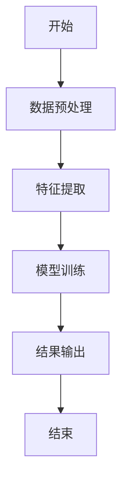
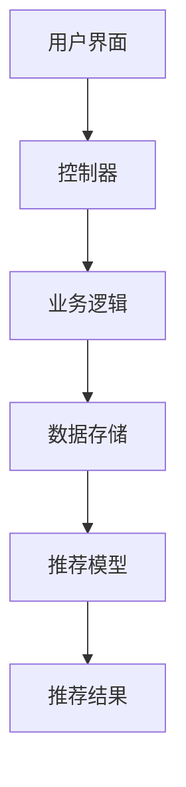

                 


# 《金融产品个性化推荐引擎》

---

## 关键词  
金融推荐引擎、个性化推荐、协同过滤、深度学习、推荐系统、金融产品

---

## 摘要  
金融产品个性化推荐引擎是通过分析用户行为、市场数据和产品特征，利用机器学习和深度学习技术，为用户推荐符合其需求的金融产品的系统。本文从背景、核心概念、算法原理、系统架构到项目实战，全面剖析金融产品个性化推荐引擎的构建与优化，旨在帮助读者理解其工作原理，并掌握实际应用中的关键技巧。

---

## 第一部分: 金融产品个性化推荐引擎概述

---

### 第1章: 金融产品个性化推荐引擎的背景与挑战

#### 1.1 问题背景与描述

- **1.1.1 金融行业的个性化推荐需求**  
  金融行业竞争激烈，用户需求多样，如何通过个性化推荐提高用户体验和转化率是金融机构的核心挑战之一。个性化推荐能够帮助用户快速找到适合的投资产品，同时降低金融机构的营销成本。

- **1.1.2 传统推荐方法的局限性**  
  传统推荐方法（如基于规则的推荐）存在以下问题：  
  - **规则复杂**：需要手动定义大量规则，难以覆盖所有场景。  
  - **灵活性差**：无法快速适应市场变化和用户需求的动态调整。  
  - **推荐精度低**：难以捕捉用户深层次的需求和市场波动。

- **1.1.3 个性化推荐引擎的核心目标**  
  个性化推荐引擎的核心目标是通过数据驱动的方式，自动分析用户行为、产品特征和市场信息，生成精准的推荐结果，提升用户体验和业务收益。

#### 1.2 问题解决与边界

- **1.2.1 个性化推荐引擎的解决方案**  
  通过机器学习和深度学习技术，构建用户画像和产品画像，利用推荐算法生成个性化推荐结果。

- **1.2.2 推荐引擎的边界与外延**  
  推荐引擎的边界包括用户数据、产品数据和推荐结果，外延则涉及数据采集、特征提取和效果评估。

- **1.2.3 核心要素与组成结构**  
  核心要素包括：用户数据、产品数据、推荐算法、推荐结果和效果评估。组成结构包括数据层、算法层和应用层。

#### 1.3 本章小结  
本章从背景、问题和目标三个维度介绍了金融产品个性化推荐引擎的构建背景，并明确了其核心要素和边界条件。

---

### 第2章: 核心概念与系统联系

#### 2.1 核心概念原理

- **2.1.1 协同过滤推荐**  
  协同过滤推荐是基于用户行为相似性或产品特征相似性进行推荐的方法。  
  - **基于用户的协同过滤**：通过分析用户行为相似性，找到相似用户的偏好，进行推荐。  
  - **基于物品的协同过滤**：通过分析产品特征相似性，找到相似产品的偏好，进行推荐。  

- **2.1.2 基于内容的推荐**  
  基于内容的推荐是通过分析产品特征和用户偏好，生成推荐结果的方法。  
  - **文本挖掘**：通过关键词提取和主题分析，生成产品描述的特征向量。  
  - **特征向量**：通过向量空间模型，将产品特征转化为向量表示。  

- **2.1.3 混合推荐模型**  
  混合推荐模型是将协同过滤和基于内容的推荐方法相结合，通过集成学习的方式提升推荐精度。

#### 2.2 核心概念对比表

| 对比维度 | 协同过滤推荐 | 基于内容的推荐 | 混合推荐模型 |
|----------|--------------|----------------|-------------|
| 优缺点   | 精度高，但需要大量用户数据 | 特异性高，但依赖特征质量 | 综合优势，但复杂性高 |
| 场景适用 | 用户行为相似性高的场景 | 产品特征清晰的场景 | 综合场景 |

#### 2.3 ER实体关系图  
```mermaid
er
actor: 用户
product: 金融产品
preference: 用户偏好
recommendation: 推荐结果
```

#### 2.4 本章小结  
本章从核心概念和系统联系的角度，详细介绍了金融产品个性化推荐引擎的关键原理和实现方法。

---

### 第3章: 推荐算法原理与实现

#### 3.1 协同过滤算法

- **3.1.1 基于用户的协同过滤**  
  ```mermaid
  graph TD
  A[用户A] --> B[用户B]
  B --> C[推荐结果]
  ```

- **3.1.2 基于物品的协同过滤**  
  ```mermaid
  graph TD
  P1[产品1] --> P2[产品2]
  P2 --> C[推荐结果]
  ```

- **3.1.3 混合协同过滤**  
  ```mermaid
  graph TD
  A[用户A] --> P1[产品1]
  P1 --> P2[产品2]
  P2 --> C[推荐结果]
  ```

#### 3.2 基于内容的推荐算法

- **3.2.1 基于文本挖掘的推荐**  
  ```python
  from sklearn.feature_extraction.text import TfidfVectorizer
  vectorizer = TfidfVectorizer()
  feature_matrix = vectorizer.fit_transform(products)
  ```

- **3.2.2 基于特征向量的推荐**  
  ```python
  import numpy as np
  features = np.array(products_features)
  similarity_matrix = features.dot(features.T)
  ```

- **3.2.3 基于深度学习的推荐**  
  ```python
  from tensorflow.keras import layers
  model = layers.Dense(64, activation='relu')(input_features)
  ```

#### 3.3 深度学习推荐模型

- **3.3.1 基于神经网络的推荐**  
  ```latex
  $$ y = f(x) $$
  $$ f(x) = \text{神经网络模型} $$
  ```

- **3.3.2 基于注意力机制的推荐**  
  ```latex
  $$ \text{Attention}(Q, K, V) = \text{softmax}(\frac{QK^T}{\sqrt{d}})V $$
  ```

- **3.3.3 基于强化学习的推荐**  
  ```latex
  $$ R = r(s, a) $$
  $$ s' = s + a $$
  ```

#### 3.4 算法实现流程



#### 3.5 本章小结  
本章从算法原理和实现流程的角度，详细介绍了协同过滤、基于内容的推荐和深度学习推荐模型的实现方法。

---

### 第4章: 系统分析与架构设计

#### 4.1 系统功能设计

- **4.1.1 用户画像构建**  
  用户画像包括用户的基本信息、投资偏好和风险承受能力。

- **4.1.2 产品特征提取**  
  产品特征包括产品类型、风险等级和收益预期。

- **4.1.3 推荐结果生成**  
  推荐结果基于用户画像和产品特征，通过推荐算法生成。

#### 4.2 系统架构设计



#### 4.3 系统接口设计

- **用户请求处理**  
  ```mermaid
  sequenceDiagram
  participant 用户 as User
  participant 推荐引擎 as RE
  User -> RE: 获取推荐结果
  RE -> RE: 处理请求
  RE -> User: 返回推荐结果
  ```

#### 4.4 本章小结  
本章从系统分析和架构设计的角度，详细介绍了金融产品个性化推荐引擎的系统组成和实现流程。

---

### 第5章: 项目实战

#### 5.1 环境安装

- **Python环境**：安装Python 3.8及以上版本。
- **依赖库安装**：使用pip安装numpy、pandas、scikit-learn和tensorflow。

#### 5.2 系统核心实现源代码

```python
import pandas as pd
from sklearn.metrics.pairwise import cosine_similarity

# 数据加载
products = pd.read_csv('products.csv')

# 特征提取
tfidf = TfidfVectorizer()
product_features = tfidf.fit_transform(products['description'])

# 模型训练
similarity_matrix = cosine_similarity(product_features)

# 推荐结果生成
def get_recommendations(product_id, similarity_matrix, products):
    idx = products[products['id'] == product_id].index[0]
    scores = similarity_matrix[idx]
    return products.iloc[scores.argsort()[::-1].tolist()][:5]
```

#### 5.3 代码应用解读与分析

- **数据加载**：从CSV文件中加载产品数据。  
- **特征提取**：使用TF-IDF算法提取产品描述的特征向量。  
- **模型训练**：计算产品之间的余弦相似度矩阵。  
- **推荐结果生成**：根据用户输入的产品ID，生成推荐结果。

#### 5.4 实际案例分析

- **案例背景**：用户A投资偏好为低风险，风险承受能力为中等。  
- **推荐结果**：推荐5只低风险、高收益的理财产品。

#### 5.5 项目小结  
本章通过实际项目案例，详细介绍了金融产品个性化推荐引擎的实现过程和应用方法。

---

## 第六章: 总结与展望

### 6.1 最佳实践 Tips

- **数据质量**：确保数据的完整性和准确性，提升推荐精度。  
- **模型优化**：通过A/B测试和交叉验证，优化推荐算法。  
- **用户体验**：注重推荐结果的可解释性和透明度，提升用户体验。

### 6.2 小结  
金融产品个性化推荐引擎是金融行业数字化转型的重要工具，通过数据驱动的方式，为用户提供精准的推荐结果，提升用户体验和业务收益。

### 6.3 注意事项  
- **数据隐私**：确保用户数据的安全性和隐私性。  
- **模型解释性**：提升推荐结果的可解释性，降低用户信任成本。  

### 6.4 拓展阅读  
- 推荐系统领域的经典论文：《Collaborative Filtering for E-commerce》。  
- 深度学习推荐系统的最新研究：《Deep Learning for Recommendation Systems》。

---

## 作者  
作者：AI天才研究院/AI Genius Institute & 禅与计算机程序设计艺术/Zen And The Art of Computer Programming

