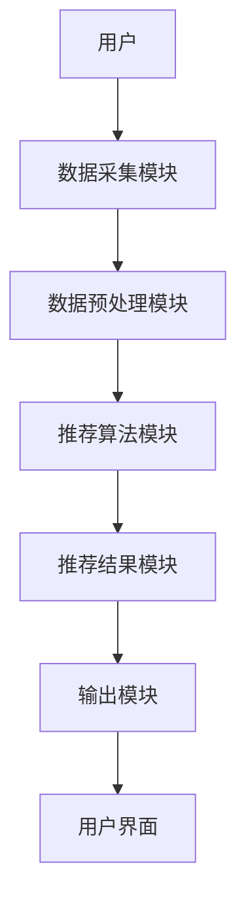
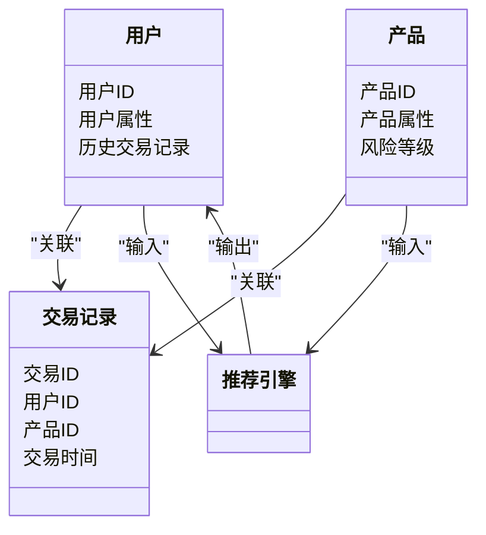
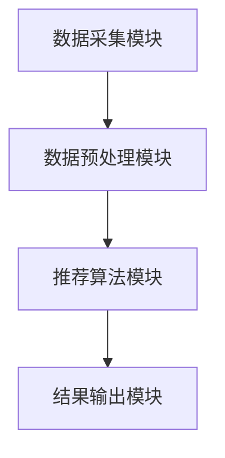
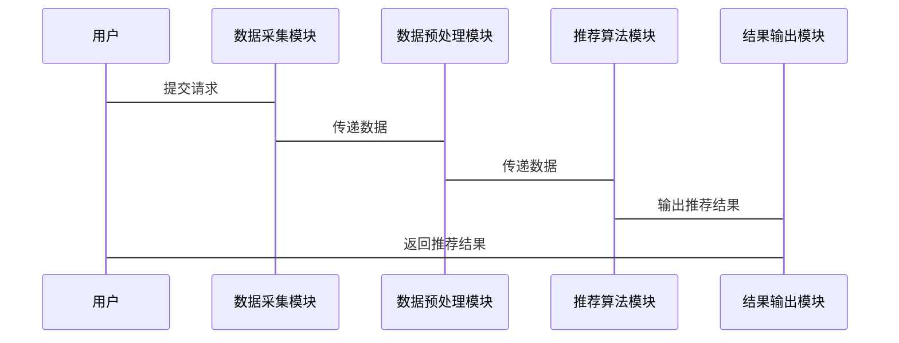

                 


# 《金融产品交叉销售推荐引擎》

> 关键词：交叉销售推荐引擎，金融产品推荐，协同过滤算法，推荐系统，数据驱动

> 摘要：本文详细介绍了金融产品交叉销售推荐引擎的设计与实现，从背景到算法原理，再到系统架构与项目实战，全面解析了如何利用数据驱动的方法提升金融产品的交叉销售效果。通过协同过滤算法和内容过滤算法的对比分析，结合混合推荐算法的优化策略，本文为金融行业的交叉销售推荐提供了理论基础与实践指导。

---

## 第一部分: 金融产品交叉销售推荐引擎概述

### 第1章: 金融产品交叉销售推荐引擎的背景与概念

#### 1.1 问题背景与挑战
- **1.1.1 金融行业的交叉销售现状**  
  金融行业通过交叉销售金融产品来提高客户满意度和增加收入。然而，传统的交叉销售方法依赖于人工经验，存在推荐精准度低、效率低下等问题。

- **1.1.2 传统交叉销售的局限性**  
  传统交叉销售方法依赖于销售经验和主观判断，难以满足大数据时代的个性化需求。推荐结果缺乏数据支持，可能导致客户流失和资源浪费。

- **1.1.3 数据驱动推荐的必要性**  
  随着大数据技术的发展，通过数据驱动的方法进行交叉销售推荐成为可能。数据驱动推荐能够提高推荐的精准度，降低销售成本。

#### 1.2 问题描述与目标
- **1.2.1 交叉销售的核心问题**  
  如何通过数据驱动的方法，从海量的金融产品中筛选出最适合客户的产品组合。

- **1.2.2 引擎的目标与功能**  
  引擎的目标是通过分析客户行为和产品特征，生成个性化的推荐列表。功能包括数据采集、数据预处理、推荐算法实现和结果输出。

- **1.2.3 用户需求与业务目标**  
  用户需求：个性化的产品推荐，提高购买概率。  
  业务目标：提高交叉销售的成功率，增加收入，提升客户忠诚度。

#### 1.3 问题解决与边界
- **1.3.1 数据驱动推荐的解决方案**  
  使用协同过滤算法和内容过滤算法，结合混合推荐算法，实现精准推荐。

- **1.3.2 引擎的边界与外延**  
  引擎仅负责推荐生成，不涉及实际的销售过程。推荐结果需要结合业务规则和人工审核。

- **1.3.3 核心要素与组成结构**  
  核心要素包括客户数据、产品数据、交易数据和推荐结果。组成结构包括数据采集模块、数据预处理模块、推荐算法模块和结果输出模块。

#### 1.4 核心概念与联系
- **1.4.1 实体关系图（ER图）架构**  
  使用ER图描述客户、产品、推荐引擎和交易记录之间的关系。

```mermaid
erDiagram
    customer[客户]
    product[金融产品]
    recommendation_engine[推荐引擎]
    transaction[交易记录]
    customer --|{many}--> transaction : "客户-交易关系"
    product --|{many}--> transaction : "产品-交易关系"
    customer --> recommendation_engine : "客户输入"
    product --> recommendation_engine : "产品输入"
    recommendation_engine --> customer : "推荐输出"
```

---

## 第二部分: 金融产品交叉销售推荐引擎的核心概念与原理

### 第2章: 金融产品交叉销售推荐引擎的核心概念与原理

#### 2.1 核心概念原理
- **2.1.1 数据驱动推荐的基本原理**  
  数据驱动推荐通过分析客户行为和产品特征，利用算法生成推荐结果。

- **2.1.2 引擎的核心算法与模型**  
  引擎的核心算法包括协同过滤算法和内容过滤算法。协同过滤算法基于用户相似性进行推荐，内容过滤算法基于产品特征进行推荐。

- **2.1.3 推荐系统的分类与特点**  
  推荐系统分为协同过滤、内容过滤和混合推荐三种类型。协同过滤基于用户行为相似性，内容过滤基于产品特征相似性，混合推荐结合两者优点。

#### 2.2 核心概念对比分析
- **2.2.1 不同推荐算法的特征对比**  
  | 算法类型 | 特征 | 优点 | 缺点 |
  |----------|------|------|------|
  | 协同过滤 | 基于用户相似性 | 精准度高 | 数据稀疏性问题 |
  | 内容过滤 | 基于产品特征 | 解释性强 | 特征提取复杂 |
  | 混合推荐  | 结合两者 | 综合优势 | 实现复杂 |

- **2.2.2 基于规则与基于数据的推荐对比**  
  基于规则推荐依赖于业务规则，灵活性低；基于数据推荐依赖于算法，灵活性高。

- **2.2.3 协同过滤与内容过滤的优劣分析**  
  协同过滤适用于用户活跃度高的场景，内容过滤适用于产品特征丰富的场景。

#### 2.3 系统架构与设计
- **2.3.1 系统整体架构图**  
  使用mermaid图展示系统整体架构。



---

## 第三部分: 金融产品交叉销售推荐引擎的算法原理

### 第3章: 金融产品交叉销售推荐引擎的算法原理

#### 3.1 算法原理概述
- **3.1.1 协同过滤算法的数学模型**  
  协同过滤算法通过计算用户相似度或产品相似度，生成推荐列表。

  $$ \text{相似度} = \frac{\sum (r_{u,i} - \bar{r}_u)(r_{u,j} - \bar{r}_j)}{\sqrt{\sum (r_{u,i} - \bar{r}_u)^2} \sqrt{\sum (r_{u,j} - \bar{r}_j)^2}} $$

- **3.1.2 内容过滤算法的实现步骤**  
  内容过滤算法通过提取产品特征，计算特征相似度，生成推荐列表。

- **3.1.3 混合推荐算法的优势**  
  混合推荐算法结合协同过滤和内容过滤的优点，推荐效果更优。

#### 3.2 协同过滤算法实现
- **3.2.1 用户-物品评分矩阵构建**  
  通过数据采集模块获取用户对产品的评分数据，构建用户-物品评分矩阵。

- **3.2.2 相似度计算与推荐生成**  
  使用余弦相似度计算用户相似度，生成推荐列表。

- **3.2.3 优缺点分析与改进方向**  
  协同过滤算法优点是推荐精准度高，缺点是存在数据稀疏性问题。

#### 3.3 内容过滤算法实现
- **3.3.1 产品特征提取与表示**  
  提取产品特征，如产品类型、风险等级等。

- **3.3.2 基于特征的相似度计算**  
  使用余弦相似度计算产品相似度。

- **3.3.3 产品推荐生成与排序**  
  根据相似度排序，生成推荐列表。

#### 3.4 混合推荐算法实现
- **3.4.1 协同过滤与内容过滤的结合**  
  综合协同过滤和内容过滤的结果，生成最终推荐列表。

- **3.4.2 混合算法的实现步骤**  
  1. 分别生成协同过滤和内容过滤的推荐列表。  
  2. 根据权重对两个推荐列表进行融合。  
  3. 排序并输出最终推荐结果。

- **3.4.3 实验对比与效果评估**  
  混合推荐算法的推荐效果优于单一算法。

---

## 第四部分: 金融产品交叉销售推荐引擎的数学模型与公式

### 第4章: 金融产品交叉销售推荐引擎的数学模型与公式

#### 4.1 协同过滤算法的数学模型
- **4.1.1 用户-物品评分矩阵的构建**  
  用户-物品评分矩阵是一个二维矩阵，行表示用户，列表示产品，元素表示用户对产品的评分。

- **4.1.2 相似度计算公式**  
  $$ \text{相似度} = \frac{\sum (r_{u,i} - \bar{r}_u)(r_{u,j} - \bar{r}_j)}{\sqrt{\sum (r_{u,i} - \bar{r}_u)^2} \sqrt{\sum (r_{u,j} - \bar{r}_j)^2}} $$

- **4.1.3 推荐评分计算公式**  
  $$ \hat{r}_{u,i} = \bar{r}_u + \sum_{j \in N(u)} w_{u,j} (r_{u,j} - \bar{r}_j) $$

#### 4.2 内容过滤算法的数学模型
- **4.2.1 产品特征向量的构建**  
  产品特征向量表示产品在各个特征上的表现。

- **4.2.2 相似度计算公式**  
  $$ \text{相似度} = \frac{\sum_{k=1}^{n} w_k (f_{u,k} - \bar{f}_k)(f_{v,k} - \bar{f}_k)}{\sqrt{\sum_{k=1}^{n} w_k (f_{u,k} - \bar{f}_k)^2} \sqrt{\sum_{k=1}^{n} w_k (f_{v,k} - \bar{f}_k)^2}} $$

- **4.2.3 推荐评分计算公式**  
  $$ \hat{r}_{u,i} = \sum_{j \in N(i)} \alpha_{u,j} \cdot \text{相似度}_{i,j} $$

---

## 第五部分: 金融产品交叉销售推荐引擎的系统分析与架构设计

### 第5章: 金融产品交叉销售推荐引擎的系统分析与架构设计

#### 5.1 问题场景介绍
- **5.1.1 系统目标与范围**  
  系统的目标是实现金融产品交叉销售推荐引擎，范围包括数据采集、数据处理和推荐生成。

- **5.1.2 项目介绍**  
  项目旨在通过数据驱动的方法，提高金融产品的交叉销售效果。

#### 5.2 系统功能设计
- **5.2.1 领域模型设计**  
  使用mermaid图展示领域模型。



- **5.2.2 系统架构设计**  
  系统架构包括数据采集模块、数据预处理模块、推荐算法模块和结果输出模块。



- **5.2.3 系统接口设计**  
  接口包括数据输入接口、推荐结果输出接口和用户查询接口。

- **5.2.4 系统交互设计**  
  使用mermaid图展示系统交互流程。



---

## 第六部分: 金融产品交叉销售推荐引擎的项目实战

### 第6章: 金融产品交叉销售推荐引擎的项目实战

#### 6.1 项目环境安装
- **6.1.1 系统环境要求**  
  需要安装Python、Pandas、NumPy和Scikit-learn。

- **6.1.2 项目依赖安装**  
  使用pip安装必要的库。

#### 6.2 系统核心实现源代码
- **6.2.1 协同过滤算法的实现代码**  

```python
import numpy as np
from sklearn.metrics.pairwise import cosine_similarity

# 示例数据：用户-产品评分矩阵
users = ['u1', 'u2', 'u3']
products = ['p1', 'p2', 'p3']
ratings = {
    'u1': {'p1': 5, 'p2': 4, 'p3': 3},
    'u2': {'p1': 4, 'p2': 3, 'p3': 2},
    'u3': {'p1': 3, 'p2': 2, 'p3': 1}
}

# 构建评分矩阵
rating_matrix = np.zeros((len(users), len(products)))
for i, user in enumerate(users):
    for j, product in enumerate(products):
        rating_matrix[i][j] = ratings[user][product]

# 计算相似度矩阵
similarity_matrix = cosine_similarity(rating_matrix)
```

- **6.2.2 代码应用解读与分析**  
  代码实现了一个简单的协同过滤算法，使用余弦相似度计算用户相似度。

- **6.2.3 实际案例分析**  
  以用户u1为例，根据相似度最高的用户u2的评分生成推荐列表。

#### 6.3 项目小结
- **6.3.1 项目总结**  
  通过协同过滤算法实现了一个简单的交叉销售推荐引擎。

- **6.3.2 项目经验**  
  数据预处理和特征提取是推荐系统的关键步骤。

- **6.3.3 项目优化方向**  
  未来可以尝试引入混合推荐算法，进一步提高推荐精准度。

---

## 第七部分: 金融产品交叉销售推荐引擎的最佳实践

### 第7章: 金融产品交叉销售推荐引擎的最佳实践

#### 7.1 最佳实践 tips
- 数据预处理是推荐系统的基础，需要仔细处理缺失值和异常值。
- 特征提取是内容过滤算法的核心，需要选择合适的特征表示方法。
- 混合推荐算法能够综合协同过滤和内容过滤的优点，提高推荐效果。

#### 7.2 小结
- 本文从背景到算法实现，全面解析了金融产品交叉销售推荐引擎的设计与实现。
- 通过协同过滤算法和内容过滤算法的对比分析，结合混合推荐算法的优化策略，为金融行业的交叉销售推荐提供了理论基础与实践指导。

#### 7.3 注意事项
- 数据隐私和安全问题需要特别注意，确保用户数据的安全性。
- 推荐结果需要结合业务规则和人工审核，避免推荐不合适的产品。

#### 7.4 拓展阅读
- 《推荐系统导论》  
- 《数据挖掘与机器学习》  
- 《金融产品风险管理》

---

## 作者

作者：AI天才研究院/AI Genius Institute & 禅与计算机程序设计艺术/Zen And The Art of Computer Programming

