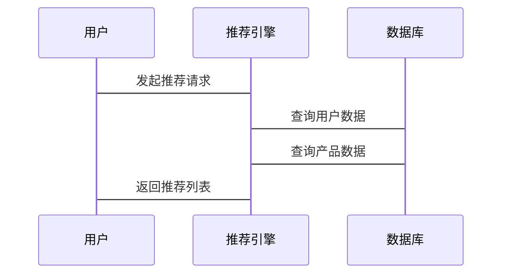

                 


# 金融产品交叉销售推荐引擎优化

**关键词**：金融推荐引擎、交叉销售优化、协同过滤、机器学习、实时推荐系统

**摘要**：本文详细探讨了金融产品交叉销售推荐引擎的优化策略，从背景分析到算法实现，再到系统架构设计，旨在为金融机构提供高效、精准的推荐解决方案。通过分析用户行为和产品关联性，结合协同过滤和基于内容的推荐算法，构建高效的推荐引擎，实现个性化推荐和实时响应，提升客户满意度和销售效率。

---

## 第1章：金融产品交叉销售推荐引擎的背景与问题分析

### 1.1 问题背景

在金融行业，交叉销售是指向现有客户推荐其他相关金融产品，以提高客户满意度和销售额。然而，传统的推荐方法存在以下问题：

- **数据稀疏性**：客户数据有限，难以准确推荐相关产品。
- **实时性不足**：推荐结果无法实时更新，导致推荐精准度下降。
- **用户行为复杂性**：用户的金融行为多样，难以准确捕捉和分析。

### 1.2 问题描述

交叉销售推荐的核心问题在于如何高效地分析用户行为和产品关联性，构建一个能够实时响应、精准推荐的推荐引擎。

- **数据稀疏性**：部分用户数据不足，导致推荐结果不准确。
- **实时性**：推荐结果无法快速响应用户需求。
- **用户行为分析**：需要深入分析用户的交易、浏览和点击行为，提取有价值的信息。

### 1.3 问题解决与边界

推荐引擎的目标是通过分析用户行为和产品特征，生成个性化推荐列表，提高交叉销售的成功率。系统实现的关键边界包括：

- **数据范围**：仅处理金融产品的推荐，不涉及其他领域。
- **用户行为分析**：基于用户的历史交易数据和产品互动数据。
- **推荐结果**：仅提供交叉销售相关的产品推荐。

### 1.4 核心概念与结构

推荐引擎的核心要素包括：

- **用户行为数据**：用户的交易、浏览、点击等行为数据。
- **产品特征**：产品的类型、风险等级、收益预期等特征。
- **推荐算法**：协同过滤、基于内容的推荐等算法。
- **推荐结果**：推荐的产品列表及其优先级。

---

## 第2章：推荐引擎的核心概念与原理

### 2.1 推荐引擎的基本原理

推荐引擎通过分析用户行为和产品特征，生成个性化推荐列表。主要推荐方法包括：

- **协同过滤**：基于用户行为相似性进行推荐。
- **基于内容的推荐**：基于产品特征相似性进行推荐。
- **混合推荐模型**：结合协同过滤和内容推荐的优点。

### 2.2 核心概念对比

| 推荐方法 | 基于用户行为 | 基于产品特征 | 优缺点 |
|----------|--------------|---------------|--------|
| 协同过滤 | ✔            |               | 精准度高，但计算复杂 |
| 基于内容 |              | ✔             | 计算简单，但可能不够精准 |

### 2.3 实体关系架构

```mermaid
er
    actor 用户 {
        id: integer
        用户名: string
        兴趣标签: string
    }
    entity 产品 {
        id: integer
        产品名称: string
        产品类型: string
        风险等级: integer
    }
    relationship 用户-产品 {
        用户 -> 产品: 购买/浏览
    }
```

---

## 第3章：推荐算法的原理与实现

### 3.1 协同过滤算法

#### 3.1.1 基于用户的协同过滤

**步骤说明**：

1. **构建用户-产品矩阵**：记录用户对产品的评分或行为。
2. **计算用户相似度**：使用余弦相似度或欧氏距离。
3. **生成推荐列表**：基于相似用户的评分，计算推荐权重。

**Python代码实现**：

```python
import numpy as np
from sklearn.metrics.pairwise import cosine_similarity

# 示例用户-产品矩阵
users = ['A', 'B', 'C']
products = ['P1', 'P2', 'P3']
matrix = np.array([[4, 3, 2],
                   [2, 4, 5],
                   [5, 1, 3]])

# 计算相似度矩阵
similarity = cosine_similarity(matrix)
```

#### 3.1.2 基于产品的协同过滤

**步骤说明**：

1. **构建产品相似度矩阵**：基于产品特征计算相似度。
2. **生成推荐列表**：基于用户行为和产品相似度。

**Python代码实现**：

```python
from sklearn.feature_extraction.text import TfidfVectorizer

# 示例产品描述
product_descriptions = ['Fixed income products', 'Equity funds', 'Mutual funds']
vectorizer = TfidfVectorizer()
tfidf = vectorizer.fit_transform(product_descriptions)
similarity = cosine_similarity(tfidf)
```

### 3.2 基于内容的推荐

**数学模型**：

- **相似度计算**：使用余弦相似度或点积相似度。

$$ \text{similarity} = \frac{\sum_{i} w_i \cdot w_j}{\sqrt{\sum_{i} w_i^2} \cdot \sqrt{\sum_{j} w_j^2}} $$

**步骤说明**：

1. **提取产品特征**：文本特征提取（如TF-IDF）。
2. **计算相似度**：基于产品特征计算相似度。
3. **生成推荐列表**：基于相似度排序。

**Python代码实现**：

```python
# 示例产品特征提取
from sklearn.feature_extraction.text import CountVectorizer

corpus = ['Product A: high risk', 'Product B: low risk']
vectorizer = CountVectorizer()
X = vectorizer.fit_transform(corpus)
```

---

## 第4章：系统分析与架构设计方案

### 4.1 系统架构设计


### 4.2 接口设计与交互流程



---

## 第5章：项目实战与优化

### 5.1 项目实战

#### 5.1.1 环境安装

```bash
pip install numpy pandas scikit-learn
```

#### 5.1.2 核心代码实现

```python
def collaborative_filtering(user_product_matrix):
    similarity = cosine_similarity(user_product_matrix)
    # 生成推荐列表
    return similarity.argsort()[:, ::-1]

# 示例应用
matrix = np.array([[4, 3, 2],
                   [2, 4, 5],
                   [5, 1, 3]])
result = collaborative_filtering(matrix)
print(result)
```

#### 5.1.3 实际案例分析

- **数据预处理**：清洗和标准化数据。
- **模型训练**：训练推荐模型。
- **结果分析**：评估推荐效果。

### 5.2 优化与最佳实践

- **特征工程优化**：增加更多特征（如用户风险偏好）。
- **模型调优**：使用网格搜索优化模型参数。
- **实时推荐系统**：采用流数据处理技术。

---

## 第6章：优化与最佳实践

### 6.1 小结

金融产品交叉销售推荐引擎的优化需要从算法选择、系统架构和数据处理等多个方面入手。通过协同过滤和基于内容的推荐算法，结合实时数据处理技术，可以显著提升推荐的精准度和实时性。

### 6.2 注意事项

- **数据隐私**：确保用户数据的安全性和隐私性。
- **模型解释性**：优化模型的可解释性，便于业务人员理解和调整。
- **性能优化**：优化算法和系统架构，提高推荐效率。

### 6.3 拓展阅读

- 推荐系统在金融领域的应用研究
- 机器学习在金融产品推荐中的最新进展

---

**作者**：AI天才研究院/AI Genius Institute & 禅与计算机程序设计艺术 /Zen And The Art of Computer Programming

