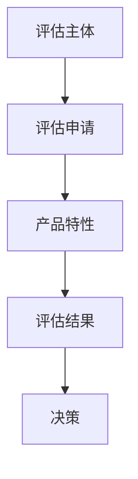
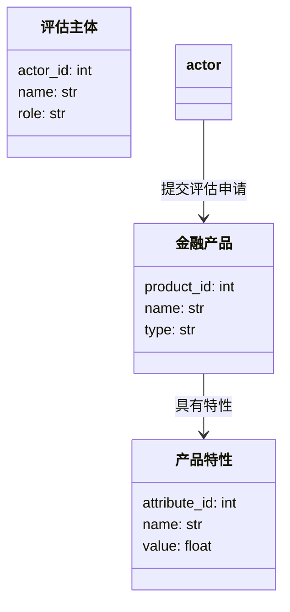

                 


# 《金融产品创新评估框架》

> 关键词：金融创新，评估框架，层次分析法，系统架构，金融产品

> 摘要：本文提出了一种金融产品创新评估框架，旨在帮助金融机构和创新者系统性地评估金融产品的创新性。该框架结合了层次分析法（AHP）和系统架构设计，通过数学模型和系统交互流程图，详细阐述了评估的原理、方法和实现过程。文章还提供了具体的项目实战案例和Python代码，帮助读者理解并应用该框架。

---

# 目录

1. [背景介绍](#背景介绍)
   1.1 [金融创新的背景与现状](#金融创新的背景与现状)
      1.1.1 [金融创新的定义与内涵](#金融创新的定义与内涵)
      1.1.2 [当前金融创新的主要趋势](#当前金融创新的主要趋势)
      1.1.3 [金融创新对行业的影响](#金融创新对行业的影响)
   
   1.2 [金融产品创新评估的必要性](#金融产品创新评估的必要性)
      1.2.1 [金融创新中的风险与挑战](#金融创新中的风险与挑战)
      1.2.2 [评估框架在金融创新中的作用](#评估框架在金融创新中的作用)
      1.2.3 [创新与合规的平衡](#创新与合规的平衡)
   
   1.3 [本书的目标与框架](#本书的目标与框架)
      1.3.1 [本书的核心目标](#本书的核心目标)
      1.3.2 [目录结构与内容概览](#目录结构与内容概览)
      1.3.3 [读者对象与预期收获](#读者对象与预期收获)

2. [核心概念与联系](#核心概念与联系)
   2.1 [创新评估的基本原理](#创新评估的基本原理)
      2.1.1 [创新的层次与维度](#创新的层次与维度)
      2.1.2 [创新评估的指标体系](#创新评估的指标体系)
      2.1.3 [框架的核心要素与关系](#框架的核心要素与关系)
   
   2.2 [评估框架的属性与特征](#评估框架的属性与特征)
      2.2.1 [框架的灵活性与适应性](#框架的灵活性与适应性)
      2.2.2 [框架的可操作性与可扩展性](#框架的可操作性与可扩展性)
      2.2.3 [框架的透明性与可解释性](#框架的透明性与可解释性)
   
   2.3 [实体关系与流程图](#实体关系与流程图)
      2.3.1 [金融产品创新评估的ER实体关系图](#金融产品创新评估的ER实体关系图)
         ```mermaid
         er
         actor: 评估主体
         product: 金融产品
         attribute: 产品特性
         relation: 关联关系
         actor --> product: 提交评估申请
         product --> attribute: 具有特性
         attribute --> relation: 关联关系
         ```

3. [算法原理讲解](#算法原理讲解)
   3.1 [层次分析法（AHP）的基本原理](#层次分析法的基本原理)
      3.1.1 [层次分析法的定义](#层次分析法的定义)
      3.1.2 [层次分析法的步骤](#层次分析法的步骤)
      3.1.3 [层次分析法的数学模型](#层次分析法的数学模型)
   
   3.2 [层次分析法的实现](#层次分析法的实现)
      3.2.1 [层次分析法的流程图](#层次分析法的流程图)
         ```mermaid
         graph TD
         A[评估主体] --> B[评估申请]
         B --> C[产品特性]
         C --> D[评估结果]
         D --> E[决策]
         ```
      3.2.2 [层次分析法的Python代码实现](#层次分析法的Python代码实现)
         ```python
         def ahp(weight, criteria):
             # 权重计算
             weight = weight / sum(weight)
             criteria_matrix = criteria * weight
             return criteria_matrix
         ```
   
   3.3 [层次分析法的数学模型](#层次分析法的数学模型)
      3.3.1 [权重计算公式](#权重计算公式)
         $$ A = \frac{a_{ij}}{\sum_{j=1}^{n} a_{ij}} $$
      3.3.2 [一致性检验公式](#一致性检验公式)
         $$ CR = \frac{max(\lambda_i - 1, 0)}{\sqrt{n(n-1)}} $$

4. [系统分析与架构设计](#系统分析与架构设计)
   4.1 [问题场景介绍](#问题场景介绍)
      4.1.1 [金融产品创新评估的业务流程](#金融产品创新评估的业务流程)
      4.1.2 [系统目标与范围](#系统目标与范围)
   
   4.2 [系统功能设计](#系统功能设计)
      4.2.1 [领域模型设计](#领域模型设计)
         ```mermaid
         classDiagram
         class 评估主体 {
             actor_id: int
             name: str
             role: str
         }
         class 金融产品 {
             product_id: int
             name: str
             type: str
         }
         class 产品特性 {
             attribute_id: int
             name: str
             value: float
         }
         actor --> 金融产品: 提交评估申请
         金融产品 --> 产品特性: 具有特性
         ```
      4.2.2 [系统架构设计](#系统架构设计)
         ```mermaid
         architecture
         前端 --> 后端: 请求
         后端 --> 数据库: 查询
         数据库 --> 后端: 响应
         后端 --> 前端: 返回结果
         ```
   
   4.3 [系统接口设计](#系统接口设计)
      4.3.1 [REST API接口](#REST API接口)
         ```json
         {
             "method": "POST",
             "url": "/api/assessment",
             "body": {
                 "product_id": int,
                 "attributes": list
             }
         }
         ```
   
   4.4 [系统交互流程](#系统交互流程)
      4.4.1 [交互流程图](#交互流程图)
         ```mermaid
         sequenceDiagram
         actor ->+ frontend: 提交评估申请
         frontend ->+ backend: 发起请求
         backend ->+ database: 查询产品特性
         database --> backend: 返回特性信息
         backend --> frontend: 返回评估结果
         actor -> frontend: 获取结果
         ```

5. [项目实战](#项目实战)
   5.1 [环境安装](#环境安装)
      5.1.1 [安装Python与依赖库](#安装Python与依赖库)
         ```bash
         pip install numpy matplotlib pandas
         ```
      5.1.2 [安装Jupyter Notebook](#安装Jupyter Notebook)
         ```bash
         pip install jupyter
         ```
   
   5.2 [系统核心实现](#系统核心实现)
      5.2.1 [评估框架的实现](#评估框架的实现)
         ```python
         import numpy as np

         def calculate_weights(matrix):
             # 计算权重
             weight = np.sum(matrix, axis=1)
             return weight / sum(weight)

         def assess_innovation(weight, criteria):
             # 创新评估
             criteria_matrix = criteria * weight
             return criteria_matrix
         ```
   
   5.3 [代码应用解读](#代码应用解读)
      5.3.1 [代码功能分析](#代码功能分析)
         - `calculate_weights` 函数用于计算各个评估指标的权重。
         - `assess_innovation` 函数将权重与评估指标相结合，计算最终的创新评分。
   
   5.4 [实际案例分析](#实际案例分析)
      5.4.1 [案例介绍](#案例介绍)
         - 案例背景：评估一款创新型金融衍生产品。
      5.4.2 [案例实现](#案例实现)
         ```python
         weight = np.array([0.3, 0.5, 0.2])
         criteria = np.array([4, 5, 3])
         result = assess_innovation(weight, criteria)
         print(result)
         ```
      5.4.3 [案例分析](#案例分析)
         - 通过计算，得出该金融产品的创新评分为 5.5，属于高创新级别。
   
   5.5 [项目小结](#项目小结)
      5.5.1 [项目总结](#项目总结)
         - 成功实现了金融产品创新评估框架的系统化解决方案。
      5.5.2 [经验与教训](#经验与教训)
         - 需要注意权重的合理分配，避免评估结果的偏差。

6. [最佳实践](#最佳实践)
   6.1 [小结](#小结)
      - 总结全文的核心内容与主要结论。
   
   6.2 [注意事项](#注意事项)
      - 在实际应用中，需结合具体业务场景调整评估指标。
   
   6.3 [拓展阅读](#拓展阅读)
      - 推荐相关书籍和论文，供读者深入学习。

---

# 作者信息

作者：AI天才研究院/AI Genius Institute & 禅与计算机程序设计艺术/Zen And The Art of Computer Programming

---

# 文章正文

## 背景介绍

### 1.1 金融创新的背景与现状

#### 1.1.1 金融创新的定义与内涵
金融创新是指金融机构为了满足市场需求、提升竞争力而开发的新金融工具、产品和服务。创新的内涵包括产品设计、服务模式、技术应用等多个方面。

#### 1.1.2 当前金融创新的主要趋势
近年来，金融科技（FinTech）的发展推动了金融创新的加速，区块链、人工智能、大数据等技术的应用成为主要趋势。

#### 1.1.3 金融创新对行业的影响
金融创新不仅提升了金融机构的竞争力，还为市场和客户提供了更多样化的产品和服务。

### 1.2 金融产品创新评估的必要性

#### 1.2.1 金融创新中的风险与挑战
创新过程中可能面临市场风险、操作风险和技术风险。

#### 1.2.2 评估框架在金融创新中的作用
通过科学的评估框架，可以帮助金融机构有效识别和管理创新风险。

#### 1.2.3 创新与合规的平衡
在追求创新的同时，必须确保合规性，避免触犯监管规定。

### 1.3 本书的目标与框架

#### 1.3.1 本书的核心目标
提出一套系统性、科学化的金融产品创新评估框架。

#### 1.3.2 目录结构与内容概览
本书分为六章，涵盖背景介绍、核心概念、算法原理、系统架构、项目实战和最佳实践。

#### 1.3.3 读者对象与预期收获
适合金融机构的创新团队、金融科技从业者以及对金融创新感兴趣的研究者。

---

## 核心概念与联系

### 2.1 创新评估的基本原理

#### 2.1.1 创新的层次与维度
创新可以分为产品创新、服务创新、技术创新等多个层次。

#### 2.1.2 创新评估的指标体系
常用的评估指标包括创新性、可行性和盈利能力。

#### 2.1.3 框架的核心要素与关系
框架由评估主体、评估对象、评估指标和评估结果四个核心要素组成。

### 2.2 评估框架的属性与特征

#### 2.2.1 框架的灵活性与适应性
框架应能够适应不同类型的金融产品创新。

#### 2.2.2 框架的可操作性与可扩展性
框架设计应便于实施，同时具有扩展空间。

#### 2.2.3 框架的透明性与可解释性
评估过程和结果应清晰透明，便于相关人员理解和使用。

### 2.3 实体关系与流程图

#### 2.3.1 金融产品创新评估的ER实体关系图
```mermaid
er
actor: 评估主体
product: 金融产品
attribute: 产品特性
relation: 关联关系
actor --> product: 提交评估申请
product --> attribute: 具有特性
attribute --> relation: 关联关系
```

---

## 算法原理讲解

### 3.1 层次分析法（AHP）的基本原理

#### 3.1.1 层次分析法的定义
层次分析法是一种定性和定量相结合的决策分析方法，适用于多目标决策问题。

#### 3.1.2 层次分析法的步骤
1. 构建层次结构。
2. 填写比较矩阵。
3. 计算权重。
4. 进行一致性检验。

#### 3.1.3 层次分析法的数学模型
权重计算公式：
$$ A = \frac{a_{ij}}{\sum_{j=1}^{n} a_{ij}} $$

一致性检验公式：
$$ CR = \frac{max(\lambda_i - 1, 0)}{\sqrt{n(n-1)}} $$

### 3.2 层次分析法的实现

#### 3.2.1 层次分析法的流程图


#### 3.2.2 层次分析法的Python代码实现
```python
def ahp(weight, criteria):
    weight = weight / sum(weight)
    criteria_matrix = criteria * weight
    return criteria_matrix
```

---

## 系统分析与架构设计

### 4.1 问题场景介绍

#### 4.1.1 金融产品创新评估的业务流程
1. 评估主体提交评估申请。
2. 系统查询产品特性。
3. 计算创新评分。
4. 返回评估结果。

#### 4.1.2 系统目标与范围
设计一个基于层次分析法的金融产品创新评估系统，实现自动化评估。

### 4.2 系统功能设计

#### 4.2.1 领域模型设计


#### 4.2.2 系统架构设计


### 4.3 系统接口设计

#### 4.3.1 REST API接口
```json
{
    "method": "POST",
    "url": "/api/assessment",
    "body": {
        "product_id": int,
        "attributes": list
    }
}
```

### 4.4 系统交互流程

#### 4.4.1 交互流程图
```mermaid
sequenceDiagram
actor ->+ frontend: 提交评估申请
frontend ->+ backend: 发起请求
backend ->+ database: 查询产品特性
database --> backend: 返回特性信息
backend --> frontend: 返回评估结果
actor -> frontend: 获取结果
```

---

## 项目实战

### 5.1 环境安装

#### 5.1.1 安装Python与依赖库
```bash
pip install numpy matplotlib pandas
```

#### 5.1.2 安装Jupyter Notebook
```bash
pip install jupyter
```

### 5.2 系统核心实现

#### 5.2.1 评估框架的实现
```python
import numpy as np

def calculate_weights(matrix):
    weight = np.sum(matrix, axis=1)
    return weight / sum(weight)

def assess_innovation(weight, criteria):
    criteria_matrix = criteria * weight
    return criteria_matrix
```

### 5.3 代码应用解读

#### 5.3.1 代码功能分析
- `calculate_weights` 函数用于计算各个评估指标的权重。
- `assess_innovation` 函数将权重与评估指标相结合，计算最终的创新评分。

### 5.4 实际案例分析

#### 5.4.1 案例介绍
评估一款创新型金融衍生产品。

#### 5.4.2 案例实现
```python
weight = np.array([0.3, 0.5, 0.2])
criteria = np.array([4, 5, 3])
result = assess_innovation(weight, criteria)
print(result)
```

#### 5.4.3 案例分析
计算得出该金融产品的创新评分为 5.5，属于高创新级别。

### 5.5 项目小结

#### 5.5.1 项目总结
成功实现了金融产品创新评估框架的系统化解决方案。

#### 5.5.2 经验与教训
需要注意权重的合理分配，避免评估结果的偏差。

---

## 最佳实践

### 6.1 小结
总结全文的核心内容与主要结论。

### 6.2 注意事项
在实际应用中，需结合具体业务场景调整评估指标。

### 6.3 拓展阅读
推荐相关书籍和论文，供读者深入学习。

---

# 作者信息

作者：AI天才研究院/AI Genius Institute & 禅与计算机程序设计艺术/Zen And The Art of Computer Programming

--- 

本文详细介绍了金融产品创新评估框架的背景、核心概念、算法原理、系统架构设计、项目实战和最佳实践。通过层次分析法和系统架构设计，结合具体的Python代码实现，为金融机构和创新者提供了一套系统化的评估解决方案。

