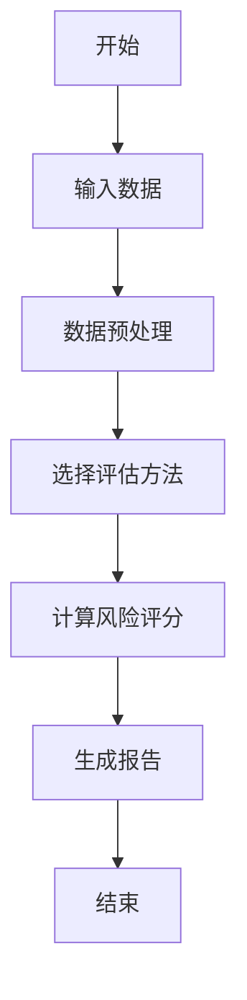
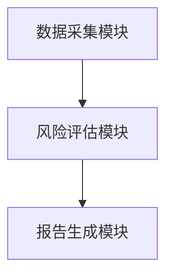
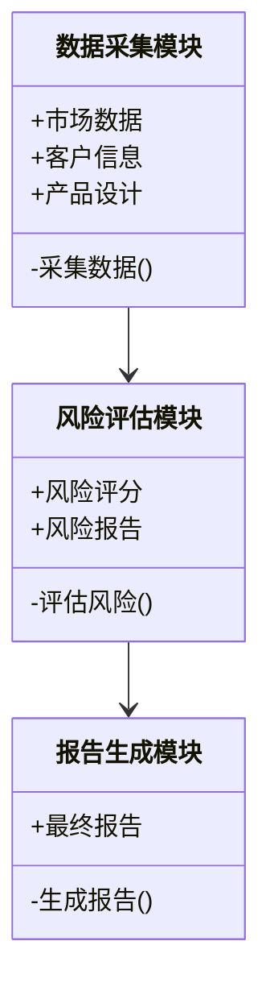
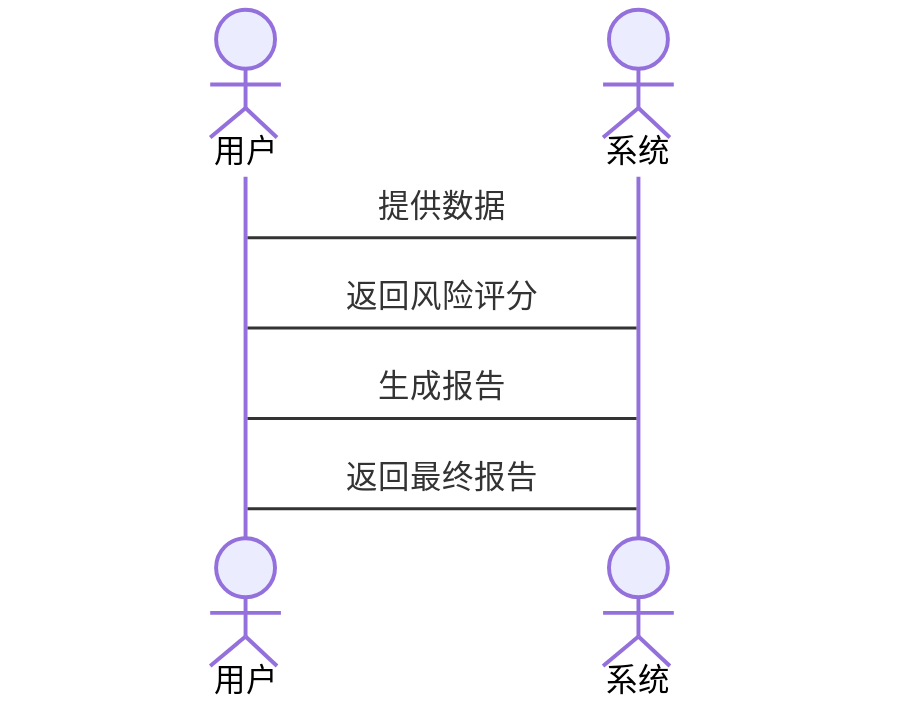

                 


# 《金融产品创新风险评估框架》

## 关键词：金融创新、风险评估、风险管理、系统架构、算法原理

## 摘要：  
本文旨在构建一个系统化的金融产品创新风险评估框架，通过结合金融学、风险管理、系统架构设计和人工智能算法，帮助金融机构在创新过程中有效识别和管理风险。文章首先介绍金融产品创新的背景与挑战，然后深入分析风险评估的核心概念与方法，接着构建基于系统架构的评估框架，最后通过实际案例展示如何将理论应用于实践。本文内容涵盖了从理论到实践的完整链条，为金融机构提供一套可操作的风险评估方案。

---

## 第一章: 金融产品创新的背景与挑战

### 1.1 金融创新的背景  
金融创新是指通过引入新的金融工具、产品、市场机制或技术手段，以满足市场需求或优化资源配置的过程。近年来，随着科技的进步和市场需求的变化，金融创新的速度显著加快，但同时也带来了更大的不确定性。  

#### 1.1.1 金融创新的定义与特征  
- **定义**：金融创新是金融机构为了适应市场变化、提高效率或满足客户需求而进行的创新活动。  
- **特征**：  
  - 复杂性：涉及金融、技术和法律等多领域。  
  - 不确定性：创新产品可能带来新的风险。  
  - 目的性：旨在解决现有问题或满足新需求。  

#### 1.1.2 金融创新的驱动力  
- **技术驱动**：大数据、人工智能和区块链等技术为金融创新提供了新工具。  
- **需求驱动**：客户需求的变化推动金融机构开发新产品。  
- **监管驱动**：监管政策的变化促使金融机构调整产品结构。  

#### 1.1.3 金融创新的风险与机遇  
- **风险**：市场风险、信用风险、操作风险和合规风险。  
- **机遇**：技术创新和客户需求为金融机构带来新的利润增长点。  

### 1.2 金融产品创新的挑战  
金融创新虽然带来了机遇，但也面临诸多挑战：  
- **复杂性**：创新产品可能涉及多个业务领域，增加管理难度。  
- **不确定性**：创新产品可能面临市场需求不足或技术缺陷。  
- **监管压力**：新产品的合规性需要满足严格的监管要求。  

### 1.3 本书的目标与结构  
本书旨在为金融机构提供一套系统化的金融产品创新风险评估框架，帮助其在创新过程中有效管理风险。文章结构如下：  
- 第二章：风险评估的基本概念与方法。  
- 第三章：金融创新中的风险类型与评估框架。  
- 第四章：基于系统架构的评估框架设计。  
- 第五章：项目实战与案例分析。  

---

## 第二章: 风险评估的基本概念与方法  

### 2.1 风险的定义与分类  
- **风险的定义**：风险是指在特定条件下，某种事件可能发生的概率及其影响程度的组合。  
- **风险的分类**：  
  - 市场风险：因市场波动导致的损失。  
  - 信用风险：因交易对手违约导致的损失。  
  - 操作风险：因内部操作失误导致的损失。  
  - 合规风险：因不符合监管要求导致的损失。  

#### 2.1.1 风险的属性对比表  
| 风险类型 | 风险来源 | 影响范围 | 防控措施 |  
|----------|----------|----------|----------|  
| 市场风险 | 市场波动 | 整体市场 | 多元化投资 |  
| 信用风险 | 对手违约 | 交易对手 | 严格信用评估 |  
| 操作风险 | 内部失误 | 内部流程 | 建立内控制度 |  
| 合规风险 | 监管变化 | 整个机构 | 合规审查 |  

### 2.2 风险评估的基本方法  
- **定性评估**：通过专家判断或经验分析进行风险排序。  
- **定量评估**：通过数学模型计算风险的概率和影响程度。  
- **综合评估**：结合定性和定量方法，得出最终风险评分。  

#### 2.2.1 定性与定量评估对比  
| 方法 | 优点 | 缺点 |  
|------|------|------|  
| 定性评估 | 简单易行，适用于初期评估 | 主观性较强，缺乏量化依据 |  
| 定量评估 | 结果客观，便于比较 | 数据获取难度大，计算复杂 |  

### 2.3 金融产品创新中的风险类型  
- **市场风险**：新产品是否符合市场需求。  
- **信用风险**：客户是否能够按时还款。  
- **操作风险**：产品开发和运营中的潜在失误。  
- **合规风险**：产品是否符合监管要求。  

---

## 第三章: 金融创新中的风险评估框架  

### 3.1 风险评估框架的核心要素  
- **输入**：市场数据、产品设计、客户信息等。  
- **输出**：风险评分、风险报告、优化建议。  

#### 3.1.1 风险评估框架的ER实体关系图  
```mermaid
erDiagram
    actor 用户
    actor 监管机构
    actor 开发团队
    database 市场数据
    database 客户信息
    database 产品设计
    database 风险评估结果
    用户 --> 市场数据 : 提供市场数据
    用户 --> 客户信息 : 提供客户信息
    开发团队 --> 产品设计 : 提供产品设计
    市场数据 --> 风险评估结果 : 用于评估
    客户信息 --> 风险评估结果 : 用于评估
    产品设计 --> 风险评估结果 : 用于评估
    监管机构 --> 风险评估结果 : 审核结果
```

### 3.2 框架设计的步骤  
#### 3.2.1 框架设计流程图  


#### 3.2.2 框架设计的数学模型  
- **风险评分公式**：  
  $$ \text{风险评分} = \alpha \times \text{市场风险} + \beta \times \text{信用风险} + \gamma \times \text{操作风险} + \delta \times \text{合规风险} $$  
  其中，$\alpha + \beta + \gamma + \delta = 1$，且 $\alpha, \beta, \gamma, \delta \geq 0$。  

---

## 第四章: 基于系统架构的评估框架设计  

### 4.1 系统架构设计  
- **系统功能模块**：数据采集模块、风险评估模块、报告生成模块。  
- **系统架构图**  


#### 4.1.1 系统功能模块的类图  


### 4.2 接口设计与交互设计  
#### 4.2.1 系统接口设计  
- 数据采集接口：接收市场数据、客户信息和产品设计。  
- 风险评估接口：返回风险评分和风险报告。  

#### 4.2.2 系统交互序列图  


---

## 第五章: 项目实战与案例分析  

### 5.1 环境安装与配置  
- **工具安装**：安装Python、Pandas、Scikit-learn等工具。  
- **数据准备**：收集市场数据、客户信息和产品设计数据。  

#### 5.1.1 核心代码实现  
```python
import pandas as pd
from sklearn.metrics import accuracy_score

# 数据预处理
data = pd.read_csv('data.csv')
X = data.drop('risk_score', axis=1)
y = data['risk_score']

# 模型训练
from sklearn.tree import DecisionTreeRegressor
model = DecisionTreeRegressor()
model.fit(X, y)

# 模型预测
new_data = pd.read_csv('new_data.csv')
predictions = model.predict(new_data.drop('risk_score', axis=1))
print('预测结果:', predictions)
print('准确率:', accuracy_score(y_true=y, y_pred=predictions))
```

### 5.2 案例分析与解读  
- **案例背景**：某金融机构开发了一款创新型理财产品，需评估其市场风险和信用风险。  
- **数据分析**：通过数据清洗和特征提取，识别出主要风险因素。  
- **模型优化**：通过调整模型参数，提高风险评估的准确性。  

---

## 第六章: 结论与展望  

### 6.1 结论  
本文构建了一个系统化的金融产品创新风险评估框架，通过理论分析、系统设计和项目实战，验证了该框架的有效性和实用性。  

### 6.2 未来展望  
未来，随着人工智能和大数据技术的进一步发展，金融产品创新风险评估将更加智能化和自动化。建议金融机构结合自身特点，探索更多创新方法和技术，以应对日益复杂的市场环境。  

---

## 作者：AI天才研究院 & 禅与计算机程序设计艺术  
本文作者是AI天才研究院的研究团队，专注于人工智能与金融领域的结合研究。如需转载请注明出处。

