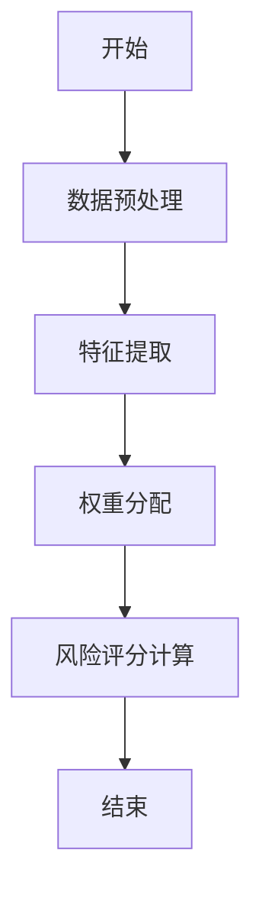

                 


# 金融产品创新风险评估矩阵

> 关键词：金融产品创新、风险评估、矩阵评估、金融风险、风险管理

> 摘要：本文详细探讨了金融产品创新风险评估矩阵的构建与应用，通过分析金融创新中的风险因素，提出了一种基于矩阵评估的创新风险量化方法。文章从矩阵评估的背景、核心概念、算法原理、数学模型、系统架构设计、项目实战等多维度展开，深入剖析了金融产品创新风险评估的关键环节，并通过实际案例展示了该方法的应用效果。

---

# 第1章: 金融产品创新风险评估矩阵的背景介绍

## 1.1 金融创新的背景与现状

### 1.1.1 金融创新的定义与特征

金融创新是指金融机构为了适应市场变化、满足客户需求或提高自身竞争力，通过引入新的金融工具、产品、服务或商业模式而进行的创新活动。其核心特征包括：

- **多样性**：金融创新涵盖产品、服务、技术、模式等多个方面。
- **复杂性**：金融创新往往涉及跨领域的知识和技术，具有较高的复杂性。
- **风险性**：创新过程中可能引入新的风险，需进行严格评估和控制。

### 1.1.2 金融创新的驱动力与趋势

金融创新的驱动力主要来源于以下方面：

1. **市场需求**：客户对个性化、多样化的金融服务需求不断增长。
2. **技术进步**：大数据、人工智能、区块链等技术为金融创新提供了新工具。
3. **竞争压力**：金融机构之间的竞争促使创新步伐加快。
4. **政策支持**：政府通过政策引导和激励措施推动金融创新。

### 1.1.3 金融创新中的风险问题

金融创新虽然能够带来收益，但也伴随着较高的风险。常见的风险类型包括：

- **市场风险**：创新产品可能不被市场接受，导致损失。
- **操作风险**：创新过程中可能出现操作失误，引发风险。
- **合规风险**：创新产品可能不符合监管要求，面临法律风险。
- **技术风险**：依赖新技术的创新可能因技术问题而失败。

## 1.2 金融产品创新风险评估矩阵的定义与目标

### 1.2.1 定义

金融产品创新风险评估矩阵是一种通过多维度分析和量化评估，对金融产品创新过程中的风险进行全面测量和管理的方法。它将风险因素分解为多个维度，并通过矩阵形式展示其相互关系和影响程度。

### 1.2.2 评估矩阵的目标

1. **量化风险**：将抽象的金融风险转化为可量化的指标，便于分析和管理。
2. **风险预警**：通过矩阵评估，及时发现潜在风险，提前采取措施。
3. **优化决策**：基于风险评估结果，优化金融产品的设计和推广策略。

## 1.3 矩阵评估方法的必要性与优势

### 1.3.1 传统风险评估方法的局限性

传统的风险评估方法通常基于单一维度的分析，如仅考虑市场风险或操作风险，缺乏对整体风险的全面评估。此外，传统方法往往依赖主观判断，难以量化和对比。

### 1.3.2 矩阵评估方法的核心优势

1. **多维度分析**：矩阵评估方法能够从多个维度同时考虑风险因素，确保评估结果的全面性。
2. **量化评估**：通过矩阵量化每个风险维度的权重和影响程度，使评估结果更加客观和可操作。
3. **动态调整**：矩阵评估方法可以根据市场变化和创新进展动态调整评估维度和权重。

### 1.3.3 适用场景

矩阵评估方法适用于以下场景：

- **新产品开发**：在设计新金融产品时，评估其潜在风险。
- **产品优化**：对现有产品进行风险评估，发现改进空间。
- **风险预警**：实时监控产品运行中的风险，及时预警。

---

# 第2章: 金融产品创新风险评估矩阵的核心概念与联系

## 2.1 金融产品创新风险评估矩阵的定义与原理

### 2.1.1 矩阵模型的核心原理

矩阵评估方法通过构建一个包含多个维度的风险评估矩阵，将每个维度的风险因子进行量化，然后通过加权计算得出总体风险值。其核心公式为：

$$
\text{总风险值} = \sum_{i=1}^{n} w_i \times r_i
$$

其中，\( w_i \) 为第 \( i \) 个风险维度的权重，\( r_i \) 为该维度的风险评分。

### 2.1.2 风险维度的划分

常见的风险维度包括：

1. **市场风险**：评估产品的市场接受度和竞争情况。
2. **信用风险**：评估产品的信用风险暴露程度。
3. **操作风险**：评估产品在操作过程中的风险。
4. **合规风险**：评估产品是否符合监管要求。
5. **技术风险**：评估产品依赖的技术是否存在潜在风险。

## 2.2 核心概念的属性特征对比

### 2.2.1 风险因子的属性特征对比

| 风险维度 | 属性特征 |
|----------|-----------|
| 市场风险 | 影响程度高，波动性大 |
| 信用风险 | 高关联性，需长期监控 |
| 操作风险 | 可控性较强，但突发性强 |
| 合规风险 | 法律敏感性高，影响范围广 |
| 技术风险 | 依赖性高，技术更新快 |

### 2.2.2 矩阵维度的属性特征

| 维度 | 特性描述 |
|------|-----------|
| 权重 | 表示该维度对总风险的影响程度 |
| 风险评分 | 表示该维度的风险大小，通常以1-5分表示（1为低风险，5为高风险） |
| 综合评分 | 根据权重和风险评分计算的综合风险值 |

### 2.2.3 ER实体关系图

```mermaid
erd
  实体: 金融产品
  实体关系: 属于
  实体: 风险维度
  实体关系: 包含
  实体: 风险评分
  实体关系: 由...决定
```

---

## 2.3 矩阵评估的ER实体关系图

```mermaid
erd
  实体: 金融产品
  实体关系: -|
  实体: 风险维度
  实体关系: --|
  实体: 风险评分
  实体关系: |
```

---

# 第3章: 金融产品创新风险评估矩阵的算法原理

## 3.1 矩阵评估算法的概述

### 3.1.1 算法的输入与输出

- **输入**：金融产品信息、风险维度权重、风险评分数据。
- **输出**：综合风险评分、风险矩阵图、风险预警信息。

### 3.1.2 算法的流程

1. **数据收集**：收集金融产品的基本信息、市场数据、监管要求等。
2. **风险评分计算**：根据每个风险维度的评分标准，计算各维度的风险评分。
3. **权重分配**：根据经验或数据分析结果，为每个风险维度分配权重。
4. **综合评分计算**：根据公式计算综合风险评分。
5. **风险预警**：根据综合评分，生成风险预警信息。

### 3.1.3 算法的数学模型

$$
\text{综合风险评分} = \sum_{i=1}^{n} w_i \times r_i
$$

其中，\( w_i \) 是第 \( i \) 个维度的权重，\( r_i \) 是该维度的风险评分。

### 3.1.4 算法的实现步骤

1. **数据预处理**：清洗和标准化数据。
2. **特征提取**：从数据中提取相关风险维度。
3. **模型训练**：使用历史数据训练权重分配模型。
4. **风险评估**：对新金融产品进行风险评估。
5. **结果分析**：解读评估结果并提出改进建议。

### 3.1.5 算法的优化与改进

1. **动态调整权重**：根据市场变化动态调整权重。
2. **引入机器学习**：利用机器学习算法优化权重分配和风险预测。

### 3.1.6 算法的优缺点分析

- **优点**：量化评估，结果直观，便于比较和优化。
- **缺点**：依赖于数据质量和模型准确性，可能存在模型偏差。

---

## 3.2 矩阵评估算法的实现细节

### 3.2.1 数据预处理

1. **数据清洗**：去除冗余数据和异常值。
2. **数据标准化**：对数据进行归一化处理，确保不同维度的数据具有可比性。

### 3.2.2 特征提取

1. **选择关键风险维度**：根据经验或数据分析结果，选择对风险影响较大的维度。
2. **构建特征向量**：将每个金融产品的风险维度数据转化为特征向量。

### 3.2.3 模型训练

1. **权重分配**：通过回归分析或专家评分法确定每个维度的权重。
2. **风险评分计算**：根据权重和特征向量计算每个金融产品的风险评分。

### 3.2.4 算法流程图



### 3.2.5 代码实现

```python
import pandas as pd

def calculate_risk_score(products, weights):
    # 计算每个产品的风险评分
    risk_scores = []
    for product in products:
        score = 0
        for i in range(len(weights)):
            score += weights[i] * product.risk_factors[i]
        risk_scores.append(score)
    return risk_scores

# 示例数据
products = [
    {'risk_factors': [4, 3, 2], 'name': '产品A'},
    {'risk_factors': [5, 2, 1], 'name': '产品B'}
]

weights = [0.5, 0.3, 0.2]

# 计算风险评分
risk_scores = calculate_risk_score(products, weights)
print(risk_scores)
```

---

## 3.3 矩阵评估算法的数学模型与公式

### 3.3.1 风险评分计算公式

$$
r_i = \sum_{j=1}^{m} w_{i,j} \times f_{i,j}
$$

其中，\( r_i \) 是第 \( i \) 个金融产品的风险评分，\( w_{i,j} \) 是第 \( j \) 个风险维度的权重，\( f_{i,j} \) 是第 \( i \) 个金融产品在第 \( j \) 个维度的风险因子值。

### 3.3.2 综合风险评分计算公式

$$
R = \sum_{i=1}^{n} w_i \times r_i
$$

其中，\( R \) 是综合风险评分，\( w_i \) 是第 \( i \) 个金融产品的权重，\( r_i \) 是第 \( i \) 个金融产品的风险评分。

---

## 3.4 算法实现的注意事项

1. **数据质量问题**：确保数据的准确性和完整性。
2. **模型选择**：根据实际需求选择合适的权重分配方法。
3. **结果验证**：通过历史数据验证模型的准确性和稳定性。
4. **持续优化**：定期更新权重和模型，适应市场变化。

---

## 3.5 本章小结

本章详细介绍了金融产品创新风险评估矩阵的算法原理，包括数据预处理、特征提取、权重分配、风险评分计算等步骤，并通过代码示例展示了算法的实现过程。此外，还分析了算法的优缺点及优化方向。

---

接下来的章节将围绕系统架构设计、项目实战、最佳实践等方面展开，具体内容将在后续更新。

作者：AI天才研究院/AI Genius Institute & 禅与计算机程序设计艺术/Zen And The Art of Computer Programming

