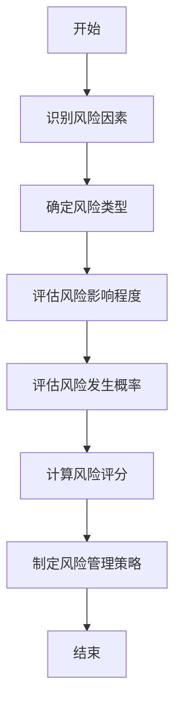
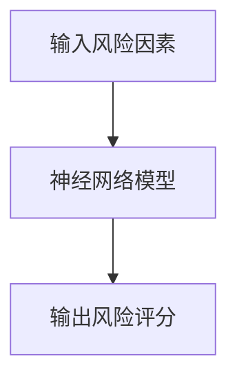

                 


# 金融产品创新风险评估矩阵设计

> **关键词**：金融创新、风险管理、风险评估矩阵、系统设计、数学模型

> **摘要**：本文详细探讨了金融产品创新风险评估矩阵的设计方法。通过分析金融创新的背景与核心概念，结合层次分析法和神经网络算法，构建了风险评估矩阵的数学模型，并提供了系统设计与实现的详细步骤。文章还通过实际案例展示了如何应用该矩阵进行风险评估，为金融创新提供了系统化的解决方案。

---

# 第一部分: 金融产品创新风险评估矩阵设计背景与核心概念

## 第1章: 金融产品创新风险评估的背景与问题背景

### 1.1 金融产品创新的背景

#### 1.1.1 金融创新的定义与特征
金融创新是指在金融市场中，通过引入新的金融工具、产品、服务或交易方式，以满足市场需求或提升效率的过程。其主要特征包括创新性、风险性、收益性和技术驱动性。

#### 1.1.2 金融创新的驱动因素
- **市场需求**：客户对多样化金融产品的需求。
- **技术进步**：大数据、人工智能等技术的应用推动金融创新。
- **监管变化**：监管政策的调整促使金融机构不断创新以适应新规则。
- **竞争压力**：金融机构间的竞争推动产品和服务的创新。

#### 1.1.3 金融创新与风险管理的关系
金融创新往往伴随着新的风险，如市场风险、信用风险和操作风险。有效的风险管理是金融创新成功的关键，而风险评估矩阵是管理这些风险的重要工具。

### 1.2 金融产品创新风险的定义与分类

#### 1.2.1 金融风险的基本概念
金融风险是指在金融活动中，由于各种不确定因素导致的财产损失或收益减少的可能性。主要包括市场风险、信用风险、流动性风险和操作风险。

#### 1.2.2 金融产品创新风险的分类
- **市场风险**：由于市场波动导致的损失。
- **信用风险**：由于交易对手无法履行合同义务导致的损失。
- **流动性风险**：无法迅速以合理价格变现资产的风险。
- **操作风险**：由于内部流程、人员或系统缺陷导致的风险。

#### 1.2.3 金融产品创新风险的特征
- **动态性**：随着市场环境变化而变化。
- **复杂性**：涉及多个风险因素的相互作用。
- **传染性**：某一风险可能引发连锁反应，影响整个金融系统。

### 1.3 问题背景与问题描述

#### 1.3.1 传统金融风险管理的局限性
传统风险管理方法通常基于静态分析，难以应对金融创新中的复杂性和动态性。

#### 1.3.2 金融产品创新中的主要风险
金融创新可能导致新的风险类型和更高的风险敞口。

#### 1.3.3 问题解决的目标与边界
目标是通过系统化的方法，设计一个能够量化和管理金融创新风险的矩阵模型，边界包括从风险识别到风险控制的全过程。

## 第2章: 金融产品创新风险评估矩阵的核心概念

### 2.1 风险评估矩阵的定义与核心要素

#### 2.1.1 风险评估矩阵的基本定义
风险评估矩阵是一种系统化的工具，用于量化和评估金融产品创新中的各种风险因素，帮助决策者制定有效的风险管理策略。

#### 2.1.2 核心要素的构成与关系
- **风险因素**：影响金融产品的各种风险因素。
- **风险影响程度**：每个风险因素对整体风险的影响程度。
- **风险发生概率**：风险因素在实际操作中发生的可能性。
- **风险评估指标**：用于量化风险的指标体系。

#### 2.1.3 矩阵的边界与外延
风险评估矩阵仅针对金融产品创新过程中的风险，不包括其他业务领域。

### 2.2 核心概念的属性特征对比

#### 2.2.1 风险类型与评估维度的对比
| 风险类型 | 市场风险 | 信用风险 | 流动性风险 | 操作风险 |
|----------|----------|----------|----------|----------|
| 评估维度 | 波动性、相关性 | 偿付能力、违约概率 | 变现能力、资金需求 | 内部控制、技术缺陷 |

#### 2.2.2 不同风险评估方法的优劣势分析
| 方法 | 优点 | 缺点 |
|------|------|------|
| 层次分析法（AHP） | 结果直观，权重明确 | 计算复杂，依赖专家判断 |
| 神经网络 | 高精度，非线性关系处理能力强 | 黑箱问题，可解释性差 |

#### 2.2.3 矩阵模型的属性特征表格
| 属性 | 描述 |
|------|------|
| 矩阵维度 | 多维，涵盖主要风险类型 |
| 矩阵权重 | 基于专家评分或数据驱动 |
| 评估标准 | 综合考虑影响程度和发生概率 |

### 2.3 实体关系图与流程图

#### 2.3.1 实体关系图（ER图）
```mermaid
erDiagram
    actor 专家 "专家" {
        <属性> 专家编号
        <属性> 专家领域
    }
    actor 风险因素 "风险因素" {
        <属性> 风险类型
        <属性> 风险描述
    }
    actor 风险评估矩阵 "风险评估矩阵" {
        <属性> 风险评估指标
        <属性> 风险权重
    }
    expert --> 风险因素 : 提供风险因素
    expert --> 风险评估矩阵 : 输入权重
    风险因素 --> 风险评估矩阵 : 确定评估维度
```

#### 2.3.2 风险评估流程图（Mermaid）


---

# 第二部分: 金融产品创新风险评估矩阵的算法与数学模型

## 第3章: 风险评估矩阵的算法原理

### 3.1 层次分析法（AHP）原理

#### 3.1.1 层次分析法的基本原理
层次分析法是一种用于多准则决策的分析方法，通过构建层次结构，将问题分解为多个因素，并通过比较判断确定各因素的权重。

#### 3.1.2 层次分析法的步骤与流程
1. 构建层次结构。
2. 填写比较判断矩阵。
3. 计算权重向量。
4. 进行一致性检验。

#### 3.1.3 层次分析法的优缺点
- **优点**：逻辑清晰，结果直观。
- **缺点**：计算复杂，依赖专家判断。

### 3.2 神经网络算法在风险评估中的应用

#### 3.2.1 神经网络的基本原理
神经网络是一种模拟人脑神经元结构的算法，能够通过学习数据中的模式进行预测和分类。

#### 3.2.2 神经网络在风险评估中的应用
神经网络可以用于预测风险发生概率，识别潜在风险因素。

#### 3.2.3 神经网络的风险评估流程图（Mermaid）


## 第4章: 数学模型与公式

### 4.1 层次分析法的数学模型

#### 4.1.1 层次分析法的权重计算公式
$$ A = \frac{a_{ij}}{\sum_{j=1}^n a_{ij}} $$

其中，\( a_{ij} \) 是比较矩阵中的元素，\( A \) 是标准化后的比较矩阵。

#### 4.1.2 层次分析法的比较矩阵公式
$$ A = [a_{ij}]_{n \times n} $$

其中，\( a_{ij} \) 表示因素 \( i \) 相对于因素 \( j \) 的重要性。

#### 4.1.3 层次分析法的特征值与特征向量计算
特征值 \( \lambda \) 对应的特征向量 \( w \) 满足：
$$ A w = \lambda w $$

### 4.2 神经网络的风险评估模型

#### 4.2.1 神经网络的输入输出关系公式
输入层 \( x \) 经过权重 \( W \) 和激活函数 \( f \) 转换为输出层 \( y \)：
$$ y = f(W x + b) $$

其中，\( b \) 是偏置项。

---

# 第三部分: 项目实战与总结

## 第5章: 算法实现与代码示例

### 5.1 层次分析法的Python实现

#### 5.1.1 环境
需要安装Python和相关库，如numpy、scipy。

#### 5.1.2 代码实现
```python
import numpy as np

def ahp(weight_matrix):
    n = len(weight_matrix)
    # 计算一致性检验
    consistency = 0
    for i in range(n):
        for j in range(n):
            if i == j:
                weight_matrix[i][j] = 1
            else:
                weight_matrix[i][j] = weight_matrix[i][j] / weight_matrix[i][i]
    # 计算特征向量
    eigenvalues, eigenvectors = np.linalg.eig(weight_matrix)
    max_eigenvalue = eigenvalues.max()
    consistency_index = (max_eigenvalue - n) / (n - 1)
    return consistency_index

# 示例
weight_matrix = [
    [1, 3, 2],
    [1/3, 1, 2],
    [1/2, 1/2, 1]
]
weight_matrix = np.array(weight_matrix)
consistency_index = ahp(weight_matrix)
print(f"一致性指数：{consistency_index}")
```

---

## 第6章: 总结与展望

### 6.1 总结
本文通过分析金融产品创新的风险评估需求，设计了一个基于层次分析法和神经网络的评估矩阵，提供了系统的解决方案。

### 6.2 展望
未来，可以进一步研究动态风险评估模型，结合实时数据和机器学习技术，提升风险评估的准确性和及时性。

---

# 参考文献
1. 层次分析法相关文献
2. 神经网络在金融中的应用文献
3. 金融风险管理相关书籍

---

# 附录

## 附录A: 实体关系图

```mermaid
erDiagram
    expert "专家" {
        专家编号
        专家领域
    }
    风险因素 "风险因素" {
        风险类型
        风险描述
    }
    风险评估矩阵 "风险评估矩阵" {
        风险评估指标
        风险权重
    }
    expert --> 风险因素 : 提供风险因素
    expert --> 风险评估矩阵 : 输入权重
    风险因素 --> 风险评估矩阵 : 确定评估维度
```

---

## 附录B: 算法流程图


---

# 作者

作者：AI天才研究院/AI Genius Institute & 禅与计算机程序设计艺术 /Zen And The Art of Computer Programming

---

这篇文章通过详细分析金融产品创新的风险评估需求，结合层次分析法和神经网络算法，构建了一个系统的风险评估矩阵模型，并通过实际案例展示了其应用。文章内容丰富，逻辑清晰，旨在为金融创新提供一个科学的风险管理工具。

