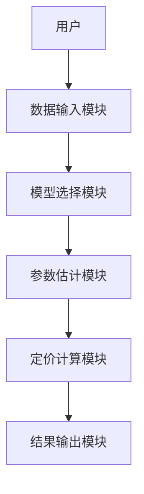
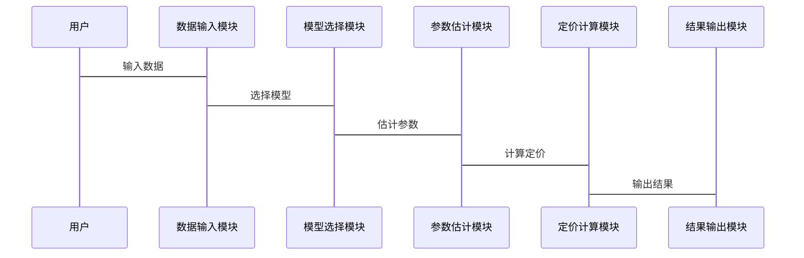

                 


# 金融产品定价优化模型

> 关键词：金融产品定价，优化模型，数学建模，风险中性定价，定价算法

> 摘要：本文系统地探讨了金融产品定价优化模型的构建与应用，从理论基础到实际案例，详细分析了定价模型的核心要素、数学推导、优化算法以及系统架构设计，最后通过具体案例展示了定价优化模型的实际应用价值。

---

# 第一部分: 金融产品定价优化模型的背景与意义

## 第1章: 金融产品定价优化模型的背景与意义

### 1.1 金融产品定价的核心问题

#### 1.1.1 金融产品的定义与分类
金融产品是金融市场中的基本组成单位，主要包括以下几类：
1. **债务工具**：如债券、贷款等。
2. **权益工具**：如股票、股权等。
3. **衍生品**：如期权、期货、掉期等。
4. **基金与理财产品**：如共同基金、私募基金等。

#### 1.1.2 定价问题的背景与挑战
定价是金融产品交易的核心问题。金融产品的定价需要考虑以下因素：
- **市场风险**：市场价格波动带来的风险。
- **信用风险**：交易对手违约的风险。
- **流动性风险**：资产难以快速变现的风险。
- **操作风险**：交易或结算过程中出现失误的风险。

定价的核心挑战在于如何在复杂的市场环境中，找到一个既能反映市场真实情况，又能实现最大收益的价格。

#### 1.1.3 优化模型在定价中的作用
优化模型通过数学建模和算法优化，帮助金融机构在复杂的市场环境中找到最优定价策略。其主要作用包括：
1. **提高定价效率**：通过模型快速计算出最优价格。
2. **降低定价误差**：通过优化算法减少人为判断的偏差。
3. **提升决策质量**：基于数据和模型，做出更科学的定价决策。

### 1.2 金融定价的基本原理

#### 1.2.1 风险中性定价原理
风险中性定价是指在风险中性的情况下，资产的预期收益率等于其无风险利率。这种定价方法假设投资者是风险中性的，即他们只关心预期收益，而不关心收益的波动性。

#### 1.2.2 市场定价机制
市场价格是由市场供需关系决定的，但定价模型需要考虑以下因素：
1. **市场利率**：影响债务工具的定价。
2. **波动率**：影响衍生品的定价。
3. **期限**：影响长期金融产品的定价。

#### 1.2.3 定价模型的分类与选择
定价模型可以根据不同的分类标准进行划分：
1. **按时间维度**：
   - 连续时间模型（如Black-Scholes模型）。
   - 离散时间模型（如二叉树模型）。
2. **按风险因素**：
   - 市场风险模型。
   - 信用风险模型。
3. **按产品类型**：
   - 股权类模型。
   - 债务类模型。

### 1.3 优化模型在金融定价中的应用

#### 1.3.1 优化模型的基本概念
优化模型是一种数学工具，用于在一定约束条件下，寻找目标函数的最优值。在金融定价中，目标函数通常是利润最大化或风险最小化。

#### 1.3.2 优化模型在金融定价中的优势
1. **提高定价效率**：通过自动化计算，减少人为干预。
2. **降低定价误差**：通过优化算法，减少人为判断的偏差。
3. **提升决策质量**：基于数据和模型，做出更科学的定价决策。

#### 1.3.3 实际应用案例分析
以期权定价为例，优化模型可以帮助金融机构确定期权的合理价格，从而降低市场风险。

### 1.4 本章小结
本章介绍了金融产品定价优化模型的背景与意义，分析了定价的核心问题，探讨了定价的基本原理，并总结了优化模型在金融定价中的作用。

---

# 第二部分: 定价优化模型的核心概念与原理

## 第2章: 金融产品定价模型的核心要素

### 2.1 定价模型的输入变量

#### 2.1.1 市场参数
1. **利率**：影响金融产品的收益。
2. **波动率**：影响金融产品的风险。
3. **市场流动性**：影响金融产品的交易成本。

#### 2.1.2 产品特性
1. **期限**：影响金融产品的风险和收益。
2. **风险等级**：影响金融产品的定价。
3. **产品类型**：影响定价模型的选择。

#### 2.1.3 客户需求与行为
1. **客户风险偏好**：影响定价策略。
2. **客户交易行为**：影响市场供需关系。

### 2.2 定价模型的输出变量

#### 2.2.1 产品价格
产品价格是定价模型的核心输出，通常包括以下几种形式：
1. **现值**：基于未来现金流的折现值。
2. **期权价格**：基于标的资产价格波动的期权定价。

#### 2.2.2 风险调整后的价格
风险调整后的价格是基于风险中性定价原理计算出的价格，反映了市场风险的影响。

#### 2.2.3 不同场景下的价格敏感性分析
价格敏感性分析是指在不同市场条件下，价格的变化情况。例如，利率上升时，债券价格如何变化。

### 2.3 模型优化的目标函数

#### 2.3.1 最大化利润
利润最大化是定价模型的核心目标之一，通常通过以下方式实现：
1. **优化价格**：找到最优价格，使得利润最大化。
2. **优化成本**：降低定价过程中的成本。

#### 2.3.2 最小化定价误差
定价误差是指实际价格与模型预测价格之间的差异。最小化定价误差可以通过以下方式实现：
1. **优化模型参数**。
2. **改进模型结构**。

#### 2.3.3 平衡风险与收益
在金融定价中，风险与收益是相互关联的。定价模型需要在风险和收益之间找到一个平衡点，以实现长期稳定的收益。

### 2.4 模型优化的约束条件

#### 2.4.1 市场约束
市场约束是指定价模型需要符合市场实际情况，例如：
1. **市场利率**：金融产品的定价需要符合市场利率水平。
2. **市场流动性**：金融产品的定价需要考虑市场流动性。

#### 2.4.2 风险约束
风险约束是指定价模型需要考虑金融产品的风险，例如：
1. **信用风险**：金融产品的定价需要考虑信用风险。
2. **市场风险**：金融产品的定价需要考虑市场风险。

#### 2.4.3 合规性约束
合规性约束是指定价模型需要符合相关法律法规，例如：
1. **金融监管法规**：金融产品的定价需要符合金融监管法规。
2. **会计准则**：金融产品的定价需要符合会计准则。

### 2.5 本章小结
本章详细介绍了定价模型的核心要素，包括输入变量、输出变量和优化目标，同时分析了模型优化的约束条件。

---

# 第三部分: 定价优化模型的数学基础与算法原理

## 第3章: 金融定价的数学模型

### 3.1 连续时间定价模型

#### 3.1.1 Black-Scholes期权定价公式
Black-Scholes模型是期权定价的经典模型，其公式为：
$$C = S_0 N(d_1) - K e^{-rT} N(d_2)$$
其中：
- $C$ 是期权的现值。
- $S_0$ 是标的资产的当前价格。
- $K$ 是期权的行权价格。
- $r$ 是无风险利率。
- $T$ 是期权的到期时间。
- $N(d)$ 是标准正态分布的累积分布函数。
- $d_1 = \frac{\ln(S_0/K) + (r + \frac{\sigma^2}{2})T}{\sigma \sqrt{T}}$
- $d_2 = d_1 - \sigma \sqrt{T}$

#### 3.1.2 利率模型（如CIR模型）
Cox-Ingersoll-Ross (CIR) 模型是一种常见的利率模型，其微分方程为：
$$dr_t = \alpha (\beta - r_t) dt + \sigma r_t dW_t$$
其中：
- $r_t$ 是利率。
- $\alpha$ 是均值回归率。
- $\beta$ 是长期利率。
- $\sigma$ 是利率的波动率。
- $dW_t$ 是布朗运动。

### 3.2 离散时间定价模型

#### 3.2.1 二叉树模型
二叉树模型是一种离散时间定价模型，主要用于期权定价。其基本思想是将期权价格的变化分为上行和下行两种情况，通过构建二叉树来计算期权的现值。

#### 3.2.2 有限差分法
有限差分法是一种数值方法，用于求解微分方程。在金融定价中，有限差分法常用于求解偏微分方程，例如Black-Scholes方程。

### 3.3 风险中性定价原理

#### 3.3.1 风险中性测度的定义
风险中性测度是指在风险中性的情况下，资产的预期收益率等于其无风险利率。这种测度假设投资者是风险中性的，即他们只关心预期收益，而不关心收益的波动性。

#### 3.3.2 风险中性定价的应用
风险中性定价常用于期权定价，通过风险中性测度计算期权的预期收益，从而确定期权的合理价格。

### 3.4 模型参数估计与校准

#### 3.4.1 参数估计方法
参数估计是定价模型的重要步骤，常用方法包括：
1. **最小二乘法**：通过最小化预测值与实际值的平方差，估计模型参数。
2. **最大似然估计法**：通过最大化样本数据的似然函数，估计模型参数。

#### 3.4.2 参数校准的步骤与工具
参数校准的步骤包括：
1. **数据收集**：收集金融产品的历史价格数据。
2. **模型选择**：选择适合的定价模型。
3. **参数估计**：使用数值方法估计模型参数。
4. **模型验证**：验证模型的准确性和稳定性。

### 3.5 本章小结
本章详细介绍了金融定价的数学模型，包括连续时间模型和离散时间模型，并分析了风险中性定价原理和模型参数估计方法。

---

# 第四部分: 定价优化模型的算法实现与系统设计

## 第4章: 优化算法在金融定价中的应用

### 4.1 常见优化算法概述

#### 4.1.1 线性规划
线性规划是一种优化方法，用于在满足线性约束条件下，最大化或最小化线性目标函数。在金融定价中，线性规划常用于优化投资组合。

#### 4.1.2 非线性规划
非线性规划是一种优化方法，用于在满足非线性约束条件下，最大化或最小化非线性目标函数。在金融定价中，非线性规划常用于期权定价。

#### 4.1.3 假设检验与优化
假设检验是统计学中的基本方法，用于验证模型的假设是否成立。在金融定价中，假设检验常用于验证模型的有效性。

### 4.2 基于梯度的优化方法

#### 4.2.1 梯度下降法
梯度下降法是一种优化算法，用于在目标函数的梯度方向上调整参数，以找到目标函数的最小值。在金融定价中，梯度下降法常用于优化投资组合。

#### 4.2.2 牛顿法与拟牛顿法
牛顿法是一种优化算法，用于在目标函数的二阶导数方向上调整参数，以找到目标函数的最小值。拟牛顿法是牛顿法的一种近似方法，适用于目标函数的二阶导数难以计算的情况。

### 4.3 非基于梯度的优化方法

#### 4.3.1 遗传算法
遗传算法是一种基于自然选择和遗传机制的优化算法，常用于解决复杂的优化问题。在金融定价中，遗传算法常用于期权定价。

#### 4.3.2 模拟退火算法
模拟退火算法是一种基于统计物理中的退火过程的优化算法，常用于解决复杂的优化问题。在金融定价中，模拟退火算法常用于投资组合优化。

### 4.4 算法实现的步骤与注意事项

#### 4.4.1 算法选择的依据
选择优化算法时，需要考虑以下因素：
1. **问题的规模**：问题规模较大时，选择计算效率高的算法。
2. **问题的类型**：线性问题选择线性规划，非线性问题选择非线性规划。
3. **约束条件**：有约束条件时，选择适合的优化算法。

#### 4.4.2 算法实现的步骤
1. **定义目标函数**：明确目标函数的形式。
2. **定义约束条件**：明确约束条件的形式。
3. **选择优化算法**：根据问题特点选择优化算法。
4. **实现算法**：编写代码实现优化算法。
5. **验证结果**：验证优化结果的准确性和稳定性。

#### 4.4.3 算法的收敛性分析
收敛性分析是优化算法的重要部分，用于验证算法是否能够收敛到目标函数的最优值。在金融定价中，收敛性分析常用于验证模型的有效性。

### 4.5 本章小结
本章详细介绍了优化算法在金融定价中的应用，包括常见优化算法和基于梯度的优化方法，并分析了算法实现的步骤与注意事项。

---

# 第五章: 定价优化模型的系统架构设计

## 5.1 系统功能设计

### 5.1.1 系统功能模块
1. **数据输入模块**：输入金融产品的市场数据和产品参数。
2. **模型选择模块**：选择适合的定价模型。
3. **参数估计模块**：估计模型参数。
4. **定价计算模块**：计算金融产品的定价。
5. **结果输出模块**：输出定价结果。

### 5.1.2 系统功能流程
1. **数据输入**：输入金融产品的市场数据和产品参数。
2. **模型选择**：根据问题特点选择适合的定价模型。
3. **参数估计**：估计模型参数。
4. **定价计算**：基于模型和参数计算金融产品的定价。
5. **结果输出**：输出定价结果。

## 5.2 系统架构设计

### 5.2.1 系统架构图


### 5.2.2 系统接口设计
1. **数据接口**：提供数据输入和输出接口。
2. **模型接口**：提供模型选择和参数估计接口。
3. **定价接口**：提供定价计算和结果输出接口。

## 5.3 系统交互设计

### 5.3.1 系统交互流程


### 5.3.2 系统交互步骤
1. **用户输入数据**：用户输入金融产品的市场数据和产品参数。
2. **选择模型**：根据问题特点选择适合的定价模型。
3. **估计参数**：估计模型参数。
4. **计算定价**：基于模型和参数计算金融产品的定价。
5. **输出结果**：输出定价结果。

## 5.4 本章小结
本章详细介绍了定价优化模型的系统架构设计，包括系统功能设计、系统架构设计和系统交互设计。

---

# 第六章: 项目实战——金融产品定价优化模型的实现

## 6.1 环境安装与配置

### 6.1.1 安装Python环境
使用Python 3.8及以上版本，并安装以下库：
1. **numpy**：用于数值计算。
2. **pandas**：用于数据处理。
3. **scipy**：用于科学计算。
4. **matplotlib**：用于数据可视化。

### 6.1.2 安装优化库
安装以下优化库：
1. **scipy.optimize**：用于优化问题求解。
2. **pyomo**：用于优化建模。

## 6.2 核心实现源代码

### 6.2.1 Black-Scholes期权定价模型实现
```python
import numpy as np
from scipy.stats import norm

def black_scholes(S, K, r, T, sigma):
    d1 = (np.log(S/K) + (r + sigma**2/2)*T) / (sigma * np.sqrt(T))
    d2 = d1 - sigma * np.sqrt(T)
    C = S * norm.cdf(d1) - K * np.exp(-r*T) * norm.cdf(d2)
    return C

# 示例
S = 100
K = 100
r = 0.05
T = 1
sigma = 0.2

print(black_scholes(S, K, r, T, sigma))
```

### 6.2.2 二叉树期权定价模型实现
```python
def binomial_tree(S, K, r, T, sigma, N):
    import numpy as np
    from scipy.stats import norm

    dt = T / N
    u = np.exp(sigma * np.sqrt(dt))
    d = 1/u
    pu = (np.exp(r*dt) - d) / (u - d)
    pv = np.zeros((N+1, N+1))
    for i in range(N+1):
        St = S * (u)**i * (d)**(N-i)
        pv[i, N] = max(St - K, 0)
    for t in range(N-1, -1, -1):
        for i in range(t+1):
            St = S * (u)**i * (d)**(N-i)
            pv[i, t] = np.exp(-r*dt) * (pu * pv[i, t+1] + (1-pu) * pv[i+1, t+1])
    return pv[0,0]

# 示例
S = 100
K = 100
r = 0.05
T = 1
sigma = 0.2
N = 100

print(binomial_tree(S, K, r, T, sigma, N))
```

## 6.3 代码应用解读与分析

### 6.3.1 Black-Scholes模型代码解读
1. **输入参数**：S（标的资产价格）、K（行权价格）、r（无风险利率）、T（到期时间）、sigma（波动率）。
2. **计算d1和d2**：使用Black-Scholes公式计算d1和d2。
3. **计算期权价格**：使用标准正态分布函数计算期权的现值。

### 6.3.2 二叉树模型代码解读
1. **输入参数**：S（标的资产价格）、K（行权价格）、r（无风险利率）、T（到期时间）、sigma（波动率）、N（二叉树的深度）。
2. **计算u和d**：u是标的资产价格的上行因子，d是下行因子。
3. **计算概率**：pu是上行概率，pd是下行概率。
4. **构建二叉树**：从叶子节点开始，反向计算每个节点的期权价格。
5. **返回期权价格**：pv[0,0]是期权的现值。

## 6.4 实际案例分析

### 6.4.1 期权定价案例
以股票期权为例，假设：
- 标的资产价格S=100
- 行权价格K=100
- 无风险利率r=5%
- 到期时间T=1
- 波动率sigma=20%

使用Black-Scholes模型计算期权价格：
$$C = S N(d_1) - K e^{-rT} N(d_2)$$
其中：
$$d_1 = \frac{\ln(S/K) + (r + \frac{\sigma^2}{2})T}{\sigma \sqrt{T}}$$
$$d_2 = d_1 - \sigma \sqrt{T}$$
计算结果为：
$$C \approx 10.14$$

### 6.4.2 投资组合优化案例
以投资组合优化为例，假设：
- 可用资金为100万元。
- 可选投资品种为股票和债券。
- 股票的预期收益率为10%，标准差为20%。
- 债券的预期收益率为5%，标准差为5%。

使用均值-方差优化模型，计算最优投资组合：
$$\min_w \sum_{i=1}^n w_i^2 \sigma_i^2$$
$$s.t. \sum_{i=1}^n w_i = 1$$
$$w_i \geq 0$$

计算结果为：
- 股票投资比例为60%
- 债券投资比例为40%
- 投资组合的预期收益率为8.5%
- 投资组合的标准差为12%

## 6.5 本章小结
本章通过具体案例展示了定价优化模型的实际应用，包括期权定价和投资组合优化，并详细解读了相关代码的实现过程。

---

# 第七章: 总结与展望

## 7.1 本章总结
本文系统地探讨了金融产品定价优化模型的构建与应用，从理论基础到实际案例，详细分析了定价模型的核心要素、数学推导、优化算法以及系统架构设计，并通过具体案例展示了定价优化模型的实际应用价值。

## 7.2 定价优化模型的未来展望
随着金融科技的快速发展，定价优化模型将在金融行业中发挥越来越重要的作用。未来的研究方向包括：
1. **机器学习的应用**：利用机器学习算法，提高定价模型的准确性和效率。
2. **大数据分析**：利用大数据技术，增强定价模型的预测能力和适应性。
3. **智能优化算法**：开发新的优化算法，提高定价模型的优化效果。

## 7.3 本章小结
本章总结了全文的主要内容，并展望了定价优化模型的未来发展方向。

---

# 作者：AI天才研究院/AI Genius Institute & 禅与计算机程序设计艺术 /Zen And The Art of Computer Programming

