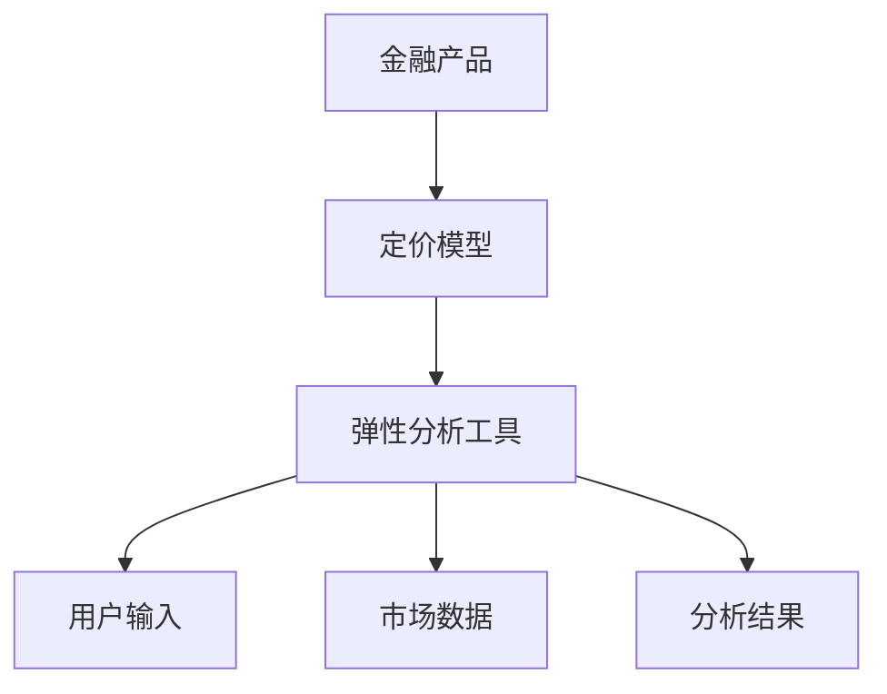
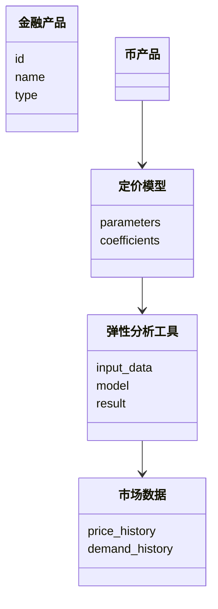
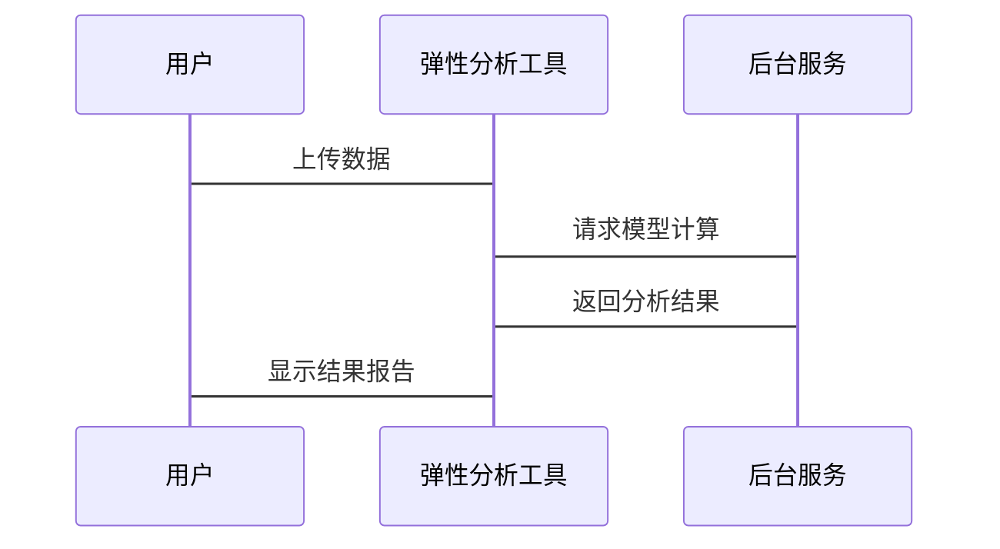

                 


# 《金融产品定价弹性分析工具》

## 关键词：金融产品定价弹性分析工具、金融建模、弹性分析、定价模型、系统架构、项目实战

## 摘要：本文深入探讨金融产品定价弹性分析工具的设计与实现，从背景介绍到数学模型，再到系统架构和项目实战，全面解析弹性分析的核心概念与应用场景。通过具体案例分析，展示如何利用弹性分析工具优化金融产品的定价策略，帮助金融机构提升市场竞争力。

---

## 第一部分: 引言

### 第1章: 问题背景与目标

#### 1.1 问题背景

金融产品定价是金融机构的核心业务之一，其准确性直接影响收益和风险控制。然而，金融市场环境复杂多变，价格弹性分析成为优化定价策略的关键工具。价格弹性分析帮助机构理解价格变动对需求的影响，从而制定更具竞争力的定价策略。

#### 1.2 问题描述

在金融产品定价中，价格弹性是指价格变动对需求量的影响程度。准确分析价格弹性，可以帮助机构预测价格调整后的市场需求变化，优化定价策略。然而，传统定价模型缺乏对价格弹性的量化分析，难以应对复杂市场环境。因此，开发一个基于弹性分析的定价工具显得尤为重要。

#### 1.3 问题解决思路

本工具旨在通过数据建模和算法分析，量化金融产品价格弹性，帮助机构优化定价策略。工具设计注重数据处理、模型计算和结果可视化，确保分析结果的准确性和可操作性。

#### 1.4 概念结构与核心要素

- **核心概念**：价格弹性、定价模型、需求预测。
- **核心要素**：历史销售数据、价格变动记录、市场环境数据、用户行为数据。
- **概念结构**：构建数据驱动的定价模型，分析价格弹性，优化定价策略。

---

## 第二部分: 核心概念与理论基础

### 第2章: 弹性分析的核心概念

#### 2.1 弹性分析的原理

- **基本原理**：通过统计分析和数学建模，量化价格变动对需求的影响。
- **关键属性**：价格弹性系数、需求弹性方向、弹性敏感度。
- **数学模型**：通过回归分析建立需求与价格的关系模型。

#### 2.2 弹性分析的核心要素

- **产品特性**：产品类型、生命周期阶段。
- **市场环境**：经济状况、竞争环境。
- **用户行为**：价格敏感度、购买习惯。

#### 2.3 弹性分析的对比分析

- **不同弹性类型对比**：需求弹性、收入弹性、交叉弹性。
- **不同场景下的弹性特征**：市场垄断 vs 竞争市场、高弹性 vs 低弹性。
- **优劣势对比**：高弹性产品价格敏感度高，低弹性产品需求相对稳定。

#### 2.4 实体关系图



---

## 第三部分: 弹性分析的数学模型与算法原理

### 第3章: 弹性分析的数学模型

#### 3.1 弹性分析的基本公式

- **弹性系数的定义**
$$ E = \frac{\% \Delta Q}{\% \Delta P} $$
其中，$\% \Delta Q$ 是需求量变化百分比，$\% \Delta P$ 是价格变化百分比。

- **弹性分析的数学表达**
$$ Q = f(P, X) $$
其中，$Q$ 是需求量，$P$ 是价格，$X$ 是其他影响因素。

#### 3.2 弹性分析的算法原理

- **线性回归模型**
$$ Q = \beta_0 + \beta_1 P + \epsilon $$
通过最小二乘法估计参数 $\beta_0$ 和 $\beta_1$，计算价格弹性系数。

- **需求弹性计算**
$$ E = \frac{Q}{P} \cdot \frac{\Delta P}{\Delta Q} $$
通过回归模型的系数计算价格弹性。

---

## 第四部分: 系统设计与架构方案

### 第4章: 系统设计与架构

#### 4.1 项目背景与需求分析

- **项目背景**：开发一个基于弹性分析的定价工具，帮助金融机构优化定价策略。
- **功能需求**：数据输入、模型计算、结果可视化、报告生成。
- **领域模型**


#### 4.2 系统架构设计

- **系统架构**


#### 4.3 接口设计与交互流程

- **接口设计**：RESTful API，支持数据上传、模型调用、结果查询。
- **交互流程**


---

## 第五部分: 项目实战

### 第5章: 项目实战

#### 5.1 环境安装与数据准备

- **环境安装**：安装Python、Pandas、Scikit-learn、Plotly。
- **数据准备**：收集历史销售数据、价格变动记录、市场环境数据。

#### 5.2 核心代码实现

- **数据预处理**
```python
import pandas as pd
data = pd.read_csv('product_data.csv')
data['log_price'] = pd.log(data['price'])
data['log_quantity'] = pd.log(data['quantity'])
```

- **模型训练**
```python
from sklearn.linear_model import LinearRegression
model = LinearRegression()
model.fit(data[['log_price']], data['log_quantity'])
```

- **弹性系数计算**
```python
elasticity = model.coef_[0]
```

#### 5.3 案例分析与结果解读

- **案例分析**：分析某金融产品的价格弹性，发现价格变化对需求的影响程度。
- **结果解读**：根据弹性系数优化定价策略。

#### 5.4 工具实现步骤总结

- **步骤总结**：数据收集、数据预处理、模型训练、结果分析。

---

## 第六部分: 总结与展望

### 第6章: 总结与展望

#### 6.1 知识回顾

- 本文介绍了金融产品定价弹性分析工具的设计与实现，从理论基础到系统架构，再到项目实战，全面解析了弹性分析的核心概念与应用场景。

#### 6.2 最佳实践 Tips

- 数据质量至关重要，确保数据准确性和完整性。
- 结合实际业务场景，灵活调整模型参数。
- 定期更新模型，适应市场环境变化。

#### 6.3 小结与注意事项

- 弹性分析工具为金融机构优化定价策略提供了有力支持。
- 在实际应用中，需注意数据隐私和模型泛化能力。

#### 6.4 拓展阅读

- 《金融工程中的定量方法》
- 《Python金融数据处理与建模》

---

## 作者：AI天才研究院 & 禅与计算机程序设计艺术

