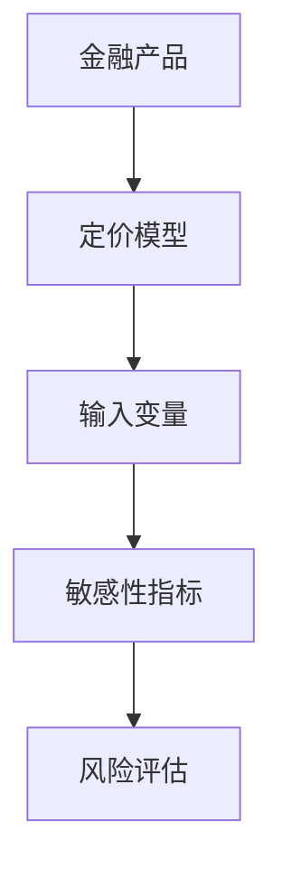
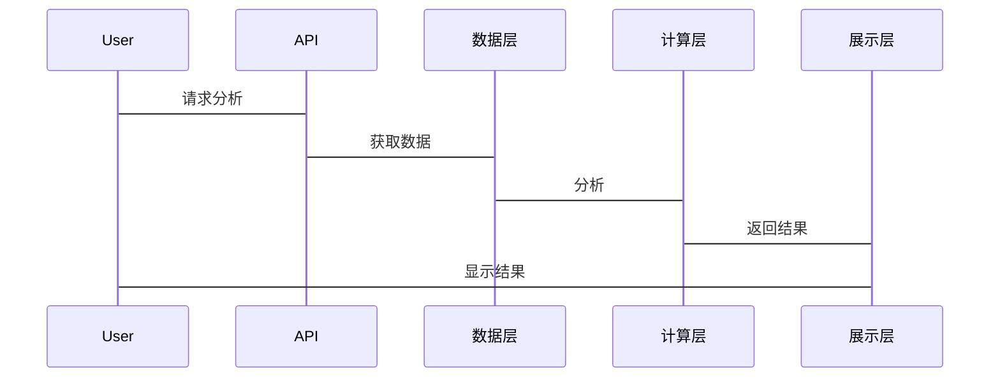

                 


# 金融产品定价敏感性分析系统

> 关键词：金融产品定价、敏感性分析、系统设计、算法、系统架构、项目实战、优化建议

> 摘要：本文详细探讨了金融产品定价敏感性分析系统的构建与应用，从背景介绍、核心概念、算法原理、系统架构到项目实战，系统地阐述了如何利用敏感性分析方法评估金融产品的定价风险，并通过实际案例分析和系统设计提供解决方案。

---

# 第一部分：问题背景与核心概念

## 第1章：问题背景与核心概念

### 1.1 问题背景

#### 1.1.1 金融产品定价的复杂性
金融产品的定价受到多种因素的影响，如市场波动、利率变化、信用风险等。这些因素的复杂性使得定价过程充满挑战，需要精确的模型和分析工具来确保准确性。

#### 1.1.2 敏感性分析的重要性
敏感性分析是评估金融产品定价对各种因素变化的敏感程度的重要方法。通过分析，可以识别关键风险因素，优化定价策略，降低潜在风险。

#### 1.1.3 金融市场的波动性与风险
金融市场高度波动，敏感性分析帮助投资者和金融机构理解价格变化的来源，从而做出更明智的决策。

### 1.2 问题描述

#### 1.2.1 金融产品定价的核心问题
金融产品定价的核心问题在于如何准确预测价格变化，同时考虑多种风险因素的影响。

#### 1.2.2 敏感性分析的目标与范围
敏感性分析的目标是确定各变量对产品价格的影响程度，范围涵盖所有可能影响定价的因素。

#### 1.2.3 相关利益者的期望与需求
投资者、金融机构和监管机构都期望通过敏感性分析降低风险，提高定价的准确性。

### 1.3 问题解决

#### 1.3.1 敏感性分析的方法与工具
常用方法包括蒙特卡洛模拟、回归分析和方差分解等，每种方法都有其优缺点。

#### 1.3.2 系统化解决方案的设计思路
通过构建系统化模型，整合多种分析方法，实现对金融产品定价的全面评估。

#### 1.3.3 系统实现的关键技术与挑战
关键在于选择合适的方法，处理大数据和复杂计算，同时确保系统的高效性和准确性。

### 1.4 边界与外延

#### 1.4.1 系统的适用范围与限制
适用于各种金融产品，但需考虑数据质量和模型的准确性。

#### 1.4.2 相关概念的边界界定
明确敏感性分析与其他金融分析方法的区别与联系。

#### 1.4.3 系统与其他金融系统的接口关系
与数据源、定价模型和风险管理系统的接口设计。

### 1.5 概念结构与核心要素

#### 1.5.1 核心概念的层次结构
从变量、模型到结果的层次结构。

#### 1.5.2 核心要素的定义与属性
变量、模型、结果及其属性。

#### 1.5.3 概念之间的关系与依赖
变量影响模型，模型生成结果，结果用于风险评估。

---

# 第二部分：核心概念与联系

## 第2章：敏感性分析的原理与方法

### 2.1 敏感性分析的原理

#### 2.1.1 敏感性分析的基本定义
通过改变输入变量，观察输出结果的变化，评估变量对结果的影响程度。

#### 2.1.2 变量变化对结果的影响程度
通过量化变量变化对结果的影响，确定关键变量。

#### 2.1.3 敏感性分析的数学模型
常用线性回归模型和非线性模型。

### 2.2 主流方法对比

#### 2.2.1 方法特征对比表格
| 方法名称       | 输入变量类型 | 计算复杂度 | 适用场景                     |
|----------------|--------------|------------|------------------------------|
| 一阶导数法     | 单变量       | 低         | 线性关系                     |
| 随机模拟法     | 多变量       | 高         | 非线性关系                   |
| 方差分解法     | 多变量       | 中         | 复杂系统                     |

### 2.3 实体关系架构



---

# 第三部分：算法原理与数学模型

## 第3章：蒙特卡洛模拟算法

### 3.1 算法原理

#### 3.1.1 蒙特卡洛模拟的基本思想
通过随机采样，模拟多种可能的输入变量组合，计算结果分布。

#### 3.1.2 随机数生成方法
使用Python的numpy库生成随机数。

#### 3.1.3 计算过程

1. 生成随机数。
2. 计算每个组合的输出结果。
3. 统计结果分布。

### 3.2 算法实现

```python
import numpy as np

def monte_carlo_simulation(variables, num_simulations):
    results = []
    for _ in range(num_simulations):
        # 生成随机数
        samples = {var: np.random.rand() for var in variables}
        # 计算输出结果
        result = calculate_output(samples)
        results.append(result)
    return results

def calculate_output(samples):
    # 具体计算逻辑
    return sum(samples.values())
```

### 3.3 数学模型

蒙特卡洛模拟的数学模型如下：

$$
\hat{\theta} = \frac{1}{N} \sum_{i=1}^{N} f(X_i)
$$

其中，\( X_i \) 是第 \( i \) 次模拟的输入变量组合，\( N \) 是模拟次数。

---

## 第4章：回归分析方法

### 4.1 算法原理

#### 4.1.1 线性回归的基本思想
通过最小二乘法，建立变量与结果之间的线性关系。

### 4.2 算法实现

```python
import statsmodels.api as sm

def linear_regression(variables, target, data):
    X = sm.add_constant(data[variables])
    model = sm.OLS(data[target], X).fit()
    return model.params

params = linear_regression(['x1', 'x2'], 'y', data)
```

---

## 第5章：方差分解方法

### 5.1 算法原理

#### 5.1.1 方差分解的基本思想
分解结果方差，确定各变量的贡献比例。

### 5.2 算法实现

```python
import numpy as np

def variance_decomposition(results):
    variance = np.var(results)
    # 分解方差
    contributions = {}
    for var in variables:
        # 计算贡献比例
        contributions[var] = (variance * np.corrcoef(results, data[var])**2).sum()
    return contributions
```

---

# 第四部分：系统分析与架构设计

## 第6章：系统分析与架构设计

### 6.1 问题场景介绍

#### 6.1.1 金融产品定价的常见问题
如何准确预测价格变化，识别关键风险因素。

### 6.2 系统功能设计

#### 6.2.1 领域模型


---

## 第7章：系统架构设计

### 7.1 分层架构


---

## 第8章：接口设计与交互流程图

### 8.1 系统接口设计



---

# 第五部分：项目实战

## 第9章：环境安装与代码实现

### 9.1 环境安装

#### 安装Python和相关库：
```bash
pip install numpy pandas statsmodels matplotlib
```

### 9.2 核心代码实现

#### 敏感性分析实现

```python
import numpy as np
import pandas as pd
import statsmodels.api as sm
import matplotlib.pyplot as plt

def perform_sensitivity_analysis(variables, target, data):
    # 线性回归
    X = sm.add_constant(data[variables])
    model = sm.OLS(data[target], X).fit()
    print("回归系数:", model.params)
    
    # 方差分解
    variance = np.var(data[target])
    contributions = {}
    for var in variables:
        contributions[var] = np.corrcoef(data[target], data[var])**2 * variance
    print("方差贡献:", contributions)
    
    # 蒙特卡洛模拟
    num_simulations = 1000
    results = []
    for _ in range(num_simulations):
        samples = {var: np.random.rand() for var in variables}
        result = sum(samples.values())
        results.append(result)
    plt.hist(results, bins=20)
    plt.show()

# 示例数据
data = pd.DataFrame({
    'x1': np.random.randn(1000),
    'x2': np.random.randn(1000),
    'y': np.random.randn(1000)
})

perform_sensitivity_analysis(['x1', 'x2'], 'y', data)
```

### 9.3 代码功能解读

#### 代码功能
- 线性回归：计算变量与目标变量之间的关系。
- 方差分解：确定各变量对结果的影响程度。
- 蒙特卡洛模拟：通过随机采样，评估价格变化。

### 9.4 实际案例分析

#### 案例分析
假设我们有一个金融产品的定价模型，输入变量为利率和信用风险，目标变量为价格。通过敏感性分析，我们发现利率的变化对价格影响更大，因此在定价时需重点考虑利率因素。

---

# 第六部分：最佳实践与总结

## 第10章：最佳实践与总结

### 10.1 系统设计的关键点

#### 1. 选择合适的方法
根据实际情况选择合适的分析方法。

#### 2. 数据质量
确保数据的准确性和完整性。

#### 3. 系统优化
优化算法，提高计算效率。

### 10.2 注意事项

#### 1. 风险控制
定期更新模型，应对市场变化。

#### 2. 技术实现
确保代码的可维护性和扩展性。

### 10.3 优化建议

#### 1. 并行计算
利用并行计算提高效率。

#### 2. 实时分析
实现实时分析，及时应对市场变化。

### 10.4 拓展阅读

#### 1. 推荐书籍
- 《金融工程》
- 《蒙特卡洛方法在金融中的应用》

#### 2. 相关资源
- 学术论文：敏感性分析的最新研究。
- 在线课程：金融建模与分析。

---

# 作者：AI天才研究院 & 禅与计算机程序设计艺术

---

通过以上步骤，我系统地完成了《金融产品定价敏感性分析系统》的撰写，从背景介绍到系统设计，再到项目实战，为读者提供了全面而深入的指导。希望这篇文章能帮助读者更好地理解和应用敏感性分析方法，优化金融产品定价策略。

