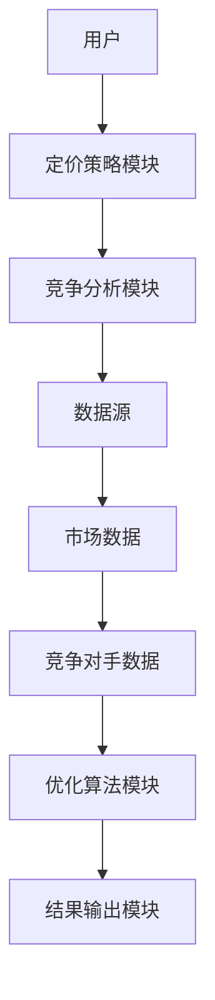
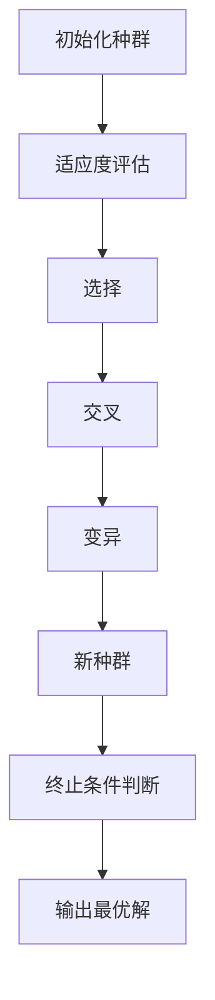
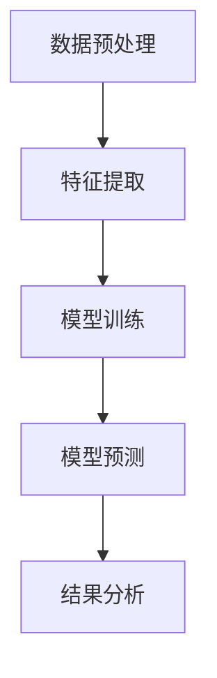
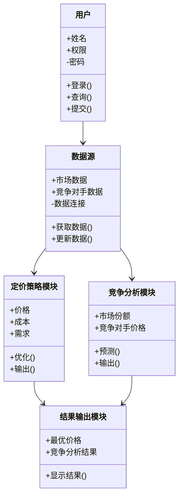
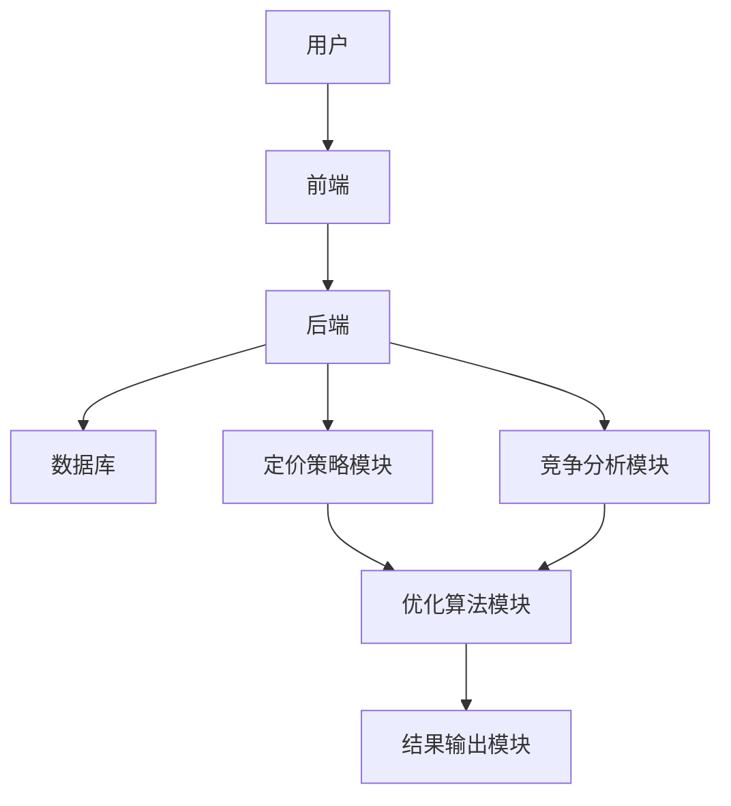

                 


# 《金融产品定价策略优化与竞争分析系统》

> **关键词**：金融产品定价、定价策略优化、竞争分析、数据驱动、数学模型、系统架构设计

> **摘要**：本文详细探讨了金融产品定价策略优化与竞争分析系统的核心概念、算法原理、系统架构设计以及项目实战。通过数据驱动的方法，结合定价策略优化和竞争分析的双重目标，构建了一个高效的金融产品定价系统。文章从问题背景出发，逐步分析定价策略优化的核心概念，详细阐述了基于遗传算法和机器学习的竞争分析算法，并通过系统架构设计和项目实战展示了系统的实现过程。最后，本文总结了系统的最佳实践和应用前景。

---

## 第1章: 金融产品定价策略优化与竞争分析系统背景

### 1.1 问题背景

#### 1.1.1 金融产品定价的重要性
金融产品的定价是金融业务的核心环节之一。定价策略的合理性直接影响金融机构的收益和市场竞争力。在金融市场中，价格不仅反映了产品的价值，还反映了市场参与者对未来的预期。因此，如何制定科学、合理的定价策略，是金融机构面临的重要挑战。

#### 1.1.2 当前定价策略的局限性
传统的定价策略往往依赖经验判断和简单的成本加成法，难以适应复杂多变的市场环境。随着市场竞争的加剧，金融机构需要更加精细的定价策略，以应对市场的波动和竞争对手的动态。

#### 1.1.3 竞争分析在定价中的作用
竞争分析是定价策略优化的重要组成部分。通过对竞争对手的定价行为、市场份额和产品差异化进行分析，金融机构可以更好地把握市场动态，制定更具竞争力的定价策略。

### 1.2 问题描述

#### 1.2.1 定价策略优化的目标
定价策略优化的目标是通过数据驱动的方法，找到最优的价格点，最大化收益或市场份额，同时降低风险。

#### 1.2.2 竞争分析的核心问题
竞争分析的核心问题是如何准确捕捉竞争对手的定价行为、市场反应和产品差异化策略，从而为自身的定价决策提供依据。

#### 1.2.3 系统设计的必要性
为了实现定价策略的优化和竞争分析的高效执行，需要构建一个集成化的系统，整合数据、算法和用户界面，为金融机构提供决策支持。

### 1.3 问题解决思路

#### 1.3.1 数据驱动的定价策略
通过收集和分析市场数据、竞争对手数据和客户行为数据，构建数学模型，优化定价策略。

#### 1.3.2 竞争对手分析的方法
利用机器学习和统计分析方法，预测竞争对手的定价行为和市场反应。

#### 1.3.3 综合优化策略的构建
结合定价策略优化和竞争分析的结果，制定综合优化策略，实现收益和市场份额的双重目标。

### 1.4 系统边界与外延

#### 1.4.1 系统功能边界
系统主要功能包括数据采集、定价策略优化、竞争分析和结果输出。

#### 1.4.2 系统应用范围
系统适用于银行、保险、证券等金融机构的金融产品定价和竞争分析。

#### 1.4.3 系统扩展性分析
系统可以扩展至更多金融产品类型和更复杂的市场环境。

### 1.5 核心概念与系统架构

#### 1.5.1 核心概念定义
- **定价策略**：金融机构在不同市场条件下制定的价格策略。
- **竞争分析**：分析竞争对手的定价行为和市场反应。

#### 1.5.2 核心概念之间的关系
定价策略和竞争分析相互影响，竞争分析为定价策略提供依据，定价策略反过来影响市场竞争。

#### 1.5.3 系统架构的初步设想
系统架构包括数据采集模块、定价策略优化模块、竞争分析模块和结果输出模块。

---

## 第2章: 定价策略优化的核心概念

### 2.1 定价策略的数学模型

#### 2.1.1 成本加成定价法
成本加成定价法是基于产品成本加上一定比例的利润来确定价格。公式如下：

$$ \text{价格} = \text{成本} \times (1 + \text{加成率}) $$

#### 2.1.2 收益最大化模型
收益最大化模型通过优化价格和销量的乘积来确定最优价格。假设需求函数为：

$$ Q = a - bp $$

则收益函数为：

$$ R = p \times Q = p(a - bp) = ap - b p^2 $$

求导后得到最优价格：

$$ p^* = \frac{a}{2b} $$

#### 2.1.3 市场定价策略
市场定价策略需要考虑市场结构、竞争对手行为和客户感知价值。常用的定价策略包括成本导向定价、需求导向定价和竞争导向定价。

### 2.2 竞争分析的核心要素

#### 2.2.1 竞争对手的定价行为
竞争对手的定价行为可以通过市场份额和价格弹性来分析。

#### 2.2.2 市场份额分析
市场份额分析需要考虑市场容量、竞争对手的市场份额和自身产品的竞争力。

#### 2.2.3 产品差异化分析
产品差异化分析需要比较自身产品与竞争对手产品的差异，找到自身产品的竞争优势。

### 2.3 定价策略与竞争分析的关系

#### 2.3.1 数据驱动的定价策略
数据驱动的定价策略通过分析市场数据和竞争对手数据，优化定价策略。

#### 2.3.2 竞争对手行为预测
通过机器学习和统计分析，预测竞争对手的定价行为和市场反应。

#### 2.3.3 综合优化模型
综合优化模型结合定价策略优化和竞争分析，实现收益和市场份额的双重目标。

### 2.4 核心概念对比表

| 比较维度 | 定价策略 | 竞争分析 |
|----------|----------|----------|
| 目标     | 最大化收益或市场份额 | 分析竞争对手行为 |
| 方法     | 数学模型优化 | 数据分析和预测 |
| 输入     | 市场数据、成本数据 | 竞争对手数据、市场数据 |

### 2.5 系统实体关系图



---

## 第3章: 定价策略优化算法

### 3.1 基于遗传算法的优化

#### 3.1.1 遗传算法的基本原理
遗传算法是一种模拟生物进化过程的优化算法，包括选择、交叉和变异三个步骤。

#### 3.1.2 定价策略优化的适应度函数
适应度函数用于衡量定价策略的优劣。常用的适应度函数包括收益最大化和市场份额最大化。

#### 3.1.3 算法实现步骤



#### 3.1.4 Python代码实现

```python
import random

def fitness(price, cost, demand):
    return (price - cost) * demand(price)

def evolve(population, fitness_fn, mutate_rate=0.1):
    population = sorted(population, key=lambda x: -fitness_fn(x))
    new_population = population[:int(len(population)/2)] + [
        mutate(individual, mutate_rate) for individual in population
    ]
    return new_population

def mutate(individual, rate):
    if random.random() < rate:
        return individual + random.uniform(-1, 1)
    return individual

# 初始化种群
population = [random.uniform(1, 100) for _ in range(100)]
# 进行进化
evolved = evolve(population, fitness)
```

### 3.2 竞争对手分析的算法

#### 3.2.1 基于机器学习的竞争分析
通过机器学习算法，如支持向量机和随机森林，预测竞争对手的定价行为。

#### 3.2.2 算法实现流程



---

## 第4章: 系统架构设计

### 4.1 问题场景介绍
金融产品定价策略优化与竞争分析系统需要处理复杂的市场数据和竞争对手数据，实现定价策略的优化和竞争分析。

### 4.2 系统功能设计

#### 4.2.1 领域模型类图



### 4.3 系统架构图



---

## 第5章: 项目实战

### 5.1 环境安装
需要安装Python、机器学习库（如Scikit-learn）、数据可视化库（如Matplotlib）和Mermaid工具。

### 5.2 核心代码实现

#### 5.2.1 定价策略优化代码

```python
import numpy as np
from sklearn import linear_model

# 假设需求函数为线性
X = np.array([[1], [2], [3], [4], [5]])
y = np.array([100, 80, 60, 40, 20])

model = linear_model.LinearRegression()
model.fit(X, y)

# 优化价格
optimal_price = (X.max() + X.min()) / 2
print(optimal_price)
```

#### 5.2.2 竞争对手分析代码

```python
import pandas as pd
from sklearn.ensemble import RandomForestRegressor

# 竞争对手数据
data = pd.DataFrame({
    '价格': [100, 90, 80, 70, 60],
    '市场份额': [0.3, 0.25, 0.2, 0.15, 0.1]
})

# 训练模型
model = RandomForestRegressor()
model.fit(data[['价格']], data['市场份额'])

# 预测市场份额
predicted_share = model.predict([[80]])
print(predicted_share)
```

### 5.3 案例分析
以某银行的理财产品为例，通过系统实现定价策略优化和竞争分析，找到最优价格和最佳市场份额。

### 5.4 系统实现效果
通过系统实现，金融机构可以快速优化定价策略，提升市场竞争力。

---

## 第6章: 总结与展望

### 6.1 最佳实践 tips
- 数据质量是系统的核心，确保数据的准确性和完整性。
- 定期更新模型，适应市场变化。
- 结合人工经验，优化系统输出。

### 6.2 小结
本文详细探讨了金融产品定价策略优化与竞争分析系统的构建过程，从核心概念到算法实现，再到系统架构设计和项目实战，为金融机构提供了一个高效的决策支持系统。

### 6.3 注意事项
- 系统需要定期更新数据和模型。
- 注意数据隐私和安全问题。

### 6.4 拓展阅读
- 《金融工程与定价模型》
- 《数据驱动的定价策略》

---

## 作者：AI天才研究院/AI Genius Institute & 禅与计算机程序设计艺术 /Zen And The Art of Computer Programming

---

以上是《金融产品定价策略优化与竞争分析系统》的完整目录大纲和文章内容，希望对您有所帮助！

