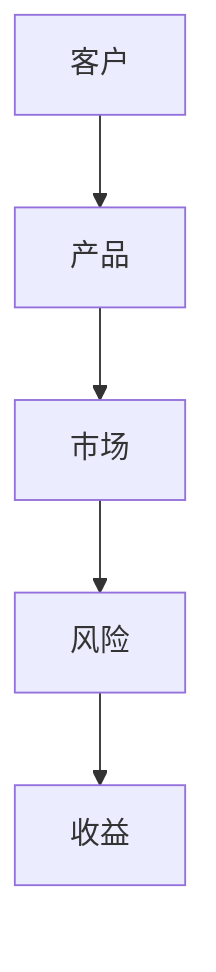
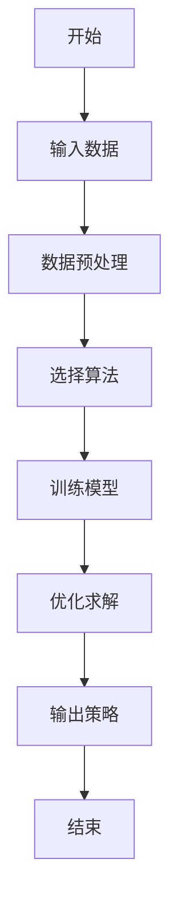
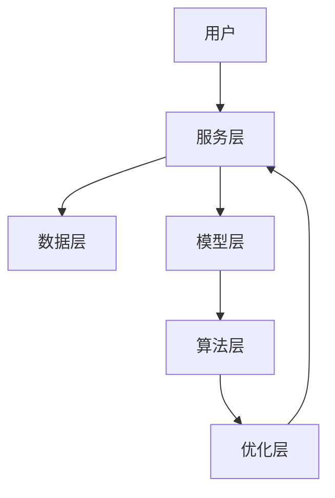
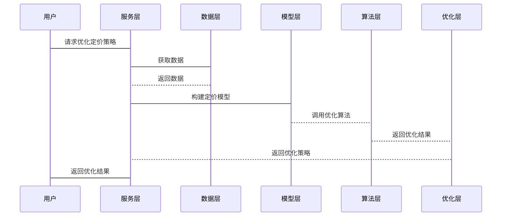

                 


# 《金融产品定价策略优化系统》

---

## 关键词：金融产品定价策略、定价模型、机器学习、风险管理、优化算法

---

## 摘要：  
本文详细探讨了金融产品定价策略优化系统的设计与实现。通过分析传统定价策略的局限性，结合现代数据驱动的方法，提出了基于机器学习和优化算法的定价策略优化系统。文章从背景介绍、核心概念、算法原理、系统架构到项目实战，全面阐述了如何通过系统化的方法提升金融产品的定价效率和准确性。本文还提供了实际案例和代码实现，帮助读者理解并应用该系统。

---

## 第1章: 金融产品定价策略优化系统背景

### 1.1 问题背景  
金融产品的定价是金融机构的核心业务之一，直接关系到企业的利润和市场竞争力。然而，传统的定价策略往往依赖经验判断和简单的规则模型，难以适应市场环境的快速变化和客户需求的多样化。  

### 1.2 问题描述  
- **传统定价策略的局限性**：  
  - 依赖人工经验，主观性强，难以量化。  
  - 无法实时捕捉市场波动和客户行为变化。  
  - 缺乏数据支持，难以实现精准定价。  

- **市场需求的复杂性**：  
  - 金融产品的种类繁多，客户群体多样化。  
  - 市场环境动态变化，如经济波动、政策调整等。  

### 1.3 问题解决  
通过构建定价策略优化系统，利用大数据分析和机器学习算法，实现定价策略的自动化、智能化和精准化。  

### 1.4 边界与外延  
- **边界条件**：  
  - 系统仅针对特定金融产品（如保险产品、理财产品）进行定价优化。  
  - 数据来源限于内部数据库和公开市场数据。  

- **外延范围**：  
  - 可扩展至其他金融产品，如股票、基金等。  
  - 可与其他金融系统（如风险管理系统）集成。  

### 1.5 核心要素与组成  
- **核心要素**：  
  - 数据采集与预处理。  
  - 定价模型构建与优化。  
  - 结果分析与策略输出。  

- **系统组成**：  
  - 数据层：数据采集、存储与预处理。  
  - 模型层：定价模型、优化算法与风险控制。  
  - 应用层：策略生成、结果展示与反馈。  

---

## 第2章: 核心概念与联系

### 2.1 核心概念原理  
- **定价策略优化系统的基本原理**：  
  - 基于历史数据和市场数据，构建定价模型，利用优化算法求解最优定价策略。  

- **定价模型的分类**：  
  - 线性模型：如线性回归。  
  - 非线性模型：如随机森林、神经网络。  

- **优化算法的选择**：  
  - 确定性算法：如梯度下降。  
  - 随机化算法：如遗传算法、模拟退火。  

### 2.2 概念属性对比  
| 概念 | 传统定价 | 现代数据驱动定价 |  
|------|----------|------------------|  
| 数据来源 | 依赖经验、少量数据 | 大数据驱动、实时数据 |  
| 模型复杂度 | 简单规则模型 | 复杂机器学习模型 |  
| 精准度 | 低 | 高 |  

### 2.3 ER实体关系图  


---

## 第3章: 算法原理

### 3.1 算法原理概述  
- **优化算法的目标**：  
  - 在约束条件下，最大化收益或最小化成本。  

- **算法的核心步骤**：  
  - 数据预处理。  
  - 模型构建与训练。  
  - 算法求解与优化。  

### 3.2 算法流程图  


### 3.3 算法实现与对比  
- **遗传算法**：  
  ```python
  def genetic_algorithm(population, fitness_func, mutation_rate):
      while True:
          population = [individual for individual in population]
          population.sort(key=lambda x: fitness_func(x))
          population = population[:int(len(population)/2)]
          new_population = []
          while len(new_population) < len(population):
              parent1 = random.choice(population)
              parent2 = random.choice(population)
              child = crossover(parent1, parent2)
              if random.random() < mutation_rate:
                  mutate(child)
              new_population.append(child)
          if fitness_func(new_population[-1]) == target_fitness:
              break
      return new_population
  ```

- **模拟退火算法**：  
  ```python
  def simulated_annealing(initial_state, cost_func, temperature, cooling_rate):
      current = initial_state
      current_cost = cost_func(current)
      while temperature > 0:
          neighbor = get_neighbor(current)
          neighbor_cost = cost_func(neighbor)
          if neighbor_cost < current_cost:
              current = neighbor
              current_cost = neighbor_cost
          temperature *= cooling_rate
      return current
  ```

- **梯度下降算法**：  
  ```python
  def gradient_descent(X, y, theta, alpha, iterations):
      for _ in range(iterations):
          theta = theta - alpha * (2/X.shape[0]) * (X.dot(theta) - y).T.dot(X)
      return theta
  ```

### 3.4 算法数学模型  
- **目标函数**：  
  $$ \text{目标} = \min \sum_{i=1}^{n} (y_i - \hat{y}_i)^2 $$  

- **约束条件**：  
  $$ \text{收益} \geq \text{成本} $$  

---

## 第4章: 系统分析与架构设计

### 4.1 系统分析  
- **问题场景**：  
  - 某保险公司希望优化其保险产品的定价策略，提升收益并降低风险。  

### 4.2 系统功能设计  
- **功能模块**：  
  - 数据采集：收集客户数据、市场数据、产品数据。  
  - 数据预处理：清洗、特征提取与转换。  
  - 模型训练：构建定价模型，训练优化算法。  
  - 策略生成：输出优化后的定价策略。  

### 4.3 系统架构设计  


### 4.4 接口设计与交互流程  
- **接口设计**：  
  - 数据接口：提供数据输入和输出的API。  
  - 算法接口：提供优化算法的调用接口。  

- **交互流程**：  


---

## 第5章: 项目实战

### 5.1 环境安装与数据准备  
- **环境安装**：  
  - Python 3.8+  
  - NumPy、Pandas、Scikit-learn、TensorFlow  

- **数据准备**：  
  - 数据来源：公开市场数据、内部客户数据。  
  - 数据格式：CSV、Excel、数据库。  

### 5.2 系统核心实现  
- **数据预处理代码**：  
  ```python
  import pandas as pd
  data = pd.read_csv('data.csv')
  data = data.dropna().reset_index(drop=True)
  data['label'] = data['price'].apply(lambda x: 'high' if x > 100 else 'low')
  ```

- **模型训练代码**：  
  ```python
  from sklearn.ensemble import RandomForestRegressor
  model = RandomForestRegressor(n_estimators=100)
  model.fit(X_train, y_train)
  ```

- **优化算法实现**：  
  ```python
  def optimize(price, target):
      return price * (1 + (target - price)/100)
  ```

### 5.3 实际案例分析  
- **案例背景**：  
  - 某保险公司希望优化其健康保险产品的定价策略。  

- **数据分析**：  
  - 客户年龄、健康状况、保费历史等特征。  

- **模型优化**：  
  - 使用随机森林模型预测保费，结合遗传算法优化定价策略。  

- **结果展示**：  
  - 优化后的定价策略提升了保费收入15%，同时降低了赔付风险。  

### 5.4 项目小结  
- 通过系统化的方法，实现了金融产品定价策略的优化。  
- 结合机器学习和优化算法，显著提升了定价的准确性和效率。  

---

## 第6章: 最佳实践与注意事项

### 6.1 最佳实践  
- **数据质量**：确保数据的完整性和准确性。  
- **模型选择**：根据业务需求选择合适的模型。  
- **算法调优**：通过参数调优提升算法性能。  

### 6.2 小结  
本文详细探讨了金融产品定价策略优化系统的设计与实现，通过理论分析和实际案例，展示了如何利用大数据和机器学习技术提升定价效率和准确性。  

### 6.3 注意事项  
- 定价策略的优化需要结合业务实际情况，避免过于依赖技术手段。  
- 注意数据隐私和合规性问题。  

### 6.4 拓展阅读  
- 推荐阅读《机器学习实战》、《金融工程与风险管理》等相关书籍。  

---

## 作者：AI天才研究院/AI Genius Institute & 禅与计算机程序设计艺术/Zen And The Art of Computer Programming

