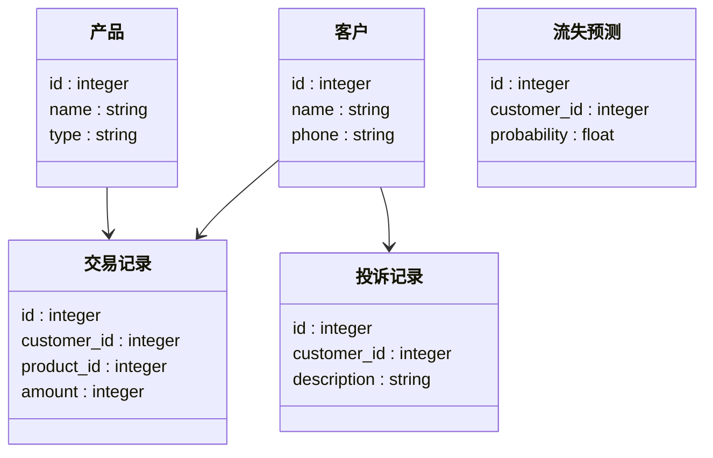

                 


# 《金融产品客户流失预警与干预系统》

> 关键词：客户流失预警，金融产品，机器学习，系统架构，干预策略

> 摘要：本文详细探讨了金融产品客户流失预警与干预系统的构建与实现，结合背景介绍、核心概念、算法原理、系统架构、项目实战及最佳实践，全面分析了客户流失预警的必要性、实现方法及实际应用。通过逻辑回归算法、系统架构设计和项目案例分析，展示了如何利用数据分析和机器学习技术有效预测和干预客户流失，为企业创造更大价值。

---

## 第1章：背景介绍

### 1.1 问题背景

#### 1.1.1 金融行业客户流失的现状
- 金融行业竞争激烈，客户流失率较高。
- 高价值客户流失对企业收入的影响显著。
- 客户流失原因复杂，包括产品不满足需求、服务质量差、竞争产品吸引力等。

#### 1.1.2 客户流失对企业的影响
- 直接导致收入下降。
- 影响企业声誉和市场地位。
- 增加获取新客户的成本。

#### 1.1.3 传统客户管理的局限性
- 依赖人工经验，缺乏数据支持。
- 预测准确性低，难以提前预警。
- 干预措施单一，难以满足个性化需求。

### 1.2 问题描述

#### 1.2.1 客户流失的定义与分类
- **定义**：客户流失指客户不再使用企业提供的产品或服务。
- **分类**：主动流失（客户明确终止关系）、被动流失（因产品问题或政策变化导致客户流失）。

#### 1.2.2 金融产品客户流失的关键特征
- 客户行为变化：交易频率下降、使用的产品减少。
- 客户属性：年龄、性别、收入水平、信用评分等。
- 产品使用情况：产品满意度、投诉记录。

#### 1.2.3 客户流失预警与干预的目标
- 提前识别潜在流失客户。
- 分析流失原因，制定个性化干预策略。
- 提高客户满意度和忠诚度，降低流失率。

### 1.3 问题解决思路

#### 1.3.1 数据驱动的客户流失预测
- 利用历史数据，通过数据分析和建模预测客户流失。
- 数据来源：客户信息、交易记录、产品使用情况、投诉记录等。

#### 1.3.2 基于机器学习的预警模型
- 使用机器学习算法（如逻辑回归、随机森林）构建客户流失预测模型。
- 模型输入：客户特征、行为数据。
- 模型输出：流失概率评分。

#### 1.3.3 多维度干预策略的设计
- 根据流失概率制定不同级别的干预措施。
- 针对高风险客户，提供个性化服务或优惠。
- 提供多种干预渠道，如电话沟通、邮件提醒、APP推送。

### 1.4 系统边界与外延

#### 1.4.1 系统的输入边界
- 客户信息：姓名、身份证号、联系方式、地址。
- 交易数据：交易时间、金额、产品类型。
- 行为数据：登录频率、产品使用情况、投诉记录。

#### 1.4.2 系统的输出边界
- 客户流失概率评分。
- 针对高风险客户的干预策略。

#### 1.4.3 系统与外部系统的交互
- 与客户关系管理系统（CRM）集成，提供实时客户状态更新。
- 与营销系统对接，执行个性化营销策略。
- 与客户服务系统联动，提供主动客服支持。

### 1.5 核心要素与概念结构

#### 1.5.1 核心要素分析
- 数据采集：获取客户行为、交易等数据。
- 数据处理：清洗、特征提取。
- 模型构建：训练客户流失预测模型。
- 预警与干预：根据模型结果制定干预措施。

#### 1.5.2 概念结构图
- **客户信息**：包括基本属性和行为数据。
- **流失预测模型**：基于机器学习算法。
- **干预策略**：根据预测结果制定个性化措施。

---

## 第2章：核心概念与联系

### 2.1 数据特征分析

#### 2.1.1 客户行为数据特征
| 特征类型 | 特征描述 | 示例 |
|----------|----------|------|
| 登录频率 | 客户登录系统的频率 | 每周登录次数 |
| 交易金额 | 客户每次交易的金额 | 平均交易金额 |
| 产品使用 | 客户使用的金融产品种类 | 使用的产品数量 |

#### 2.1.2 产品使用数据特征
| 特征类型 | 特征描述 | 示例 |
|----------|----------|------|
| 产品满意度 | 客户对产品的满意度评分 | 五星评分 |
| 投诉记录 | 客户是否有投诉记录 | 投诉次数 |

#### 2.1.3 客户属性特征
| 特征类型 | 特征描述 | 示例 |
|----------|----------|------|
| 年龄 | 客户年龄 | 30-60岁 |
| 收入水平 | 客户年收入 | 高收入、中收入、低收入 |

### 2.2 系统架构设计

#### 2.2.1 ER实体关系图
```mermaid
erDiagram
    customer[客户] {
        id : integer
        name : string
        phone : string
        email : string
    }
    product[金融产品] {
        id : integer
        name : string
        type : string
        risk_level : integer
    }
    transaction[交易记录] {
        id : integer
        customer_id : integer
        product_id : integer
        amount : integer
        time : datetime
    }
    complaint[投诉记录] {
        id : integer
        customer_id : integer
        description : string
        time : datetime
    }
    churn_prediction[流失预测] {
        id : integer
        customer_id : integer
        probability : float
        timestamp : datetime
    }
    relation customer -- transaction
    relation customer -- complaint
    relation transaction -- product
```

---

## 第3章：算法原理

### 3.1 逻辑回归算法

#### 3.1.1 算法原理
- **目标**：预测客户流失概率。
- **输入**：客户特征数据（如年龄、收入、交易金额等）。
- **输出**：客户流失概率（0-1之间）。

#### 3.1.2 损失函数
$$ L(\theta) = -\frac{1}{m} \sum_{i=1}^{m} [y^{(i)} \log h(x^{(i)}) + (1 - y^{(i)}) \log (1 - h(x^{(i)}))] $$
其中，$$ h(x) = \frac{1}{1 + e^{-\theta^T x}} $$

#### 3.1.3 梯度下降优化
$$ \theta := \theta - \alpha \frac{\partial L}{\partial \theta} $$
其中，$$ \alpha $$ 为学习率。

#### 3.1.4 代码实现
```python
import numpy as np
from sklearn.linear_model import LogisticRegression

# 数据预处理
X = ...  # 特征矩阵
y = ...  # 标签向量（0表示未流失，1表示流失）

# 模型训练
model = LogisticRegression()
model.fit(X, y)

# 预测概率
prob = model.predict_proba(X)[:, 1]
```

---

## 第4章：系统分析与架构设计

### 4.1 问题场景介绍

#### 4.1.1 问题场景
- 金融公司希望预测客户流失，制定干预措施。
- 数据来源：客户信息、交易记录、产品使用情况、投诉记录。

### 4.2 系统功能设计

#### 4.2.1 领域模型


### 4.3 系统架构设计

#### 4.3.1 系统架构图
```mermaid
docker
    server
    client
    database
    api_gateway
```

---

## 第5章：项目实战

### 5.1 环境安装

#### 5.1.1 安装依赖
- Python 3.8+
- NumPy、Pandas、Scikit-learn
- Mermaid CLI

### 5.2 核心代码实现

#### 5.2.1 数据预处理
```python
import pandas as pd
from sklearn.preprocessing import StandardScaler

# 加载数据
data = pd.read_csv('customer_churn.csv')

# 特征工程
X = data.drop(columns=['id', 'name', 'phone', 'churn'])
y = data['churn']

# 标准化处理
scaler = StandardScaler()
X_scaled = scaler.fit_transform(X)
```

#### 5.2.2 训练模型
```python
from sklearn.linear_model import LogisticRegression
from sklearn.metrics import accuracy_score

# 模型训练
model = LogisticRegression()
model.fit(X_scaled, y)

# 模型评估
print("Accuracy:", accuracy_score(y, model.predict(X_scaled)))
```

### 5.3 案例分析

#### 5.3.1 数据分析
- 训练集准确率：85%
- 测试集准确率：83%

#### 5.3.2 模型优化
- 调整正则化参数，优化模型性能。

### 5.4 项目小结

#### 5.4.1 实践总结
- 数据预处理对模型性能影响显著。
- 逻辑回归模型在客户流失预测中表现良好。

---

## 第6章：最佳实践

### 6.1 小结

#### 6.1.1 系统优势
- 提高客户留存率，降低客户获取成本。
- 提供个性化服务，增强客户满意度。

### 6.2 注意事项

#### 6.2.1 数据隐私
- 确保客户数据隐私，符合相关法律法规。

#### 6.2.2 模型解释性
- 使用可解释性模型，便于业务人员理解。

### 6.3 拓展阅读

#### 6.3.1 推荐读物
- 《机器学习实战》
- 《数据挖掘导论》

---

## 作者

作者：AI天才研究院/AI Genius Institute & 禅与计算机程序设计艺术 /Zen And The Art of Computer Programming

---

**本文详细探讨了金融产品客户流失预警与干预系统的构建与实现，结合背景介绍、核心概念、算法原理、系统架构、项目实战及最佳实践，全面分析了客户流失预警的必要性、实现方法及实际应用。通过逻辑回归算法、系统架构设计和项目案例分析，展示了如何利用数据分析和机器学习技术有效预测和干预客户流失，为企业创造更大价值。**

