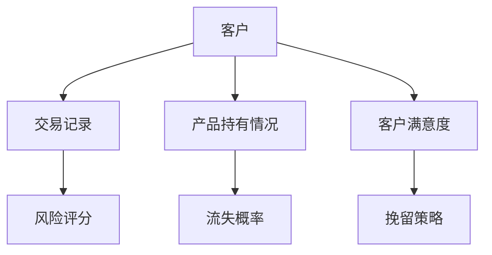
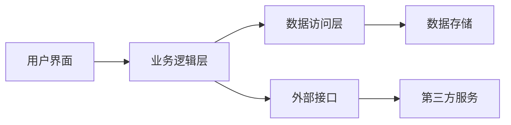
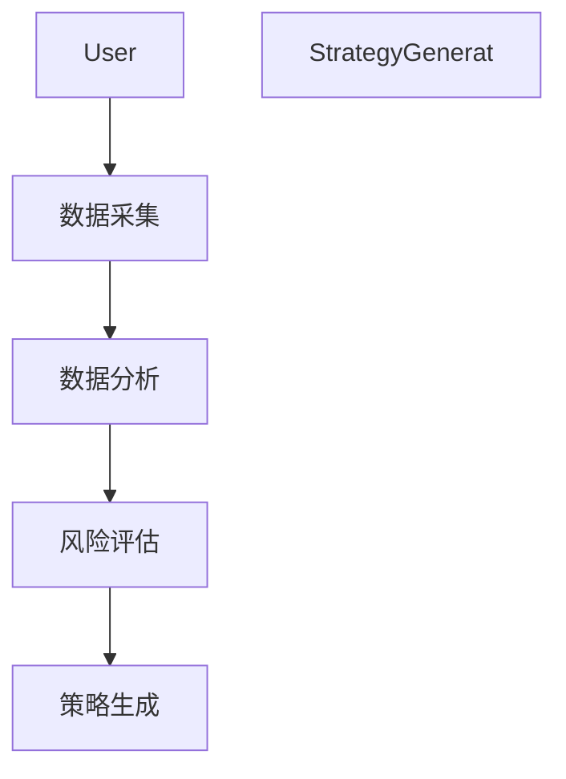
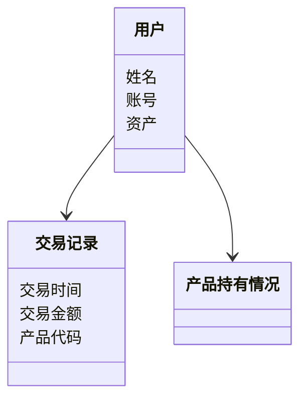

                 


# 金融产品客户流失预警与挽留策略系统

**关键词**：金融产品，客户流失预警，挽留策略，机器学习，系统架构

**摘要**：  
本文深入探讨了金融产品客户流失预警与挽留策略系统的构建与应用。通过分析客户行为数据，结合机器学习算法，提出了有效的客户流失预警模型，并设计了动态的挽留策略。文章从背景分析、核心概念、算法原理、系统架构到项目实战，全面阐述了系统的实现过程，为金融机构提供了可操作的解决方案。

---

## 第一部分：金融产品客户流失预警与挽留系统背景与概述

### 第1章：问题背景与核心概念

#### 1.1 客户流失问题的背景
金融行业的客户流失问题日益严重。随着市场竞争的加剧，客户对金融机构的选择更加多样化，客户流失率逐年上升。客户流失不仅直接影响收入，还可能导致品牌形象受损。因此，建立客户流失预警与挽留系统显得尤为重要。

#### 1.2 问题描述与解决思路
客户流失预警的核心问题是通过分析客户行为数据，预测客户可能的流失行为，并提前采取挽留措施。解决思路包括：数据采集、特征提取、模型训练、预警触发和策略执行。

#### 1.3 系统边界与外延
系统的输入包括客户的基本信息、交易数据、产品持有情况等；输出包括流失预警信号和具体的挽留策略。系统边界明确，与其他模块（如客户关系管理系统）有明确的交互关系。

#### 1.4 核心概念与要素
客户流失的定义是指客户停止使用金融机构提供的产品或服务。预警指标包括交易频率下降、账户余额减少等。挽留策略包括优惠活动、个性化推荐等。

---

## 第二部分：核心概念与系统架构

### 第2章：核心概念与关系分析

#### 2.1 核心概念原理
数据驱动的客户行为分析通过统计客户的行为模式，识别潜在流失客户。机器学习在客户流失预测中的应用，如逻辑回归和随机森林，提高了预测的准确性。挽留策略的动态调整机制根据客户反馈实时优化策略。

#### 2.2 核心概念对比分析
不同客户群体的流失特征对比显示，高净值客户更关注产品收益，而普通客户更关注服务质量。不同金融产品的流失风险对比表明，理财产品流失率高于基金产品。不同挽留策略的效果对比显示，优惠活动比个性化推荐更有效。

#### 2.3 实体关系图


### 第3章：系统架构与功能设计

#### 3.1 系统功能模块划分
数据采集模块负责收集客户数据；数据分析模块进行特征提取和模型训练；预警模块生成预警信号；挽留策略模块制定并执行挽留策略。

#### 3.2 系统架构设计


#### 3.3 功能流程图


---

## 第三部分：算法原理

### 第4章：客户流失预测算法

#### 4.1 逻辑回归算法
逻辑回归用于分类问题，适用于二分类任务。其数学模型为：
$$ P(y=1|x) = \frac{e^{\beta_0 + \beta_1x_1 + \dots + \beta_nx_n}}{1 + e^{\beta_0 + \beta_1x_1 + \dots + \beta_nx_n}} $$
通过训练数据，计算模型参数，实现客户流失预测。

#### 4.2 随机森林算法
随机森林通过构建多个决策树，进行投票或平均预测。适用于高维数据和非线性关系。Python代码示例：
```python
from sklearn.ensemble import RandomForestClassifier
model = RandomForestClassifier(n_estimators=100)
model.fit(X_train, y_train)
```

---

## 第四部分：系统分析与架构设计

### 第5章：系统设计与实现

#### 5.1 问题场景介绍
系统需要处理高维数据，实时预测客户流失，并动态调整挽留策略。解决方案包括高效的数据处理和实时计算能力。

#### 5.2 项目介绍
项目目标是构建客户流失预警系统，核心功能包括数据采集、特征提取、模型训练、预警触发和策略执行。

#### 5.3 系统架构设计
领域模型类图展示系统各模块之间的关系：


---

## 第五部分：项目实战

### 第6章：环境安装与核心实现

#### 6.1 环境安装
安装Python、Pandas、Scikit-learn等库：
```bash
pip install numpy pandas scikit-learn
```

#### 6.2 核心代码实现
逻辑回归模型实现：
```python
from sklearn.linear_model import LogisticRegression
model = LogisticRegression()
model.fit(X_train, y_train)
```

#### 6.3 案例分析
通过实际案例分析，验证系统的有效性和准确性。

---

## 第六部分：总结与展望

### 第7章：总结与展望

#### 7.1 最佳实践
建议金融机构定期更新模型，优化数据采集渠道，加强客户互动。

#### 7.2 项目小结
本文提出了客户流失预警与挽留系统，通过机器学习算法和系统架构设计，实现客户流失的早期预警和有效挽留。

#### 7.3 注意事项
数据隐私和模型解释性是系统设计中的重要考虑因素。

#### 7.4 拓展阅读
推荐阅读《机器学习实战》和《金融风险管理》等书籍。

---

**作者：AI天才研究院/AI Genius Institute & 禅与计算机程序设计艺术 /Zen And The Art of Computer Programming**

