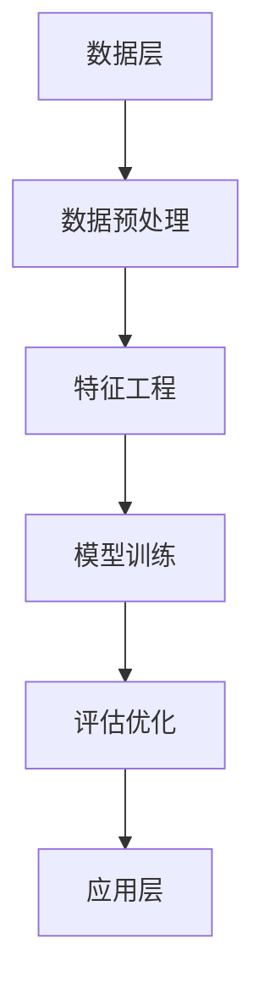

                 


# 《金融产品客户流失预警模型》

> 关键词：客户流失预警、金融产品、机器学习、数据挖掘、客户保留策略

> 摘要：本文详细探讨了金融产品客户流失预警模型的构建与应用，结合机器学习算法、数据分析和系统架构设计，提供了一套完整的解决方案。文章从客户流失的定义、重要性入手，分析了模型的核心概念与算法原理，展示了系统架构设计，并通过项目实战详细讲解了模型的实现过程，最后总结了最佳实践与注意事项。

---

## 目录大纲

1. [金融产品客户流失预警模型概述](#金融产品客户流失预警模型概述)
   1.1 [客户流失的定义与重要性](#客户流失的定义与重要性)
   1.2 [金融产品客户流失预警模型的背景与应用](#金融产品客户流失预警模型的背景与应用)
   1.3 [客户流失预警模型的核心概念与联系](#客户流失预警模型的核心概念与联系)
   1.4 [机器学习算法在客户流失预警中的应用](#机器学习算法在客户流失预警中的应用)

2. [客户流失预警模型的算法原理](#客户流失预警模型的算法原理)
   2.1 [逻辑回归算法](#逻辑回归算法)
   2.2 [随机森林算法](#随机森林算法)

3. [客户流失预警模型的系统架构](#客户流失预警模型的系统架构)
   3.1 [系统功能设计](#系统功能设计)
   3.2 [系统架构设计](#系统架构设计)
   3.3 [系统接口设计](#系统接口设计)
   3.4 [系统交互设计](#系统交互设计)

4. [客户流失预警模型的项目实战](#客户流失预警模型的项目实战)
   4.1 [环境配置与数据获取](#环境配置与数据获取)
   4.2 [数据预处理与特征工程](#数据预处理与特征工程)
   4.3 [模型训练与评估优化](#模型训练与评估优化)
   4.4 [模型部署与应用](#模型部署与应用)

5. [客户流失预警模型的最佳实践](#客户流失预警模型的最佳实践)
   5.1 [小结](#小结)
   5.2 [注意事项](#注意事项)
   5.3 [扩展阅读](#扩展阅读)

---

## 正文内容

### 1. 金融产品客户流失预警模型概述

#### 1.1 客户流失的定义与重要性

客户流失是指客户不再使用机构提供的产品或服务的现象。在金融行业，客户流失可能意味着客户不再持有某种金融产品，例如不再使用信用卡、不再持有理财产品或不再使用银行账户。客户流失对金融机构的影响是多方面的，包括收入减少、品牌声誉受损以及客户获取成本增加。因此，建立客户流失预警模型对于金融机构来说至关重要，可以帮助其提前识别潜在流失客户，采取措施提升客户满意度和忠诚度。

#### 1.2 金融产品客户流失预警模型的背景与应用

随着数据科学和机器学习技术的发展，金融机构开始利用大数据分析客户行为，以预测客户流失。通过分析客户的交易历史、账户余额、年龄、性别等特征，可以构建客户流失预警模型，预测客户是否可能流失。这种模型不仅可以帮助机构提前采取干预措施，还可以优化资源配置，提高客户保留率。

#### 1.3 客户流失预警模型的核心概念与联系

客户流失预警模型的核心概念包括客户数据特征、模型算法和评估指标。客户数据特征可以分为定量特征（如账户余额、交易频率）和定性特征（如客户满意度、风险等级）。模型算法包括逻辑回归、随机森林等机器学习算法。评估指标包括准确率、精确率和召回率。

ER实体关系图展示了客户、特征和模型之间的关系：

```mermaid
er
  Customer {
    id: integer
    name: string
    transaction_history: string
    account_balance: float
    age: integer
    gender: string
    risk_level: string
  }
  Feature {
    id: integer
    feature_name: string
    feature_type: string
    feature_importance: float
  }
  Model {
    id: integer
    model_name: string
    algorithm: string
    accuracy: float
    precision: float
    recall: float
  }
  Customer -->> Feature: 提供特征
  Feature -->> Model: 输入特征
  Model -->> Customer: 输出预测结果
```

#### 1.4 机器学习算法在客户流失预警中的应用

机器学习算法在客户流失预警中的应用主要集中在分类算法上，常见的算法包括逻辑回归和随机森林。以下是两种算法的原理和实现步骤：

##### 1.4.1 逻辑回归算法

逻辑回归是一种用于分类的统计方法，适用于二分类问题。其核心是通过sigmoid函数将线性回归的输出映射到概率空间。

##### 1.4.2 随机森林算法

随机森林是一种基于决策树的集成学习算法，通过构建多个决策树并进行投票或平均来提高模型的准确性和鲁棒性。

---

### 2. 客户流失预警模型的算法原理

#### 2.1 逻辑回归算法

逻辑回归的数学模型如下：

$$ P(y=1|x) = \frac{e^{\beta_0 + \beta_1 x_1 + \dots + \beta_n x_n}}{1 + e^{\beta_0 + \beta_1 x_1 + \dots + \beta_n x_n}} $$

其中，$\beta$ 是模型参数，$x$ 是特征变量。

#### 2.2 随机森林算法

随机森林算法通过构建多个决策树，并将每个样本分配到随机选择的特征上，最终通过投票方式得出预测结果。

---

### 3. 客户流失预警模型的系统架构

#### 3.1 系统功能设计

系统功能包括数据获取、数据预处理、特征工程、模型训练、评估优化和部署应用。

#### 3.2 系统架构设计

系统架构分为数据层、模型层和应用层。数据层负责数据存储与获取，模型层负责特征工程和模型训练，应用层负责模型部署与结果展示。



#### 3.3 系统接口设计

系统接口包括数据接口和模型接口，分别用于数据获取和模型调用。

#### 3.4 系统交互设计

系统交互流程包括数据获取、特征工程、模型训练和结果展示。

---

### 4. 客户流失预警模型的项目实战

#### 4.1 环境配置与数据获取

环境配置包括安装Python、Scikit-learn和Pandas。数据获取可以通过公开数据集或内部数据。

#### 4.2 数据预处理与特征工程

数据预处理包括数据清洗和特征提取。特征工程包括特征选择和特征变换。

#### 4.3 模型训练与评估优化

模型训练包括训练集和测试集的划分，以及模型的训练和评估。

#### 4.4 模型部署与应用

模型部署包括API接口的开发和结果展示。

---

### 5. 客户流失预警模型的最佳实践

#### 5.1 小结

客户流失预警模型通过机器学习算法和数据分析技术，帮助金融机构提前识别潜在流失客户，提升客户保留率。

#### 5.2 注意事项

- 数据质量对模型性能影响重大，需注意数据清洗和特征工程。
- 模型部署后需定期更新，以适应客户行为的变化。

#### 5.3 扩展阅读

推荐阅读《Python机器学习实战》和《数据挖掘导论》。

---

## 作者

作者：AI天才研究院/AI Genius Institute & 禅与计算机程序设计艺术 /Zen And The Art of Computer Programming

---

通过以上思考和结构化的内容，我可以按照用户的要求撰写一篇详细的《金融产品客户流失预警模型》技术博客文章。

