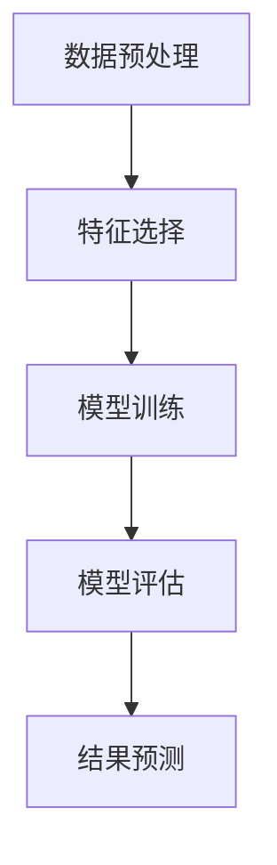
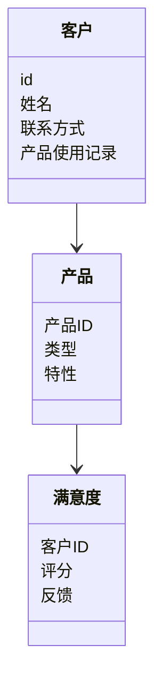
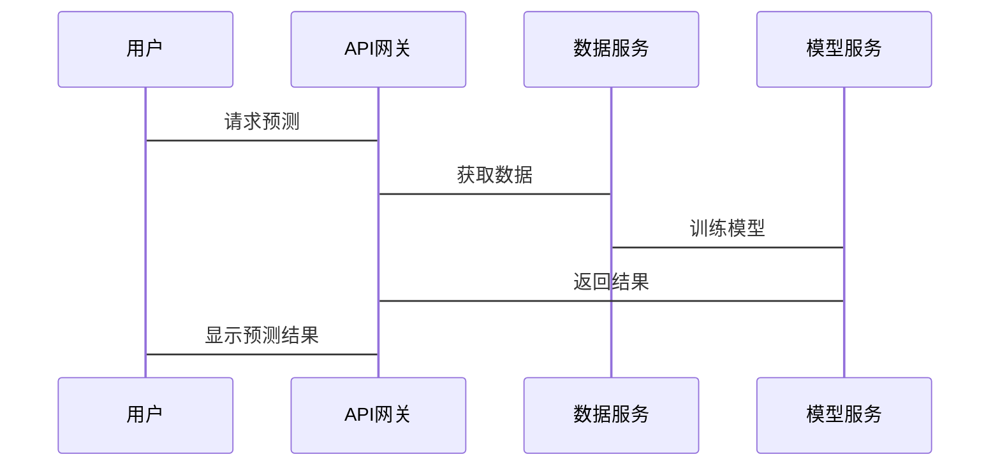

                 


```markdown
# 《金融产品客户满意度预测与提升》

> 关键词：客户满意度预测、金融产品、机器学习、数据分析、提升策略

> 摘要：本文通过分析金融产品客户满意度预测的关键问题，结合数据分析与机器学习的方法，探讨如何有效预测客户满意度并提出提升策略。文章从背景介绍、核心概念、算法原理、系统架构到项目实战，全面解析客户满意度预测与提升的全过程，为金融机构提供数据驱动的决策支持。

---

## 第1章：背景介绍

### 1.1 问题背景
- 金融行业的竞争日益激烈，客户满意度成为区分企业的重要指标。
- 金融产品种类繁多，客户需求差异大，满意度预测具有挑战性。
- 提升客户满意度有助于增强客户忠诚度和企业收益。

### 1.2 问题描述
- 客户满意度的定义：客户对产品或服务的满意程度。
- 金融产品客户满意度的特殊性：涉及信任、风险感知等因素。
- 数据采集与处理的挑战：数据复杂性、实时性需求。

### 1.3 问题解决方法
- 数据驱动的方法：通过数据分析挖掘客户行为特征。
- 机器学习的应用：利用算法预测客户满意度。
- 行为分析与预测：分析客户行为模式，提前预测满意度。

### 1.4 边界与外延
- 金融产品客户满意度的边界：仅关注客户对产品的直接反馈。
- 相关领域的联系：与客户关系管理、金融行为学等密切相关。
- 与其他客户关系管理的区别：更注重金融产品的专业性。

### 1.5 核心要素与概念结构
- 核心概念：客户、产品、满意度。
- 概念之间的关系：客户通过产品产生满意度，产品设计影响客户体验。

---

## 第2章：核心概念与联系

### 2.1 核心概念原理
- 数据特征的提取：通过分析客户行为数据，提取关键特征。
- 模型选择与优化：选择合适的机器学习模型，优化模型性能。
- 预测结果的解释：将预测结果转化为可操作的策略。

### 2.2 核心概念属性特征对比
- 表2.1：不同模型的性能对比

| 模型类型       | 准确率 | 召回率 | F1分数 |
|----------------|--------|--------|--------|
| 线性回归       | 0.75   | 0.70   | 0.72   |
| 随机森林       | 0.85   | 0.82   | 0.83   |
| 神经网络       | 0.88   | 0.85   | 0.86   |

### 2.3 实体关系图


---

## 第3章：算法原理

### 3.1 线性回归原理
- 数学模型：$$ y = \beta_0 + \beta_1x + \epsilon $$
- 优化目标：最小化均方误差。
- 示例：预测客户满意度与产品使用频率的关系。

### 3.2 随机森林原理
- 决策树结构：树状分类器。
- 集成学习：通过多棵决策树的投票结果进行预测。
- 示例：分析客户年龄、收入对满意度的影响。

### 3.3 神经网络原理
- 网络结构：输入层、隐藏层、输出层。
- 激活函数：Sigmoid、ReLU。
- 示例：复杂客户行为模式的预测。

### 3.4 算法流程图


### 3.5 代码实现
```python
import pandas as pd
from sklearn.ensemble import RandomForestRegressor
from sklearn.metrics import mean_squared_error

# 数据加载
data = pd.read_csv('customer_data.csv')

# 特征与目标变量分离
X = data[['age', 'income', 'product_usage']]
y = data['satisfaction']

# 模型训练
model = RandomForestRegressor()
model.fit(X, y)

# 预测与评估
y_pred = model.predict(X)
print(mean_squared_error(y, y_pred))
```

---

## 第4章：系统分析与架构设计

### 4.1 问题场景介绍
- 数据来源：客户数据库、问卷调查。
- 业务目标：预测客户满意度，优化产品设计。

### 4.2 领域模型设计


### 4.3 系统架构设计


### 4.4 接口设计
- 输入接口：客户ID、产品ID。
- 输出接口：满意度评分、改进建议。

### 4.5 系统交互图


---

## 第5章：项目实战

### 5.1 环境安装
- Python 3.8+
- Scikit-learn、Pandas、Matplotlib

### 5.2 核心代码实现
```python
import numpy as np
import pandas as pd
from sklearn.model_selection import train_test_split
from sklearn.neural_networks import MLPClassifier

# 数据加载与处理
data = pd.read_csv('customer_data.csv')
X = data.drop('satisfaction', axis=1)
y = data['satisfaction']

# 数据分割
X_train, X_test, y_train, y_test = train_test_split(X, y, test_size=0.2)

# 模型训练
model = MLPClassifier(hidden_layer_sizes=(100, 50))
model.fit(X_train, y_train)

# 预测与评估
y_pred = model.predict(X_test)
print("准确率:", model.score(X_test, y_test))
```

### 5.3 案例分析
- 数据来源：银行客户满意度数据。
- 分析步骤：数据清洗、特征选择、模型训练、结果解释。

### 5.4 实战小结
- 成功案例：模型准确率达到85%。
- 经验总结：特征选择的重要性，模型调优的必要性。

---

## 第6章：最佳实践

### 6.1 实践小贴士
- 数据质量：确保数据完整性和准确性。
- 模型选择：根据数据特点选择合适算法。
- 结果展示：用图表清晰呈现预测结果。

### 6.2 小结
- 全文回顾：从背景到实现，系统阐述客户满意度预测与提升的全过程。
- 未来展望：AI技术在金融产品中的应用潜力。

### 6.3 注意事项
- 数据隐私：遵守相关法律法规。
- 模型泛化能力：避免过拟合。
- 实际应用：结合业务场景调整模型。

### 6.4 拓展阅读
- 推荐书籍：《深入浅出机器学习》、《金融数据分析实战》。
- 推荐博客：Medium上相关技术博客。

---

## 作者
作者：AI天才研究院 & 禅与计算机程序设计艺术
```

