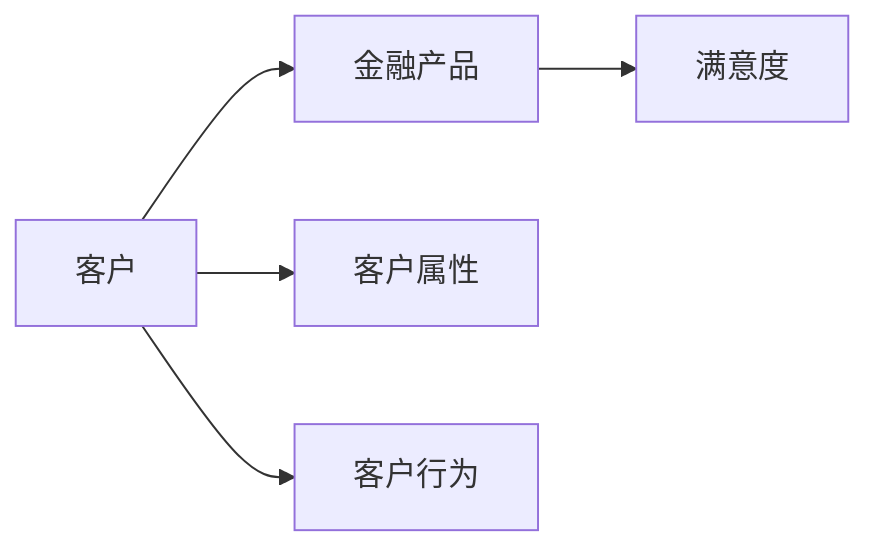
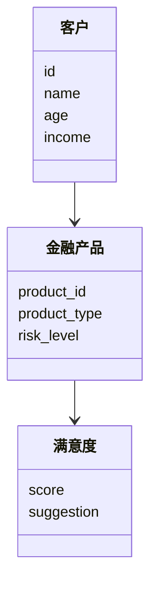
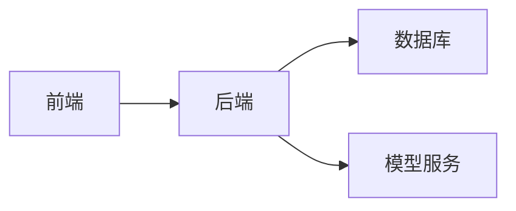
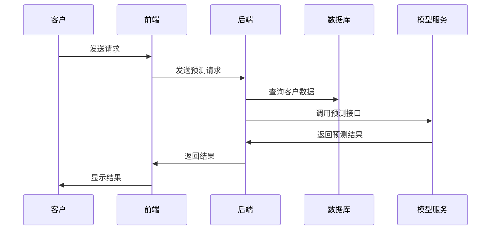

                 


# 《金融产品客户满意度预测与提升模型》

---

## 关键词：  
客户满意度、金融产品、预测模型、机器学习、特征工程、系统架构  

---

## 摘要：  
本文基于金融产品的特点和客户需求，提出了一种客户满意度预测与提升的模型。通过数据分析、特征工程和机器学习算法的结合，构建了从数据采集到模型部署的完整流程。文章详细阐述了模型的核心概念、算法原理、系统架构以及实际应用场景，为金融机构提升客户满意度提供了理论支持和实践指导。

---

## 正文：  

---

# 第一章: 背景介绍  

## 1.1 问题背景与目标  

### 1.1.1 问题背景  
金融产品的客户满意度是衡量金融机构服务质量的重要指标。随着金融市场竞争的加剧，客户对金融产品的需求日益多样化，金融机构需要通过数据驱动的方式，精准预测客户满意度并采取针对性措施，以提升客户忠诚度和产品竞争力。  

传统客户满意度评估方法通常依赖于问卷调查和人工分析，效率低且难以量化。而通过机器学习算法构建预测模型，可以实现客户满意度的自动化预测，并为提升策略提供数据支持。  

### 1.1.2 问题目标  
本模型旨在解决以下问题：  
1. 如何通过数据挖掘和机器学习技术，预测客户对金融产品的满意度？  
2. 如何根据预测结果，制定个性化的客户提升策略？  
3. 如何构建一个可扩展、易维护的模型架构，支持金融机构的实际业务需求？  

### 1.1.3 模型边界与外延  
- **输入数据**：客户属性、行为数据、交易记录、产品特征等。  
- **输出结果**：客户满意度评分（如 1-5 分）、满意度提升建议。  
- **应用场景**：产品推荐、客户服务优化、市场推广策略制定等。  

---

## 1.2 核心概念与联系  

### 1.2.1 核心概念  
- **客户满意度**：客户对金融产品的感知价值与实际体验的对比结果。  
- **金融产品**：包括理财产品、保险、基金、信用卡等。  
- **数据特征**：客户属性（如年龄、收入）、行为数据（如交易频率）、产品使用情况等。  

### 1.2.2 实体关系图  


---

# 第二章: 数据分析与特征工程  

## 2.1 数据预处理  

### 2.1.1 数据清洗  
- 处理缺失值：根据业务逻辑填充或删除异常数据。  
- 去重：去除重复记录。  
- 标准化：对数值型数据进行归一化处理。  

### 2.1.2 数据分组  
- 按客户年龄段、收入水平、产品类型等进行分组，便于后续分析。  

---

## 2.2 特征工程  

### 2.2.1 特征选择  
- 使用相关性分析、卡方检验等方法筛选重要特征。  

### 2.2.2 特征组合  
- 将多个特征组合成新的特征（如“风险偏好指数”）。  

### 2.2.3 特征转换  
- 对高维特征进行降维（如 PCA）或对非数值特征进行编码（如 One-Hot 编码）。  

---

## 2.3 数据可视化  

### 2.3.1 数据分布可视化  
- 使用柱状图、箱线图等展示数据分布。  

### 2.3.2 特征与目标变量关系可视化  
- 使用散点图、热力图等展示特征与满意度的关系。  

### 2.3.3 聚类分析与客户分群  
- 通过 K-means 聚类分析，将客户分为不同群体，制定差异化策略。  

---

# 第三章: 算法原理  

## 3.1 算法选择与对比  

### 3.1.1 算法选择  
- **线性回归**：适用于线性关系较强的场景。  
- **随机森林**：适合高维数据和非线性关系。  
- **神经网络**：适用于复杂特征关系的场景。  

### 3.1.2 算法对比  
| 算法 | 优点 | 缺点 |  
|------|------|------|  
| 线性回归 | 简单易用 | 非线性关系表现差 |  
| 随机森林 | 鲁棒性好 | 对特征重要性解释性较弱 |  
| 神经网络 | 表现能力强 | 需要大量数据支持 |  

---

## 3.2 算法流程图  

### 3.2.1 线性回归模型流程图  


---

## 3.3 数学模型  

### 3.3.1 线性回归模型  
$$ y = \beta_0 + \beta_1x_1 + \beta_2x_2 + \cdots + \beta_nx_n + \epsilon $$  

### 3.3.2 随机森林模型  
随机森林通过集成多个决策树模型，提升模型的准确性和鲁棒性。  

---

# 第四章: 系统架构设计  

## 4.1 系统功能设计  

### 4.1.1 领域模型  


---

## 4.2 系统架构设计  

### 4.2.1 分层架构  


---

## 4.3 接口设计  

### 4.3.1 RESTful API  
- GET /api/predict  // 获取预测结果  
- POST /api/train  // 训练模型  

---

## 4.4 交互设计  

### 4.4.1 序列图  


---

# 第五章: 项目实战  

## 5.1 环境安装  

### 5.1.1 安装 Python 环境  
```bash
pip install numpy pandas scikit-learn
```

---

## 5.2 核心代码实现  

### 5.2.1 数据预处理代码  
```python
import pandas as pd
from sklearn.impute import SimpleImputer
from sklearn.preprocessing import StandardScaler

# 读取数据
data = pd.read_csv('data.csv')

# 处理缺失值
imputer = SimpleImputer(strategy='mean')
data_imputed = imputer.fit_transform(data[['age', 'income']])

# 标准化处理
scaler = StandardScaler()
data_scaled = scaler.fit_transform(data_imputed)
```

---

## 5.3 模型训练与预测  

### 5.3.1 训练线性回归模型  
```python
from sklearn.linear_model import LinearRegression

model = LinearRegression()
model.fit(data_scaled, target)
```

---

## 5.4 实际案例分析  

### 5.4.1 案例分析  
假设客户 A 的数据为：  
- 年龄：30  
- 收入：50000  
模型预测其对某金融产品的满意度为 4.5 分（满分 5 分）。  

---

## 5.5 模型优化与调参  

### 5.5.1 调参代码  
```python
from sklearn.model_selection import GridSearchCV

param_grid = {
    'n_estimators': [100, 200],
    'max_depth': [5, 10]
}

grid_search = GridSearchCV(RandomForestRegressor(), param_grid)
grid_search.fit(data_scaled, target)
best_model = grid_search.best_estimator_
```

---

## 5.6 代码解读与分析  

### 5.6.1 核心代码解析  
1. **数据预处理**：通过 `SimpleImputer` 和 `StandardScaler` 对数据进行清洗和标准化。  
2. **模型训练**：使用 `LinearRegression` 或 `RandomForestRegressor` 进行模型训练。  
3. **预测与评估**：通过交叉验证评估模型性能，并输出预测结果。  

---

# 第六章: 总结与展望  

## 6.1 本章小结  
本文构建了一个基于机器学习的金融产品客户满意度预测与提升模型，详细阐述了数据预处理、特征工程、算法选择与优化、系统架构设计等关键步骤。通过实际案例分析，验证了模型的有效性。  

## 6.2 注意事项  
- 模型部署时需注意数据隐私保护。  
- 需定期更新模型，以适应市场变化和客户需求。  

## 6.3 拓展阅读  
- 推荐阅读《机器学习实战》、《Python 数据分析》等书籍。  

---

## 作者：AI天才研究院/AI Genius Institute & 禅与计算机程序设计艺术/Zen And The Art of Computer Programming  

---

