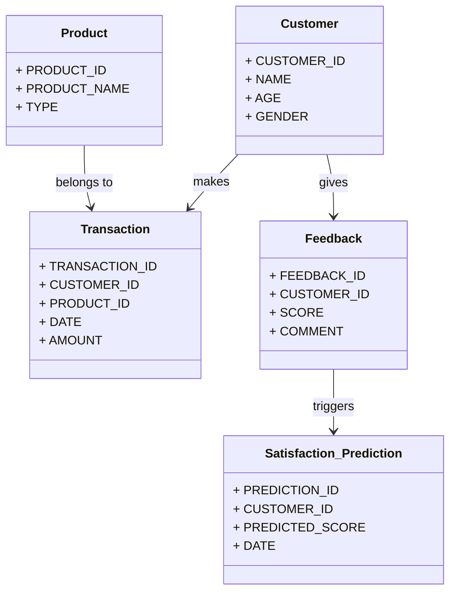
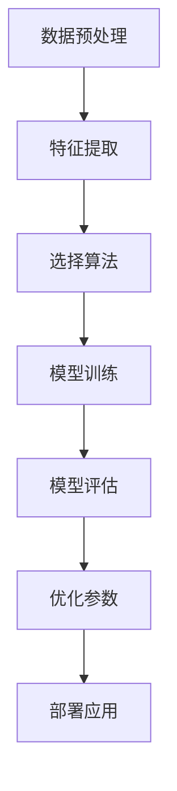
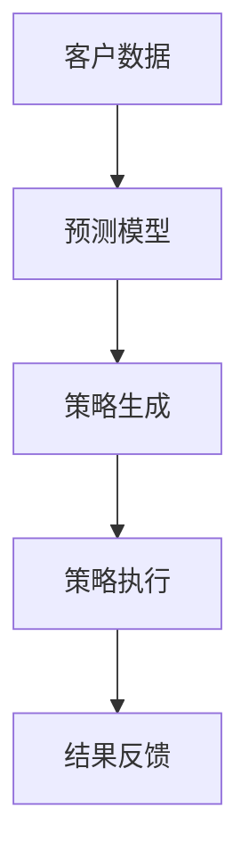
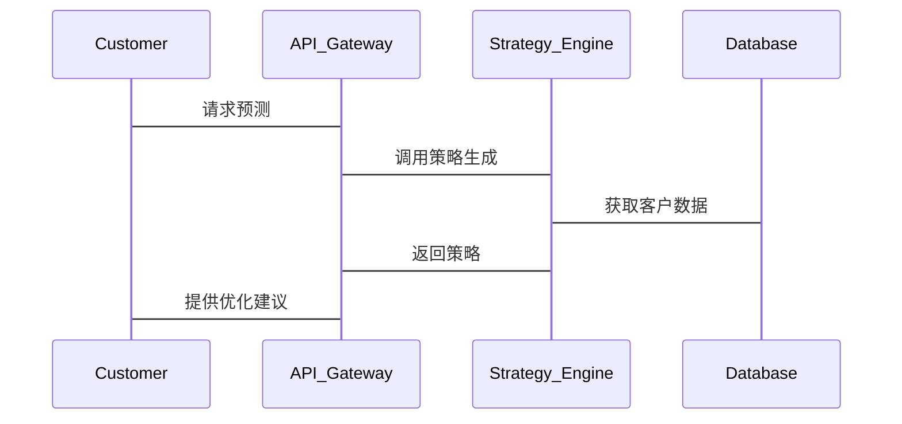

                 


# 金融产品客户满意度预测与提升策略引擎

> 关键词：金融产品、客户满意度、预测模型、策略引擎、算法原理

> 摘要：本文探讨了如何通过数据分析和机器学习技术预测客户对金融产品的满意度，并基于预测结果设计提升策略引擎。文章首先介绍背景与核心概念，然后详细讲解算法原理，接着设计系统架构，最后通过项目实战验证方法的有效性。

---

# 第一部分: 金融产品客户满意度预测与提升背景概述

## 第1章: 金融产品客户满意度预测的背景与意义

### 1.1 问题背景与描述

#### 1.1.1 金融产品客户满意度的重要性
- 金融产品的客户满意度是衡量客户对产品和服务的整体感受的关键指标。
- 满意度高的客户更可能持续使用产品并推荐给他人，从而提高企业市场份额。
- 满意度低的客户可能导致收入损失和声誉损害。

#### 1.1.2 当前客户满意度预测的挑战
- 数据多样性：客户行为、反馈、交易记录等多维度数据的整合与处理难度大。
- 模型复杂性：需要考虑客户个体差异和市场动态变化。
- 实时性要求：金融市场的快速变化要求预测模型具有实时响应能力。

#### 1.1.3 提升客户满意度的商业价值
- 提高客户忠诚度，降低客户流失率。
- 通过精准预测优化产品设计和服务流程。
- 提升客户体验，增强品牌竞争力。

### 1.2 客户满意度预测的核心概念

#### 1.2.1 客户满意度的定义与维度
- **定义**：客户满意度是指客户对产品或服务的实际体验与期望之间的差距。
- **维度**：包括产品质量、服务效率、用户体验等多个方面。

#### 1.2.2 金融产品客户满意度的影响因素
- 客户属性：年龄、性别、收入水平等。
- 产品特性：收益率、风险程度、流动性等。
- 服务质量：响应速度、问题解决能力等。

#### 1.2.3 预测模型的构建目标
- 准确预测客户满意度。
- 分析关键影响因素，为策略制定提供数据支持。

---

# 第二部分: 金融产品客户满意度预测的核心概念与联系

## 第2章: 客户满意度预测的核心概念与联系

### 2.1 核心概念的原理与属性

#### 2.1.1 客户满意度预测的关键要素
- 数据来源：客户行为数据、反馈数据、市场数据等。
- 数据预处理：清洗、归一化、特征提取。
- 模型训练：选择合适的算法，优化参数。

#### 2.1.2 各要素的特征对比分析
| 要素 | 特征 | 描述 |
|------|------|------|
| 数据来源 | 多样性 | 包括结构化和非结构化数据 |
| 数据预处理 | 复杂性 | 需要处理缺失值、异常值等 |
| 模型训练 | 可解释性 | 需要模型易于解释和调整 |

#### 2.1.3 核心概念的ER实体关系图
```mermaid
erDiagram
    customer(CUSTOMER_ID, NAME, AGE, GENDER) {
    }
    product(PRODUCT_ID, PRODUCT_NAME, TYPE) {
    }
    transaction(TRANSACTION_ID, CUSTOMER_ID, PRODUCT_ID, DATE, AMOUNT) {
    }
    feedback(FEEDBACK_ID, CUSTOMER_ID, SCORE, COMMENT) {
    }
    satisfaction_prediction(PREDICTION_ID, CUSTOMER_ID, PREDICTED_SCORE, DATE) {
    }
    customer -> transaction : "makes"
    product -> transaction : "belongs to"
    customer -> feedback : "gives"
    feedback -> satisfaction_prediction : "triggers"
```

### 2.2 核心概念的联系与系统架构

#### 2.2.1 系统功能模块的Mermaid类图


#### 2.2.2 系统架构的Mermaid架构图


---

# 第三部分: 金融产品客户满意度预测的算法原理

## 第3章: 客户满意度预测的算法原理

### 3.1 预测模型的算法选择

#### 3.1.1 常见算法的优缺点对比
| 算法 | 优点 | 缺点 |
|------|------|------|
| 线性回归 | 简单、可解释性高 | 不能处理非线性关系 |
| 随机森林 | 高精度、鲁棒性强 | 解释性较弱 |
| 神经网络 | 能处理复杂非线性关系 | 训练时间长、易过拟合 |

#### 3.1.2 算法选择的依据与标准
- 数据类型和分布
- 预测精度要求
- 计算资源限制

#### 3.1.3 算法流程的Mermaid图


### 3.2 算法原理的数学模型与公式

#### 3.2.1 线性回归模型的公式推导
$$ y = \beta_0 + \beta_1x + \epsilon $$

#### 3.2.2 随机森林算法的原理
- 随机森林通过集成多个决策树，减少过拟合，提高泛化能力。

### 3.3 算法实现的代码示例

#### 3.3.1 Python代码实现
```python
import pandas as pd
from sklearn.ensemble import RandomForestRegressor
from sklearn.metrics import mean_squared_error

# 数据加载与预处理
data = pd.read_csv('customer_satisfaction.csv')
X = data.drop('score', axis=1)
y = data['score']

# 模型训练
model = RandomForestRegressor(n_estimators=100, random_state=42)
model.fit(X, y)

# 模型预测
predicted = model.predict(X)

# 模型评估
mse = mean_squared_error(y, predicted)
print(f'Mean Squared Error: {mse}')
```

#### 3.3.2 代码的功能解读与分析
- 数据预处理：加载数据并进行特征提取。
- 模型选择：选择随机森林作为回归模型。
- 模型训练与预测：训练模型并进行预测。
- 模型评估：计算均方误差，评估模型性能。

---

# 第四部分: 金融产品客户满意度提升策略引擎的设计

## 第4章: 提升策略引擎的设计与实现

### 4.1 策略引擎的核心功能

#### 4.1.1 策略生成的逻辑与规则
- 根据预测结果生成个性化策略。
- 结合客户行为和市场动态调整策略。

#### 4.1.2 策略引擎的架构设计


#### 4.1.3 策略引擎的系统交互图


### 4.2 策略引擎的设计与实现

#### 4.2.1 策略引擎的功能模块
- 数据采集模块：收集客户行为数据。
- 数据分析模块：分析数据生成预测结果。
- 策略生成模块：基于预测结果制定优化策略。
- 策略执行模块：执行策略并反馈结果。

#### 4.2.2 策略引擎的优化方向
- 结合实时数据动态调整策略。
- 引入客户反馈进一步优化模型。

---

# 总结与展望

## 第5章: 总结与展望

### 5.1 本章总结
- 本文详细介绍了金融产品客户满意度预测与提升策略引擎的设计与实现。
- 通过数据分析、算法选择和系统设计，构建了一个完整的预测与优化框架。

### 5.2 未来研究方向
- 开发更高效的预测模型，如深度学习模型。
- 引入实时数据流处理，提升预测的实时性。
- 研究多目标优化策略，同时考虑客户满意度和企业收益。

### 5.3 最佳实践 tips
- 数据预处理是关键，确保数据质量。
- 选择合适的算法，平衡精度和计算成本。
- 定期更新模型，适应市场变化。

---

作者：AI天才研究院/AI Genius Institute  
禅与计算机程序设计艺术/Zen And The Art of Computer Programming

