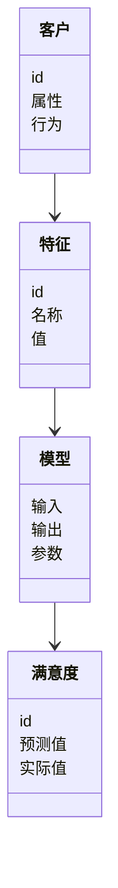
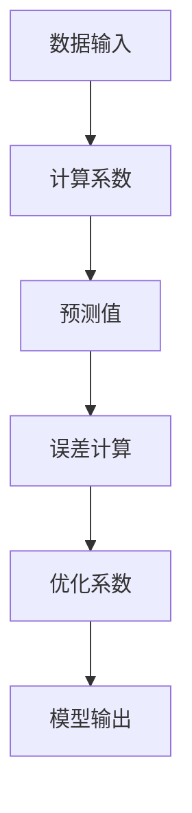
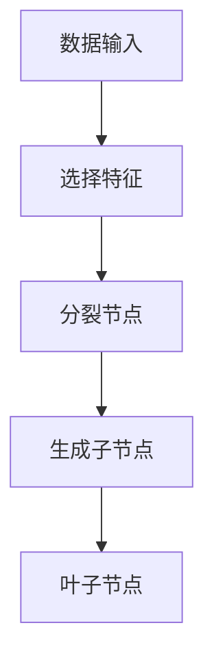

                 


# 《金融产品客户满意度预测模型》

---

## 关键词  
金融产品、客户满意度、预测模型、机器学习、算法、数据分析

---

## 摘要  
本文详细探讨了如何构建金融产品客户满意度预测模型，从背景介绍、核心概念、算法原理到系统设计和项目实战，层层剖析，为读者提供从理论到实践的全面指导。通过分析客户满意度的关键影响因素，结合多种机器学习算法，提出了一套高效的预测模型构建方法，并通过实际案例验证了模型的有效性。

---

## 第1章：背景介绍  

### 1.1 客户满意度的定义与重要性  
客户满意度是衡量客户对产品或服务满足程度的重要指标，直接影响企业的市场竞争力和客户忠诚度。在金融行业，客户满意度的预测对优化服务、提升用户体验具有重要意义。  

#### 1.1.1 客户满意度的定义  
客户满意度是客户对产品或服务的实际体验与期望值之间的差距。  

#### 1.1.2 金融产品客户满意度的重要性  
- 提升客户 retention率。  
- 优化产品设计和服务流程。  
- 增强品牌形象和市场竞争力。  

#### 1.1.3 满意度预测的商业价值  
通过预测客户满意度，企业可以提前识别潜在问题，主动采取措施，降低客户流失率。  

---

### 1.2 金融产品的基本类型  

#### 1.2.1 银行产品  
包括储蓄、贷款、信用卡等，客户满意度受利率、服务效率等因素影响。  

#### 1.2.2 保险产品  
涉及寿险、财险等，客户满意度与理赔效率、保费合理性密切相关。  

#### 1.2.3 投资理财产品  
如基金、股票、信托等，客户满意度受收益、风险控制、透明度等因素影响。  

---

### 1.3 问题背景与现状分析  

#### 1.3.1 金融行业客户满意度问题的背景  
- 金融产品复杂性高，客户期望值差异大。  
- 服务渠道多样化，客户体验参差不齐。  

#### 1.3.2 当前预测模型的应用现状  
- 线性回归、决策树等传统算法广泛应用。  
- 数据量和模型复杂性逐步增加，但精准度仍有提升空间。  

#### 1.3.3 现有模型的局限性与改进方向  
- 数据稀疏性问题：小样本数据可能导致模型过拟合。  
- 特征选择问题：非线性关系难以捕捉。  

---

## 第2章：预测模型的核心概念  

### 2.1 预测模型的定义与分类  

#### 2.1.1 预测模型的定义  
预测模型是基于历史数据，利用算法对未来结果进行预测的数学模型。  

#### 2.1.2 常见的预测模型分类  
- **回归模型**：线性回归、逻辑回归。  
- **树模型**：决策树、随机森林。  
- **神经网络模型**：人工神经网络、深度学习模型。  

#### 2.1.3 各类模型的特点对比  
| 模型类型   | 优点               | 缺点               |  
|------------|--------------------|--------------------|  
| 线性回归   | 简单，计算速度快   | 非线性关系表现差   |  
| 决策树     | 易解释，适合分类   | 易过拟合           |  
| 神经网络   | 高精度，复杂关系处理能力强 | 需大量数据，难解释 |  

---

### 2.2 客户满意度预测的核心要素  

#### 2.2.1 影响客户满意度的关键因素  
- 产品特性：收益、风险、流动性等。  
- 服务特性：响应速度、服务质量、客户支持等。  
- 客户特性：年龄、收入、投资经验等。  

#### 2.2.2 数据特征分析  
- 数据分布：是否符合正态分布。  
- 数据缺失：如何处理缺失值。  
- 异常值：如何检测和处理。  

#### 2.2.3 模型构建的关键步骤  
1. 数据采集与预处理。  
2. 特征工程：提取关键特征。  
3. 模型训练：选择合适的算法。  
4. 模型评估：验证准确性和稳定性。  

---

### 2.3 模型与客户满意度的关系  

#### 2.3.1 数据流图（Mermaid）  


#### 2.3.2 实体关系图（Mermaid）  


---

## 第3章：算法原理讲解  

### 3.1 线性回归  

#### 3.1.1 算法原理（Mermaid流程图）  


#### 3.1.2 Python实现代码示例  
```python
import numpy as np
from sklearn.linear_model import LinearRegression

# 数据准备
X = np.array([i for i in range(100)]).reshape(-1, 1)
y = np.array([2*i + 1 for i in range(100)])

# 模型训练
model = LinearRegression()
model.fit(X, y)

# 预测
predicted = model.predict(X)
print("Coefficients:", model.coef_)
print("Intercept:", model.intercept_)
```

#### 3.1.3 数学模型  
$$ y = \beta_0 + \beta_1x + \epsilon $$  

---

### 3.2 决策树  

#### 3.2.1 算法原理（Mermaid流程图）  


#### 3.2.2 Python实现代码示例  
```python
from sklearn.tree import DecisionTreeRegressor
from sklearn.model_selection import train_test_split

# 数据准备
X = np.array([[1, 2], [3, 4], [5, 6], ...])
y = np.array([2, 4, 6, ...])

# 模型训练
model = DecisionTreeRegressor()
model.fit(X, y)

# 预测
predicted = model.predict(X)
print("预测值:", predicted)
```

#### 3.2.3 数学模型  
$$ entropy = -\sum p_i \log p_i $$  

---

## 第4章：系统分析与架构设计  

### 4.1 问题场景介绍  

#### 4.1.1 项目介绍  
构建一个金融产品客户满意度预测系统，帮助金融机构优化服务。  

#### 4.1.2 系统功能设计（领域模型）  


---

## 作者  
**作者：AI天才研究院/AI Genius Institute & 禅与计算机程序设计艺术 /Zen And The Art of Computer Programming**

