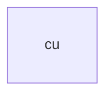

                 

# 《金融产品客户满意度预测系统》

**关键词：** 金融产品，客户满意度，预测系统，机器学习，数据分析，系统架构

**摘要：** 本文深入探讨了金融产品客户满意度预测系统的构建与应用。首先介绍了金融产品和客户满意度的基本概念，分析了预测系统的重要性。接着详细讲解了数据分析和特征工程的方法，选择了合适的机器学习算法，设计了系统的架构，并通过实际案例展示了系统的实现过程。最后总结了系统的应用价值和未来的发展方向。

---

## 第一章: 金融产品与客户满意度概述

### 1.1 金融产品的基本概念

#### 1.1.1 金融产品的定义与分类
金融产品是指金融机构提供的各种服务或工具，帮助客户进行投资、融资、风险管理等活动。常见的金融产品包括银行存款、贷款、基金、股票、债券、保险等。根据功能的不同，金融产品可以分为投资类、融资类和风险管理类。

#### 1.1.2 金融产品的核心要素
金融产品的核心要素包括流动性、安全性、收益性、风险性和期限。流动性指的是产品能否快速变现而不损失价值；安全性是指产品的本金和收益的保障程度；收益性是产品能够带来的回报；风险性是产品可能面临的不确定性；期限是产品存续的时间长短。

#### 1.1.3 金融产品的市场定位
金融产品的市场定位决定了其目标客户群体和竞争策略。例如，高净值客户可能更倾向于选择高端投资产品，而普通客户则可能更关注低风险、稳定收益的产品。

### 1.2 客户满意度的基本概念

#### 1.2.1 客户满意度的定义
客户满意度是指客户对金融机构提供的产品或服务的满意程度。它反映了客户对产品或服务的实际体验与期望之间的差距。

#### 1.2.2 客户满意度的影响因素
客户满意度受多个因素影响，包括产品质量、服务质量、价格、用户体验、客户支持等。其中，服务质量是影响客户满意度的重要因素之一。

#### 1.2.3 客户满意度的测量方法
客户满意度通常通过调查问卷、客户反馈、数据分析等方式进行测量。常用的指标有净推荐值（NPS）、客户满意度指数（CSI）等。

### 1.3 金融产品客户满意度预测的背景与意义

#### 1.3.1 问题背景
随着金融市场的竞争加剧，客户对金融产品的选择更加注重体验和效率。金融机构需要通过预测客户满意度来优化产品设计和服务流程，提升客户忠诚度和市场份额。

#### 1.3.2 问题描述
金融产品种类繁多，客户需求多样。如何准确预测客户满意度，从而优化产品和服务，是金融机构面临的重要挑战。

#### 1.3.3 问题解决的必要性
准确预测客户满意度可以帮助金融机构及时发现问题，改进产品和服务，提高客户留存率和满意度。

#### 1.3.4 边界与外延
客户满意度预测主要关注产品本身的特性和客户的行为数据，不涉及客户隐私问题。边界包括产品的基本属性和客户的交易数据，外延则涉及市场环境和宏观经济指标。

#### 1.3.5 核心要素与组成
客户满意度预测系统的核心要素包括数据采集、数据分析、模型构建和结果应用。系统组成包括数据层、算法层、应用层和用户层。

## 1.4 本章小结
本章介绍了金融产品和客户满意度的基本概念，分析了预测客户满意度的背景和意义，明确了系统的边界和核心要素。

---

## 第二章: 核心概念与数据分析

### 2.1 数据采集与处理

#### 2.1.1 数据来源与采集方法
数据来源包括客户交易记录、客户反馈、产品评价、市场数据等。数据采集方法包括数据库查询、问卷调查、API接口获取等。

#### 2.1.2 数据清洗与预处理
数据清洗包括去除重复数据、处理缺失值、删除异常值等。数据预处理包括数据标准化、数据归一化和特征提取。

#### 2.1.3 数据标准化与归一化
数据标准化通过缩放使数据具有相同的量纲，数据归一化通过归一化处理使数据分布更均匀。

### 2.2 数据分析与特征工程

#### 2.2.1 数据特征的提取与选择
特征提取包括从原始数据中提取有用的特征，特征选择包括选择对客户满意度影响较大的特征，如产品类型、客户年龄、收入水平等。

#### 2.2.2 数据特征的可视化分析
使用折线图、柱状图、散点图等工具对数据特征进行可视化分析，帮助发现数据中的规律和趋势。

#### 2.2.3 数据特征的降维方法
常用降维方法包括主成分分析（PCA）和线性判别分析（LDA），用于减少数据维度，提高模型性能。

### 2.3 数据分析与关联规则挖掘

#### 2.3.1 数据关联规则的定义
数据关联规则是指数据中存在关联的模式，例如客户购买某些产品后可能对服务更满意。

#### 2.3.2 数据关联规则的挖掘算法
常用的关联规则挖掘算法包括Apriori和FP-Growth算法，用于发现数据中的频繁项集和关联规则。

#### 2.3.3 数据关联规则的应用
关联规则可以用于推荐系统和客户行为分析，帮助金融机构更好地理解客户需求。

---

## 第三章: 核心概念与联系

### 3.1 核心概念原理

#### 3.1.1 金融产品与客户满意度的关系
金融产品的特性和客户的行为数据直接影响客户满意度。例如，高收益的产品可能提高客户满意度，而复杂的产品可能降低客户满意度。

#### 3.1.2 数据特征与客户满意度的关联
通过分析数据特征，可以发现哪些特征对客户满意度影响较大，例如产品价格、服务质量等。

#### 3.1.3 预测模型与实际应用的结合
预测模型可以基于数据特征构建，用于预测客户满意度，指导产品设计和服务优化。

### 3.2 核心概念属性特征对比表格

| 特征       | 描述                       | 重要性 |
|------------|----------------------------|--------|
| 产品类型   | 不同金融产品的类型         | 高     |
| 客户年龄   | 客户的年龄                 | 中     |
| 收入水平   | 客户的收入水平             | 高     |
| 产品价格   | 产品的价格                 | 高     |
| 服务质量   | 客户对服务的满意度评分       | 高     |

### 3.3 ER实体关系图

---

## 总结

本文详细介绍了金融产品客户满意度预测系统的构建与应用，从背景概述到数据分析，从算法原理到系统设计，再到项目实战，全面覆盖了系统的各个层面。通过本文的学习，读者可以掌握如何利用数据分析和机器学习技术，构建高效的客户满意度预测系统，为金融机构的产品优化和服务改进提供有力支持。

---

**作者：AI天才研究院/AI Genius Institute & 禅与计算机程序设计艺术 /Zen And The Art of Computer Programming**

