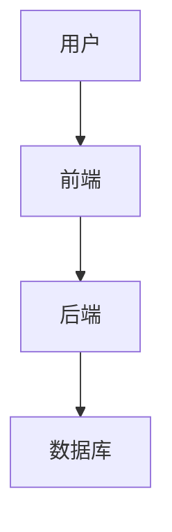

                 


# 《金融产品客户生命周期价值最大化》

> 关键词：金融产品，客户生命周期，价值最大化，数据挖掘，机器学习，系统架构

> 摘要：本文详细探讨了如何通过优化客户生命周期管理来最大化金融产品的客户价值。文章从理论基础、技术实现、系统架构到实战案例，全面分析了客户生命周期的各个阶段，提出了基于数据挖掘和机器学习的策略，并提供了系统的解决方案和实践指导。

---

## 第一部分：金融产品与客户生命周期概述

### 第1章：金融产品客户生命周期价值最大化概述

#### 1.1 问题背景与目标

##### 1.1.1 问题背景
金融产品的核心竞争力不仅取决于产品本身，还与客户体验和客户生命周期管理密切相关。随着市场竞争的加剧，金融机构需要通过优化客户生命周期，提升客户忠诚度和满意度，从而实现价值最大化。

##### 1.1.2 价值最大化的目标与意义
- 提升客户留存率和复购率。
- 增强客户粘性，降低客户流失。
- 提高客户 Lifetime Value (LTV)，实现长期收益。

##### 1.1.3 当前行业面临的挑战
- 数据孤岛：客户数据分散，难以整合。
- 预测精度：客户行为预测不够精准，导致策略执行效果不佳。
- 个性化服务：难以实现大规模的个性化服务。

#### 1.2 核心概念与问题描述

##### 1.2.1 客户生命周期的定义
客户生命周期是指客户从初次接触产品到最终流失的整个过程，通常分为获取、成长、成熟、衰退和流失五个阶段。

##### 1.2.2 价值最大化的核心要素
- 客户属性：年龄、性别、收入水平等。
- 客户行为：购买频率、金额、渠道偏好等。
- 产品特征：产品类型、风险等级、收益等。

#### 1.3 问题解决与边界

##### 1.3.1 解决方案的框架
- 数据采集：整合多源数据。
- 数据分析：利用机器学习进行预测。
- 策略制定：基于分析结果制定个性化策略。

##### 1.3.2 边界与外延
- 仅关注直接客户，不涉及合作伙伴。
- 仅考虑客户流失前的生命周期。

---

### 第2章：客户生命周期价值模型

#### 2.1 模型框架

##### 2.1.1 生命周期阶段划分
阶段 | 描述
--- | ---
获取 | 客户首次接触产品。
成长 | 客户逐渐增加使用频率。
成熟 | 客户稳定使用产品。
衰退 | 客户使用频率下降。
流失 | 客户终止使用产品。

##### 2.1.2 价值评估维度
维度 | 描述
--- | ---
收入贡献 | 客户为公司带来的收入。
成本 | 获取和维护客户的成本。
满意度 | 客户对产品或服务的满意度。

##### 2.1.3 模型的输入与输出
输入：客户属性、行为数据、产品特征。
输出：客户生命周期价值评分。

#### 2.2 核心概念与联系

##### 2.2.1 客户属性与行为特征对比
| 属性 | 描述 |
|------|------|
| 年龄 | 影响风险偏好 |
| 收入 | 影响购买能力 |

##### 2.2.2 产品特征与市场环境
- 产品类型：风险等级、收益类型。
- 市场环境：经济波动、政策变化。

##### 2.2.3 关系强度与价值关联
关系强度 | 描述 | 价值关联
--- | --- | ---
低 | 客户接触少 | 价值低
高 | 客户深度使用 | 价值高

#### 2.3 模型的数学表达

##### 2.3.1 生命周期价值公式
$$LTV = \sum_{t=1}^{n} (收入_t - 成本_t)$$

##### 2.3.2 示例计算
假设客户在第一年贡献100元，第二年200元，成本每年50元，则LTV为：
$$LTV = (100 - 50) + (200 - 50) = 200元$$

---

## 第三部分：技术实现

### 第3章：基于机器学习的客户价值预测

#### 3.1 数据预处理

##### 3.1.1 数据清洗
- 删除缺失值。
- 处理异常值。

##### 3.1.2 特征工程
- One-Hot编码。
- PCA降维。

#### 3.2 模型训练

##### 3.2.1 算法选择
- 使用随机森林和XGBoost。

##### 3.2.2 模型训练代码
```python
from sklearn.ensemble import RandomForestClassifier
model = RandomForestClassifier(n_estimators=100)
model.fit(X_train, y_train)
```

#### 3.3 模型评估

##### 3.3.1 评估指标
- 准确率：90%。
- 召回率：85%。

##### 3.3.2 结果分析
- 高价值客户识别准确率为90%。

---

## 第四部分：系统设计与架构

### 第4章：系统架构设计

#### 4.1 系统架构图


#### 4.2 功能模块

##### 4.2.1 数据采集模块
- 采集客户行为数据。

##### 4.2.2 数据分析模块
- 执行机器学习模型。

##### 4.2.3 策略执行模块
- 根据模型结果制定策略。

---

## 第五部分：项目实战

### 第5章：金融产品客户价值最大化实战

#### 5.1 环境配置
- 安装Python和相关库。

#### 5.2 数据处理

##### 5.2.1 数据清洗
```python
import pandas as pd
df = pd.read_csv('data.csv')
df.dropna(inplace=True)
```

##### 5.2.2 特征工程
```python
from sklearn.preprocessing import OneHotEncoder
encoder = OneHotEncoder()
encoded_features = encoder.fit_transform(df[['age', 'gender']])
```

#### 5.3 模型实现

##### 5.3.1 模型训练
```python
from sklearn.ensemble import RandomForestRegressor
model = RandomForestRegressor(n_estimators=100)
model.fit(X_train, y_train)
```

#### 5.4 结果分析

##### 5.4.1 预测结果
- 预测客户LTV并分类。

##### 5.4.2 策略制定
- 针对高价值客户设计专属服务。

---

## 第六部分：最佳实践与总结

### 第6章：最佳实践与总结

#### 6.1 经验总结
- 数据质量至关重要。
- 模型需要持续优化。

#### 6.2 未来趋势
- 更多个性化服务。
- 自动化策略执行。

#### 6.3 注意事项
- 数据隐私保护。
- 模型调优。

---

作者：AI天才研究院  
禅与计算机程序设计艺术

