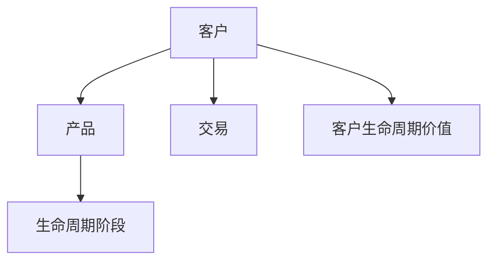

                 

# 金融产品客户生命周期价值预测

> 关键词：客户生命周期价值、金融产品、预测模型、机器学习、数据挖掘

> 摘要：本文探讨了金融产品客户生命周期价值预测的方法，从理论基础到算法实现，再到系统架构，结合实际案例，分析了如何有效预测客户价值，为企业优化决策提供支持。

---

# 第1章: 金融产品客户生命周期价值预测概述

## 1.1 问题背景与描述

### 1.1.1 什么是客户生命周期价值（CLV）

客户生命周期价值（Customer Lifetime Value, CLV）是指一个客户在其整个生命周期内为企业带来的净收益。在金融产品领域，CLV的预测对制定客户策略、产品定价和风险管理具有重要意义。

### 1.1.2 金融产品与客户生命周期的关系

金融产品从推出到退市的生命周期与客户从获取到流失的生命周期密切相关。CLV不仅反映了客户对产品的需求，还反映了产品对客户价值的影响。

### 1.1.3 问题解决的意义与目标

通过预测CLV，企业可以优化资源分配，提升客户满意度，降低客户流失率，从而提高整体收益。

## 1.2 核心概念与边界

### 1.2.1 客户生命周期价值的核心要素

- 客户属性：年龄、性别、收入等
- 客户行为：交易频率、金额、渠道等
- 时间因素：购买时间、产品持有时间等
- 经济因素：市场波动、利率变化等

### 1.2.2 问题的边界与外延

- 仅考虑直接收益，不包括间接影响
- 适用于单个客户或客户群体

### 1.2.3 相关概念对比分析

- CLV与客户满意度：CLV关注长期收益，满意度关注即时反馈
- CLV与客户忠诚度：CLV是忠诚度的量化指标

## 1.3 核心概念结构与组成

### 1.3.1 CLV的计算公式与影响因素

公式：$$ CLV = \frac{R - C}{1 - \omega} $$

其中，R为客户的边际收入，C为获取客户的成本，ω为客户的流失概率。

### 1.3.2 金融产品生命周期模型

模型展示了金融产品的生命周期与客户生命周期之间的关系。

### 1.3.3 客户行为与价值的关系

通过客户行为分析，预测其CLV，优化产品策略。

---

# 第2章: 客户生命周期价值的理论基础

## 2.1 理论基础概述

### 2.1.1 客户价值理论

客户价值理论强调客户对企业的贡献，是CLV的核心基础。

### 2.1.2 生命周期理论

客户与产品共同经历生命周期，影响CLV的计算。

### 2.1.3 金融产品定价理论

基于CLV优化产品定价策略。

## 2.2 客户行为分析

### 2.2.1 客户行为模型

分析客户行为模式，预测其CLV。

### 2.2.2 客户决策树分析

通过决策树划分客户群体，制定个性化策略。

### 2.2.3 客户流失预测

预测客户流失，提前采取措施。

## 2.3 金融产品与客户价值的关系

### 2.3.1 产品生命周期对客户价值的影响

产品阶段不同，客户价值也不同。

### 2.3.2 客户价值对产品定价的影响

高价值客户享受定制产品。

### 2.3.3 产品创新与客户价值提升

通过创新提升客户价值。

## 2.4 核心概念联系的表格对比

| 概念 | 定义 | 属性 | 关系 |
|------|------|------|------|
| 客户生命周期 | 时间段 | 长度、阶段 | 决定CLV |
| 客户价值 | 终生收益 | 收入、成本 | 核心计算对象 |
| 产品生命周期 | 产品阶段 | 阶段、用户 | 影响CLV计算 |

## 2.5 ER实体关系图

---

通过以上结构，文章详细介绍了金融产品客户生命周期价值预测的各个方面，从理论到实践，帮助读者全面理解CLV预测的重要性及其应用。

