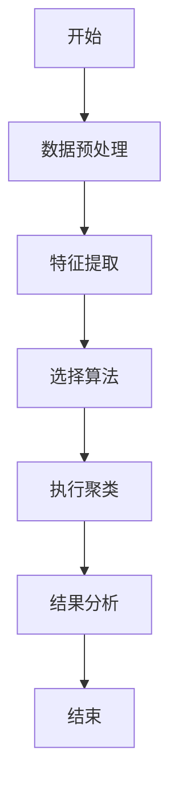
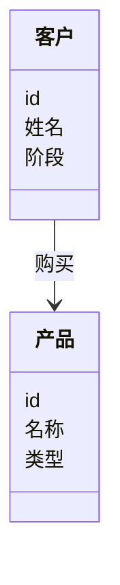
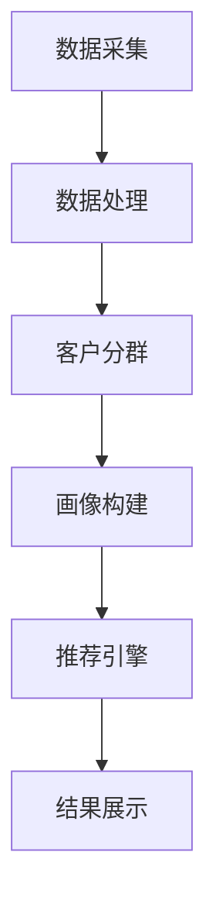
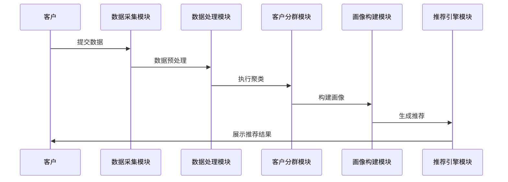

                 


# 金融产品客户生命周期管理平台

**关键词**：金融产品、客户生命周期、客户画像、系统架构、机器学习

**摘要**：本文详细探讨了金融产品客户生命周期管理平台的设计与实现。通过分析客户生命周期的各个阶段，结合机器学习算法，构建客户画像，优化产品推荐策略。文章还介绍了系统架构设计、接口设计和交互流程，并通过实战案例展示了平台的实际应用。

---

## 第1章：背景介绍

### 1.1 问题背景

#### 1.1.1 金融行业的数字化转型
随着金融科技的发展，金融机构亟需数字化转型，以应对市场竞争和客户需求的变化。

#### 1.1.2 客户生命周期管理的重要性
客户生命周期管理能够帮助金融机构精准识别客户阶段，优化服务策略。

#### 1.1.3 当前金融行业的问题与挑战
现有系统在客户细分、产品推荐和风险管理方面存在不足，难以满足个性化需求。

### 1.2 问题描述

#### 1.2.1 金融产品的复杂性
金融产品种类繁多，客户需求差异大，传统系统难以覆盖所有场景。

#### 1.2.2 客户需求的多样性
客户在不同生命周期阶段的需求差异显著，需要动态调整服务策略。

#### 1.2.3 现有系统的问题与不足
现有系统缺乏智能化手段，难以实现精准客户画像和个性化推荐。

### 1.3 问题解决

#### 1.3.1 引入客户生命周期管理平台的必要性
通过平台实现客户全生命周期管理，优化产品推荐和服务策略。

#### 1.3.2 平台的目标与核心功能
目标是实现客户精准画像和产品推荐，核心功能包括客户分群、画像构建和推荐引擎。

#### 1.3.3 平台的预期效果与价值
提升客户满意度和产品销售效率，降低运营成本，增强客户忠诚度。

### 1.4 边界与外延

#### 1.4.1 平台的边界
平台专注于客户生命周期管理，不涉及产品定价和风险控制。

#### 1.4.2 相关概念的外延
包括客户画像、推荐算法和系统架构。

#### 1.4.3 平台与其他系统的接口关系
平台需与CRM、营销系统和数据仓库等系统对接。

### 1.5 核心要素组成

#### 1.5.1 平台的核心功能模块
- 数据采集模块：收集客户数据。
- 数据处理模块：清洗和预处理数据。
- 客户分群模块：基于聚类算法划分客户群体。
- 画像构建模块：构建客户画像。
- 推荐引擎模块：生成产品推荐策略。

#### 1.5.2 各模块之间的关系
数据采集模块向数据处理模块输入数据，处理后数据流向客户分群模块，生成客户群体后用于画像构建和推荐引擎。

#### 1.5.3 平台的整体架构
采用分层架构，包括数据层、业务逻辑层和表现层，确保各模块协同工作。

---

## 第2章：核心概念与联系

### 2.1 核心概念原理

#### 2.1.1 客户生命周期的定义
客户从接触产品到最终流失的全过程。

#### 2.1.2 各阶段的特点与目标
- 开拓期：吸引新客户。
- 发展期：提升客户活跃度。
- 成熟期：增加客户粘性。
- 衰退期：减少客户流失。

#### 2.1.3 平台在各阶段的作用
- 开拓期：精准营销。
- 发展期：个性化服务。
- 成熟期：定制化产品。
- 衰退期：客户挽回。

### 2.2 核心概念属性特征对比

| 阶段   | 属性   | 特征                     |
|--------|--------|--------------------------|
| 开拓期 | 活跃度 | 低                       |
| 发展期 | 贡献度 | 逐步提升                 |
| 成熟期 | 稳定性 | 高                       |
| 衰退期 | 留存率 | 低                       |

### 2.3 ER实体关系图

```mermaid
er
actor 客户
actor 营销系统
actor 产品模块
actor 服务模块
```

---

## 第3章：算法原理讲解

### 3.1 客户画像构建算法

#### 3.1.1 聚类算法原理
聚类算法通过数据点的相似性将客户分为不同群体。

#### 3.1.2 聚类算法流程图



#### 3.1.3 聚类算法实现

```python
from sklearn.cluster import KMeans

# 数据预处理
X = data.drop('label', axis=1)
y = data['label']

# 模型训练
model = KMeans(n_clusters=3, random_state=0)
model.fit(X)

# 预测结果
labels = model.labels_
```

#### 3.1.4 聚类算法数学模型
$$ J = \sum_{i=1}^{k} \sum_{j=1}^{n_i} (x_j - c_i)^2 $$
其中，\( c_i \) 是第i个聚类中心，\( x_j \) 是属于该聚类的数据点。

---

## 第4章：系统分析与架构设计方案

### 4.1 问题场景介绍

#### 4.1.1 问题场景描述
客户数据分散，缺乏统一的客户视图，难以进行精准营销。

### 4.1.2 项目介绍
本项目旨在构建客户生命周期管理平台，优化产品推荐策略。

### 4.1.3 系统功能设计

#### 4.1.3.1 领域模型



#### 4.1.3.2 系统架构设计



#### 4.1.3.3 接口设计
- 数据接口：API接口用于数据采集和处理。
- 推荐接口：提供产品推荐结果。

#### 4.1.3.4 交互序列图



---

## 第5章：项目实战

### 5.1 环境安装

#### 5.1.1 Python环境安装
安装Python 3.8及以上版本，安装必要的库：scikit-learn、pandas、numpy。

#### 5.1.2 数据库安装
安装MySQL或MongoDB，用于存储客户数据。

### 5.2 系统核心实现

#### 5.2.1 数据采集模块实现

```python
import pandas as pd

def load_data():
    data = pd.read_csv('customer_data.csv')
    return data
```

#### 5.2.2 数据处理模块实现

```python
def preprocess(data):
    data = data.dropna()
    return data
```

#### 5.2.3 客户分群模块实现

```python
from sklearn.cluster import KMeans

def customer_segmentation(data):
    X = data[['age', 'income']]
    model = KMeans(n_clusters=3)
    model.fit(X)
    data['cluster'] = model.labels_
    return data
```

#### 5.2.4 画像构建模块实现

```python
def build_profile(data):
    profiles = data.groupby('cluster').mean()
    return profiles
```

#### 5.2.5 推荐引擎模块实现

```python
def recommend(profiles, customer_id):
    cluster = profiles.index[profiles['customer_id'] == customer_id][0]
    recommendations = profiles[profiles['cluster'] == cluster].sort_values('score', ascending=False).head(5)
    return recommendations
```

### 5.3 代码应用解读与分析

#### 5.3.1 数据采集模块解读
读取CSV文件中的客户数据，确保数据完整性。

#### 5.3.2 数据处理模块解读
删除缺失值，确保数据干净。

#### 5.3.3 客户分群模块解读
使用K-means算法将客户分为三个群体，便于后续分析。

#### 5.3.4 画像构建模块解读
根据聚类结果，生成客户画像，展示各群体的特征。

#### 5.3.5 推荐引擎模块解读
根据客户画像，生成个性化产品推荐。

### 5.4 实际案例分析

#### 5.4.1 数据准备
使用真实客户的交易数据，构建测试案例。

#### 5.4.2 代码实现
按照上述代码实现各模块功能，进行测试和验证。

#### 5.4.3 结果分析
分析推荐结果的有效性，优化推荐策略。

### 5.5 项目小结

#### 5.5.1 核心收获
掌握了客户分群和推荐算法的实现方法。

#### 5.5.2 实践经验
了解了系统架构设计和模块实现的流程。

#### 5.5.3 问题总结
在实际应用中，需要考虑数据质量和算法性能。

---

## 第6章：最佳实践

### 6.1 小结

#### 6.1.1 核心概念回顾
客户生命周期管理是优化金融产品服务的关键。

#### 6.1.2 算法与系统架构总结
聚类算法和系统架构设计是平台实现的核心。

### 6.2 注意事项

#### 6.2.1 数据隐私与安全
确保客户数据的隐私和安全，符合相关法律法规。

#### 6.2.2 系统性能优化
优化算法性能，提高推荐效率。

#### 6.2.3 系统可扩展性
设计灵活的架构，方便后续功能扩展。

### 6.3 拓展阅读

#### 6.3.1 推荐算法的优化
探索其他推荐算法，如协同过滤和深度学习模型。

#### 6.3.2 客户生命周期管理的深入研究
研究客户行为分析和预测模型，提升客户留存率。

---

## 作者

**作者**：AI天才研究院/AI Genius Institute & 禅与计算机程序设计艺术/Zen And The Art of Computer Programming

---

本文详细介绍了金融产品客户生命周期管理平台的设计与实现，涵盖了从背景分析到系统架构设计的全过程。通过实际案例和代码实现，展示了平台的应用价值和潜力。希望本文能为金融机构的技术人员提供有价值的参考。

