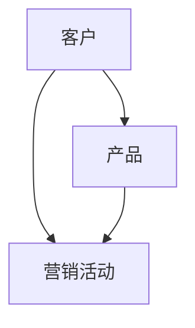
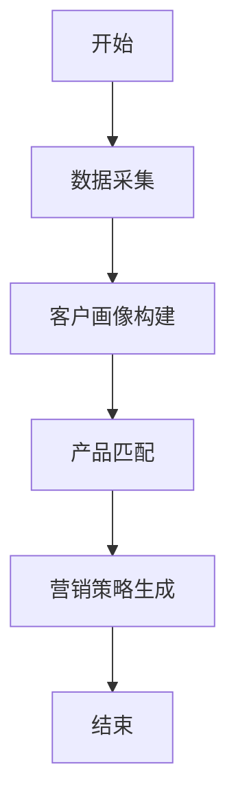
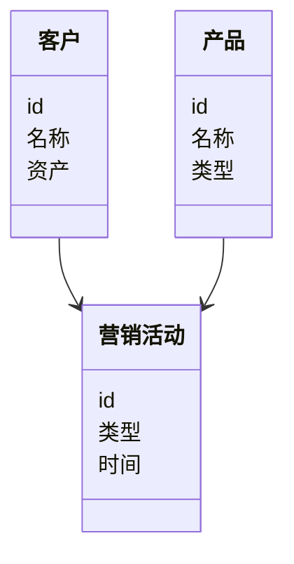
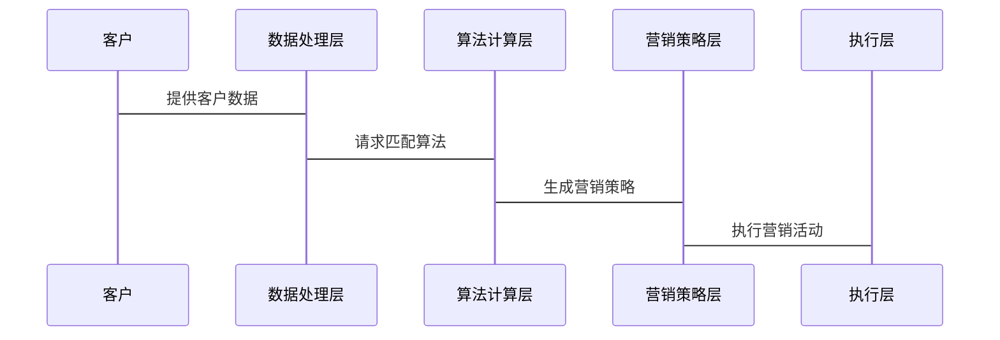

                 


# 金融产品客户精准营销引擎

## 关键词：客户精准营销、金融产品、大数据分析、机器学习、系统架构

## 摘要：金融产品客户精准营销引擎是一种基于大数据分析和机器学习的系统，用于通过客户画像、产品匹配和营销策略生成实现精准营销。本文详细介绍了该引擎的背景、核心概念、算法原理、系统架构、项目实战和最佳实践。

---

## 第一部分: 金融产品客户精准营销引擎概述

## 第1章: 问题背景与核心概念

### 1.1 问题背景

#### 1.1.1 传统营销模式的局限性
传统的金融营销模式通常依赖于经验丰富的营销人员进行产品推荐。然而，这种模式存在效率低下、覆盖面有限、难以大规模处理等问题，尤其是在面对海量客户和复杂的产品组合时，难以实现精准匹配。

#### 1.1.2 金融行业数字化转型的必然性
随着互联网和移动应用的普及，金融行业正经历着数字化转型。客户的行为模式和需求发生了显著变化，传统的营销方式已经无法满足现代客户的多样化需求。

#### 1.1.3 精准营销的市场需求
现代客户期望获得个性化的服务和产品推荐。精准营销能够通过数据分析和机器学习算法，识别客户的需求，提供量身定制的金融产品，从而提高客户满意度和忠诚度。

### 1.2 问题描述

#### 1.2.1 客户需求与产品匹配的难点
金融产品种类繁多，客户的需求多样，如何高效地匹配客户与产品是精准营销的核心挑战。

#### 1.2.2 营销效率低下的现状
传统的营销方式效率低下，难以快速响应市场变化和客户需求。

#### 1.2.3 数据孤岛与信息不透明的问题
金融行业存在数据孤岛，客户信息分散，难以整合和利用，导致信息不透明，影响精准营销的效果。

### 1.3 问题解决思路

#### 1.3.1 数据驱动的营销理念
通过收集和分析客户的交易数据、行为数据等，构建客户画像，实现精准的营销策略。

#### 1.3.2 精准营销的核心思路
利用大数据分析和机器学习算法，识别客户的需求，推荐合适的金融产品。

#### 1.3.3 技术赋能营销的实现路径
通过技术手段整合数据，构建客户画像，优化营销策略，提高营销效率。

### 1.4 边界与外延

#### 1.4.1 精准营销的边界
精准营销的边界包括客户数据的收集和处理、产品推荐算法的设计与实现、营销策略的生成与执行。

#### 1.4.2 相关领域的外延
精准营销与客户关系管理（CRM）、大数据分析、人工智能等领域密切相关。

#### 1.4.3 与其他技术的协同关系
精准营销引擎需要与数据存储、数据分析、机器学习等技术协同工作，形成完整的系统。

### 1.5 核心概念与结构

#### 1.5.1 核心概念的定义
精准营销引擎是一种基于数据驱动的系统，通过客户画像和产品匹配算法，生成个性化的营销策略。

#### 1.5.2 概念的属性特征对比
| 概念 | 属性 | 特征 |
|------|------|------|
| 客户画像 | 数据来源 | 交易数据、行为数据 |
|        | 数据维度 | 年龄、性别、收入、资产 |
| 产品匹配 | 算法类型 | 基于相似度的推荐、基于协同过滤的推荐 |
| 营销策略 | 输出形式 | 邮件、短信、APP推送 |

#### 1.5.3 核心要素的组成与关系
核心要素包括客户数据、产品数据、匹配算法、营销策略生成模块。客户数据和产品数据通过匹配算法生成推荐结果，推荐结果指导营销策略的执行。

---

## 第2章: 核心概念与联系

### 2.1 精准营销引擎的原理

#### 2.1.1 数据采集与处理
通过API或数据库获取客户的交易数据和行为数据，进行清洗和预处理。

#### 2.1.2 客户画像构建
基于处理后的数据，构建客户画像，识别客户的特征和需求。

#### 2.1.3 产品匹配算法
使用机器学习算法，如协同过滤、聚类分析等，匹配客户与最合适的金融产品。

#### 2.1.4 营销策略生成
根据匹配结果，生成个性化的营销策略，指导营销活动的执行。

### 2.2 核心概念的属性特征对比

| 概念 | 属性 | 特征 |
|------|------|------|
| 客户画像 | 数据来源 | 交易数据、行为数据 |
|        | 数据维度 | 年龄、性别、收入、资产 |
| 产品匹配 | 算法类型 | 基于相似度的推荐、基于协同过滤的推荐 |
| 营销策略 | 输出形式 | 邮件、短信、APP推送 |

### 2.3 ER实体关系图



---

## 第3章: 算法原理与数学模型

### 3.1 算法原理

#### 3.1.1 算法流程



### 3.2 数学模型

#### 3.2.1 概率匹配模型

$$ P(产品|客户) = \frac{P(客户|产品)P(产品)}{P(客户)} $$

#### 3.2.2 优化目标函数

$$ \text{目标函数} = \sum_{i=1}^{n} (y_i - f(x_i))^2 $$

#### 3.2.3 示例：客户A与产品B的匹配概率计算

$$ P(B|A) = 0.85 $$

### 3.3 算法实现

#### 3.3.1 Python代码实现

```python
def calculate_probability(customer, product):
    # 示例代码
    return 0.85
```

---

## 第4章: 系统分析与架构设计

### 4.1 问题场景分析

#### 4.1.1 系统目标
构建一个高效的金融产品客户精准营销引擎，实现客户与产品的精准匹配。

#### 4.1.2 项目范围
涵盖数据采集、客户画像构建、产品匹配算法设计、营销策略生成等模块。

### 4.2 系统功能设计

#### 4.2.1 领域模型



### 4.3 系统架构设计

#### 4.3.1 系统架构图


### 4.4 系统接口设计

#### 4.4.1 API接口

| 接口名称 | 输入 | 输出 |
|----------|------|------|
| get_customer_profile | customer_id | 客户画像 |
| match_product | customer_id | 推荐产品列表 |

### 4.5 系统交互

#### 4.5.1 序列图



---

## 第5章: 项目实战

### 5.1 环境安装

#### 5.1.1 安装Python和相关库
安装Python和pandas、numpy、scikit-learn等库。

### 5.2 系统核心实现

#### 5.2.1 核心代码实现

```python
import pandas as pd
from sklearn.metrics.pairwise import cosine_similarity

# 示例数据
customers = pd.DataFrame({
    'id': [1, 2, 3],
    'age': [30, 45, 25],
    'income': [60000, 80000, 50000]
})

products = pd.DataFrame({
    'id': [1, 2, 3],
    'name': ['储蓄', '基金', '保险'],
    'type': ['存款', '理财', '保障']
})

# 计算相似度
customer_vector = customers[['age', 'income']].values
product_vector = products[['id', 'type']].values

similarity_matrix = cosine_similarity(customer_vector, product_vector)
```

#### 5.2.2 代码解读与分析
通过计算客户和产品的相似度，生成推荐列表。

### 5.3 实际案例分析

#### 5.3.1 案例背景
假设客户A，30岁，收入60000元，匹配合适的金融产品。

#### 5.3.2 分析与结论
客户A的相似度最高的产品是储蓄，其次是基金，最后是保险。

### 5.4 项目小结

---

## 第6章: 最佳实践

### 6.1 小结
精准营销引擎通过数据驱动和算法优化，实现客户与产品的精准匹配，提高营销效率和客户满意度。

### 6.2 注意事项
- 数据隐私和安全的保护
- 算法的可解释性
- 系统的可扩展性

### 6.3 拓展阅读
推荐阅读《数据驱动的营销策略》和《机器学习在金融中的应用》。

---

## 作者：AI天才研究院/AI Genius Institute & 禅与计算机程序设计艺术 /Zen And The Art of Computer Programming

---

以上是《金融产品客户精准营销引擎》的完整内容，涵盖从背景到实现的详细步骤，旨在为读者提供一个全面的技术指南。

