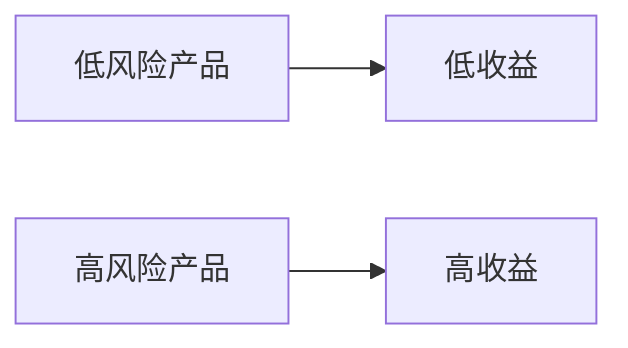

                 


# 《金融产品客户精准营销推荐引擎》

## 关键词：金融营销、精准营销、推荐引擎、客户画像、机器学习、深度学习

## 摘要：
金融产品客户精准营销推荐引擎是一种基于人工智能和大数据分析的技术，旨在通过客户画像、产品画像和推荐算法的结合，实现对客户的精准识别和个性化产品推荐。本文将详细探讨这一引擎的核心概念、算法原理、系统架构设计以及实际应用案例，帮助读者深入了解如何利用技术手段提升金融营销的效果和效率。

---

## 目录

1. [背景与概述](#背景与概述)
2. [客户画像与特征分析](#客户画像与特征分析)
3. [金融产品画像与匹配规则](#金融产品画像与匹配规则)
4. [推荐算法与模型评估](#推荐算法与模型评估)
5. [系统架构设计与实现](#系统架构设计与实现)
6. [项目实战与案例分析](#项目实战与案例分析)
7. [最佳实践与未来展望](#最佳实践与未来展望)
8. [附录](#附录)

---

## 1. 背景与概述

### 1.1 金融营销的现状与挑战

#### 1.1.1 传统金融营销模式的局限性
传统的金融营销模式依赖于人工推荐和通用的产品策略，存在以下问题：
- **客户覆盖不足**：无法精准识别潜在客户，导致资源浪费。
- **推荐效率低下**：基于经验的推荐难以满足多样化的客户需求。
- **数据利用不足**：传统方法难以充分利用客户数据和市场数据。

#### 1.1.2 精准营销的必要性与优势
精准营销通过分析客户行为、偏好和风险承受能力，实现个性化推荐，具有以下优势：
- **提高转化率**：通过精准匹配客户需求，提升销售效率。
- **降低营销成本**：减少无效推荐，优化资源分配。
- **提升客户满意度**：通过个性化服务增强客户黏性。

#### 1.1.3 金融行业数字化转型的背景
随着大数据、人工智能等技术的发展，金融行业正在加速数字化转型，推荐引擎成为提升客户体验和业务效率的关键技术。

---

## 2. 客户画像与特征分析

### 2.1 客户画像的构建方法

#### 2.1.1 基于数据挖掘的客户画像
通过数据分析工具（如Python的pandas库）提取客户特征，构建客户画像。例如，使用聚类分析将客户分为不同类别。


#### 2.1.2 基于机器学习的客户画像
利用机器学习算法（如随机森林）对客户进行分类，识别高价值客户。


#### 2.1.3 客户画像的可视化与分析
使用工具如Tableau或Power BI对客户画像进行可视化分析，便于业务人员理解。

---

## 3. 金融产品画像与匹配规则

### 3.1 金融产品的分类与特征

#### 3.1.1 金融产品的分类标准
金融产品可以按风险、收益、期限等维度进行分类。例如：
- **低风险产品**：如货币基金、债券。
- **中风险产品**：如股票、混合型基金。
- **高风险产品**：如股票型基金、期货。

#### 3.1.2 不同金融产品的风险与收益特征
通过绘制收益-风险曲线（如图），可以直观了解不同产品的风险收益比。



#### 3.1.3 产品画像的构建与应用
通过构建产品画像，可以实现产品与客户的精准匹配。例如，将高净值客户匹配到高风险高收益产品。

---

## 4. 推荐算法与模型评估

### 4.1 常见推荐算法的原理与应用

#### 4.1.1 协同过滤算法
协同过滤是一种基于用户相似性推荐产品的算法。例如，基于用户的购买记录进行推荐。


#### 4.1.2 基于内容的推荐算法
基于产品本身的特征进行推荐。例如，根据产品的收益率和风险等级推荐相似产品。

#### 4.1.3 基于机器学习的推荐算法
利用机器学习模型（如协同过滤）进行推荐。例如，使用矩阵分解技术进行降维。

---

## 5. 系统架构设计与实现

### 5.1 系统功能模块设计

#### 5.1.1 数据采集模块
从数据库中采集客户行为数据、交易数据等。

#### 5.1.2 数据处理模块
对数据进行清洗、特征提取和转换。

#### 5.1.3 推荐算法模块
实现多种推荐算法（如协同过滤、聚类分析）。

#### 5.1.4 推荐结果模块
将推荐结果返回给前端展示。

---

## 6. 项目实战与案例分析

### 6.1 环境搭建

#### 6.1.1 安装必要的库
```bash
pip install pandas numpy scikit-learn
```

### 6.2 核心代码实现

#### 6.2.1 协同过滤算法实现

```python
from sklearn.metrics.pairwise import cosine_similarity

# 数据预处理
customers = pd.DataFrame(...)
products = pd.DataFrame(...)

# 计算相似度
similarity_matrix = cosine_similarity(customers)
```

---

## 7. 最佳实践与未来展望

### 7.1 小结
精准营销推荐引擎通过客户画像、产品画像和推荐算法的结合，实现了金融产品的精准推荐，显著提升了营销效率和客户满意度。

### 7.2 注意事项
- 数据隐私保护：确保客户数据的安全性。
- 模型优化：定期更新模型，适应市场变化。
- 多维度分析：结合多种算法提升推荐准确性。

---

## 附录

### 附录A: 参考文献
- [1] 《机器学习实战》
- [2] 《推荐系统实战》

### 附录B: 推荐系统工具
- 数据分析工具：Python、R
- 可视化工具：Tableau、Power BI
- 开发框架：Flask、Django

---

作者：AI天才研究院/AI Genius Institute & 禅与计算机程序设计艺术 /Zen And The Art of Computer Programming

