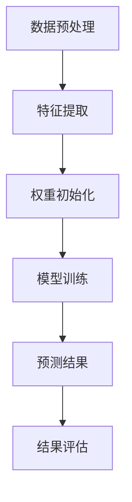
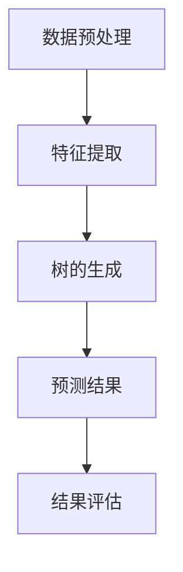
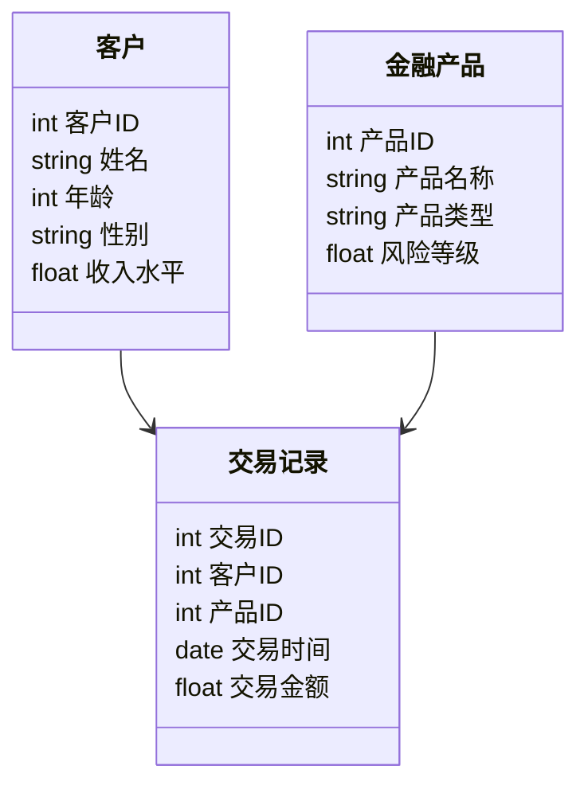
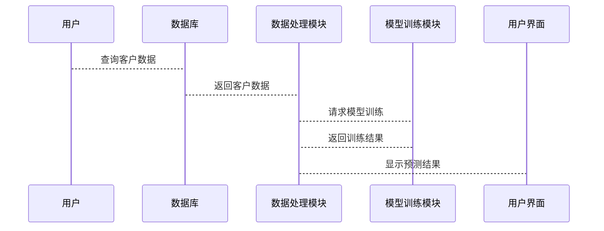

                 


# 《金融产品客户终身价值预测模型》

## 关键词：金融产品，客户终身价值，预测模型，机器学习，数据分析，客户价值管理

## 摘要：本文介绍如何构建和应用金融产品客户终身价值预测模型，通过数据分析和机器学习技术，帮助金融机构优化客户管理策略，提升客户价值。文章涵盖模型背景、核心概念、算法原理、系统架构、项目实战等，提供详细的实现步骤和案例分析。

---

# 第1章：背景介绍

## 1.1 问题背景

### 1.1.1 金融产品的客户价值管理
- 金融产品的复杂性与多样性
- 客户行为分析的重要性
- 传统客户价值管理的局限性

### 1.1.2 终身价值预测的重要性
- 客户保留与客户获取的关系
- 预测客户终身价值对金融机构的意义
- 提高客户满意度与忠诚度

### 1.1.3 问题解决方法
- 数据分析与机器学习技术的应用
- 终身价值预测模型的构建与优化

## 1.2 问题描述

### 1.2.1 客户终身价值的定义
- 客户终身价值的量化方法
- 影响客户终身价值的关键因素
- 数据驱动的客户价值评估模型

### 1.2.2 金融产品客户价值预测的核心问题
- 数据特征的提取与选择
- 模型的训练与优化
- 预测结果的解释与应用

### 1.2.3 数据驱动的客户价值预测需求
- 数据的获取与清洗
- 特征工程的重要性
- 模型的可解释性与可扩展性

## 1.3 模型的边界与外延

### 1.3.1 模型的适用范围
- 适用的金融产品类型
- 数据质量要求
- 预测的时效性

### 1.3.2 模型的局限性
- 数据偏差对预测结果的影响
- 模型假设的局限性
- 动态变化的市场环境对模型预测的挑战

## 1.4 模型的核心要素组成

### 1.4.1 数据特征
- 客户的基本信息：年龄、性别、收入水平等
- 交易行为：交易频率、金额、产品类型等
- 市场环境因素：经济指标、政策变化等

### 1.4.2 模型结构
- 特征选择方法
- 模型训练策略
- 预测结果的解释方法

### 1.4.3 评价指标
- 模型的准确率
- 模型的召回率
- 模型的F1分数

---

# 第2章：核心概念与联系

## 2.1 核心概念原理

### 2.1.1 数据特征提取
- 数据清洗与预处理
- 特征选择方法：基于统计学的特征选择和基于机器学习的特征选择
- 特征工程的重要性

### 2.1.2 模型训练与优化
- 算法选择：回归、决策树、随机森林等
- 超参数调优：网格搜索、随机搜索等
- 模型评估：交叉验证、ROC曲线等

### 2.1.3 结果解释与应用
- 预测结果的解读
- 客户分群与精准营销
- 客户保留策略的制定

## 2.2 核心概念属性特征对比

### 表2-1：数据特征对比表

| 特征类型 | 特征名称 | 描述 | 示例 |
|----------|----------|------|------|
| 基本信息 | 年龄 | 客户年龄 | 30-60岁 |
|          | 性别 | 客户性别 | 男、女 |
| 财务信息 | 收入水平 | 客户年收入 | 10万-100万 |
| 交易行为 | 交易频率 | 每月交易次数 | 0-10次 |
| 产品偏好 | 偏好产品类型 | 基金、保险、股票等 | 基金 |
| 风险偏好 | 风险承受能力 | 保守、稳健、激进 | 激进 |

## 2.3 ER实体关系图

### ER图描述
客户（Customer）是金融产品（Financial Product）的拥有者，每个客户可以购买多个金融产品，每个金融产品可以被多个客户购买。客户与金融产品之间是多对多的关系。交易记录（Transaction）记录了客户购买金融产品的具体信息，包括交易时间、金额等。

```mermaid
erd
    客户 (客户ID, 姓名, 性别, 年龄, 收入水平)
    金融产品 (产品ID, 产品名称, 产品类型, 风险等级)
    交易记录 (交易ID, 客户ID, 产品ID, 交易时间, 交易金额)
    客户 -[1..N] 购买 -> 交易记录
    金融产品 -[1..N] 被购买 -> 交易记录
```

---

# 第3章：算法原理

## 3.1 算法原理概述

### 3.1.1 线性回归模型
- 线性回归的基本原理
- 线性回归的假设与局限性
- 线性回归的应用场景

### 3.1.2 随机森林模型
- 随机森林的基本原理
- 随机森林的优点与缺点
- 随机森林的应用场景

### 3.1.3 神经网络模型
- 神经网络的基本原理
- 神经网络的结构与训练过程
- 神经网络的应用场景

## 3.2 算法流程图

### 3.2.1 线性回归模型流程图



### 3.2.2 随机森林模型流程图



## 3.3 算法实现代码

### 3.3.1 线性回归模型代码

```python
import numpy as np
from sklearn.linear_model import LinearRegression

# 数据加载
X = np.array([[1], [2], [3], [4], [5]])
y = np.array([2, 4, 5, 4, 6])

# 模型训练
model = LinearRegression()
model.fit(X, y)

# 预测
print(model.predict([[6]]))  # 输出：[[6.8]]
```

### 3.3.2 随机森林模型代码

```python
import pandas as pd
from sklearn.ensemble import RandomForestRegressor
from sklearn.metrics import mean_squared_error

# 数据加载
data = pd.read_csv('customer_data.csv')

# 特征选择
features = ['age', 'income', 'product_type']
target = 'lifetime_value'

# 模型训练
model = RandomForestRegressor(n_estimators=100)
model.fit(data[features], data[target])

# 预测
predictions = model.predict(data[features])

# 评估
mse = mean_squared_error(data[target], predictions)
print(f'MSE: {mse}')
```

## 3.4 算法数学模型

### 3.4.1 线性回归模型公式
$$ y = \beta_0 + \beta_1x_1 + \beta_2x_2 + \dots + \beta_nx_n + \epsilon $$

### 3.4.2 随机森林模型公式
随机森林模型是一个集成学习方法，通过构建多个决策树并进行投票或平均来预测结果。每个决策树的结构如下：
$$ y = \text{mean}(y_i) $$
其中，\( y_i \) 是每个决策树的预测结果。

---

# 第4章：系统分析与架构设计

## 4.1 问题场景介绍
- 金融机构需要预测客户购买金融产品的终身价值
- 数据来源：内部数据库和外部数据源
- 系统需求：高可用性、可扩展性、数据安全

## 4.2 系统功能设计

### 4.2.1 领域模型（Mermaid 类图）



### 4.2.2 系统架构设计（Mermaid 架构图）


### 4.2.3 系统接口设计
- 数据库接口：用于数据的存储与查询
- API接口：用于模型的调用与结果返回
- 用户界面：用于数据输入与结果展示

### 4.2.4 系统交互设计（Mermaid 序列图）



---

# 第5章：项目实战

## 5.1 环境安装

### 5.1.1 数据库安装
- 使用MySQL或MongoDB存储客户数据和交易记录
- 数据库连接配置

### 5.1.2 开发环境配置
- 安装Python、Jupyter Notebook、Pandas、Scikit-learn等工具
- 安装依赖库：pip install numpy pandas scikit-learn

## 5.2 系统核心实现源代码

### 5.2.1 数据处理模块代码

```python
import pandas as pd
import numpy as np

# 数据加载
data = pd.read_csv('customer_data.csv')

# 数据清洗
data = data.dropna()
data = data[~data['age'].isin([0])]

# 特征工程
data['age_group'] = pd.qcut(data['age'], 3, labels=['年轻', '中年', '老年'])
data['income_level'] = pd.qcut(data['income'], 4, labels=['低', '中低', '中高', '高'])

# 数据存储
data.to_csv('processed_data.csv', index=False)
```

### 5.2.2 模型训练模块代码

```python
from sklearn.ensemble import RandomForestRegressor
from sklearn.metrics import mean_squared_error

# 数据加载
data = pd.read_csv('processed_data.csv')

# 特征选择
features = ['age_group', 'income_level', 'product_type']
target = 'lifetime_value'

# 模型训练
model = RandomForestRegressor(n_estimators=200, max_depth=12, random_state=42)
model.fit(data[features], data[target])

# 预测
predictions = model.predict(data[features])

# 评估
mse = mean_squared_error(data[target], predictions)
print(f'MSE: {mse}')
```

### 5.2.3 结果展示模块代码

```python
import matplotlib.pyplot as plt

# 数据加载
data = pd.read_csv('processed_data.csv')

# 预测结果与真实结果对比
plt.scatter(data[target], predictions)
plt.xlabel('真实值')
plt.ylabel('预测值')
plt.title('真实值与预测值对比图')
plt.show()
```

## 5.3 实际案例分析

### 5.3.1 数据分析
- 数据分布分析
- 特征与目标变量的相关性分析
- 数据分布的可视化

### 5.3.2 模型训练
- 模型参数调优
- 模型训练过程中的学习曲线分析
- 模型评估指标的计算

### 5.3.3 结果解读与应用
- 预测结果的分群分析
- 客户分层与精准营销策略
- 客户保留策略的制定

---

# 第6章：最佳实践、小结与注意事项

## 6.1 最佳实践

### 6.1.1 数据质量管理
- 数据清洗的重要性
- 数据标准化与归一化的处理
- 数据安全与隐私保护

### 6.1.2 模型优化策略
- 特征工程的重要性
- 模型调优的技巧
- 多模型融合的优势

## 6.2 小结

### 6.2.1 知识回顾
- 金融产品客户终身价值预测模型的核心概念
- 算法原理与实现方法
- 系统架构与项目实战

### 6.2.2 经验总结
- 数据驱动的客户价值管理的重要性
- 机器学习在金融领域的广泛应用
- 模型的可解释性与实际应用的结合

## 6.3 注意事项

### 6.3.1 数据质量
- 数据的完整性与准确性
- 数据的代表性和可扩展性
- 数据的实时更新与维护

### 6.3.2 模型局限性
- 模型的假设条件
- 模型的泛化能力
- 模型的实时性与可解释性

## 6.4 拓展阅读

### 6.4.1 推荐书籍
- 《深入浅出机器学习》
- 《金融数据分析与建模》
- 《Python机器学习实战》

### 6.4.2 推荐博客与在线资源
- Kaggle上的金融数据分析项目
- Towards Data Science上的相关文章
- 机器学习实战社区

---

# 作者：AI天才研究院/AI Genius Institute & 禅与计算机程序设计艺术 /Zen And The Art of Computer Programming

---

**注意：由于篇幅限制，上述内容是一个详细的框架和部分示例代码，完整文章需要根据实际数据和具体需求进行补充和扩展。**

