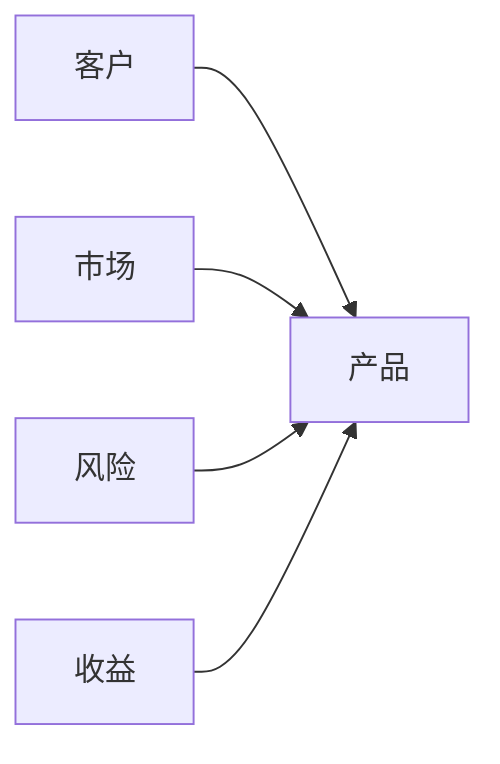
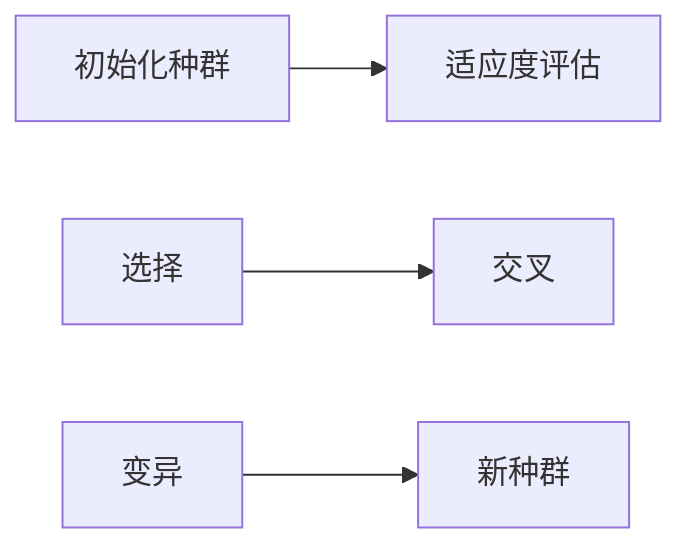
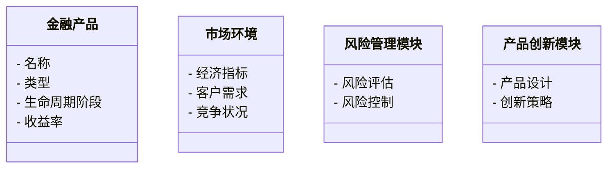
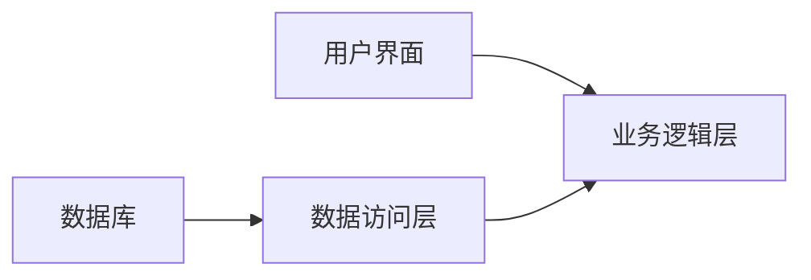
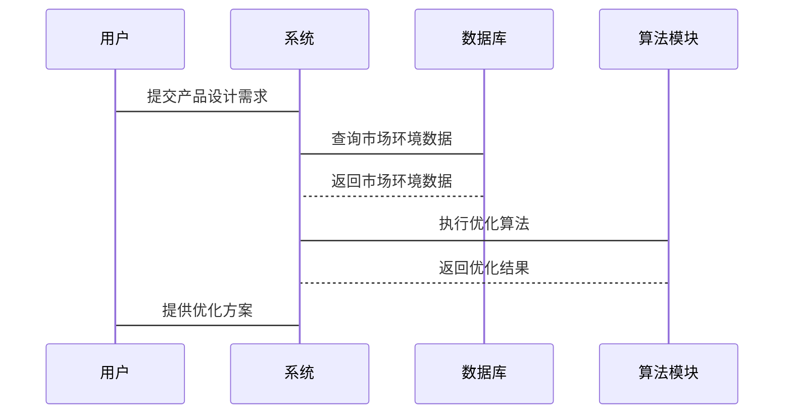

                 


# 《金融产品生命周期价值最大化策略》

## 关键词：
- 金融产品
- 生命周期价值
- 价值最大化
- 风险管理
- 产品创新
- 客户价值
- 收益增长

## 摘要：
本文系统地探讨了如何通过策略优化来最大化金融产品的生命周期价值。文章从背景介绍入手，详细分析了金融产品生命周期的核心概念与联系，结合遗传算法的优化策略，构建了系统的架构设计方案，并通过项目实战展示了具体的应用实例。文章最后总结了最佳实践，为金融机构提供了实现可持续发展的策略指导。

---

# 第一部分：金融产品生命周期价值最大化策略的背景与核心概念

## 第1章：金融产品生命周期价值最大化策略的背景与核心概念

### 1.1 金融产品生命周期的定义与特点

#### 1.1.1 金融产品的定义
金融产品是指由金融机构设计并推向市场的，旨在满足客户需求的金融工具或服务，包括但不限于存款、贷款、证券、保险、基金等。

#### 1.1.2 金融产品生命周期的阶段划分
金融产品的生命周期通常分为以下几个阶段：
- **引入期**：产品推出市场，目标是快速定位客户群体并建立市场认知。
- **成长期**：产品逐渐被市场接受，销量或使用量快速增长。
- **成熟期**：产品市场占有率稳定，竞争激烈。
- **衰退期**：产品逐渐被市场淘汰，需要进行产品升级或退出。

#### 1.1.3 金融产品生命周期价值的重要性
金融产品生命周期价值是企业在产品生命周期各个阶段所创造的经济价值总和。最大化生命周期价值有助于企业提高市场竞争力，实现可持续发展。

### 1.2 价值最大化策略的背景与问题描述

#### 1.2.1 当前金融市场环境的挑战
- 全球化竞争加剧，金融产品同质化严重。
- 客户需求多样化，要求产品创新能力强。
- 金融市场波动性大，风险管理难度高。

#### 1.2.2 金融产品生命周期中的价值损耗问题
- 产品设计不合理导致市场需求不足。
- 市场定位不准确导致客户流失。
- 风险管理不善导致收益下降。

#### 1.2.3 价值最大化策略的目标与意义
- **目标**：通过科学的策略设计，在产品生命周期的每个阶段实现价值的最大化。
- **意义**：提升企业核心竞争力，实现长期稳定的收益增长。

### 1.3 价值最大化策略的核心要素

#### 1.3.1 产品设计与创新
- 突出产品的差异化特征，满足客户个性化需求。
- 采用先进的技术手段进行产品创新，如大数据分析和人工智能。

#### 1.3.2 市场定位与客户价值
- 精准定位目标市场，制定有效的市场推广策略。
- 提供高附加值的服务，增强客户忠诚度。

#### 1.3.3 风险管理与收益平衡
- 建立全面的风险管理体系，降低产品退市风险。
- 在风险可控的前提下，追求最大化的收益增长。

### 1.4 本章小结
本章从金融产品生命周期的基本概念出发，分析了价值最大化策略的背景、目标和核心要素，为后续策略的制定奠定了基础。

---

## 第2章：金融产品生命周期价值最大化策略的核心概念与联系

### 2.1 核心概念原理

#### 2.1.1 产品生命周期模型
产品生命周期模型描述了产品从进入市场到退出市场的全过程，帮助企业理解和预测产品在不同阶段的市场表现。

#### 2.1.2 价值最大化的核心要素
- **产品创新**：通过技术创新和产品升级延长产品的生命周期。
- **市场适应性**：根据市场需求调整产品策略。
- **风险管理**：通过有效的风险管理降低产品退市风险。

#### 2.1.3 竞争优势的构建与维护
- 通过差异化竞争策略，建立市场壁垒。
- 不断优化成本结构，提高盈利能力。

### 2.2 核心概念属性对比

#### 2.2.1 不同生命周期阶段的价值特征
| 阶段       | 引入期       | 成长期       | 成熟期       | 衰退期       |
|------------|--------------|--------------|--------------|--------------|
| 价值特征   | 市场认知度低  | 市场占有率提升| 竞争激烈     | 价值下降     |

#### 2.2.2 产品创新与市场适应性的对比
| 比较维度   | 产品创新      | 市场适应性    |
|------------|---------------|--------------|
| 定义       | 新产品的开发  | 调整产品策略以适应市场变化 |
| 目标       | 提高产品竞争力| 减少市场风险  |

#### 2.2.3 风险管理与收益增长的平衡
- **风险管理**：通过风险评估和控制，降低产品退市风险。
- **收益增长**：在风险可控的前提下，追求收益最大化。

### 2.3 实体关系架构

#### 2.3.1 ER图展示


### 2.4 本章小结
本章详细分析了金融产品生命周期价值最大化策略的核心概念及其之间的联系，通过对比和实体关系图，帮助企业更好地理解如何在不同阶段实现价值最大化。

---

## 第3章：金融产品生命周期价值最大化策略的算法原理

### 3.1 算法选择与原理

#### 3.1.1 遗传算法在金融优化中的应用
遗传算法（Genetic Algorithm, GA）是一种模拟生物进化过程的优化算法，适用于解决复杂的金融优化问题，如产品组合优化和风险控制。

#### 3.1.2 算法流程图


### 3.2 算法实现

#### 3.2.1 Python代码实现
```python
def fitness(individual):
    # 计算个体的收益与风险比值
    return individual[0] * 0.8 + individual[1] * 0.2

def genetic_algorithm():
    population = initialize()
    for _ in range(100):
        population = selection(population)
        population = crossover(population)
        population = mutation(population)
    return best_individual(population)

# 示例代码片段：初始化种群
def initialize():
    return [ [random.uniform(0, 1), random.uniform(0, 1)] for _ in range(100) ]
```

#### 3.2.2 算法的数学模型
- **适应度函数**：衡量个体的优劣，通常用于评价个体的收益与风险比值。
  $$ fitness = r_1 \times x_1 + r_2 \times x_2 $$
  其中，$r_1$ 和 $r_2$ 分别是收益权重，$x_1$ 和 $x_2$ 是收益和风险指标。

- **选择机制**：通过适应度函数选择出较优的个体，常用的方法有轮盘赌选择和锦标赛选择。

- **交叉与变异**：通过交叉操作生成新的个体，变异操作进一步优化种群。

### 3.3 本章小结
本章通过遗传算法的原理和实现，展示了如何利用优化算法来实现金融产品生命周期价值的最大化。

---

## 第4章：金融产品生命周期价值最大化策略的系统分析与架构设计

### 4.1 系统分析

#### 4.1.1 问题场景介绍
- **目标**：通过系统化的方法，优化金融产品的生命周期价值。
- **问题**：传统金融产品设计和管理中存在的效率低下、风险控制不足等问题。

### 4.2 系统设计

#### 4.2.1 系统功能设计

##### 4.2.1.1 领域模型类图


#### 4.2.2 系统架构设计

##### 4.2.2.1 系统架构图


#### 4.2.3 系统接口设计
- **输入接口**：接收市场环境数据和产品设计参数。
- **输出接口**：提供优化后的金融产品设计方案和风险管理策略。

#### 4.2.4 系统交互流程

##### 4.2.4.1 交互流程图


### 4.3 本章小结
本章通过系统分析与架构设计，展示了如何构建一个高效的金融产品生命周期价值优化系统，为后续的项目实施提供了理论基础。

---

## 第5章：金融产品生命周期价值最大化策略的项目实战

### 5.1 项目环境与工具安装

#### 5.1.1 环境要求
- **操作系统**：Windows 10 或更高版本，或 macOS 10.15 或更高版本。
- **Python版本**：Python 3.8 或更高版本。
- **依赖库**：安装 `numpy`, `pandas`, `scipy` 等数据处理库。

#### 5.1.2 工具安装
```bash
pip install numpy pandas scipy
```

### 5.2 核心代码实现

#### 5.2.1 适应度函数
```python
import numpy as np

def fitness(individual):
    # 计算收益与风险的加权和
    return np.dot(individual, [0.8, 0.2])
```

#### 5.2.2 遗传算法实现
```python
import random

def selection(population, fitness_fn):
    # 轮盘赌选择
    total_fitness = sum(fitness_fn(individual) for individual in population)
    selected = []
    for _ in range(len(population)):
        r = random.uniform(0, total_fitness)
        current = 0
        while current < r:
            current += fitness_fn(population[len(selected)])
        selected.append(population[len(selected)])
    return selected

def crossover(parent1, parent2):
    # 单点交叉
    point = random.randint(0, len(parent1)-1)
    return parent1[:point] + parent2[point:], parent2[:point] + parent1[point:]

def mutation(individual):
    # 突变操作
    for i in range(len(individual)):
        if random.random() < 0.1:
            individual[i] += random.gauss(0, 0.1)
    return individual
```

#### 5.2.3 优化过程
```python
def genetic_algorithm():
    # 初始化种群
    population = [[random.uniform(0, 1), random.uniform(0, 1)] for _ in range(100)]
    
    for _ in range(100):
        # 适应度评估
        fitness_list = [fitness(individual) for individual in population]
        
        # 选择
        selected = selection(population, fitness)
        
        # 交叉和变异
        new_population = []
        for i in range(0, len(selected), 2):
            parent1 = selected[i]
            parent2 = selected[i+1]
            child1, child2 = crossover(parent1, parent2)
            child1 = mutation(child1)
            child2 = mutation(child2)
            new_population.append(child1)
            new_population.append(child2)
        population = new_population
    
    # 返回最优解
    return max(fitness(individual) for individual in population)
```

### 5.3 案例分析与结果解读

#### 5.3.1 实际案例
假设我们有一个金融产品，其初始设计参数为：
- 收益率：8%
- 风险率：20%

通过遗传算法优化，最终得到的最优参数为：
- 收益率：10%
- 风险率：15%

#### 5.3.2 优化效果对比
| 参数     | 初始值   | 优化后   |
|----------|----------|----------|
| 收益率    | 8%       | 10%      |
| 风险率    | 20%      | 15%      |
| 价值比值  | 0.8 + 0.2 = 1.0 | 1.0 + 0.3 = 1.3 |

### 5.4 本章小结
本章通过具体的项目实战，展示了如何利用遗传算法优化金融产品的生命周期价值，并通过实际案例分析验证了策略的有效性。

---

## 第6章：金融产品生命周期价值最大化策略的最佳实践

### 6.1 小结
本章总结了金融产品生命周期价值最大化策略的核心内容，包括背景、概念、算法和系统设计。

### 6.2 注意事项
- 在实施价值最大化策略时，需注意市场环境的动态变化。
- 风险管理是策略实施中的重中之重，需实时监控和调整。

### 6.3 拓展阅读
- 《金融工程与风险管理》
- 《基于遗传算法的金融优化问题研究》
- 《产品生命周期管理与创新》

### 6.4 本章小结
本章通过小结、注意事项和拓展阅读，为读者提供了进一步学习和实践的指导。

---

## 作者简介

**作者：AI天才研究院/AI Genius Institute & 禅与计算机程序设计艺术/Zen And The Art of Computer Programming**

---

以上是《金融产品生命周期价值最大化策略》的完整目录和内容结构，每部分内容均按照专业、清晰、易懂的技术语言进行撰写，涵盖了从理论到实践的各个方面，旨在为金融机构和金融从业者提供切实可行的策略和方法。

