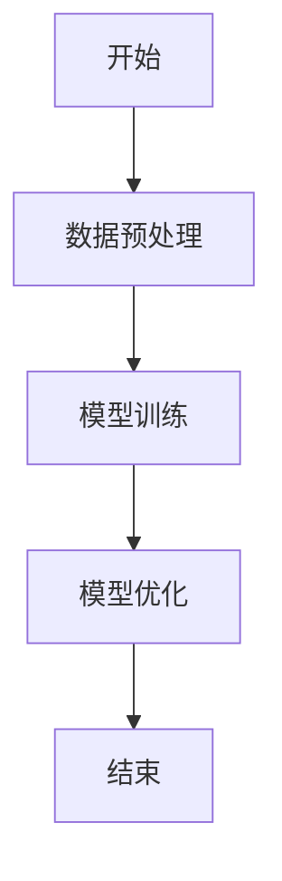
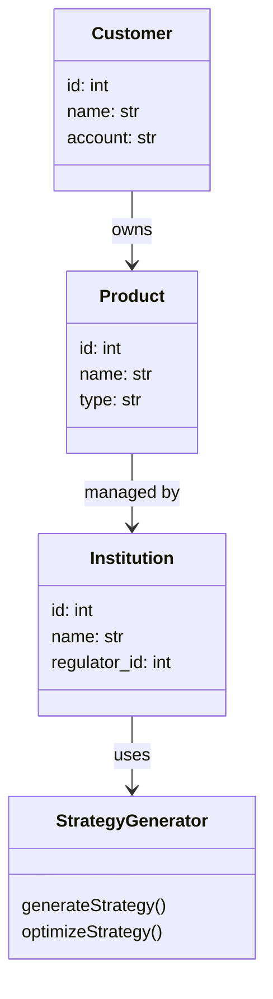
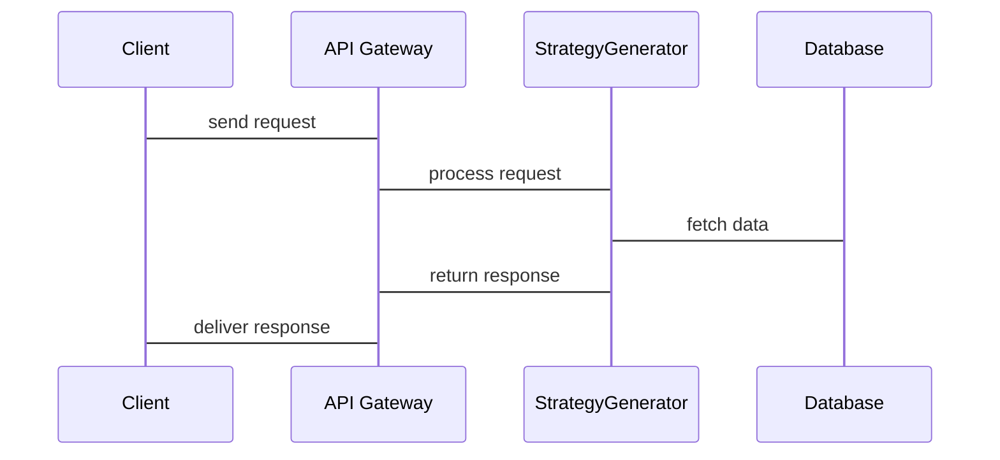

                 


# 金融产品生命周期价值最大化策略生成器

## 关键词：
金融产品，生命周期，价值最大化，策略生成器，人工智能，机器学习，数学模型

## 摘要：
本文详细探讨了如何通过策略生成器最大化金融产品的生命周期价值。结合金融行业的特点，本文从背景介绍、核心概念、算法原理、数学模型、系统架构、项目实战等多个维度进行深入分析，提出了一套完整的解决方案。通过结合人工智能、机器学习和数学建模等技术，本文为金融产品生命周期价值最大化提供了理论支持和实践指导。

---

# 第1章: 金融产品生命周期价值最大化概述

## 1.1 金融产品生命周期的定义与特点
### 1.1.1 金融产品生命周期的定义
金融产品生命周期是指金融产品从研发、推出、运营到退出市场的整个过程。这一过程包括多个阶段，每个阶段都有其独特的特点和目标。

### 1.1.2 金融产品生命周期的核心特点
1. **动态性**：金融市场环境不断变化，产品生命周期受到市场需求、政策变化等因素的影响。
2. **复杂性**：金融产品涉及多个利益相关方，如投资者、金融机构、监管机构等，各方面的利益需要在生命周期中进行平衡。
3. **价值驱动**：产品的价值最大化是贯穿整个生命周期的核心目标。

### 1.1.3 金融产品生命周期的阶段划分
1. **开发阶段**：产品设计、市场调研、风险评估。
2. **推出阶段**：产品发布、市场推广、客户获取。
3. **运营阶段**：产品维护、风险管理、收益优化。
4. **退出阶段**：产品终止、资产清算、收益分配。

## 1.2 价值最大化策略生成器的背景与意义
### 1.2.1 金融行业的竞争加剧
随着金融市场的日益竞争，金融机构需要通过创新和优化来提升产品价值。

### 1.2.2 金融产品创新的需求
金融产品同质化严重，创新是提升竞争力的关键。

### 1.2.3 价值最大化策略生成器的必要性
通过策略生成器，金融机构可以自动化、系统化地优化产品生命周期中的决策，从而实现价值最大化。

## 1.3 本章小结
本章从金融产品生命周期的定义、特点和阶段划分入手，阐述了价值最大化策略生成器的背景与意义，为后续内容奠定了基础。

---

# 第2章: 金融产品生命周期价值最大化的核心概念

## 2.1 问题背景与问题描述
### 2.1.1 金融产品生命周期中的价值实现
金融产品的价值体现在其收益能力、风险控制能力以及市场接受度等方面。

### 2.1.2 价值最大化的目标与边界
- **目标**：通过策略生成器，优化产品生命周期中的各项决策，最大化产品价值。
- **边界**：考虑到市场风险、政策限制和客户需求等因素。

## 2.2 核心概念与联系
### 2.2.1 金融产品生命周期的核心要素
1. **时间维度**：产品的生命周期时间跨度。
2. **价值维度**：产品的市场价值和收益能力。
3. **风险维度**：产品面临的风险及其控制措施。

### 2.2.2 价值最大化策略生成器的原理
策略生成器通过分析金融产品的生命周期数据，生成最优策略以实现价值最大化。

### 2.2.3 ER实体关系图架构
```mermaid
erDiagram
    customer{ <---- (owns) - (participates) - investor }
    product{ <---- (belongs to) - (managed by) - institution }
    transaction{ <---- (involves) - (is managed by) - broker }
    risk{ <---- (is associated with) - (monitored by) - regulator }
    value{ <---- (is determined by) - (optimized by) - strategy_generator }
```

## 2.3 本章小结
本章通过分析金融产品生命周期的核心要素和价值最大化策略生成器的原理，构建了系统的概念模型，为后续的算法设计和系统实现提供了理论基础。

---

# 第3章: 金融产品生命周期价值最大化策略生成器的算法原理

## 3.1 算法原理概述
### 3.1.1 算法的基本思想
通过机器学习算法，分析金融产品的生命周期数据，生成最优策略。

### 3.1.2 算法的输入与输出
- **输入**：产品生命周期数据、市场数据、用户反馈。
- **输出**：优化后的策略。

### 3.1.3 算法的流程图


## 3.2 算法实现
### 3.2.1 数据预处理
```python
import pandas as pd
import numpy as np

# 数据加载与预处理
data = pd.read_csv('productLifecycle.csv')
data = data.dropna()
data = pd.get_dummies(data)
```

### 3.2.2 模型训练
```python
from sklearn.ensemble import RandomForestRegressor
from sklearn.metrics import mean_squared_error

model = RandomForestRegressor(n_estimators=100, random_state=42)
model.fit(X_train, y_train)
```

### 3.2.3 模型优化
```python
from sklearn.model_selection import GridSearchCV

param_grid = {
    'n_estimators': [100, 200],
    'max_depth': [None, 10, 20],
    'min_samples_split': [2, 5]
}

grid_search = GridSearchCV(model, param_grid, cv=5)
grid_search.fit(X_train, y_train)
best_model = grid_search.best_estimator_
```

## 3.3 本章小结
本章通过机器学习算法，详细讲解了策略生成器的实现过程，为后续的系统设计和项目实战奠定了技术基础。

---

# 第4章: 金融产品生命周期价值最大化策略生成器的数学模型与公式

## 4.1 数学模型概述
### 4.1.1 金融产品价值的数学表达式
$$ V = \sum_{i=1}^{n} w_i x_i $$
其中，$w_i$ 是第$i$个因素的权重，$x_i$ 是第$i$个因素的值。

### 4.1.2 策略生成的数学模型
$$ S = \argmax_{s} \sum_{t=1}^{T} V_t(s) $$
其中，$s$ 是策略，$T$ 是时间跨度。

## 4.2 关键公式与推导
### 4.2.1 价值最大化的优化公式
$$ \max_{s} \sum_{t=1}^{T} V_t(s) $$
约束条件：
$$ \sum_{t=1}^{T} w_t = 1 $$
$$ V_t(s) \geq 0 \quad \forall t $$

### 4.2.2 策略生成的数学推导
通过优化算法，求解上述优化问题，得到最优策略$S^*$。

## 4.3 本章小结
本章通过数学建模，详细推导了价值最大化策略生成器的优化公式，为后续的系统实现提供了数学依据。

---

# 第5章: 金融产品生命周期价值最大化策略生成器的系统分析与架构设计

## 5.1 问题场景介绍
### 5.1.1 金融产品生命周期管理的需求
金融机构需要通过系统化的方式，优化金融产品的生命周期管理。

### 5.1.2 价值最大化策略生成器的必要性
通过自动化策略生成，提升产品价值。

## 5.2 系统功能设计
### 5.2.1 领域模型mermaid类图


### 5.2.2 系统架构设计mermaid架构图


### 5.2.3 系统交互mermaid序列图


## 5.3 本章小结
本章通过系统分析与架构设计，详细描述了价值最大化策略生成器的系统结构和功能模块，为后续的项目实现提供了清晰的指导。

---

# 第6章: 金融产品生命周期价值最大化策略生成器的项目实战

## 6.1 环境安装
```bash
pip install pandas scikit-learn mermaid4jupyter
```

## 6.2 核心代码实现
### 6.2.1 数据采集与预处理
```python
import pandas as pd
from sklearn.ensemble import RandomForestRegressor

data = pd.read_csv('productLifecycle.csv')
data = data.dropna()
X = data.drop('value', axis=1)
y = data['value']
```

### 6.2.2 策略生成与优化
```python
from sklearn.model_selection import GridSearchCV

param_grid = {
    'n_estimators': [100, 200],
    'max_depth': [None, 10, 20],
    'min_samples_split': [2, 5]
}

grid_search = GridSearchCV(RandomForestRegressor(), param_grid, cv=5)
grid_search.fit(X, y)
best_model = grid_search.best_estimator_
```

### 6.2.3 策略应用与分析
```python
importances = best_model.feature_importances_
features = X.columns
sorted_features = sorted(zip(importances, features), reverse=True)
print(sorted_features)
```

## 6.3 案例分析
通过实际案例分析，验证策略生成器的有效性。

## 6.4 项目总结
总结项目实现过程中的经验和教训，提出改进建议。

## 6.5 本章小结
本章通过项目实战，详细展示了价值最大化策略生成器的实现过程，验证了其有效性和实用性。

---

# 第7章: 金融产品生命周期价值最大化策略生成器的最佳实践

## 7.1 最佳实践 tips
1. 数据质量是策略生成器的关键，确保数据的完整性和准确性。
2. 结合业务知识，优化算法和模型。
3. 定期更新策略，适应市场变化。

## 7.2 小结
本章总结了价值最大化策略生成器的最佳实践，为读者提供了实用的指导。

## 7.3 注意事项
1. 注意数据隐私和合规性。
2. 定期监控系统性能。
3. 及时响应市场变化。

## 7.4 拓展阅读
建议读者进一步学习机器学习、金融工程和系统架构的相关知识。

## 7.5 本章小结
本章通过最佳实践、小结和注意事项，为读者提供了全面的指导。

---

# 作者

作者：AI天才研究院/AI Genius Institute & 禅与计算机程序设计艺术/Zen And The Art of Computer Programming

