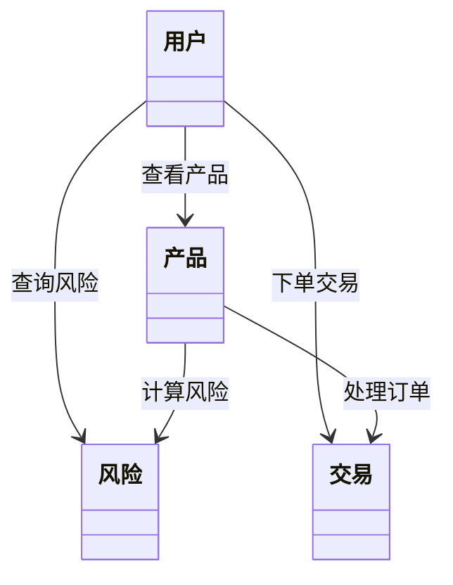

                 


# 《金融产品生命周期管理》

**关键词：** 金融产品生命周期管理，风险管理，金融产品分类，产品开发，产品运营，系统架构设计

**摘要：**  
本文详细探讨了金融产品生命周期管理的核心概念、流程与方法，分析了金融产品的分类与特点，以及在不同生命周期阶段的风险管理策略。通过系统化的分析与设计，结合实际案例，本文提出了如何通过合理的开发与运营策略来优化金融产品的生命周期管理。文章内容涵盖从产品开发到终止的各个阶段，结合数学模型与算法原理，为读者提供了全面而深入的技术见解。

---

## 第1章: 金融产品生命周期管理概述

### 1.1 金融产品生命周期管理的核心概念

#### 1.1.1 金融产品生命周期的定义

金融产品生命周期是指金融产品从研发、推出、运营到终止的全过程。这一过程涉及多个阶段，每个阶段都有其特定的目标和管理策略。金融产品生命周期管理的目标是通过科学的管理和优化，确保产品在市场中的成功推出和持续运营。

#### 1.1.2 金融产品生命周期管理的背景与意义

随着金融市场的快速发展，金融产品的种类和复杂性不断增加。有效的生命周期管理可以帮助金融机构更好地应对市场变化，降低风险，提高产品的市场竞争力。特别是在当前数字化和智能化的背景下，金融产品生命周期管理需要结合先进的技术手段，如大数据、人工智能等，以实现更高效的管理。

#### 1.1.3 金融产品生命周期管理的边界与外延

金融产品生命周期管理的边界包括产品从研发到终止的全过程，但不包括与产品无关的外部因素，如宏观经济政策的变化。其外延则涵盖了与产品生命周期相关的风险管理、合规管理、客户管理等多个方面。

### 1.2 金融产品生命周期管理的核心要素

#### 1.2.1 产品开发阶段

产品开发阶段是金融产品生命周期的起点，主要包括需求分析、产品设计和开发测试。这一阶段的核心目标是确保产品符合市场需求，并具备良好的可操作性和风险可控性。

#### 1.2.2 产品运营阶段

产品运营阶段是金融产品生命周期的核心部分，主要包括产品的市场推广、客户维护和产品监控。这一阶段的目标是通过持续的优化和改进，确保产品的市场表现和客户满意度。

#### 1.2.3 产品终止阶段

产品终止阶段是金融产品生命周期的终点，主要包括产品的退市和资产清算。这一阶段的目标是确保产品的平稳退出，避免对客户和机构造成不必要的损失。

### 1.3 金融产品生命周期管理的流程与方法

#### 1.3.1 生命周期各阶段的管理目标

- **开发阶段：** 确保产品设计符合市场需求，降低开发风险。
- **运营阶段：** 通过持续优化提升产品市场表现和客户满意度。
- **终止阶段：** 确保产品平稳退市，避免负面影响。

#### 1.3.2 各阶段之间的衔接与协调

金融产品生命周期的各阶段之间需要紧密衔接，确保信息的流畅传递和资源的合理分配。例如，开发阶段的需求分析结果需要为运营阶段的市场推广提供依据，而运营阶段的市场反馈也需要为终止阶段的退市决策提供参考。

#### 1.3.3 金融产品生命周期管理的工具与技术

- **工具：** 包括项目管理工具（如JIRA）、数据分析工具（如Python）、风险管理工具等。
- **技术：** 包括大数据分析、人工智能、区块链等新兴技术在金融产品管理中的应用。

### 1.4 本章小结

本章从核心概念、核心要素和管理流程三个方面详细介绍了金融产品生命周期管理的基本框架。通过对各阶段目标和管理策略的分析，为后续章节的深入探讨奠定了基础。

---

## 第2章: 金融产品分类与特点

### 2.1 金融产品的基本分类

#### 2.1.1 股票、债券、基金等传统金融产品

- **股票：** 代表公司所有权，具有较高的风险和收益潜力。
- **债券：** 债务工具，具有较低的风险和稳定的收益。
- **基金：** 通过集合资金进行投资，具有分散风险和专业管理的特点。

#### 2.1.2 衍生品、结构性金融产品

- **衍生品：** 包括期货、期权等，具有高杠杆和复杂性。
- **结构性金融产品：** 通过将不同金融工具组合，实现特定风险收益目标。

#### 2.1.3 创新性金融产品

- **创新型金融产品：** 包括基于区块链的数字货币、智能合约等，具有较高的创新性和不确定性。

### 2.2 各类金融产品的特点与风险

#### 2.2.1 股票、债券的风险特征

- **股票：** 高风险高收益，受市场波动影响较大。
- **债券：** 低风险低收益，受利率和信用风险影响。

#### 2.2.2 基金产品的流动性与收益性

- **基金产品：** 流动性较高，收益取决于管理能力和市场表现。

#### 2.2.3 衍生品的复杂性与杠杆效应

- **衍生品：** 具有高杠杆效应，风险和收益均较高。

### 2.3 金融产品分类与生命周期管理的关系

#### 2.3.1 不同产品类别在生命周期中的管理重点

- **传统金融产品：** 管理重点在于合规性和稳定性。
- **衍生品和结构性产品：** 管理重点在于风险控制和复杂性应对。
- **创新型产品：** 管理重点在于创新性和技术实现。

#### 2.3.2 产品特性对生命周期管理策略的影响

产品特性如复杂性、流动性等直接影响其生命周期管理策略的选择和实施。例如，高复杂性的产品需要更加复杂的开发和风险管理工具。

### 2.4 本章小结

本章通过对金融产品的分类和特点的分析，探讨了不同产品类别在生命周期管理中的不同策略和挑战。这为后续章节的深入分析奠定了基础。

---

## 第3章: 风险管理与金融产品生命周期

### 3.1 风险管理的核心概念

#### 3.1.1 风险的定义与分类

- **风险定义：** 风险是指在一定条件下，某种事件发生的不确定性及其可能带来的损失。
- **风险分类：** 包括市场风险、信用风险、流动性风险和操作风险等。

#### 3.1.2 风险管理的目标与方法

- **目标：** 最大化收益，最小化损失。
- **方法：** 包括风险识别、风险评估、风险控制和风险应对。

### 3.2 金融产品生命周期中的风险类型

#### 3.2.1 市场风险

- **定义：** 由于市场波动导致的资产价值损失。
- **影响：** 主要影响股票、基金等市场相关产品。

#### 3.2.2 信用风险

- **定义：** 由于债务人违约导致的损失。
- **影响：** 主要影响债券、贷款等信用类金融产品。

#### 3.2.3 流动性风险

- **定义：** 无法及时以合理价格变现资产的风险。
- **影响：** 主要影响债券、基金等流动性要求较高的产品。

#### 3.2.4 操作风险

- **定义：** 由于操作失误或系统故障导致的损失。
- **影响：** 影响所有金融产品的正常运作。

### 3.3 风险评估与管理策略

#### 3.3.1 风险评估方法

- **定量分析：** 使用数学模型（如VaR、CVaR）评估风险。
- **定性分析：** 结合专家经验进行风险判断。

#### 3.3.2 不同生命周期阶段的风险管理策略

- **开发阶段：** 着重于产品设计中的风险控制。
- **运营阶段：** 着重于市场波动中的风险应对。
- **终止阶段：** 着重于退市过程中的风险防范。

### 3.4 本章小结

本章分析了金融产品生命周期中各类风险的特点和影响，并提出了相应的风险管理策略。通过科学的风险管理，可以有效降低金融产品的风险，提高其市场竞争力。

---

## 第4章: 金融产品开发与设计

### 4.1 产品开发的基本流程

#### 4.1.1 需求分析

- **目标：** 确定产品的市场定位和功能需求。
- **方法：** 通过市场调研和客户需求分析确定产品方向。

#### 4.1.2 产品设计

- **目标：** 设计出符合市场需求的产品方案。
- **方法：** 使用领域模型（如Mermaid类图）进行产品架构设计。

#### 4.1.3 开发与测试

- **目标：** 实现产品功能并确保其稳定性和安全性。
- **方法：** 使用敏捷开发模式，结合自动化测试工具进行功能验证。

### 4.2 产品设计的核心要素

#### 4.2.1 产品目标

- **目标：** 确定产品的核心功能和市场定位。
- **示例：** 设计一只专注于长期成长的股票基金。

#### 4.2.2 产品结构

- **结构：** 包括产品功能模块和数据流设计。
- **工具：** 使用Mermaid流程图进行系统架构设计。

#### 4.2.3 产品功能

- **功能：** 包括产品认购、赎回、收益分配等功能。
- **技术实现：** 使用Python编写自动化交易脚本。

### 4.3 开发过程中的风险管理

#### 4.3.1 风险识别

- **方法：** 通过需求分析和设计评审识别潜在风险。
- **示例：** 发现某功能模块存在高风险，及时进行风险评估。

#### 4.3.2 风险控制

- **措施：** 通过代码审查、压力测试等手段降低开发风险。
- **工具：** 使用静态代码分析工具（如SonarQube）进行风险控制。

#### 4.3.3 风险应对

- **策略：** 制定风险应对计划，包括风险规避、转移和缓解。

### 4.4 本章小结

本章详细介绍了金融产品开发的基本流程和设计要素，并强调了风险管理在开发过程中的重要性。通过科学的设计和有效的风险管理，可以确保产品的顺利开发和推出。

---

## 第5章: 产品运营与维护

### 5.1 运营管理的核心任务

#### 5.1.1 产品监控

- **目标：** 监测产品的市场表现和客户反馈。
- **方法：** 使用大数据分析工具（如Python的Pandas库）进行数据挖掘和分析。

#### 5.1.2 客户服务

- **目标：** 提供优质的客户服务，提升客户满意度。
- **方法：** 建立客户反馈机制，及时处理客户问题。

#### 5.1.3 数据分析

- **目标：** 通过数据分析优化产品运营策略。
- **方法：** 使用机器学习算法（如XGBoost）进行预测和分析。

### 5.2 运营过程

#### 5.2.1 产品监控

- **监控指标：** 包括产品收益、客户留存率、市场波动等。
- **工具：** 使用实时监控工具（如Prometheus）进行数据可视化。

#### 5.2.2 客户服务

- **服务渠道：** 包括在线客服、电话客服和邮件客服。
- **服务流程：** 建立高效的客户响应机制。

#### 5.2.3 数据分析

- **数据分析模型：** 使用时间序列分析（如ARIMA）预测市场趋势。
- **数据可视化：** 使用图表工具（如Matplotlib）进行数据展示。

### 5.3 产品优化与创新

#### 5.3.1 产品优化

- **优化方向：** 根据市场反馈优化产品功能和用户体验。
- **方法：** 使用A/B测试（如Google Optimize）验证优化效果。

#### 5.3.2 产品创新

- **创新方向：** 结合新兴技术（如区块链）开发创新型金融产品。
- **案例：** 开发基于智能合约的自动化交易产品。

### 5.4 本章小结

本章从产品监控、客户服务和数据分析三个方面详细介绍了金融产品的运营过程，并提出了通过优化和创新提升产品竞争力的策略。

---

## 第6章: 金融产品生命周期的系统架构设计

### 6.1 系统架构设计概述

#### 6.1.1 问题场景介绍

- **场景描述：** 需要设计一个支持多种金融产品的生命周期管理的系统。
- **目标：** 实现产品的全生命周期管理，包括开发、运营和终止阶段。

#### 6.1.2 项目介绍

- **项目目标：** 开发一个智能化的金融产品生命周期管理系统。
- **项目范围：** 包括产品开发、运营和终止的全过程。

### 6.2 系统功能设计

#### 6.2.1 领域模型

- **领域模型：** 使用Mermaid类图描述系统的功能模块和交互关系。



#### 6.2.2 系统架构设计

- **架构设计：** 使用分层架构，包括表现层、业务逻辑层和数据访问层。


### 6.3 系统接口设计

#### 6.3.1 系统接口设计

- **接口描述：** 包括用户登录、产品查询、风险评估等接口。

#### 6.3.2 接口交互设计

- **交互流程：** 用户登录 → 查询产品 → 评估风险 → 下单交易。

### 6.4 本章小结

本章通过系统架构设计和接口设计，提出了一个支持金融产品生命周期管理的系统架构。通过分层设计和模块化开发，可以实现系统的高效管理和扩展。

---

## 第7章: 项目实战

### 7.1 环境安装

#### 7.1.1 安装Python

- **安装方法：** 使用Anaconda或PyCharm进行安装。
- **版本要求：** Python 3.8或以上版本。

#### 7.1.2 安装相关库

- **库列表：** NumPy、Pandas、Matplotlib、Scikit-learn。

### 7.2 核心实现源代码

#### 7.2.1 风险评估代码

```python
import numpy as np
import pandas as pd
from sklearn.ensemble import RandomForestRegressor

# 数据加载
data = pd.read_csv('risk_data.csv')

# 特征选择
features = data[['volatility', 'market_value', 'liquidity']]
target = data['risk_score']

# 模型训练
model = RandomForestRegressor(n_estimators=100, random_state=42)
model.fit(features, target)

# 预测风险
new_data = np.array([[0.2, 100, 0.8]])
predicted_risk = model.predict(new_data)
print(f"Predicted risk score: {predicted_risk[0]}")
```

#### 7.2.2 产品开发流程

```python
def product_development(product_name):
    # 需求分析
    print(f"Analyzing requirements for {product_name}")
    # 产品设计
    print(f"Designing {product_name}")
    # 开发测试
    print(f"Developing and testing {product_name}")
    return product_name

# 示例
product = product_development("New Fund")
print(f"Product developed: {product}")
```

### 7.3 代码应用解读与分析

- **风险评估代码：** 使用随机森林回归模型进行风险评估，通过特征工程和模型训练实现风险预测。
- **产品开发流程代码：** 通过函数封装产品开发流程，包括需求分析、产品设计和开发测试。

### 7.4 实际案例分析

#### 7.4.1 案例分析

- **案例背景：** 某基金公司开发一只创新型股票基金。
- **分析步骤：** 通过市场调研、风险评估和产品设计，确保产品的市场竞争力。

#### 7.4.2 案例小结

通过实际案例分析，展示了如何将理论应用于实践，确保金融产品的顺利开发和推出。

### 7.5 本章小结

本章通过项目实战，详细介绍了金融产品生命周期管理系统的开发过程，包括环境安装、代码实现和案例分析。通过实际操作，读者可以更好地理解和掌握相关技术。

---

## 第8章: 最佳实践与小结

### 8.1 最佳实践

#### 8.1.1 风险管理

- **建议：** 在产品开发和运营过程中，始终将风险管理放在首位。
- **工具推荐：** 使用先进的风险管理工具（如RiskMetrics）进行风险评估。

#### 8.1.2 系统架构设计

- **建议：** 采用模块化设计，确保系统的可扩展性和可维护性。
- **工具推荐：** 使用Docker进行容器化部署，确保系统的高效运行。

#### 8.1.3 数据分析

- **建议：** 利用大数据和人工智能技术进行数据分析，提高决策的科学性。
- **工具推荐：** 使用Jupyter Notebook进行数据可视化和分析。

### 8.2 小结

金融产品生命周期管理是一项复杂而重要的任务，涉及多个阶段和多个方面的管理。通过科学的系统设计和有效的风险管理，可以确保金融产品的成功开发和运营。

### 8.3 注意事项

- **数据隐私：** 在产品开发和运营过程中，必须注意客户数据的隐私保护。
- **合规性：** 确保产品设计和运营符合相关法律法规要求。
- **技术更新：** 随着技术的发展，及时更新系统和工具，确保产品的竞争力。

### 8.4 拓展阅读

- **推荐书籍：** 《金融工程》、《风险管理与金融机构》。
- **推荐文章：** 《大数据在金融产品管理中的应用》。

---

## 作者信息

**作者：** AI天才研究院/AI Genius Institute & 禅与计算机程序设计艺术/Zen And The Art of Computer Programming

---

**备注：** 以上内容为《金融产品生命周期管理》的技术博客文章目录大纲，涵盖从概述到实战的详细内容，结合理论与实践，为读者提供了全面而深入的指导。

