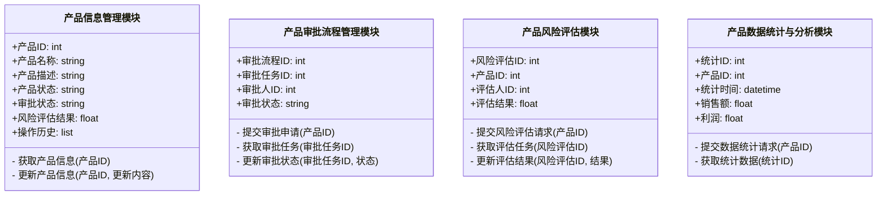

                 


# 金融产品生命周期管理平台

## 关键词：金融产品、生命周期管理、技术实现、系统架构、项目实战

## 摘要：  
金融产品生命周期管理平台旨在通过数字化手段，实现金融产品的全生命周期管理，从产品设计、审批、上线到退市的每一个阶段进行智能化管理。本文将从平台的背景、核心概念、算法原理、系统架构、项目实战等多个方面展开，详细分析该平台的技术实现和应用场景，帮助读者全面理解金融产品生命周期管理的核心要点。

---

## 第1章: 金融产品生命周期管理平台背景介绍

### 1.1 金融产品的生命周期概述  
金融产品的生命周期是指从产品设计、审批、上线、运营到退市的整个过程。  
- **产品设计阶段**：涉及需求分析、风险评估、功能设计等。  
- **产品审批阶段**：需要通过合规性审查、风险评估等流程。  
- **产品上线阶段**：涉及产品发布、市场推广等。  
- **产品运营阶段**：包括产品监控、风险预警、客户反馈处理等。  
- **产品退市阶段**：根据市场反馈或监管要求，逐步退出市场。  

传统金融产品管理方式存在效率低、风险高、成本高等问题，亟需通过技术手段实现数字化管理。

### 1.2 金融产品生命周期管理平台的定义与特点  
- **定义**：金融产品生命周期管理平台是一种基于数字化技术的管理工具，旨在对金融产品的全生命周期进行自动化、智能化管理。  
- **特点**：  
  - **模块化管理**：将产品生命周期分解为多个模块，每个模块独立管理。  
  - **自动化流程**：通过工作流引擎实现审批、风险评估等流程的自动化。  
  - **实时监控**：对产品运行状态进行实时监控，及时发现并处理问题。  
  - **数据驱动决策**：利用数据分析技术，为产品设计、审批、运营提供数据支持。  

### 1.3 金融产品生命周期管理平台的背景与应用前景  
- **背景**：随着金融行业的数字化转型，传统的人工管理模式已无法满足市场需求，亟需引入技术手段提升效率。  
- **应用前景**：  
  - 提高金融产品的审批效率，缩短产品上市时间。  
  - 降低产品运营成本，优化资源配置。  
  - 提升风险控制能力，保障金融市场的稳定性。  

---

## 第2章: 核心概念与联系  

### 2.1 核心概念的定义与对比  
- **产品设计**：涉及需求分析、功能设计、风险评估。  
- **产品审批**：包括合规性审查、风险评估、审批流程。  
- **产品运营**：涉及产品监控、客户反馈、数据统计。  
- **产品退市**：根据市场反馈或监管要求，逐步退出市场。  

通过对比表格展示核心概念的属性特征：

| 概念       | 属性特征               |
|------------|------------------------|
| 产品设计   | 需求分析、风险评估     |
| 产品审批   | 合规性审查、审批流程   |
| 产品运营   | 实时监控、数据统计     |
| 产品退市   | 市场反馈、监管要求     |

### 2.2 平台的核心模块  
- **产品信息管理模块**：负责产品信息的录入、存储和查询。  
- **产品审批流程管理模块**：实现审批流程的自动化管理。  
- **产品风险评估模块**：通过算法模型评估产品风险。  
- **产品数据统计与分析模块**：对产品运行数据进行统计和分析。  

### 2.3 实体关系图  
通过Mermaid图展示实体关系：

```mermaid
erDiagram
    actor 用户
    actor 管理员
    actor 产品审批人
    actor 风险评估师
    actor 数据分析师
    participant 产品信息管理模块
    participant 产品审批流程管理模块
    participant 产品风险评估模块
    participant 产品数据统计与分析模块
    用户 --> 产品信息管理模块: 提交产品信息
    产品信息管理模块 --> 产品审批流程管理模块: 提交审批申请
    产品审批流程管理模块 --> 产品审批人: 审批产品信息
    产品审批流程管理模块 --> 产品信息管理模块: 审批结果反馈
    产品信息管理模块 --> 产品风险评估模块: 提交风险评估请求
    产品风险评估模块 --> 风险评估师: 进行风险评估
    产品风险评估模块 --> 产品信息管理模块: 返回评估结果
    产品信息管理模块 --> 产品数据统计与分析模块: 提交数据统计请求
    产品数据统计与分析模块 --> 数据分析师: 进行数据分析
    产品数据统计与分析模块 --> 产品信息管理模块: 返回分析结果
```

---

## 第3章: 算法原理  

### 3.1 工作流引擎  
工作流引擎用于实现审批流程的自动化管理。  
- **流程定义**：通过BPMN（业务流程建模与执行规范）定义审批流程。  
- **流程执行**：根据定义的流程，自动分配任务并通知相关人员。  

### 3.2 规则引擎  
规则引擎用于实现风险评估和审批规则的动态管理。  
- **规则定义**：通过规则引擎定义风险评估规则。  
- **规则执行**：根据规则引擎定义的规则，自动评估产品风险。  

### 3.3 算法实现  
以风险评估为例，使用Python实现简单的风险评估算法：

```python
def risk_assessment(sales, profit, risk_factors):
    # 销售额、利润、风险因素
    score = 0
    # 销售额对风险的影响
    score += (sales / 1000) * 0.3
    # 利润对风险的影响
    score += (profit / 1000) * 0.3
    # 风险因素对风险的影响
    score += sum(risk_factors) * 0.4
    return score

# 示例
sales = 5000
profit = 2000
risk_factors = [2, 3, 1]
print(risk_assessment(sales, profit, risk_factors))
```

---

## 第4章: 系统分析与架构设计  

### 4.1 系统功能设计  
- **领域模型**：通过Mermaid图展示领域模型的类图：



### 4.2 系统架构设计  
- **分层架构**：将系统分为数据层、业务逻辑层和表现层。  
- **模块交互**：通过API接口实现模块之间的交互。

---

## 第5章: 项目实战  

### 5.1 环境安装  
- 安装Python、Django框架、PostgreSQL数据库。  

### 5.2 核心代码实现  
- 产品信息管理模块的实现：

```python
from django.db import models

class Product(models.Model):
    product_id = models.AutoField(primary_key=True)
    product_name = models.CharField(max_length=100)
    product_description = models.TextField()
    product_status = models.CharField(max_length=20)
    approval_status = models.CharField(max_length=20)
    risk_assessment_result = models.FloatField()
    operation_history = models.TextField()

    def __str__(self):
        return self.product_name
```

### 5.3 代码解读与分析  
- 数据库设计：通过Django模型定义产品信息表结构。  
- 交互流程：用户提交产品信息，系统自动触发审批流程。

### 5.4 实际案例分析  
以某理财产品为例，展示平台在实际中的应用。  

---

## 第6章: 最佳实践、小结、注意事项、拓展阅读  

### 6.1 最佳实践  
- 定期更新规则和流程，确保平台适应市场需求。  
- 加强数据安全和隐私保护，确保用户信息的安全性。  

### 6.2 小结  
金融产品生命周期管理平台通过数字化手段，实现金融产品的全生命周期管理，提升效率、降低成本、降低风险。  

### 6.3 注意事项  
- 确保系统的稳定性和安全性。  
- 定期进行系统维护和优化。  

### 6.4 拓展阅读  
- 推荐阅读《金融产品风险管理》、《数字化转型与金融创新》等书籍。

---

## 作者：AI天才研究院 & 禅与计算机程序设计艺术

---

通过以上内容，您可以逐步构建一个完整的金融产品生命周期管理平台，实现金融产品的智能化管理。

