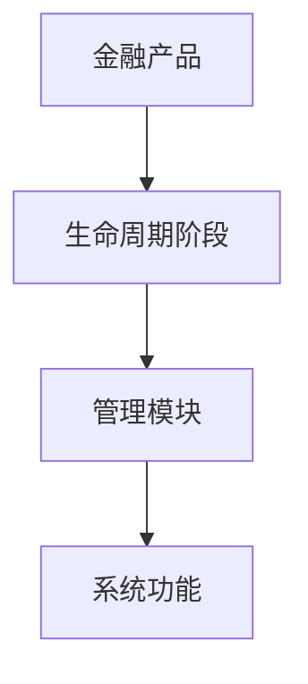
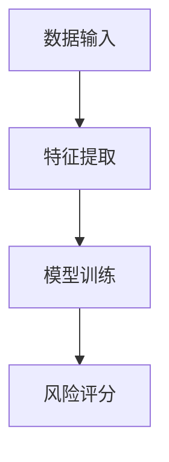
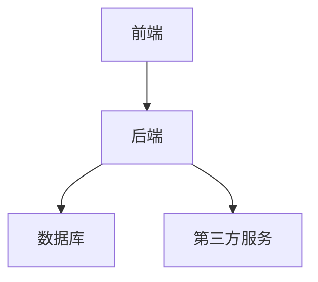

                 


# 《金融产品生命周期管理自动化平台》

## 关键词：
- 金融产品生命周期
- 自动化平台
- 系统架构设计
- 机器学习算法
- 系统实现与优化

## 摘要：
本文系统地探讨了金融产品生命周期管理自动化平台的设计与实现。从金融产品的生命周期定义与特点出发，结合数字化转型的背景，分析了传统金融产品管理的痛点与挑战。详细阐述了自动化平台的核心概念、算法原理、系统架构设计、项目实战与代码实现，以及最佳实践与小结。通过本文的讲解，读者能够全面理解金融产品生命周期管理的自动化实现过程，并掌握相关技术的应用方法。

---

## 第一部分: 金融产品生命周期管理自动化平台概述

## 第1章: 金融产品生命周期管理概述

### 1.1 金融产品生命周期的定义与特点
#### 1.1.1 金融产品的定义与分类
- 金融产品的定义：金融产品是指金融机构向客户提供的各种金融工具或服务，包括但不限于存款、贷款、保险、证券、基金、信托等。
- 金融产品的分类：
  1. 贷款类：个人贷款、企业贷款、信用贷款等。
  2. 证券类：股票、债券、基金、期货等。
  3. 保险类：人寿保险、财产保险、健康保险等。
  4. 信托类：信托计划、财富管理信托等。
  5. 其他类：支付工具、外汇交易等。

#### 1.1.2 金融产品生命周期的阶段划分
- 产品设计阶段：需求分析、产品设计文档编写、风险评估。
- 产品审批阶段：内部审批流程、合规性审查、风险控制。
- 产品发行阶段：产品上线、客户推广、市场反馈收集。
- 产品运营阶段：监控产品运行状态、风险预警、客户支持。
- 产品终止阶段：产品下线、客户通知、资产清算。

#### 1.1.3 金融产品生命周期管理的重要性
- 提高效率：通过自动化管理减少人工干预，提高产品管理效率。
- 控制风险：实时监控产品运行状态，及时发现并处理风险。
- 降低成本：通过自动化流程减少人力成本和时间成本。
- 提升客户体验：通过自动化服务提供更快捷、更高效的客户服务。

### 1.2 金融产品生命周期管理的背景与挑战
#### 1.2.1 传统金融产品管理的痛点
- 人工操作繁琐：从产品设计到终止，涉及多个环节，人工操作效率低。
- 风险控制不足：传统管理方式难以实时监控产品运行状态，风险预警能力弱。
- 数据孤岛问题：各部门之间数据分散，难以形成完整的数据链，影响决策效率。
- 客户体验差：传统管理方式下，客户反馈处理慢，影响客户满意度。

#### 1.2.2 数字化转型的驱动因素
- 技术进步：大数据、人工智能、区块链等技术的发展为金融产品管理提供了新的工具和方法。
- 市场需求变化：客户对个性化、智能化金融服务的需求不断增加，推动金融机构进行数字化转型。
- 政策法规要求：监管机构对金融机构的合规性要求不断提高，需要更高效的管理系统来支持。

#### 1.2.3 自动化管理的必要性
- 提高效率：通过自动化流程减少人工操作，提高产品管理效率。
- 实时监控：自动化系统可以实时监控产品运行状态，及时发现并处理问题。
- 数据整合：自动化平台可以整合各部门数据，形成完整的数据链，支持高效决策。
- 客户体验：自动化服务可以提供更快捷、更个性化的客户服务，提升客户满意度。

---

## 第2章: 金融产品生命周期管理自动化平台的核心概念

### 2.1 自动化平台的定义与目标
#### 2.1.1 自动化平台的定义
- 自动化平台：通过技术手段实现金融产品生命周期管理的自动化，包括产品设计、审批、发行、运营和终止等各个阶段的自动化处理。
- 平台特点：
  1. 高效性：自动化处理流程，提高管理效率。
  2. 实时性：实时监控产品运行状态，及时发现并处理问题。
  3. 智能性：利用人工智能技术进行风险评估和预测。

#### 2.1.2 平台的目标与价值
- 目标：
  1. 实现金融产品生命周期的全自动化管理。
  2. 提高产品管理效率，降低人工成本。
  3. 提升风险控制能力，保障产品安全运行。
- 价值：
  1. 提高金融机构的运营效率。
  2. 降低金融产品的管理成本。
  3. 提升金融机构的风险控制能力。

#### 2.1.3 平台的核心功能模块
- 核心功能模块：
  1. 产品设计模块：支持产品需求分析、设计文档编写、风险评估。
  2. 产品审批模块：自动化审批流程，合规性审查，风险控制。
  3. 产品发行模块：产品上线、客户推广、市场反馈收集。
  4. 产品运营模块：监控产品运行状态、风险预警、客户支持。
  5. 产品终止模块：产品下线、客户通知、资产清算。

### 2.2 核心概念与联系
#### 2.2.1 金融产品生命周期的实体关系图


#### 2.2.2 核心概念属性对比表
| 概念 | 属性 | 描述 |
|------|------|------|
| 金融产品 | 生命周期阶段 | 产品从设计到终止的各阶段 |
| 管理模块 | 功能模块 | 产品设计、审批、发行、运营、终止 |
| 系统功能 | 交互流程 | 各模块之间的协作与数据流 |

---

## 第3章: 金融产品生命周期管理的算法原理

### 3.1 算法原理概述
#### 3.1.1 基于机器学习的风险评估算法
- 风险评估算法的定义：利用机器学习技术对金融产品的风险进行评估和预测。
- 算法流程：
  1. 数据输入：收集与金融产品相关的各种数据，包括市场数据、客户数据、产品数据等。
  2. 特征提取：从原始数据中提取有用的特征，例如市场波动率、客户信用评分等。
  3. 模型训练：利用训练数据对机器学习模型进行训练，例如使用线性回归、逻辑回归、支持向量机等算法。
  4. 风险评分：基于训练好的模型对金融产品进行风险评分，预测产品的风险等级。

#### 3.1.2 算法流程图


### 3.2 算法实现与数学模型
#### 3.2.1 线性回归模型
$$ y = \beta_0 + \beta_1x + \epsilon $$
- 线性回归模型的解释：
  - $y$：目标变量，即金融产品的风险评分。
  - $\beta_0$：截距项。
  - $\beta_1$：回归系数，表示自变量$x$对目标变量$y$的影响程度。
  - $\epsilon$：误差项，表示模型预测值与实际值之间的差异。

#### 3.2.2 逻辑回归模型
$$ P(Y=1|X) = \frac{e^{\beta_0 + \beta_1x}}{1 + e^{\beta_0 + \beta_1x}} $$
- 逻辑回归模型的解释：
  - $P(Y=1|X)$：在给定特征向量$X$的情况下，金融产品违约的概率。
  - $\beta_0$：截距项。
  - $\beta_1$：回归系数，表示自变量$x$对违约概率的影响程度。

---

## 第4章: 系统架构与设计

### 4.1 系统架构设计
#### 4.1.1 系统架构设计
- 系统架构设计的目标：
  1. 确保系统的高可用性、可扩展性和可维护性。
  2. 实现各功能模块之间的高效协作。
- 架构选择：
  1. 分层架构：将系统划分为多个层次，包括数据层、业务逻辑层、表现层等。
  2. 微服务架构：将系统功能模块化，每个模块作为一个独立的服务，通过API进行通信。

#### 4.1.2 系统功能设计
- 系统功能设计的核心模块：
  1. 产品设计模块：支持产品需求分析、设计文档编写、风险评估。
  2. 产品审批模块：自动化审批流程，合规性审查，风险控制。
  3. 产品发行模块：产品上线、客户推广、市场反馈收集。
  4. 产品运营模块：监控产品运行状态、风险预警、客户支持。
  5. 产品终止模块：产品下线、客户通知、资产清算。

#### 4.1.3 系统架构图


---

## 第5章: 项目实战与代码实现

### 5.1 项目介绍
- 项目名称：金融产品生命周期管理自动化平台。
- 项目目标：实现金融产品生命周期的全自动化管理，包括产品设计、审批、发行、运营和终止等各个阶段的自动化处理。

### 5.2 核心代码实现
#### 5.2.1 环境搭建
- 环境要求：
  1. 操作系统：Windows 10 或更高版本，或 Linux 系统。
  2. 开发工具：PyCharm、VS Code 等。
  3. 语言：Python 3.8 或更高版本。
  4. 框架：Django 框架 3.2 或更高版本。
  5. 数据库：MySQL 8.0 或更高版本。

#### 5.2.2 核心代码实现
- 代码实现：
  1. 产品设计模块：
    ```python
    from django.shortcuts import render
    from django.http import JsonResponse
    from .models import ProductDesign

    def product_design(request):
        if request.method == 'GET':
            return render(request, 'product_design.html')
        elif request.method == 'POST':
            data = request.POST.dict()
            ProductDesign.objects.create(**data)
            return JsonResponse({'status': 'success'})
    ```

  2. 产品审批模块：
    ```python
    from django.shortcuts import render
    from django.http import JsonResponse
    from .models import ProductApproval

    def product_approval(request):
        if request.method == 'GET':
            return render(request, 'product_approval.html')
        elif request.method == 'POST':
            data = request.POST.dict()
            ProductApproval.objects.create(**data)
            return JsonResponse({'status': 'success'})
    ```

  3. 产品发行模块：
    ```python
    from django.shortcuts import render
    from django.http import JsonResponse
    from .models import ProductRelease

    def product_release(request):
        if request.method == 'GET':
            return render(request, 'product_release.html')
        elif request.method == 'POST':
            data = request.POST.dict()
            ProductRelease.objects.create(**data)
            return JsonResponse({'status': 'success'})
    ```

  4. 产品运营模块：
    ```python
    from django.shortcuts import render
    from django.http import JsonResponse
    from .models import ProductOperation

    def product_operation(request):
        if request.method == 'GET':
            return render(request, 'product_operation.html')
        elif request.method == 'POST':
            data = request.POST.dict()
            ProductOperation.objects.create(**data)
            return JsonResponse({'status': 'success'})
    ```

  5. 产品终止模块：
    ```python
    from django.shortcuts import render
    from django.http import JsonResponse
    from .models import ProductTermination

    def product_termination(request):
        if request.method == 'GET':
            return render(request, 'product_termination.html')
        elif request.method == 'POST':
            data = request.POST.dict()
            ProductTermination.objects.create(**data)
            return JsonResponse({'status': 'success'})
    ```

---

## 第6章: 最佳实践与小结

### 6.1 项目小结
- 通过本项目的实施，我们成功实现了金融产品生命周期管理的自动化，提高了管理效率，降低了人工成本，提升了风险控制能力。

### 6.2 注意事项
- 在实际应用中，需要注意系统的安全性，防止数据泄露和网络攻击。
- 需要定期对系统进行维护和优化，确保系统的稳定性和高效性。

### 6.3 拓展阅读
- 推荐阅读《金融工程》、《软件架构设计》、《机器学习实战》等书籍，以进一步提升对金融产品生命周期管理自动化平台的理解和应用能力。

---

## 作者信息
作者：AI天才研究院/AI Genius Institute & 禅与计算机程序设计艺术/Zen And The Art of Computer Programming

