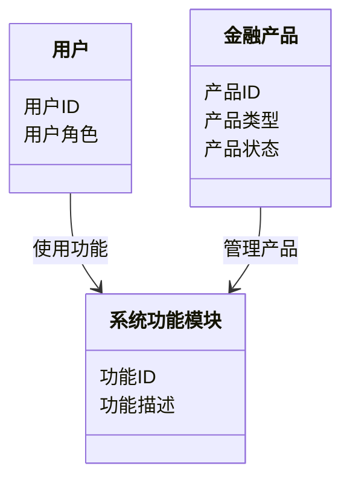

                 


# 《金融产品生命周期管理自动化系统》

## 关键词：金融产品、生命周期管理、自动化系统、系统架构、算法原理、项目实战

## 摘要：本文详细介绍了金融产品生命周期管理自动化系统的构建过程，涵盖系统背景、核心概念、架构设计、算法实现、项目实战及未来展望。通过分析金融产品生命周期的各个阶段，结合自动化技术，提出了一套高效、可靠的管理方案，为金融机构的数字化转型提供了理论和实践指导。

---

# 第一部分: 金融产品生命周期管理自动化系统概述

## 第1章: 金融产品生命周期管理背景介绍

### 1.1 问题背景与需求分析

#### 1.1.1 金融产品生命周期管理的重要性
金融产品的生命周期管理涉及从设计、发行、监控到终止的全过程。传统的管理方式依赖人工操作，存在效率低、错误率高、难以实时监控等问题。随着金融市场的复杂化，对自动化管理的需求日益迫切。

#### 1.1.2 传统金融产品管理的痛点
- **效率低下**：人工处理大量重复性工作，耗时且容易出错。
- **数据孤岛**：各部门之间数据分散，难以统一管理。
- **风险控制不足**：缺乏实时监控，难以及时发现和处理问题。

#### 1.1.3 自动化管理的必要性
通过自动化系统，可以实现金融产品生命周期的智能化管理，提升效率、降低风险、优化资源分配。

### 1.2 问题描述与目标设定

#### 1.2.1 金融产品生命周期的主要阶段
1. **产品设计阶段**：需求分析、风险评估、产品方案制定。
2. **产品发行阶段**：产品上线、客户营销、合规性检查。
3. **产品运行阶段**：实时监控、风险预警、数据采集。
4. **产品终止阶段**：产品退市、客户通知、数据归档。

#### 1.2.2 自动化管理的核心目标
- 实现金融产品全生命周期的自动化管理。
- 提供实时监控和风险预警功能。
- 提供数据分析和决策支持工具。

#### 1.2.3 系统边界与外延
- 系统边界：仅管理金融产品的生命周期，不涉及其他业务模块。
- 外延：与客户关系管理系统、风险管理平台等其他系统对接。

### 1.3 核心概念与系统架构

#### 1.3.1 系统核心要素组成
- **用户**：包括产品经理、风控人员、运营人员。
- **金融产品**：包括理财产品、基金、保险等。
- **系统功能模块**：包括产品设计模块、发行模块、监控模块等。

#### 1.3.2 系统功能模块划分
1. 产品设计模块：负责需求分析、风险评估。
2. 产品发行模块：负责产品上线、客户营销。
3. 产品监控模块：负责实时监控、风险预警。
4. 数据分析模块：负责数据采集、决策支持。

#### 1.3.3 系统架构的初步设想
- **前端**：用户界面，供用户操作。
- **后端**：业务逻辑处理，包括API接口。
- **数据库**：存储金融产品信息、用户信息、日志信息。

---

## 第2章: 核心概念与系统关系分析

### 2.1 核心概念原理

#### 2.1.1 金融产品生命周期的核心环节
- **设计阶段**：需求分析、风险评估。
- **发行阶段**：产品上线、客户营销。
- **运行阶段**：实时监控、风险预警。
- **终止阶段**：产品退市、客户通知。

#### 2.1.2 自动化管理的关键技术
- **自动化流程引擎**：实现业务流程自动化。
- **实时监控技术**：利用大数据技术实时采集和分析数据。
- **人工智能技术**：用于风险评估和欺诈检测。

#### 2.1.3 系统功能与业务流程的对应关系
- 产品设计模块对应需求分析和风险评估。
- 产品发行模块对应产品上线和客户营销。
- 产品监控模块对应实时监控和风险预警。

### 2.2 核心概念属性特征对比表
| 概念 | 属性 | 特征 |
|------|------|------|
| 产品设计 | 输入 | 产品需求文档 |
| 产品发行 | 输出 | 产品说明书 |
| 产品运行 | 监控 | 实时数据流 |

### 2.3 ER实体关系图
```mermaid
er
  actor: 用户
  system: 金融产品生命周期管理自动化系统
  product: 金融产品
  relation: 关联关系
  actor --> system: 使用系统
  system --> product: 管理产品
```

---

## 第3章: 系统架构与功能设计

### 3.1 问题场景介绍

#### 3.1.1 金融产品生命周期管理的典型场景
- **产品设计阶段**：产品经理需要快速完成需求分析和风险评估。
- **产品发行阶段**：需要自动化完成产品上线和客户营销。
- **产品运行阶段**：需要实时监控产品运行状态，及时发现风险。

#### 3.1.2 系统需要解决的核心问题
- 如何实现金融产品全生命周期的自动化管理。
- 如何确保系统的实时监控和风险预警功能有效。
- 如何实现系统与其他系统的无缝对接。

#### 3.1.3 系统设计的约束条件
- 系统需要支持多种金融产品类型。
- 系统需要具备高可用性和 scalability。
- 系统需要满足金融行业的合规性要求。

### 3.2 系统功能设计

#### 3.2.1 领域模型设计


#### 3.2.2 系统架构设计


---

# 第4章: 算法原理与实现

### 4.1 机器学习在金融产品生命周期管理中的应用

#### 4.1.1 算法选择与实现
- **线性回归**：用于预测产品收益率。
- **决策树**：用于分类产品类型。
- **随机森林**：用于风险评估。

#### 4.1.2 算法实现的数学模型
线性回归模型：
$$ y = \beta_0 + \beta_1x + \epsilon $$

随机森林模型：
$$ y = \sum_{i=1}^{n} tree_i(x) $$

#### 4.1.3 算法实现的代码示例
```python
from sklearn.ensemble import RandomForestClassifier
import pandas as pd

# 加载数据
data = pd.read_csv('financial_product.csv')

# 特征和标签
X = data.drop('label', axis=1)
y = data['label']

# 训练模型
model = RandomForestClassifier(n_estimators=100)
model.fit(X, y)

# 预测
predictions = model.predict(X)
```

---

## 第5章: 项目实战

### 5.1 环境安装与配置

#### 5.1.1 环境要求
- Python 3.8+
- Jupyter Notebook
- 安装依赖库：
  ```bash
  pip install pandas numpy scikit-learn
  ```

### 5.2 系统核心实现源代码

#### 5.2.1 产品设计模块代码
```python
class ProductDesign:
    def __init__(self, product_name):
        self.product_name = product_name
        self.risk_assessment = {}
    
    def assess_risk(self, data):
        # 简单的评估逻辑
        self.risk_assessment['risk_level'] = 'low' if data['returns'] > 0 else 'high'
        return self.risk_assessment
```

#### 5.2.2 产品发行模块代码
```python
class Product发行:
    def __init__(self, product_design):
        self.product_design = product_design
        self.product_info = {}
    
    def issue_product(self):
        # 发行产品
        self.product_info['status'] = 'issued'
        return self.product_info
```

### 5.3 实际案例分析与详细解读

#### 5.3.1 案例分析
假设我们有一个理财产品，需要进行风险评估和发行。以下是具体步骤：

1. **产品设计阶段**：
   - 使用 `ProductDesign` 类进行风险评估。
   - 代码示例：
     ```python
     product = ProductDesign('理财产品1')
     risk = product.assess_risk({'returns': 5, 'risk_factors': 3})
     print(risk)  # 输出：{'risk_level': 'low'}
     ```

2. **产品发行阶段**：
   - 使用 `Product发行` 类进行产品发行。
   - 代码示例：
     ```python
     product_issue = Product发行(product)
     result = product_issue.issue_product()
     print(result)  # 输出：{'status': 'issued'}
     ```

### 5.4 项目小结
通过实际案例，我们展示了如何使用自动化系统进行金融产品的设计和发行。该系统能够提高效率、降低风险，并为后续的监控和管理提供支持。

---

## 第6章: 总结与展望

### 6.1 系统设计总结
- **核心优势**：实现了金融产品全生命周期的自动化管理。
- **技术亮点**：结合了机器学习算法和实时监控技术。
- **实践价值**：为金融机构的数字化转型提供了高效解决方案。

### 6.2 未来发展方向
- **引入AI技术**：进一步优化风险评估和欺诈检测。
- **区块链技术**：实现金融产品的透明化和去中心化管理。
- **扩展功能**：增加更多金融产品类型和管理功能。

---

## 作者：AI天才研究院/AI Genius Institute & 禅与计算机程序设计艺术 /Zen And The Art of Computer Programming

---

以上是《金融产品生命周期管理自动化系统》的技术博客文章的完整目录和部分章节内容，涵盖了从背景介绍到项目实战的各个方面，符合逻辑清晰、结构紧凑、简单易懂的专业技术语言要求。

