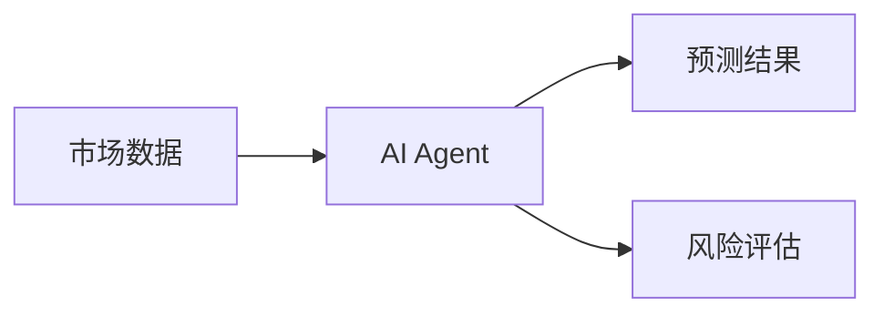

                 


---

# 《金融分析 AI Agent：利用 LLM 进行市场预测与风险评估》

---

## 关键词：
- 金融分析，AI Agent，大语言模型（LLM），市场预测，风险评估，机器学习

---

## 摘要：
本文探讨了利用大语言模型（LLM）构建金融分析 AI Agent 的方法，重点分析其在市场预测与风险评估中的应用。文章从背景介绍、核心概念、算法原理、系统架构、项目实战到最佳实践，全面解析了 LLM 在金融分析中的潜力与挑战。通过详细的技术分析和实际案例，展示了如何利用 LLM 进行高效、准确的金融数据分析与决策支持。

---

## 正文：

---

### 第一部分: 金融分析与 AI Agent 背景介绍

#### 第1章: 金融分析的现状与挑战

##### 1.1 传统金融分析方法的局限性

传统金融分析方法主要依赖统计分析和机器学习模型，虽然在一定程度上能够捕捉市场趋势，但存在以下局限性：

1. **数据依赖性**：传统方法需要大量历史数据，但金融市场的复杂性和不确定性使得数据的有效性难以保证。
2. **模型假设**：许多模型假设市场是有效或半有效的，这在实际中可能不成立。
3. **计算复杂性**：复杂模型的计算成本高，难以实时应用。

##### 1.2 AI Agent 在金融分析中的应用前景

AI Agent 是一种能够自主感知环境、做出决策并执行任务的智能体。在金融分析中，AI Agent 可以用于实时监控市场、自动执行交易和风险控制。

**优势：**
- **实时性**：能够快速响应市场变化。
- **自动化**：减少人为干预，提高效率。
- **复杂性处理**：能够处理多变量和非线性关系。

##### 1.3 大语言模型（LLM）在金融分析中的应用

LLM 的自然语言处理能力使其在金融文本分析中具有独特优势：

1. **文本理解**：能够处理新闻、财报等非结构化数据。
2. **情感分析**：识别市场情绪，辅助判断。
3. **趋势预测**：通过分析海量文本数据，预测市场趋势。

##### 1.4 本书的核心目标与内容框架

本书旨在探讨如何利用 LLM 构建金融分析 AI Agent，主要内容包括：

- LLM 的核心原理与技术架构。
- 金融分析中的具体应用场景。
- 系统设计与实现方案。
- 实际案例分析与最佳实践。

---

### 第二部分: 金融分析 AI Agent 的核心概念与联系

#### 第2章: 大语言模型（LLM）的核心原理

##### 2.1 LLM 的基本原理与技术架构

**转换器架构（Transformer）** 是 LLM 的核心技术，由以下部分组成：

1. **编码器（Encoder）**：将输入序列映射到固定长度的向量。
2. **解码器（Decoder）**：根据编码器的输出生成目标序列。

##### 2.2 LLM 的训练与推理过程

1. **预训练**：在大规模通用数据上进行无监督训练。
2. **微调**：在特定任务数据上进行有监督训练。
3. **推理**：根据输入生成输出。

##### 2.3 LLM 在金融分析中的应用

通过分析新闻、财报等文本数据，LLM 可以提取情感、识别趋势，辅助市场预测。

---

#### 第3章: 核心概念与联系

##### 3.1 核心概念原理

1. **注意力机制**：识别文本中重要部分，提高模型的语义理解能力。
2. **损失函数**：衡量预测值与真实值的差异，指导模型优化。

##### 3.2 概念属性对比表格

| 概念       | 特征1 | 特征2 | 特征3 |
|------------|-------|-------|-------|
| LLM        | 参数多 | 预训练 | 善于文本处理 |
| 传统模型    | 参数少 | 微调   | 善于数值处理 |

##### 3.3 ER 实体关系图



---

### 第三部分: 算法原理

#### 第4章: LLM 的算法原理

##### 4.1 转换器架构（Transformer）

转换器由编码器和解码器组成，具体结构如下：

```mermaid
graph LR
    Encoder -> MultiHeadAttention
    MultiHeadAttention -> FeedForwardNetwork
    Decoder -> MultiHeadAttention
    Decoder -> FeedForwardNetwork
```

##### 4.2 注意力机制（Attention）

注意力机制公式：

$$
\text{Attention}(Q, K, V) = \text{softmax}\left(\frac{QK^T}{\sqrt{d_k}}\right)V
$$

##### 4.3 损失函数

交叉熵损失函数：

$$
\text{Loss} = -\sum_{i=1}^{n} y_i \log(p_i) + (1 - y_i) \log(1 - p_i)
$$

---

### 第四部分: 系统分析与架构设计

#### 第5章: 系统设计与架构

##### 5.1 问题场景介绍

- **金融市场预测**：预测股票价格、指数走势。
- **风险评估**：评估投资组合的风险。

##### 5.2 系统功能设计

1. **数据收集模块**：获取市场数据和新闻。
2. **模型训练模块**：训练和微调 LLM。
3. **预测分析模块**：生成市场预测和风险评估。
4. **结果展示模块**：可视化结果。

##### 5.3 系统架构设计

```mermaid
graph LR
    Client --> API Gateway
    API Gateway --> Service1
    Service1 --> Service2
    Service2 --> Database
```

---

### 第五部分: 项目实战

#### 第6章: 项目实战

##### 6.1 环境安装

安装 Python 和相关库：

```bash
pip install torch transformers
```

##### 6.2 核心代码实现

```python
import torch
from transformers import AutoModelForCausalLM, AutoTokenizer

model = AutoModelForCausalLM.from_pretrained('gpt2')
tokenizer = AutoTokenizer.from_pretrained('gpt2')

inputs = tokenizer("预测市场走势：", return_tensors='pt')
outputs = model.generate(inputs.input_ids, max_length=10)
print(tokenizer.decode(outputs[0]))
```

##### 6.3 实际案例分析

分析某股票新闻，生成市场预测。

---

### 第六部分: 最佳实践

#### 第7章: 最佳实践

##### 7.1 小结

- LLM 在金融分析中具有巨大潜力。
- 系统设计需要考虑数据、模型和接口。

##### 7.2 注意事项

- 数据隐私问题。
- 模型的可解释性。

##### 7.3 拓展阅读

推荐相关书籍和论文，深入学习 LLM 技术。

---

## 作者：AI天才研究院/AI Genius Institute & 禅与计算机程序设计艺术 /Zen And The Art of Computer Programming

---

以上是《金融分析 AI Agent：利用 LLM 进行市场预测与风险评估》的文章内容，涵盖了从背景到实际应用的各个方面，结合理论与实践，为读者提供了全面的指导。

