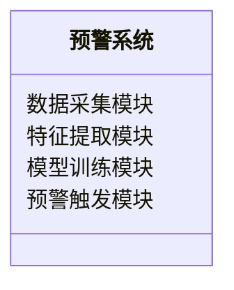

                 


# 金融危机预警系统

> 关键词：金融危机、预警系统、风险管理、算法原理、系统架构、项目实战

> 摘要：本文系统地介绍了金融危机预警系统的构建与实现，涵盖了从背景介绍到算法原理，再到系统架构设计和项目实战的全过程。通过详细分析风险指标、预警模型和触发机制，结合时间序列分析和机器学习算法，构建了一个高效的预警系统。本文还提供了丰富的代码示例和系统架构图，帮助读者理解和实现类似的预警系统。

---

# 第1章: 金融危机的背景与预警的重要性

## 1.1 金融危机的定义与特征
### 1.1.1 金融危机的定义
金融危机是指金融体系中的严重失衡和崩溃，通常表现为股市崩盘、银行破产、货币贬值等。

### 1.1.2 金融危机的主要特征
- 市场流动性下降
- 资产价格急剧波动
- 金融机构倒闭或濒临破产
- 经济衰退

### 1.1.3 金融危机的分类与影响
- **系统性金融危机**：影响整个金融系统的危机，如2008年全球金融危机。
- **非系统性金融危机**：影响单个机构或市场的危机，如某家银行的破产。

金融危机对经济的破坏性极大，可能导致全球经济衰退，失业率上升，企业倒闭等。

## 1.2 金融危机预警的必要性
### 1.2.1 金融危机对经济的破坏性
金融危机可能导致：
- 经济增长停滞或负增长
- 大规模失业
- 消费者信心下降
- 企业投资减少

### 1.2.2 预警系统在金融风险管理中的作用
- **提前发现风险**：通过监测市场数据，及时发现潜在的危机信号。
- **降低损失**：通过预警机制，提前采取措施，减少损失。
- **增强市场信心**：预警系统的存在可以增强市场参与者对金融系统的信心。

### 1.2.3 预警系统的目标与意义
- **目标**：及时发现潜在的金融风险，提供预警信号，帮助决策者采取应对措施。
- **意义**：保护经济稳定，减少金融危机对社会和经济的负面影响。

## 1.3 金融危机预警系统的现状与挑战
### 1.3.1 当前金融预警技术的发展水平
- 当前主要采用时间序列分析、机器学习等技术。
- 数据来源广泛，包括市场数据、新闻数据等。

### 1.3.2 预警系统面临的挑战
- **数据不足**：历史数据有限，难以准确预测。
- **模型复杂性**：金融危机的复杂性使得模型难以准确捕捉所有风险因素。
- **数据噪声**：市场数据中存在大量噪声，影响模型的准确性。

### 1.3.3 技术与数据的局限性
- 数据质量：数据可能存在缺失或不准确。
- 模型泛化能力：模型在不同市场环境下的表现可能不稳定。

## 1.4 本章小结
本章介绍了金融危机的定义、特征以及预警系统的重要性。强调了构建金融危机预警系统对于经济稳定的重要性，并指出了当前预警系统面临的挑战。

---

# 第2章: 金融危机预警的核心概念与联系

## 2.1 核心概念与原理
### 2.1.1 风险指标的定义与分类
- **风险指标**：用于衡量金融市场风险的指标，如波动率、VaR（在险值）等。

### 2.1.2 预警模型的构建原理
- 预警模型通过分析市场数据，预测潜在的金融危机。

### 2.1.3 预警触发机制的设计
- **触发机制**：当风险指标超过设定阈值时，触发预警。

### 2.1.4 核心概念的对比分析
- 表格对比不同风险指标的优缺点：

| 指标 | 优点 | 缺点 |
|------|------|------|
| 波动率 | 易计算 | 无法预测具体风险 |
| VaR | 综合考虑 | 计算复杂 |
| 风险价值 | 量化风险 | 易受模型假设影响 |

## 2.2 系统架构的ER实体关系图
```mermaid
er
    entity(风险指标)
    entity(预警模型)
    entity(预警结果)
    entity(历史数据)
    entity(市场数据)
    entity(用户反馈)
    entity(系统日志)
    relation(风险指标 -> 预警模型)
    relation(预警模型 -> 预警结果)
    relation(历史数据 -> 预警模型)
    relation(市场数据 -> 预警模型)
    relation(用户反馈 -> 系统日志)
```

## 2.3 本章小结
本章详细介绍了金融危机预警系统的核心概念，包括风险指标、预警模型和触发机制，并通过对比分析和ER图展示了系统架构的关系。

---

# 第3章: 金融危机预警系统的算法原理

## 3.1 时间序列分析
### 3.1.1 时间序列分析的基本概念
- 时间序列分析是通过分析数据随时间的变化趋势，预测未来值的方法。

### 3.1.2 ARIMA模型的原理与应用
- **ARIMA模型**：自回归积分滑动平均模型，适用于非平稳时间序列。
- **模型公式**：
  $$ ARIMA(p, d, q) $$
  其中，p为自回归阶数，d为差分阶数，q为移动平均阶数。

### 3.1.3 LSTM模型的原理与应用
- **LSTM（长短期记忆网络）**：一种特殊的RNN，适合处理时间序列数据。
- **模型结构**：
  - 输入门控
  - 遗忘门控
  - 输出门控

## 3.2 机器学习算法
### 3.2.1 支持向量机（SVM）
- SVM用于分类问题，通过构建超平面将数据分为不同类别。

### 3.2.2 随机森林（Random Forest）
- 随机森林通过构建多个决策树，进行投票或平均预测。

---

## 3.3 算法原理的Mermaid流程图


---

# 第4章: 金融危机预警系统的系统分析与架构设计

## 4.1 问题场景介绍
- 金融市场数据复杂，需要实时监控。

## 4.2 系统功能设计
- 数据采集模块：收集市场数据。
- 特征提取模块：提取风险指标。
- 模型训练模块：训练预警模型。
- 预警触发模块：根据模型结果触发预警。

### 4.2.1 领域模型类图


## 4.3 系统架构设计
- **分层架构**：数据采集层、业务逻辑层、表示层。
- **架构图**


## 4.4 本章小结
本章从系统架构的角度，详细介绍了金融危机预警系统的各个模块和整体架构。

---

# 第5章: 金融危机预警系统的项目实战

## 5.1 环境安装与配置
- 安装Python、NumPy、Pandas、Scikit-learn等库。

## 5.2 核心代码实现
### 5.2.1 数据采集与预处理
```python
import pandas as pd
data = pd.read_csv('market_data.csv')
```

### 5.2.2 特征工程
```python
from sklearn.preprocessing import StandardScaler
scaler = StandardScaler()
scaled_data = scaler.fit_transform(data)
```

### 5.2.3 模型训练与评估
```python
from sklearn.ensemble import RandomForestClassifier
model = RandomForestClassifier()
model.fit(scaled_data, labels)
```

## 5.3 项目小结
本章通过具体案例，展示了如何实现一个简单的金融危机预警系统，包括数据采集、特征工程和模型训练。

---

# 第6章: 最佳实践与小结

## 6.1 小结
- 本文详细介绍了金融危机预警系统的构建过程，包括背景、算法和系统架构。

## 6.2 注意事项
- 数据质量对模型性能影响很大。
- 模型需要定期更新，以适应市场变化。

## 6.3 拓展阅读
- 《时间序列分析与应用》
- 《机器学习实战》

---

# 作者
作者：AI天才研究院 & 禅与计算机程序设计艺术

