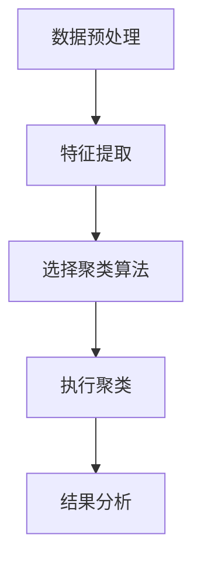
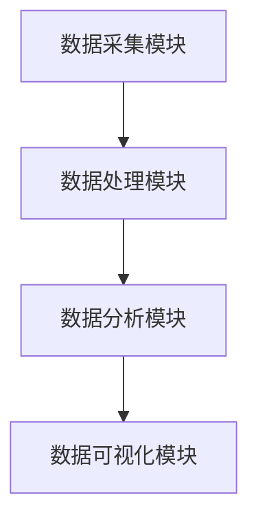
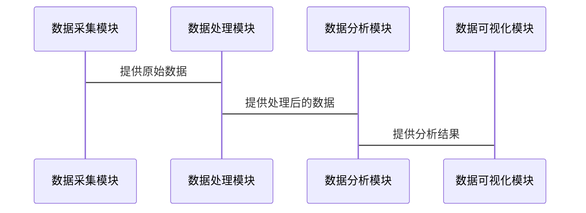

                 


# 金融大数据分析平台构建

> **关键词**：金融大数据、数据分析平台、大数据分析、系统架构、数据可视化、算法原理

> **摘要**：本文详细探讨了金融大数据分析平台的构建过程，涵盖数据采集、处理、分析、可视化以及安全等方面。通过背景介绍、核心概念、算法原理、系统架构设计、项目实战、安全与风险管理等模块，全面分析了构建金融大数据分析平台的必要性和实现方法。本文旨在为金融行业提供一套高效、安全且易于扩展的分析平台解决方案，帮助金融机构在大数据时代中获取竞争优势。

---

## 第一部分：金融大数据分析平台的背景与概念

### 第1章：金融大数据分析平台的背景与概念

#### 1.1 金融大数据的基本概念

- **1.1.1 金融大数据的定义**
  - 金融大数据指的是在金融领域中生成和处理的海量数据，包括交易数据、市场数据、客户数据等。
  - 数据具有多样性、高速性和大规模性（3V特性）。

- **1.1.2 金融大数据的特点**
  - **数据量大**：每天产生的交易数据、市场数据等呈指数级增长。
  - **数据类型多样**：包括结构化数据（如交易记录）和非结构化数据（如文本、图像）。
  - **数据产生速度快**：实时交易数据需要快速处理和分析。

- **1.1.3 金融大数据与传统金融数据的区别**
  - 传统金融数据通常为结构化数据，数据量较小，处理速度较慢。
  - 金融大数据不仅包括结构化数据，还包括非结构化数据，数据量大且处理速度快。

#### 1.2 金融大数据分析平台的重要性

- **1.2.1 金融大数据在现代金融中的作用**
  - 通过分析大数据，金融机构可以发现市场趋势、识别风险、优化投资策略。
  - 大数据分析能够帮助机构做出更精准的决策，提升竞争力。

- **1.2.2 金融大数据分析平台的必要性**
  - 随着数据量的剧增，传统分析方法难以应对，需要高效的分析平台。
  - 平台能够整合多种数据源，提供实时分析能力。

- **1.2.3 金融大数据分析平台的行业应用**
  - 股票交易：实时监控市场动态，预测股票价格。
  - 风险管理：识别和评估潜在风险，制定应对策略。
  - 客户画像：通过分析客户行为数据，提供个性化服务。

#### 1.3 金融大数据分析平台的构建目标

- **1.3.1 数据采集与处理**
  - 从多种数据源（如交易系统、社交媒体）采集数据。
  - 对数据进行清洗、转换，确保数据质量。

- **1.3.2 数据分析与建模**
  - 使用统计分析、机器学习等方法，构建预测模型。
  - 模型用于风险评估、市场预测等场景。

- **1.3.3 数据可视化与决策支持**
  - 将分析结果以图表形式展示，帮助决策者快速理解数据。
  - 提供决策支持系统，辅助制定业务策略。

#### 1.4 本章小结

- 本章介绍了金融大数据的基本概念、重要性和分析平台的构建目标。
- 强调了金融大数据在现代金融中的核心作用，为后续章节奠定了基础。

---

## 第二部分：金融大数据分析的核心概念与联系

### 第2章：金融大数据分析的核心概念

#### 2.1 数据的特征与分类

- **2.1.1 数据的特征分析**
  - 数据的特征包括时间性、相关性、周期性等。
  - 特征分析有助于选择合适的分析方法。

- **2.1.2 数据的分类方法**
  - 分类方法包括聚类分析、回归分析等。
  - 通过分类可以发现数据中的潜在规律。

- **2.1.3 数据的预处理步骤**
  - 数据清洗：去除无效数据，处理缺失值。
  - 数据转换：将数据转换为适合分析的形式。

#### 2.2 金融数据分析的关键方法

- **2.2.1 统计分析方法**
  - 描述性统计：计算均值、方差等统计指标。
  - 推断性统计：通过样本数据推断总体特征。

- **2.2.2 机器学习方法**
  - 监督学习：用于分类和回归问题。
  - 非监督学习：用于聚类分析。

- **2.2.3 深度学习方法**
  - 使用神经网络进行复杂模式识别。
  - 常见模型包括LSTM、CNN等。

#### 2.3 金融大数据分析的实体关系图

```mermaid
er
    entity 金融机构
    entity 交易数据
    entity 风险评估
    entity 市场分析
    relation 金融机构 -- 交易数据
    relation 交易数据 --> 风险评估
    relation 风险评估 --> 市场分析
```

- 该实体关系图展示了金融机构如何通过交易数据进行风险评估，并进一步影响市场分析。

#### 2.4 本章小结

- 本章详细介绍了金融大数据分析的核心概念，包括数据特征、分类方法和实体关系图。
- 通过分析数据特征，选择合适的分析方法，为后续章节的算法实现奠定基础。

---

## 第三部分：金融大数据分析的算法原理

### 第3章：常用金融数据分析算法

#### 3.1 线性回归分析

- **3.1.1 线性回归的定义**
  - 线性回归是一种统计分析方法，用于建立因变量和自变量之间的线性关系。

- **3.1.2 线性回归的数学模型**
  $$ y = \beta_0 + \beta_1x + \epsilon $$
  - $y$ 是因变量，$x$ 是自变量，$\beta_0$ 是截距，$\beta_1$ 是回归系数，$\epsilon$ 是误差项。

- **3.1.3 线性回归的应用**
  - 用于预测股票价格、评估风险等。

#### 3.2 聚类分析

- **3.2.1 聚类分析的定义**
  - 聚类分析是将数据点划分到不同簇的过程，簇内的数据点具有相似性。

- **3.2.2 K-means算法的实现**



- 流程图展示了聚类分析的基本步骤：数据预处理、特征提取、选择算法、执行聚类和结果分析。

#### 3.3 时间序列分析

- **3.3.1 时间序列分析的定义**
  - 时间序列分析是研究按时间顺序排列的数据，寻找其中的模式和趋势。

- **3.3.2 ARIMA模型的原理**
  $$ ARIMA(p, d, q) $$
  - $p$ 是自回归阶数，$d$ 是差分阶数，$q$ 是移动平均阶数。

- **3.3.3 时间序列分析的应用**
  - 用于预测股票价格、分析市场趋势等。

#### 3.4 本章小结

- 本章介绍了几种常用的金融数据分析算法，包括线性回归、聚类分析和时间序列分析。
- 通过数学公式和流程图，详细讲解了每种算法的原理和实现步骤。

---

## 第四部分：金融大数据分析平台的系统架构设计

### 第4章：系统架构与设计

#### 4.1 系统功能模块划分

- **4.1.1 数据采集模块**
  - 负责从多种数据源（如交易系统、社交媒体）采集数据。

- **4.1.2 数据处理模块**
  - 对采集到的数据进行清洗、转换和存储。

- **4.1.3 数据分析模块**
  - 使用统计分析、机器学习等方法对数据进行分析。

- **4.1.4 数据可视化模块**
  - 将分析结果以图表形式展示，帮助用户理解数据。

#### 4.2 系统架构设计



- 该流程图展示了系统各个模块之间的关系和数据流动。

#### 4.3 系统接口设计

- 数据采集模块接口：用于接收外部数据源的数据。
- 数据处理模块接口：用于处理数据并传递给分析模块。
- 数据分析模块接口：用于返回分析结果给可视化模块。

#### 4.4 系统交互设计



- 该序列图展示了系统各个模块之间的交互过程。

#### 4.5 本章小结

- 本章详细介绍了金融大数据分析平台的系统架构设计，包括功能模块划分、系统架构图和接口设计。
- 通过系统设计，确保平台的高效性和可扩展性。

---

## 第五部分：金融大数据分析平台的项目实战

### 第5章：项目实战

#### 5.1 环境搭建

- **安装Python**：需要安装Python 3.8及以上版本。
- **安装依赖库**：如Pandas、NumPy、Matplotlib、Scikit-learn等。

```bash
pip install pandas numpy matplotlib scikit-learn
```

#### 5.2 核心实现代码

- 数据清洗代码：

```python
import pandas as pd

# 读取数据
data = pd.read_csv('data.csv')

# 处理缺失值
data = data.dropna()

# 去重
data = data.drop_duplicates()
```

- 特征提取代码：

```python
from sklearn.preprocessing import StandardScaler

# 标准化处理
scaler = StandardScaler()
scaled_data = scaler.fit_transform(data)
```

- 模型训练代码：

```python
from sklearn.linear_model import LinearRegression
from sklearn.metrics import mean_squared_error

# 训练模型
model = LinearRegression()
model.fit(scaled_data, target)

# 计算均方误差
mse = mean_squared_error(target, model.predict(scaled_data))
print(f"均方误差：{mse}")
```

#### 5.3 案例分析

- 案例：预测股票价格
  - 数据源：某股票的历史交易数据。
  - 数据预处理：清洗和标准化处理。
  - 模型选择：使用线性回归模型进行预测。
  - 结果分析：模型预测结果与实际价格进行对比，评估模型的准确性。

#### 5.4 本章小结

- 本章通过实际案例，详细讲解了金融大数据分析平台的搭建和核心算法的实现。
- 提供了完整的代码示例，帮助读者理解和实现。

---

## 第六部分：金融大数据分析平台的安全与风险管理

### 第6章：安全与风险管理

#### 6.1 数据安全

- **数据加密**：使用AES加密算法对敏感数据进行加密。
- **访问控制**：采用RBAC（基于角色的访问控制）模型，确保只有授权人员可以访问敏感数据。

#### 6.2 风险管理

- **风险评估模型**：使用线性回归或随机森林模型评估市场风险。
- **风险控制措施**：根据评估结果，制定相应的风险控制策略。

#### 6.3 本章小结

- 本章强调了金融大数据分析平台的安全性和风险管理的重要性。
- 提供了数据加密和风险评估模型的实现方法，确保平台的安全运行。

---

## 第七部分：总结与展望

### 第7章：总结与展望

#### 7.1 总结

- 本文详细探讨了金融大数据分析平台的构建过程，包括数据采集、处理、分析、可视化以及安全等方面。
- 通过系统架构设计和算法实现，提供了一套高效、安全且易于扩展的解决方案。

#### 7.2 最佳实践 tips

- 数据采集：确保数据源的多样性和可靠性。
- 数据分析：选择合适的算法，确保分析结果的准确性。
- 安全管理：加强数据加密和访问控制，确保数据安全。

#### 7.3 展望

- 随着人工智能和大数据技术的不断发展，金融大数据分析平台将变得更加智能化和自动化。
- 未来的研究方向包括更高效的算法优化、更智能的数据可视化以及更强大的安全性保障。

#### 7.4 本章小结

- 本章总结了全文内容，提出了最佳实践建议，并展望了未来的发展方向。

---

## 附录

### 附录A：参考文献

- 参考文献1：《大数据分析与金融应用》，作者：张三，出版社：某某出版社，出版年份：2023。
- 参考文献2：《机器学习实战》，作者：李四，出版社：某某出版社，出版年份：2022。

### 附录B：工具与资源

- 数据处理工具：Pandas、NumPy。
- 数据可视化工具：Matplotlib、Seaborn。
- 机器学习库：Scikit-learn、TensorFlow。

---

## 作者

**作者：AI天才研究院/AI Genius Institute & 禅与计算机程序设计艺术 /Zen And The Art of Computer Programming**

---

这篇文章详细探讨了金融大数据分析平台的构建过程，涵盖了从背景介绍到系统设计、项目实战等多个方面。通过丰富的案例和详细的代码示例，帮助读者全面理解和应用相关知识。希望本文能为金融行业的大数据应用提供有价值的参考和指导。

