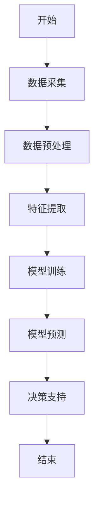
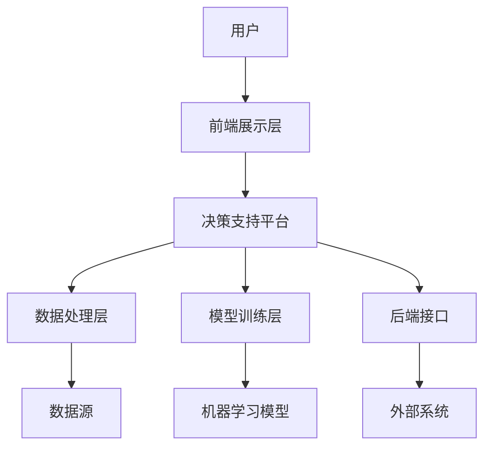
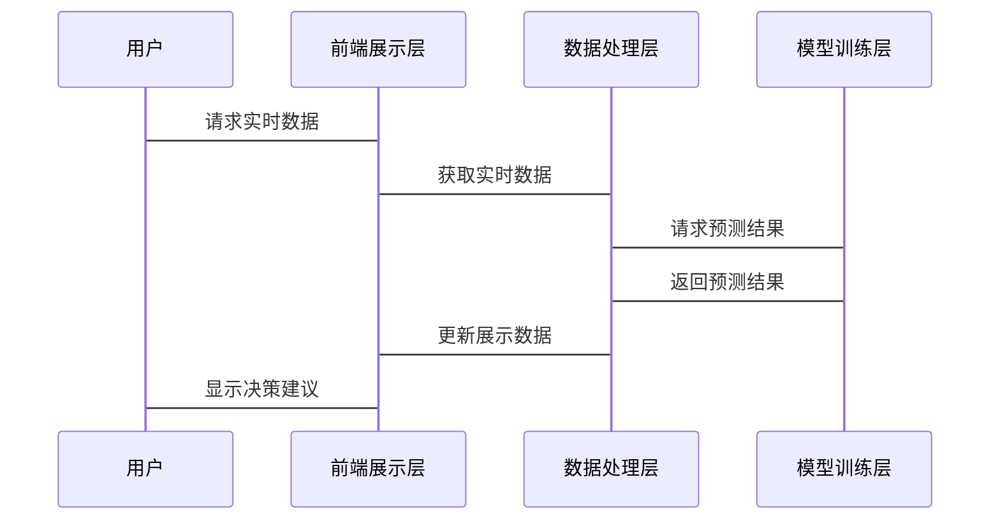

                 


# 《金融大数据实时决策支持平台》

---

## 关键词：金融大数据，实时决策支持，数据处理算法，系统架构设计，大数据分析

---

## 摘要：  
金融行业的数据呈现出海量、实时性和多样性的特点，这对金融机构的决策能力提出了更高的要求。传统的决策支持系统已难以满足实时性和高效性的需求。本文从金融大数据的特点出发，结合实时决策支持的核心需求，详细阐述了金融大数据实时决策支持平台的构建过程，包括数据采集、处理、分析和决策支持的全生命周期管理。通过分析平台的核心算法和系统架构设计，本文提出了基于流数据处理和机器学习的实时决策支持方案，并通过实际案例展示了平台的应用价值和优势。

---

## 第一部分: 金融大数据实时决策支持平台背景与概述

---

### 第1章: 问题背景与目标

#### 1.1 问题背景

金融行业作为数据密集型行业，每天都会产生海量的交易数据、市场数据和用户行为数据。这些数据的实时性、多样性和复杂性对金融机构的决策能力提出了更高的要求。传统的决策支持系统通常基于批量数据处理，无法满足实时性需求，导致决策滞后或不准确。此外，金融市场的波动性极高，实时决策能力是金融机构的核心竞争力之一。

#### 1.2 问题描述

- **数据特点**：金融数据具有高实时性、多样性（结构化和非结构化数据）、海量性（每天产生的数据量巨大）和复杂性（数据之间存在复杂的关联关系）。
- **决策需求**：金融机构需要实时监控市场动态、评估风险、优化投资组合，并快速做出决策。
- **传统系统局限**：传统的决策支持系统通常依赖于批量数据处理，无法满足实时性需求，且难以应对复杂的数据类型和关联关系。

#### 1.3 问题解决思路

- **数据采集**：建立高效的实时数据采集机制，支持多种数据源（如交易数据、市场数据、社交媒体数据等）的接入。
- **实时处理**：采用流数据处理技术，对数据进行实时清洗、转换和分析。
- **决策支持**：基于机器学习和深度学习算法，构建实时预测模型，并生成决策建议。

#### 1.4 平台的边界与外延

- **功能边界**：平台主要关注实时数据处理和决策支持，不涉及底层数据存储和外部系统接口。
- **外延与扩展性**：平台设计具有良好的扩展性，可以轻松接入新的数据源或算法模型。
- **接口关系**：平台需要与前端展示层和后端数据源进行交互，确保数据的实时流动和处理。

---

### 第2章: 核心概念与联系

#### 2.1 核心概念原理

- **大数据处理**：大数据处理的核心在于高效地处理海量、多样化的数据，通常采用分布式计算框架（如Hadoop、Spark）。
- **实时决策支持**：实时决策支持依赖于流数据处理技术和实时分析算法，确保决策的及时性和准确性。
- **平台架构设计**：平台架构设计需要兼顾实时性、扩展性和可维护性，采用分层架构和模块化设计。

#### 2.2 核心概念对比表

| 概念         | 特征                       | 优缺点                                   |
|--------------|----------------------------|------------------------------------------|
| 数据源       | 结构化/非结构化数据         | 高效性/复杂性                           |
| 处理算法     | 批处理/流处理               | 延时性/实时性                           |
| 决策支持     | 基于规则/基于模型           | 简单性/准确性                           |

#### 2.3 ER实体关系图

```mermaid
erDiagram
    customer[客户] {
        <属性>
        id : int
        name : string
        account : string
    }
    transaction[交易] {
        <属性>
        id : int
        time : datetime
        amount : float
        status : string
    }
    market_data[市场数据] {
        <属性>
        id : int
        time : datetime
        price : float
        volume : int
    }
    risk_assessment[风险评估] {
        <属性>
        id : int
        score : float
        time : datetime
    }
    decision_support[决策支持] {
        <属性>
        id : int
        recommendation : string
        time : datetime
    }
    customer -> transaction : 进行交易
    transaction -> market_data : 影响市场数据
    market_data -> risk_assessment : 用于风险评估
    risk_assessment -> decision_support : 生成决策支持
```

---

## 第二部分: 算法原理讲解

---

### 第3章: 算法原理

#### 3.1 算法选择与优化

- **流数据处理**：采用基于时间戳的流数据处理算法，确保数据的实时性和准确性。
- **机器学习模型**：选择适合实时决策的机器学习模型（如时间序列分析、在线学习算法）。

#### 3.2 算法实现步骤



#### 3.3 核心算法代码实现

```python
import pandas as pd
from sklearn.linear_model import SGDRegressor

# 数据采集与预处理
def process_data(data_stream):
    # 数据清洗
    cleaned_data = data_stream.dropna()
    # 特征提取
    features = cleaned_data[['time', 'price', 'volume']]
    return features

# 模型训练
def train_model(features, labels):
    model = SGDRegressor()
    model.fit(features, labels)
    return model

# 实时预测
def predict_realtime(model, new_data):
    processed_data = process_data(new_data)
    predictions = model.predict(processed_data)
    return predictions

# 示例数据
data = pd.DataFrame({
    'time': [1, 2, 3, 4, 5],
    'price': [100, 105, 98, 110, 108],
    'volume': [1000, 800, 1200, 900, 1100]
})

# 模型训练
labels = data['price']
features = process_data(data)
model = train_model(features, labels)

# 实时预测
new_data = pd.DataFrame({
    'time': [6],
    'price': [110],
    'volume': [1050]
})
prediction = predict_realtime(model, new_data)
print("预测价格：", prediction[0])
```

#### 3.4 数学模型与公式

$$
\text{预测价格} = \beta_0 + \beta_1 \times \text{时间} + \beta_2 \times \text{成交量} + \epsilon
$$

其中：
- $\beta_0$：截距项
- $\beta_1, \beta_2$：回归系数
- $\epsilon$：误差项

---

## 第三部分: 系统分析与架构设计

---

### 第4章: 系统分析与架构设计

#### 4.1 问题场景介绍

- **需求分析**：金融机构需要实时监控市场数据、评估风险并生成决策建议。
- **系统目标**：构建一个高效、可靠的实时决策支持平台。

#### 4.2 系统功能设计

- **数据采集模块**：实时采集市场数据、交易数据和用户行为数据。
- **数据处理模块**：对数据进行清洗、转换和特征提取。
- **模型训练模块**：基于实时数据训练机器学习模型。
- **决策支持模块**：根据模型输出生成决策建议。

#### 4.3 系统架构设计



#### 4.4 系统接口设计

- **数据接口**：与数据源（如交易所、数据库）对接，获取实时数据。
- **模型接口**：与机器学习模型对接，获取预测结果。
- **展示接口**：与前端展示层对接，输出决策建议。

#### 4.5 系统交互流程



---

## 第四部分: 项目实战

---

### 第5章: 项目实战

#### 5.1 环境安装

- **安装Python**：确保安装了Python 3.8及以上版本。
- **安装依赖库**：安装Pandas、Scikit-learn、Flask等库。

#### 5.2 系统核心实现

```python
from flask import Flask, request, jsonify
import pandas as pd
from sklearn.linear_model import SGDRegressor

app = Flask(__name__)

# 模型加载
model = SGDRegressor()
model_weights = {'beta_0': 100, 'beta_1': 2, 'beta_2': 3}
model.coef_ = [model_weights['beta_1'], model_weights['beta_2']]
model.intercept_ = [model_weights['beta_0']]

@app.route('/predict', methods=['POST'])
def predict():
    data = request.json
    features = [data['time'], data['volume']]
    prediction = model.predict([features])
    return jsonify({'prediction': prediction[0]})

if __name__ == '__main__':
    app.run(debug=True)
```

#### 5.3 代码应用解读

- **数据采集**：从实时数据源获取数据，并进行清洗和预处理。
- **模型训练**：基于预处理后的数据训练机器学习模型。
- **实时预测**：通过API接口接收实时数据，返回预测结果。

#### 5.4 实际案例分析

- **案例背景**：某金融机构需要实时监控股票价格走势。
- **数据源**：实时股票价格和成交量数据。
- **模型选择**：使用时间序列分析模型预测未来价格。
- **结果展示**：通过前端展示预测结果，并生成投资建议。

---

## 第五部分: 最佳实践与总结

---

### 第6章: 最佳实践与总结

#### 6.1 小结

- 本文详细介绍了金融大数据实时决策支持平台的构建过程，从数据采集到模型训练，再到实时预测和决策支持，覆盖了平台构建的全生命周期。
- 平台的设计基于流数据处理和机器学习算法，确保了决策的实时性和准确性。

#### 6.2 注意事项

- 数据隐私和安全问题需要高度重视。
- 模型的实时更新和优化是确保平台性能的关键。
- 系统架构设计需要充分考虑扩展性和可维护性。

#### 6.3 拓展阅读

- 推荐阅读《大数据分析与机器学习实战》和《分布式系统设计与实现》。

---

## 作者：AI天才研究院/AI Genius Institute & 禅与计算机程序设计艺术 /Zen And The Art of Computer Programming

---

**摘要：** 金融大数据实时决策支持平台是金融行业的重要工具，本文从背景到实现，全面分析了平台的构建过程，为读者提供了丰富的理论和实践指导。

