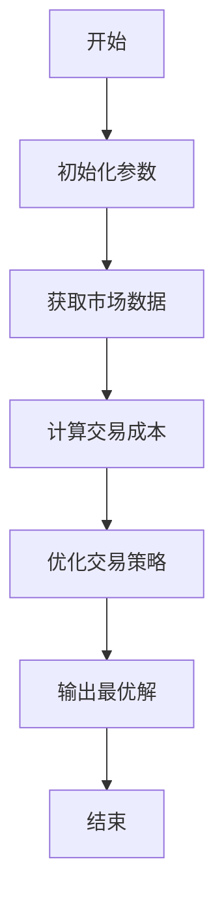
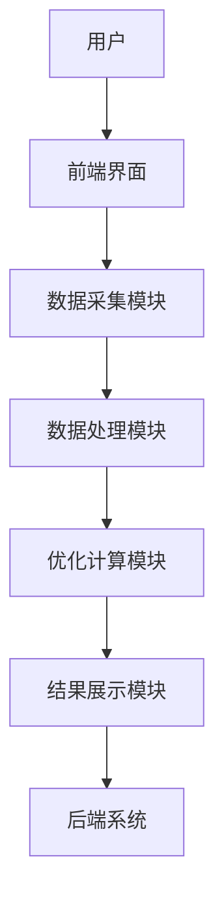
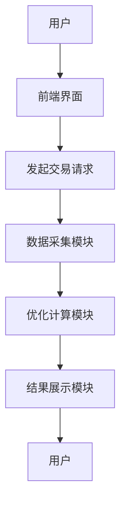

                 


# 金融市场交易成本优化系统

> 关键词：金融市场，交易成本，优化系统，算法原理，系统架构，项目实战

> 摘要：本文将深入探讨金融市场交易成本优化系统的构建与实现。从问题背景、核心概念、算法原理到系统架构设计，再到项目实战，系统性地分析和讲解如何优化金融市场交易成本。通过本文，读者将了解如何通过技术手段降低交易成本，提升交易效率，优化交易体验，为金融市场的高效运作提供技术支持。

---

## 第1章: 金融市场交易成本优化系统概述

### 1.1 问题背景与描述

#### 1.1.1 交易成本的概念与组成
在金融市场中，交易成本是指在进行证券交易时所产生的一系列费用和损失。交易成本主要包括以下几个方面：
- **直接成本**：如佣金（Commission）、过户费（Transfer Fee）、印花税（Stamp Duty）等。
- **间接成本**：如市场冲击（Market Impact）、机会成本（Opportunity Cost）、信息成本（Information Cost）等。

交易成本的高低直接影响投资者的收益，尤其是在高频交易和机构投资中，降低交易成本显得尤为重要。

#### 1.1.2 问题描述
在金融市场中，交易成本的优化是一个复杂的系统工程。传统的交易成本计算和优化方法往往存在以下问题：
- **数据来源单一**：无法全面考虑市场环境、交易策略、交易时间等多方面因素。
- **计算方法简单**：传统的交易成本计算方法通常只考虑单一因素，忽略了多因素的综合影响。
- **优化效率低下**：传统优化方法计算复杂，难以在实时交易中快速响应。

#### 1.1.3 问题解决
通过构建一个高效的交易成本优化系统，可以实现以下目标：
- **实时计算**：能够实时计算不同交易策略下的交易成本。
- **多因素分析**：能够综合考虑市场环境、交易时间、交易规模等多个因素。
- **快速优化**：能够在较短时间内找到最优的交易策略，降低交易成本。

### 1.2 交易成本优化系统的目标与意义

#### 1.2.1 系统目标
- 提供一个实时、高效的交易成本计算和优化平台。
- 优化交易成本，提升交易效率。
- 降低投资者的交易成本，提高投资收益。

#### 1.2.2 系统优化的意义
- 通过优化交易成本，提升金融市场的整体运行效率。
- 为投资者提供更精准的交易决策支持。
- 降低交易风险，提高市场的稳定性。

#### 1.2.3 系统优化的边界与外延
- **边界**：仅考虑交易成本的优化，不涉及市场预测、投资策略等其他因素。
- **外延**：可以与其他金融系统（如风险管理系统、投资管理系统）进行集成，形成完整的金融交易体系。

### 1.3 核心概念与联系

#### 1.3.1 核心概念原理
- **交易成本**：包括直接成本和间接成本。
- **优化目标**：最小化交易成本，最大化投资收益。
- **优化方法**：基于数学模型的优化算法。

#### 1.3.2 核心概念属性特征对比表

| 概念        | 直接成本 | 间接成本 | 总体成本 |
|-------------|----------|----------|----------|
| 定义        | 佣金、印花税等直接支付的费用 | 市场冲击、机会成本等隐性成本 | 包括直接成本和间接成本的总和 |
| 计算方式    | 确定性计算 | 统计模型估算 | 综合计算 |
| 优化难度    | 较低 | 较高 | 较高 |

#### 1.3.3 ER实体关系图架构
```mermaid
erDiagram
    participant 用户
    participant 交易系统
    participant 成交记录
    participant 市场数据
    participant 优化算法
    用户 -> 交易系统: 提交交易请求
    交易系统 -> 成交记录: 记录交易信息
    交易系统 -> 市场数据: 获取实时数据
    优化算法 -> 成交记录: 优化交易成本
```

---

## 第2章: 交易成本优化系统的算法原理

### 2.1 算法原理概述

#### 2.1.1 算法的基本思想
交易成本优化算法的核心思想是通过数学建模和优化方法，找到最优的交易策略，使得交易成本最小化。常用的方法包括：
- **线性规划**：适用于简单的优化问题。
- **动态规划**：适用于复杂的多阶段优化问题。
- **遗传算法**：适用于全局优化问题。

#### 2.1.2 算法的输入与输出
- **输入**：市场数据（如价格、成交量等）、交易策略、交易规模等。
- **输出**：最优交易策略、最小化交易成本。

#### 2.1.3 算法的步骤与流程
1. 数据收集：获取市场数据和交易策略。
2. 数据预处理：清洗数据，提取特征。
3. 模型建立：建立数学模型，定义目标函数和约束条件。
4. 算法优化：求解模型，得到最优解。
5. 结果验证：验证优化结果的可行性。

### 2.2 算法的数学模型与公式

#### 2.2.1 数学模型的建立
交易成本优化问题可以表示为一个优化问题：
$$
\text{目标函数} = \min C
$$
其中，$C$ 是交易成本。

#### 2.2.2 优化目标的数学表达
$$
C = w_1 C_1 + w_2 C_2 + \cdots + w_n C_n
$$
其中，$w_i$ 是第 $i$ 个成本项的权重，$C_i$ 是第 $i$ 个成本项的值。

#### 2.2.3 约束条件的数学描述
$$
\begin{cases}
C_1 \leq C_{1,\text{max}} \\
C_2 \leq C_{2,\text{max}} \\
\vdots \\
C_n \leq C_{n,\text{max}}
\end{cases}
$$
其中，$C_{i,\text{max}}$ 是第 $i$ 个成本项的最大值。

### 2.3 算法的实现与优化

#### 2.3.1 算法的实现流程


#### 2.3.2 算法的优化策略
- **参数优化**：通过调整参数，提高算法的优化效率。
- **模型优化**：优化数学模型，使其更符合实际场景。
- **并行计算**：利用多线程或分布式计算，提高计算效率。

#### 2.3.3 算法的复杂度分析
- **时间复杂度**：优化算法的时间复杂度取决于具体的优化方法。例如，线性规划的时间复杂度为 $O(n^3)$，遗传算法的时间复杂度为 $O(n^2)$。
- **空间复杂度**：优化算法的空间复杂度主要取决于数据存储的需求。

---

## 第3章: 交易成本优化系统的系统分析与架构设计

### 3.1 系统分析

#### 3.1.1 问题场景介绍
在金融市场中，投资者需要实时监控市场数据，计算交易成本，并优化交易策略。传统的交易成本计算方法往往无法满足实时性和高效性的要求。

#### 3.1.2 项目介绍与目标
- **项目介绍**：构建一个实时、高效的交易成本优化系统。
- **项目目标**：
  - 提供实时交易成本计算功能。
  - 提供多因素优化功能。
  - 提供最优交易策略推荐功能。

#### 3.1.3 系统功能需求分析
- **数据采集**：实时采集市场数据。
- **数据处理**：清洗、转换和存储数据。
- **优化计算**：计算交易成本，优化交易策略。
- **结果展示**：展示优化结果，提供决策支持。

### 3.2 系统架构设计

#### 3.2.1 系统架构的总体设计


#### 3.2.2 系统架构的详细设计
- **前端界面**：负责接收用户输入，展示优化结果。
- **数据采集模块**：负责采集市场数据。
- **数据处理模块**：负责清洗、转换和存储数据。
- **优化计算模块**：负责计算交易成本，优化交易策略。
- **结果展示模块**：负责展示优化结果。

#### 3.2.3 系统架构的实现方案
- **前端**：使用React框架，构建交互式界面。
- **后端**：使用Python的Django框架，搭建RESTful API。
- **数据采集**：使用API接口，实时获取市场数据。
- **数据处理**：使用数据库进行数据存储和管理。
- **优化计算**：使用Python的scipy库进行优化计算。

### 3.3 系统接口与交互设计

#### 3.3.1 系统接口的设计
- **API接口**：提供RESTful API，供前端调用。
- **数据接口**：与市场数据源对接，获取实时数据。

#### 3.3.2 系统交互的流程图


---

## 第4章: 交易成本优化系统的项目实战

### 4.1 环境安装与配置

#### 4.1.1 开发环境的搭建
- **操作系统**：Windows/Mac/Linux。
- **开发工具**：PyCharm/VS Code。
- **编程语言**：Python 3.8+。

#### 4.1.2 依赖库的安装
```bash
pip install numpy pandas scipy matplotlib requests
```

#### 4.1.3 系统的初始化与配置
- **配置文件**：设置API接口、数据库连接等参数。
- **环境变量**：配置市场数据源的API密钥。

### 4.2 系统核心实现

#### 4.2.1 核心算法的实现
```python
import numpy as np
from scipy.optimize import minimize

def transaction_cost(txn, price):
    return txn * price * 0.001  # 佣金为0.1%

def optimize(txn, price):
    # 目标函数
    def cost(x):
        return np.sum(transaction_cost(x, price))
    # 约束条件
    constraints = [{'type': 'eq', 'fun': lambda x: np.sum(x) - txn}]
    result = minimize(cost, txn, method='SLSQP')
    return result.x

txn = 1000  # 交易数量
price = [100, 99, 101, 102]  # 价格序列
optimal_txn = optimize(txn, price)
print(optimal_txn)
```

#### 4.2.2 系统功能的实现
- **数据采集**：通过API接口获取市场数据。
- **数据处理**：清洗、转换和存储数据。
- **优化计算**：使用scipy库进行优化计算。
- **结果展示**：将优化结果展示在前端界面。

#### 4.2.3 系统接口的实现
- **API接口**：提供RESTful API，供前端调用。
- **数据接口**：与市场数据源对接，获取实时数据。

### 4.3 代码应用与分析

#### 4.3.1 核心代码的解读
- **目标函数**：定义交易成本的计算方法。
- **优化算法**：使用scipy库的最小化函数进行优化。
- **约束条件**：确保交易数量的总和等于目标数量。

#### 4.3.2 代码的优化与改进
- **参数调整**：优化算法的参数，提高计算效率。
- **模型优化**：改进数学模型，使其更符合实际场景。

#### 4.3.3 代码的测试与验证
- **单元测试**：测试各个模块的功能。
- **集成测试**：测试系统整体的运行情况。
- **性能测试**：测试系统的处理能力。

---

## 第5章: 交易成本优化系统的最佳实践与小结

### 5.1 最佳实践 tips

#### 5.1.1 系统优化的注意事项
- **数据来源**：确保数据的准确性和实时性。
- **算法选择**：根据实际需求选择合适的优化算法。
- **系统架构**：确保系统的可扩展性和高效性。

#### 5.1.2 系统优化的常见问题
- **数据冗余**：避免数据冗余，提高数据处理效率。
- **算法效率**：优化算法的计算效率，降低系统的响应时间。
- **系统稳定性**：确保系统的稳定运行，避免因故障导致交易中断。

#### 5.1.3 系统优化的解决方案
- **数据压缩**：使用数据压缩技术，减少数据存储空间。
- **并行计算**：利用多线程或分布式计算，提高计算效率。
- **容错设计**：设计容错机制，确保系统的稳定性。

### 5.2 项目小结

#### 5.2.1 优化系统的核心价值
- 提供实时、高效的交易成本计算功能。
- 提供多因素优化功能，综合考虑市场环境、交易策略等多个因素。
- 提供最优交易策略推荐功能，帮助投资者降低交易成本，提高投资收益。

#### 5.2.2 优化系统的未来展望
- **智能化**：引入人工智能技术，实现智能化的交易成本优化。
- **自动化**：实现交易的自动化，减少人工干预。
- **全球化**：支持多市场的交易成本优化，实现全球化的交易成本管理。

### 5.3 注意事项

#### 5.3.1 交易成本的动态变化
交易成本会随着市场环境的变化而变化，需要实时监控和调整。

#### 5.3.2 交易策略的多样性
不同的交易策略会影响交易成本，需要综合考虑多种策略。

#### 5.3.3 系统的实时性要求
交易成本优化系统需要实时响应，确保交易的及时性和高效性。

### 5.4 拓展阅读

#### 5.4.1 推荐书籍
- 《算法导论》
- 《金融工程》
- 《Python金融计算》

#### 5.4.2 推荐博客与资源
- [FinTech博客](https://www.fintechblog.com)
- [Python金融计算社区](https://www.pythonfinance.com)
- [Scipy官方文档](https://scipy.org)

---

## 作者

作者：AI天才研究院/AI Genius Institute & 禅与计算机程序设计艺术 /Zen And The Art of Computer Programming

---

通过本文，我们详细探讨了金融市场交易成本优化系统的构建与实现。从问题背景到系统架构设计，再到项目实战，系统性地分析和讲解了如何优化金融市场交易成本。希望本文能够为读者提供有价值的参考和启发。

