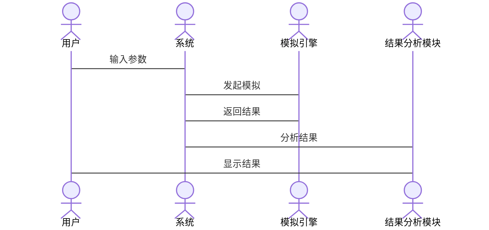

                 


# 金融市场传染效应模拟系统

> 关键词：金融市场、传染效应、系统模拟、算法原理、网络模型、扩散模型

> 摘要：本文将详细介绍金融市场传染效应模拟系统的构建与实现。从背景介绍、核心概念、算法原理到系统架构、项目实战，最后给出最佳实践和未来展望。通过系统的分析与设计，为读者提供一个全面的金融市场传染效应模拟框架。

---

## 第一部分: 金融市场传染效应概述

### 第1章: 金融市场传染效应的背景与概念

#### 1.1 金融市场传染效应的定义
- 传染效应的定义
- 传染效应的特征
- 传染效应的分类

#### 1.2 金融市场传染效应的表现形式
- 股票市场的传染效应
- 债券市场的传染效应
- 外汇市场的传染效应

#### 1.3 传染效应的传播机制
- 价格波动的传播路径
- 市场参与者的心理因素
- 市场结构的复杂性

#### 1.4 传染效应的边界与外延
- 传染效应的边界条件
- 传染效应的外延范围
- 传染效应与其他金融现象的关系

#### 1.5 本章小结

---

## 第二部分: 传染效应的核心概念与联系

### 第2章: 核心概念与原理

#### 2.1 传染效应的核心概念
- 传染源的定义与特征
- 传染路径的分类
- 传染强度的衡量指标

#### 2.2 传染效应的数学模型
- 扩散模型的数学表达
- 网络模型的构建
- 随机过程模型的应用

#### 2.3 传染效应的ER实体关系图
```mermaid
er
    actor 投资者
    actor 市场
    actor 资产
    actor 价格
    actor 时间
    actor 传染路径
    actor 传染强度
    actor 传染源
    actor 传染结果
    actor 边界条件
```

#### 2.4 传染效应的对比分析
- 不同传染机制的对比
- 传染强度与传播速度的对比
- 传染范围与传染源的关系

#### 2.5 本章小结

---

## 第三部分: 传染效应的算法原理

### 第3章: 传染效应模拟算法

#### 3.1 传染效应的扩散模型
- 扩散模型的原理
- 扩散模型的实现步骤
- 扩散模型的数学公式
$$\frac{dS}{dt} = \beta S I$$

#### 3.2 传染效应的网络模型
- 网络模型的构建
- 网络模型的传播规则
- 网络模型的实现

#### 3.3 传染效应的数学公式
- 网络模型的数学表达
- 扩散模型的数学推导
- 传染强度的数学计算

#### 3.4 传染效应的模拟代码实现
```python
import networkx as nx
import matplotlib.pyplot as plt
import numpy as np

# 创建一个示例网络
G = nx.erdos_renyi_graph(10, 0.5)
nx.draw(G, with_labels=True, node_color='red', edge_color='blue', alpha=0.8)
plt.show()

# 初始化感染状态
initial_infection = [0, 1, 0, 0, 1]
state = np.array(initial_infection)

# 传播概率
beta = 0.3

# 模拟传播过程
for t in range(10):
    new_infection = np.zeros_like(state)
    for i in range(len(state)):
        if state[i] == 1:
            for neighbor in G.neighbors(i):
                if state[neighbor] == 0:
                    new_infection[neighbor] = 1
    state += new_infection
    print(f"Time step {t}: {state}")
```

#### 3.5 传染效应的模拟结果分析
- 模拟结果的可视化
- 模拟结果的统计分析
- 模拟结果的对比分析

#### 3.6 本章小结

---

## 第四部分: 传染效应的系统架构与实现

### 第4章: 系统架构与设计

#### 4.1 系统功能设计
- 领域模型的构建
- 传染效应的模拟功能
- 结果分析与可视化功能

#### 4.2 系统架构设计


#### 4.3 系统接口设计
- 输入接口的设计
- 输出接口的设计
- 数据接口的设计

#### 4.4 系统交互设计


#### 4.5 本章小结

---

## 第五部分: 项目实战与案例分析

### 第5章: 项目实战

#### 5.1 环境安装与配置
- 安装Python环境
- 安装相关库（如networkx、matplotlib等）
- 配置开发环境

#### 5.2 核心代码实现
- 模拟引擎的实现
- 结果分析模块的实现
- 用户界面的设计

#### 5.3 代码解读与分析
- 模拟引擎的核心逻辑
- 结果分析模块的实现细节
- 用户界面的设计思路

#### 5.4 实际案例分析
- 案例背景介绍
- 案例模拟过程
- 案例分析结果

#### 5.5 本章小结

---

## 第六部分: 最佳实践与未来展望

### 第6章: 最佳实践

#### 6.1 系统设计的注意事项
- 系统的可扩展性
- 系统的可维护性
- 系统的性能优化

#### 6.2 算法选择的建议
- 根据实际需求选择算法
- 确保算法的高效性
- 考虑算法的可解释性

#### 6.3 系统实现的注意事项
- 数据的准确性
- 系统的稳定性
- 系统的可扩展性

#### 6.4 本章小结

---

## 第七部分: 总结与展望

### 第7章: 总结与展望

#### 7.1 本文总结
- 核心内容回顾
- 系统实现总结
- 实验结果总结

#### 7.2 未来展望
- 新算法的研究
- 系统的优化方向
- 应用领域的拓展

#### 7.3 本章小结

---

## 作者：AI天才研究院/AI Genius Institute & 禅与计算机程序设计艺术 /Zen And The Art of Computer Programming

