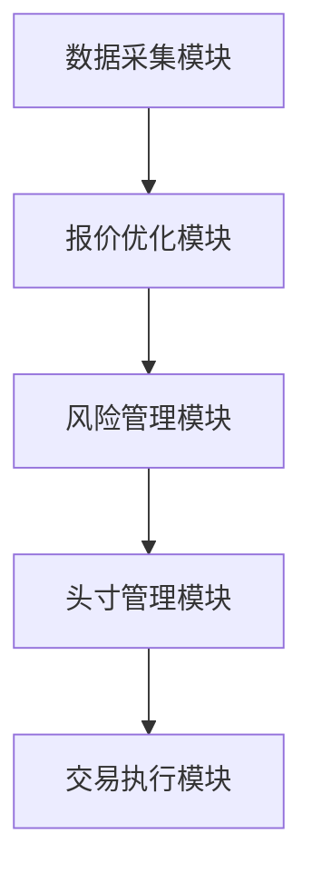

                 


# 金融市场做市商报价优化与风险管理

> 关键词：做市商，报价优化，风险管理，市场微观结构，金融系统架构，数学模型

> 摘要：本文从做市商的基本概念出发，系统地探讨了报价优化与风险管理的核心原理、数学模型、系统架构和实际应用。通过深入分析市场微观结构，结合具体的数学模型和算法流程图，详细讲解了报价优化与风险管理的实现方法。同时，本文还通过实际案例分析，展示了如何在实际金融市场中应用这些优化方法，并提出了未来的研究方向和最佳实践建议。

---

# 第1章: 做市商的基本概念与背景

## 1.1 做市商的定义与角色

### 1.1.1 做市商的基本定义

做市商（Market Maker）是指在金融市场中主动提供买卖报价，以促进市场流动性和价格发现的参与者。做市商通过在市场上同时挂出买入和卖出订单，为其他投资者提供交易对手方，从而维护市场的流动性和稳定性。

**定义**：  
做市商是指在金融市场中主动提供买卖报价的参与者，通过同时挂出买入和卖出订单来促进市场交易。

### 1.1.2 做市商在金融市场中的角色

做市商在金融市场中扮演着多重角色，包括：

1. **价格发现**：通过主动挂单，做市商帮助确定市场的均衡价格。
2. **市场流动性提供者**：做市商通过提供买卖订单，增加了市场的深度和流动性。
3. **风险管理参与者**：做市商通过调整报价和头寸管理，控制自身的市场风险。

### 1.1.3 做市商与市场的关系

做市商与市场的关系是相互依存的。做市商的存在使得市场能够更高效地运行，而市场的波动性和参与者行为也直接影响做市商的报价策略和风险管理。

---

## 1.2 做市商的历史演变

### 1.2.1 做市商制度的起源

做市商制度起源于19世纪的伦敦证券交易所，早期的做市商主要是手工报价，为投资者提供交易服务。随着金融市场的快速发展，做市商的角色逐渐从传统的手工报价转向自动化报价。

### 1.2.2 现代做市商制度的发展

随着电子交易系统的普及，现代做市商通过算法和自动化系统进行实时报价和订单处理。这种自动化做市商（Algorithmic Market Maker）能够根据市场数据动态调整报价，优化收益并控制风险。

### 1.2.3 做市商制度的全球化趋势

近年来，做市商制度在全球范围内得到了广泛应用，尤其是在场外市场（OTC市场）和新兴市场。做市商的存在使得这些市场更加活跃和高效。

---

## 1.3 做市商的核心功能

### 1.3.1 维护市场流动性

做市商通过提供持续的买卖报价，确保市场的流动性。特别是在市场波动剧烈时，做市商的存在能够为投资者提供即时的交易对手方，减少市场深度的枯竭。

### 1.3.2 提供价格发现

做市商通过挂单和调整报价，帮助市场发现合理的资产价格。价格发现是金融市场的重要功能，能够反映市场的供需关系。

### 1.3.3 管理市场风险

做市商通过头寸管理和风险对冲，降低市场的系统性风险。例如，做市商可以通过套期保值和对冲交易，减少自身和市场的风险敞口。

---

## 1.4 本章小结

本章介绍了做市商的基本概念、历史演变和核心功能。做市商在金融市场中扮演着价格发现、维护流动性和管理风险的重要角色。随着金融市场的自动化和全球化，做市商的角色和功能也在不断演变和扩展。

---

# 第2章: 报价优化的核心概念与原理

## 2.1 报价优化的基本原理

### 2.1.1 报价优化的定义

报价优化是指通过数学模型和算法，对做市商的买卖报价进行动态调整，以实现收益最大化和风险最小化的过程。

### 2.1.2 报价优化的目标

报价优化的目标包括：

1. **最大化收益**：通过优化买卖价差和交易量，提高做市商的利润。
2. **最小化风险**：通过调整报价，降低市场风险和流动性风险。
3. **提高市场效率**：通过优化报价，促进市场的流动性和价格发现。

### 2.1.3 报价优化的实现方法

报价优化的实现方法主要包括：

1. **基于市场微观结构的优化**：通过分析市场深度、订单簿数据和市场参与者行为，调整报价。
2. **基于统计套利的优化**：利用统计套利模型，优化做市商的头寸和报价。
3. **基于机器学习的优化**：使用机器学习算法，动态调整报价策略。

---

## 2.2 市场微观结构与报价优化

### 2.2.1 市场微观结构的基本概念

市场微观结构是指市场中参与者的行为、订单簿结构和交易机制。主要包括以下几个方面：

1. **订单簿**：记录买方和卖方的订单及其价格和数量。
2. **市场深度**：市场在某一价格水平上可以交易的订单数量。
3. **订单流**：市场的订单生成和交易过程。

### 2.2.2 做市商报价对市场的影响

做市商的报价直接影响市场的买卖价差、订单深度和交易量。例如，做市商可以通过调整买卖价差来影响市场的流动性。

### 2.2.3 微观结构与报价优化的关系

市场微观结构是报价优化的重要依据。做市商需要根据市场深度、订单流和参与者行为，动态调整报价策略。

---

## 2.3 报价优化的数学模型

### 2.3.1 报价模型的基本框架

报价优化的数学模型通常包括以下几个部分：

1. **价格预测模型**：预测未来资产价格的变化。
2. **订单簿分析模型**：分析订单簿中的买方和卖方订单。
3. **报价调整模型**：根据市场数据，动态调整买卖报价。

### 2.3.2 市场深度与报价关系的数学表达

假设市场深度为 $D$，做市商的买卖价差为 $s$，则报价优化的目标是最优化 $s$ 和 $D$ 的关系，以实现收益最大化和风险最小化。

数学表达式如下：

$$ \text{收益} = (s) \times \text{交易量} $$
$$ \text{风险} = \text{波动率} \times \text{头寸} $$

### 2.3.3 动态调整模型的实现

动态调整模型通过实时分析市场数据，调整买卖报价。例如，基于马科夫链的动态调整模型可以预测未来的价格变化，并根据预测结果调整报价。

---

## 2.4 本章小结

本章详细讲解了报价优化的核心概念与原理。报价优化是做市商在金融市场中实现收益最大化和风险最小化的关键手段。通过分析市场微观结构和使用数学模型，做市商可以动态调整报价策略，提高市场效率和自身收益。

---

# 第3章: 风险管理的核心概念与方法

## 3.1 风险管理的基本原理

### 3.1.1 风险的定义与分类

风险是指在金融市场中，由于价格波动或其他因素导致的损失可能性。常见的风险类型包括：

1. **市场风险**：由于市场价格波动导致的损失。
2. **信用风险**：由于交易对手违约导致的损失。
3. **操作风险**：由于系统故障或人为错误导致的损失。

### 3.1.2 风险管理的目标

风险管理的目标包括：

1. **最小化潜在损失**：通过风险对冲和头寸管理，降低潜在损失。
2. **确保市场稳定性**：通过风险管理，维护市场的流动性和稳定性。
3. **提高收益**：通过风险管理，优化收益与风险的平衡。

### 3.1.3 风险管理的基本方法

风险管理的基本方法包括：

1. **风险识别**：识别潜在风险来源。
2. **风险评估**：评估风险的大小和影响。
3. **风险对冲**：通过头寸对冲，降低风险敞口。
4. **风险监控**：实时监控市场风险和头寸变化。

---

## 3.2 做市商面临的主要风险

### 3.2.1 市场风险

市场风险是指由于市场价格波动导致的损失。做市商通过调整头寸和报价，降低市场风险。

### 3.2.2 信用风险

信用风险是指由于交易对手违约导致的损失。做市商需要通过严格的信用评估和对冲策略，降低信用风险。

### 3.2.3 操作风险

操作风险是指由于系统故障或人为错误导致的损失。做市商需要通过系统优化和流程改进，降低操作风险。

---

## 3.3 风险管理的数学模型

### 3.3.1 风险价值（VaR）模型

风险价值（Value at Risk，VaR）模型是常用的市场风险度量方法。VaR模型计算在一定置信水平下，资产组合的最大可能损失。

数学表达式如下：

$$ VaR = \text{损失的分位数} $$

### 3.3.2 凸性风险（CVaR）模型

凸性风险（Conditional Value at Risk，CVaR）模型是VaR模型的扩展，考虑了在VaR水平上的平均损失。

数学表达式如下：

$$ CVaR = \mathbb{E}[L | L > VaR] $$

### 3.3.3 风险调整后的回报模型

风险调整后的回报模型将风险因素纳入收益计算，帮助做市商优化收益与风险的平衡。

数学表达式如下：

$$ \text{风险调整后收益} = \text{收益} - \text{风险成本} $$

---

## 3.4 本章小结

本章详细讲解了风险管理的核心概念与方法。做市商需要通过风险识别、评估、对冲和监控，降低市场风险、信用风险和操作风险。通过使用VaR、CVaR等数学模型，做市商可以更好地管理风险，实现收益与风险的平衡。

---

# 第4章: 报价优化与风险管理的系统架构

## 4.1 系统功能模块设计

### 4.1.1 数据采集模块

数据采集模块负责收集市场数据，包括订单簿、交易量和价格数据等。

### 4.1.2 报价优化模块

报价优化模块通过分析市场数据，动态调整买卖报价，实现报价优化。

### 4.1.3 风险管理模块

风险管理模块负责实时监控市场风险和头寸变化，调整对冲策略。

---

## 4.2 系统架构设计

### 4.2.1 分层架构设计

系统架构采用分层设计，包括数据层、业务逻辑层和用户界面层。

### 4.2.2 模块间的交互关系

模块间的交互关系如下：

1. 数据采集模块将市场数据传递给报价优化模块和风险管理模块。
2. 报价优化模块根据市场数据调整报价，并将结果传递给风险管理模块。
3. 风险管理模块根据报价结果和市场数据，调整对冲策略，并将结果反馈给报价优化模块。

### 4.2.3 系统的可扩展性设计

系统的可扩展性设计允许未来添加新的模块和功能，例如引入机器学习算法进行报价优化。

---

## 4.3 系统接口设计

### 4.3.1 系统接口的设计

系统接口设计包括以下几个部分：

1. **数据接口**：与交易所或其他数据源对接，获取市场数据。
2. **报价接口**：向市场发送买卖报价。
3. **风险监控接口**：实时监控市场风险和头寸变化。

### 4.3.2 系统交互流程图

以下是系统的交互流程图：



---

## 4.4 本章小结

本章详细讲解了报价优化与风险管理的系统架构设计。通过分层架构和模块化设计，做市商可以高效地进行报价优化和风险管理，确保系统的稳定性和可扩展性。

---

# 第5章: 项目实战

## 5.1 环境安装与配置

### 5.1.1 系统环境要求

系统环境要求包括：

1. **操作系统**：Linux/Windows/MacOS
2. **编程语言**：Python
3. **依赖库**：Pandas、NumPy、Matplotlib、Scikit-learn

### 5.1.2 数据源配置

数据源可以包括：

1. **交易所API**：通过API获取实时市场数据。
2. **历史数据**：从数据库中获取历史订单数据。

---

## 5.2 系统核心实现

### 5.2.1 报价优化模块实现

以下是报价优化模块的核心代码：

```python
import numpy as np
import pandas as pd

def optimize_quotes(market_depth, volatility):
    bid_price = market_depth['bid_price']
    ask_price = market_depth['ask_price']
    spread = ask_price - bid_price
    adjusted_spread = spread * (1 - volatility)
    return {
        'bid_price': bid_price - adjusted_spread,
        'ask_price': ask_price + adjusted_spread
    }
```

### 5.2.2 风险管理模块实现

以下是风险管理模块的核心代码：

```python
def calculate_risk(head

