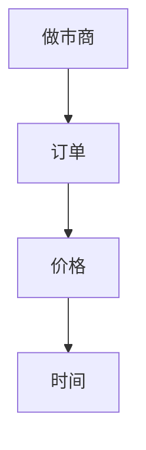
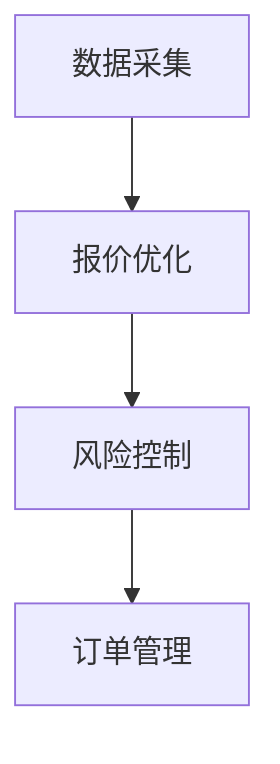
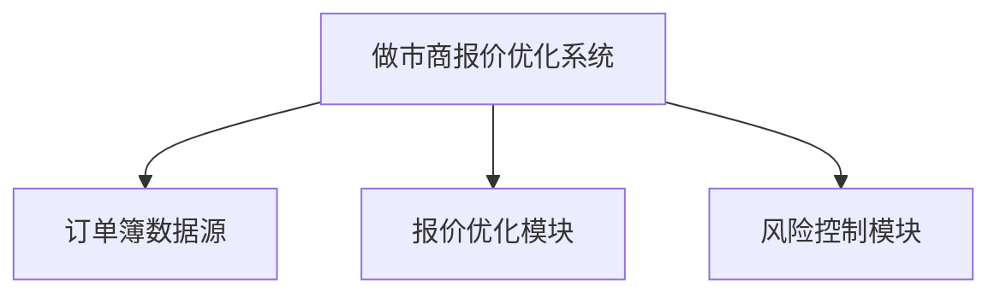

                 


# 金融市场做市商报价优化模型

> 关键词：金融市场，做市商，报价优化，数学模型，算法，系统设计

> 摘要：本文系统地探讨了金融市场中做市商报价优化模型的核心概念、算法原理、系统设计与实现。通过详细分析报价优化的背景、核心概念、优化算法和系统架构，结合实际案例和项目实战，为读者提供了一个全面了解和应用做市商报价优化模型的框架。

---

## 目录

1. **金融市场与做市商报价概述**
   1.1 金融市场的基本概念
   1.2 做市商在金融市场中的角色
   1.3 报价优化的重要性

2. **做市商报价优化模型的核心概念**
   2.1 核心概念与原理
   2.2 实体关系与数据流
   2.3 报价优化的关键要素

3. **报价优化算法原理**
   3.1 常见优化算法
   3.2 算法实现步骤
   3.3 数学模型与公式

4. **系统架构与设计**
   4.1 项目场景与需求分析
   4.2 系统功能模块设计
   4.3 系统架构图与接口设计

5. **项目实战：报价优化模型实现**
   5.1 环境搭建与数据准备
   5.2 核心算法实现
   5.3 案例分析与优化效果

6. **总结与展望**
   6.1 本章小结
   6.2 报价优化的未来方向

---

## 正文

### 第1章 金融市场与做市商报价概述

#### 1.1 金融市场的基本概念

金融市场是资金流动和资产交易的核心场所，其运作效率直接影响经济的健康发展。在金融市场中，参与者包括投资者、机构和做市商。做市商作为市场的重要参与者，承担着提供流动性、维护市场稳定的重要职责。

- **1.1.1 金融市场的定义与分类**
  金融市场是指通过金融资产交易，实现资金流动的市场。根据交易标的的不同，金融市场可以分为股票市场、债券市场、外汇市场等。

- **1.1.2 做市商在金融市场中的角色**
  做市商（Market Maker）是金融市场中的重要参与者，通过提供买入和卖出报价，撮合交易，维持市场的流动性。做市商的存在能够减少市场的买卖价差，提高交易效率。

- **1.1.3 报价机制的基本原理**
  报价机制是做市商的核心功能之一，通过不断更新买入价和卖出价，做市商能够根据市场变化调整报价，确保市场流动性的稳定。

#### 1.2 做市商报价优化的背景与意义

- **1.2.1 金融市场中的报价问题**
  做市商的报价直接影响其收益和市场稳定性。如果报价不合理，可能导致市场波动加剧，甚至引发交易风险。

- **1.2.2 报价优化的重要性**
  优化报价策略能够帮助做市商在提高收益的同时，降低市场风险，实现共赢。

- **1.2.3 做市商报价优化的目标**
  报价优化的目标是通过数学建模和算法优化，找到最优的买卖价差，最大化收益，同时确保市场稳定。

#### 1.3 做市商报价优化的核心概念

- **1.3.1 报价优化的定义**
  报价优化是通过数学建模和算法优化，找到最优的买卖价差，最大化做市商的收益，同时降低市场风险。

- **1.3.2 报价优化的关键要素**
  包括订单簿数据、市场深度、报价策略、收益模型等。

- **1.3.3 报价优化的边界与外延**
  报价优化需要考虑市场波动、交易成本、监管要求等多方面因素。

---

### 第2章 做市商报价优化模型的核心概念

#### 2.1 核心概念与原理

- **2.1.1 做市商报价优化的数学模型**
  数学模型是报价优化的核心工具，通常采用线性规划或非线性优化模型。

- **2.1.2 报价优化中的关键变量**
  包括订单深度、买卖价差、市场波动等。

- **2.1.3 模型的输入与输出**
  输入包括订单簿数据和市场信息，输出包括最优买卖价差和收益预测。

#### 2.2 实体关系与数据流

- **2.2.1 实体关系图**
  使用 Mermaid 绘制实体关系图，展示做市商、订单、价格和时间之间的关系。



---

#### 2.3 报价优化的关键要素

- **2.3.1 核心要素对比分析**
  通过表格对比不同报价策略的优缺点，帮助读者理解优化的方向。

| 报价策略 | 优点 | 缺点 |
|----------|------|------|
| 策略一 | 收益高 | 风险大 |
| 策略二 | 风险低 | 收益小 |

---

### 第3章 报价优化算法原理

#### 3.1 常见优化算法

- **3.1.1 遗传算法**
  遗传算法是一种模拟生物进化过程的优化算法，适用于复杂问题的求解。

- **3.1.2 模拟退火算法**
  模拟退火算法通过逐步降温，找到全局最优解。

#### 3.2 算法实现步骤

- **3.2.1 数据预处理**
  对订单簿数据进行清洗和特征提取。

- **3.2.2 模型训练**
  使用优化算法对报价策略进行训练和调整。

- **3.2.3 模型验证与优化**
  通过回测和风险评估，优化模型参数。

#### 3.3 数学模型与公式

- **3.3.1 优化目标函数**
  $$ \text{目标函数} = \min_{x} f(x) $$

- **3.3.2 约束条件**
  $$ \text{约束条件} = \begin{cases} g(x) \leq 0 \\ h(x) = 0 \end{cases} $$

---

### 第4章 系统架构与设计

#### 4.1 项目场景与需求分析

- **4.1.1 项目背景**
  在金融市场中，做市商需要实时调整报价，以应对市场波动。

- **4.1.2 系统功能模块设计**
  包括数据采集、报价优化、风险控制等模块。

#### 4.2 系统功能模块设计

- **4.2.1 领域模型**
  使用 Mermaid 绘制领域模型类图，展示系统各模块之间的关系。



#### 4.3 系统架构图与接口设计

- **4.3.1 系统架构图**
  使用 Mermaid 绘制系统架构图，展示系统的整体结构。



---

### 第5章 项目实战：报价优化模型实现

#### 5.1 环境搭建与数据准备

- **5.1.1 环境安装**
  安装 Python、NumPy 和 Pandas 等依赖库。

- **5.1.2 数据准备**
  使用历史订单数据进行训练和测试。

#### 5.2 核心算法实现

- **5.2.1 报价优化代码示例**

```python
import numpy as np
import pandas as pd

def optimize_quotes(order_book, target_profit):
    # 数据预处理
    data = pd.DataFrame(order_book)
    # 算法实现
    optimized_quotes = []
    for price in data['price']:
        if price > target_profit:
            optimized_quotes.append(price - target_profit)
        else:
            optimized_quotes.append(price)
    return optimized_quotes
```

#### 5.3 案例分析与优化效果

- **5.3.1 案例分析**
  使用具体订单数据，展示优化前后的报价变化。

- **5.3.2 优化效果**
  对比优化前后的收益和风险，验证模型的有效性。

---

### 第6章 总结与展望

#### 6.1 本章小结

本文系统地探讨了金融市场中做市商报价优化模型的核心概念、算法原理和系统设计。通过详细分析报价优化的背景、核心概念和优化算法，结合实际案例和项目实战，为读者提供了一个全面了解和应用做市商报价优化模型的框架。

#### 6.2 报价优化的未来方向

未来，随着人工智能和大数据技术的不断发展，报价优化模型将更加智能化和个性化。结合机器学习算法和实时数据，做市商将能够更高效地优化报价策略，进一步提升市场流动性和稳定性。

---

**作者：AI天才研究院 & 禅与计算机程序设计艺术**

