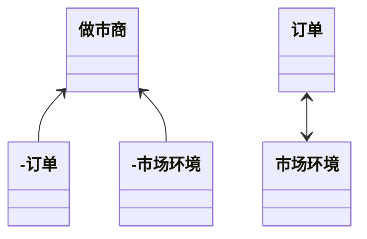
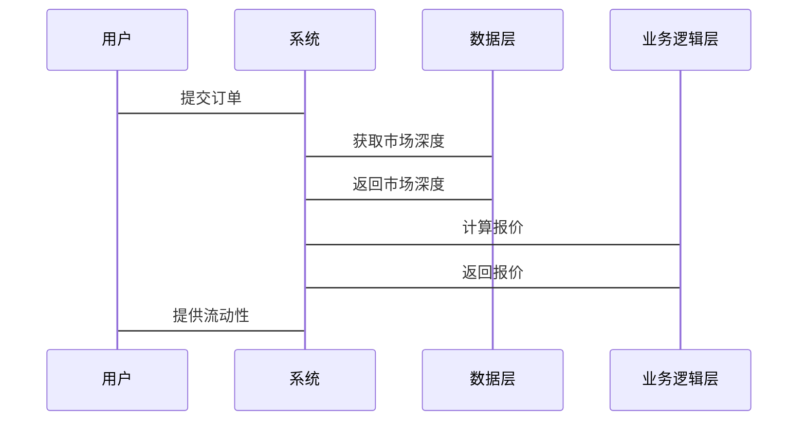

                 


# 金融市场做市商策略优化

**关键词**：做市商，策略优化，高频交易，算法交易，市场微观结构

**摘要**：本文深入探讨了金融市场中做市商策略优化的核心概念、算法原理、系统设计以及实际应用。通过分析市场微观结构，结合机器学习和优化算法，提出了一种基于订单簿数据的做市商优化策略，并通过项目实战展示了如何实现该策略。最后，本文总结了策略优化的关键点和未来研究方向。

---

## 第1章 金融市场做市商概述

### 1.1 做市商的角色与重要性

#### 1.1.1 做市商的定义与基本职能
做市商（Market Maker）是指在金融市场中主动提供买卖报价，维持市场流动性的机构。其核心职能包括：
- 提供连续的买卖报价
- 维护市场深度
- 处理订单流

#### 1.1.2 做市商在金融市场中的地位
做市商是金融市场的重要参与者，负责提供流动性，降低买卖价差，提高市场效率。他们的存在使得市场参与者能够以更优的价格进行交易，尤其是在订单簿不活跃的情况下。

#### 1.1.3 做市商对市场流动性的贡献
做市商通过主动报价和订单处理，增加了市场的流动性，减少了市场的波动性，为投资者提供了更稳定的交易环境。

### 1.2 做市商策略优化的必要性

#### 1.2.1 传统做市商策略的局限性
传统做市商策略通常基于简单的价差和成交量预测，难以应对高频交易和算法交易带来的复杂市场环境。主要问题包括：
- 无法有效预测短期价格波动
- 风险管理能力有限
- 无法快速适应市场变化

#### 1.2.2 市场环境变化对做市商策略的影响
随着高频交易和算法交易的普及，市场环境发生了显著变化：
- 交易速度加快
- 数据量剧增
- 市场微观结构复杂化

这些变化要求做市商不断优化其策略，以适应新的市场环境。

#### 1.2.3 策略优化的目标与意义
做市商策略优化的目标是通过改进报价策略和订单处理算法，提高收益、降低风险并提高市场流动性。其意义在于：
- 提高市场竞争力
- 增强风险控制能力
- 提高市场效率

### 1.3 当前金融市场环境分析

#### 1.3.1 高频交易的兴起
高频交易（High-Frequency Trading, HFT）是一种利用高速计算机和算法在极短时间内进行大量交易的交易方式。其兴起得益于技术进步和市场结构的变化，但也带来了新的挑战，如市场闪崩风险。

#### 1.3.2 算法交易的普及
算法交易（Algorithmic Trading）是利用数学模型和算法自动执行交易的策略。其普及使得市场参与者能够更快地做出决策，但也增加了市场的复杂性。

#### 1.3.3 市场微观结构的变化
市场微观结构的变化包括订单簿的复杂化、市场参与者行为的多样化以及信息传播速度的加快。这些变化要求做市商更加精细地管理订单流和价格波动。

## 1.4 本章小结
本章介绍了做市商的基本概念和角色，分析了策略优化的必要性，并探讨了当前金融市场环境的变化对做市商策略的影响。接下来的章节将详细探讨做市商策略优化的核心概念、算法原理、系统设计和实际应用。

---

## 第2章 做市商策略优化的核心概念与联系

### 2.1 市场微观结构分析

#### 2.1.1 市场深度与订单簿分析
市场深度（Market Depth）是指在特定价格水平上可以成交的订单数量。订单簿分析是做市商策略优化的重要工具，通过对订单簿数据的分析，可以预测价格波动和交易量变化。

#### 2.1.2 市场冲击与流动性风险
市场冲击（Market Impact）是指大额交易对市场价格的影响。流动性风险是指在短时间内无法以合理价格成交的风险。做市商需要通过优化策略来降低市场冲击和流动性风险。

#### 2.1.3 市场参与者的行为特征
市场参与者包括机构投资者、高频交易商和零售投资者。不同参与者的行为特征不同，做市商需要根据这些特征调整其报价策略。

### 2.2 做市商策略优化的关键因素

#### 2.2.1 价格预测与波动性
价格预测是做市商策略优化的核心，准确的价格预测可以帮助做市商更好地管理买卖价差和风险。

#### 2.2.2 成交量预测与订单处理
成交量预测是做市商策略优化的另一个关键因素。通过对成交量的预测，做市商可以更好地管理订单流和库存风险。

#### 2.2.3 风险管理与资本分配
风险管理是做市商策略优化的重要组成部分。通过有效的风险管理，做市商可以降低市场冲击和流动性风险，同时优化资本分配。

### 2.3 核心概念对比分析

#### 2.3.1 被动做市与主动做市的对比
被动做市（Passive Market Making）是指做市商仅根据市场订单流进行报价，不主动干预价格。主动做市（Active Market Making）是指做市商主动调整报价，以影响市场价格和订单流。

#### 2.3.2 不同做市策略的优缺点
- 被动做市策略：优点是风险较低，操作简单；缺点是收益有限，难以应对复杂市场环境。
- 主动做市策略：优点是收益较高，能够应对复杂市场环境；缺点是风险较高，操作复杂。

#### 2.3.3 做市商与经纪商的协同关系
做市商与经纪商在金融市场中相互依存。经纪商为做市商提供订单流，做市商为经纪商提供流动性。两者之间的协同关系是做市商策略优化的重要外部因素。

### 2.4 实体关系图（ER图）

```mermaid
erDiagram
    actor 做市商 {
        <属性>
        报价策略
        订单处理算法
        风险管理模型
    }
    actor 市场参与者 {
        <属性>
        订单流
        市场深度
        市场冲击
    }
    actor 市场环境 {
        <属性>
        市场微观结构
        高频交易
        算法交易
    }
    做市商 --> 市场参与者: 提供流动性
    市场参与者 --> 做市商: 提供订单流
    做市商 --> 市场环境: 适应市场变化
    市场环境 --> 做市商: 影响策略优化
```

---

## 第3章 基于机器学习的做市商策略优化算法

### 3.1 算法原理讲解

#### 3.1.1 机器学习在做市商策略优化中的应用
机器学习（Machine Learning）是一种通过数据训练模型来预测和优化决策的算法。在做市商策略优化中，机器学习可以用于价格预测、订单处理和风险管理。

#### 3.1.2 基于机器学习的价格预测模型
价格预测模型是做市商策略优化的重要组成部分。常见的价格预测模型包括：
- 线性回归模型
- 支持向量回归（SVR）
- 随机森林回归
- LSTM神经网络

#### 3.1.3 优化算法的实现
优化算法是做市商策略优化的核心。常见的优化算法包括：
- 遗传算法（Genetic Algorithm）
- 粒子群优化（Particle Swarm Optimization）
- 模拟退火（Simulated Annealing）

### 3.2 算法实现步骤

#### 3.2.1 数据收集与预处理
数据收集是做市商策略优化的第一步。数据来源包括：
- 历史价格数据
- 订单簿数据
- 市场参与者行为数据

数据预处理包括数据清洗、特征提取和数据标准化。

#### 3.2.2 模型训练与优化
模型训练是基于机器学习的价格预测和优化算法的实现过程。通过训练数据，模型可以预测价格波动和交易量变化。

#### 3.2.3 模型评估与部署
模型评估是通过回测和实证分析来验证模型的有效性和稳定性。模型部署是将优化后的策略应用于实际交易中。

### 3.3 算法实现的数学模型

#### 3.3.1 价格预测模型
$$ y = \beta_0 + \beta_1 x_1 + \beta_2 x_2 + \cdots + \beta_n x_n + \epsilon $$
其中，$y$ 是目标变量（价格），$x_i$ 是自变量（特征），$\beta_i$ 是系数，$\epsilon$ 是误差项。

#### 3.3.2 优化目标函数
$$ \text{目标函数} = \sum_{i=1}^{n} (y_i - \hat{y}_i)^2 $$
其中，$y_i$ 是实际值，$\hat{y}_i$ 是预测值。

---

## 第4章 做市商策略优化系统的系统分析与架构设计

### 4.1 系统分析

#### 4.1.1 问题场景介绍
做市商在高频交易中面临的主要问题包括：
- 订单处理速度慢
- 市场微观结构复杂
- 风险管理能力有限

#### 4.1.2 项目介绍
本项目旨在设计一个基于机器学习的做市商策略优化系统，通过分析订单簿数据，优化报价策略和订单处理算法。

### 4.2 系统功能设计

#### 4.2.1 领域模型设计
领域模型包括以下实体：
- 做市商
- 订单
- 市场环境

实体关系如下：


#### 4.2.2 系统架构设计
系统架构包括以下层次：
- 数据层：存储和管理数据
- 业务逻辑层：处理业务逻辑和算法
- 用户界面层：与用户交互

系统架构如下：
```mermaid
archi
    做市商策略优化系统
    数据层 --> 业务逻辑层
    业务逻辑层 --> 用户界面层
```

### 4.3 系统接口设计

#### 4.3.1 API接口设计
API接口用于与其他系统（如交易系统、数据源）进行交互。主要接口包括：
- 获取订单簿数据
- 提交报价
- 获取市场深度

#### 4.3.2 交互流程图
交互流程图展示用户与系统的交互过程：


---

## 第5章 做市商策略优化系统的项目实战

### 5.1 项目环境安装

#### 5.1.1 Python环境安装
安装Python和必要的库：
- NumPy
- Pandas
- Scikit-learn
- TensorFlow
- Matplotlib

安装命令：
```bash
pip install numpy pandas scikit-learn tensorflow matplotlib
```

#### 5.1.2 数据库安装
安装MySQL或其他数据库管理系统，用于存储和管理数据。

### 5.2 核心代码实现

#### 5.2.1 订单簿分析代码
```python
import pandas as pd
import numpy as np

# 读取订单簿数据
order_book = pd.read_csv('order_book.csv')

# 计算买卖价差
bid_ask_spread = order_book['AskPrice'] - order_book['BidPrice']

# 绘制买卖价差分布图
import matplotlib.pyplot as plt
plt.hist(bid_ask_spread, bins=50)
plt.title('Bid-Ask Spread Distribution')
plt.xlabel('Spread')
plt.ylabel('Frequency')
plt.show()
```

#### 5.2.2 价格预测模型实现
```python
from sklearn.linear_model import LinearRegression
from sklearn.metrics import mean_squared_error

# 训练价格预测模型
model = LinearRegression()
model.fit(X_train, y_train)

# 模型预测
y_pred = model.predict(X_test)

# 模型评估
mse = mean_squared_error(y_test, y_pred)
print('Mean Squared Error:', mse)
```

### 5.3 实际案例分析

#### 5.3.1 案例背景
假设我们有一个股票的订单簿数据，包含买卖价差、订单量和市场深度等信息。

#### 5.3.2 策略优化与结果分析
通过优化算法，调整买卖价差和订单处理策略，提高做市商的收益和降低风险。

### 5.4 项目总结
本项目展示了如何通过机器学习和优化算法实现做市商策略优化。通过订单簿分析、价格预测和风险管理，做市商可以提高其市场竞争力和收益。

---

## 第6章 高级主题与最佳实践

### 6.1 机器学习在做市商策略优化中的新趋势

#### 6.1.1 深度学习的应用
深度学习（Deep Learning）在价格预测和订单处理中的应用越来越广泛，其强大的非线性建模能力可以更好地捕捉市场微观结构的变化。

#### 6.1.2 强化学习的应用
强化学习（Reinforcement Learning）是一种通过试错学习来优化策略的方法，可以用于做市商的动态报价和订单处理。

### 6.2 风险管理与策略优化

#### 6.2.1 动态风险控制
动态风险控制是做市商策略优化的重要组成部分。通过实时监控市场环境和订单流，做市商可以动态调整其报价策略和订单处理算法。

#### 6.2.2 模型调优与优化
模型调优是通过优化算法参数和调整模型结构来提高模型的准确性和稳定性。在做市商策略优化中，模型调优可以显著提高策略的收益和稳定性。

### 6.3 最佳实践

#### 6.3.1 风险管理
风险管理是做市商策略优化的核心，通过有效的风险管理，做市商可以降低市场冲击和流动性风险。

#### 6.3.2 持续学习与优化
金融市场是一个动态变化的环境，做市商需要持续学习和优化其策略，以适应市场变化。

#### 6.3.3 技术实现
技术实现是做市商策略优化的关键，通过高效的算法和系统设计，做市商可以提高其交易效率和市场竞争力。

---

## 第7章 总结与展望

### 7.1 总结
本文深入探讨了金融市场中做市商策略优化的核心概念、算法原理、系统设计和实际应用。通过分析市场微观结构，结合机器学习和优化算法，提出了一种基于订单簿数据的做市商优化策略，并通过项目实战展示了如何实现该策略。

### 7.2 展望
未来，随着人工智能和大数据技术的发展，做市商策略优化将更加智能化和自动化。深度学习和强化学习的应用将进一步提升做市商的市场竞争力和风险控制能力。

---

## 参考文献与推荐阅读

- Bouchaud, J. P. (2009). *Econophysics: an introduction*. Oxford University Press.
- Cont, R. (2001). *Financial market liquidity: a new approach*. Quantitative Finance.
- Chan, E. H. (2008). *Algorithmic trading: winning strategies and their pitfalls*. CFA Institute.
- Hull, J. C. (2005). *Options, futures, and other derivatives*. Pearson Education.

---

## 作者信息

**作者：AI天才研究院/AI Genius Institute**

专注于人工智能与计算机程序设计的交叉研究，致力于通过技术创新推动金融市场的智能化发展。了解更多内容，请访问 [AI Genius Institute](https://www.aigeniusinstitute.com)。

---

通过以上结构和技术内容，您可以系统地了解金融市场做市商策略优化的核心概念、算法实现和实际应用。希望这篇文章对您有所帮助！

