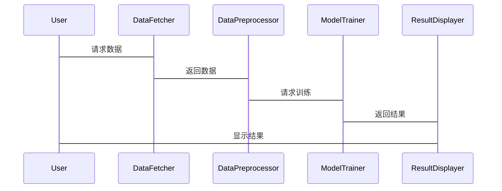

                 


# 金融市场分析的AI Agent决策支持

## 关键词：AI Agent、金融市场分析、决策支持、人工智能、机器学习、强化学习、金融数据

## 摘要

金融市场分析的AI Agent决策支持是一种结合人工智能技术的创新方法，通过感知、决策和执行模块，帮助投资者在复杂多变的市场环境中做出更明智的决策。本文探讨了AI Agent在金融市场中的应用，详细介绍了其核心概念、算法原理、系统架构设计以及项目实战，展示了如何利用强化学习、监督学习和无监督学习等算法，构建高效的金融分析系统，提升决策支持能力。

---

# 第一部分: 金融市场分析的AI Agent决策支持概述

## 第1章: 金融市场分析的背景与挑战

### 1.1 金融市场的现状与发展趋势

#### 1.1.1 传统金融市场分析方法的局限性

传统金融市场分析方法主要依赖技术分析和基本分析，但存在以下局限性：

- 数据局限性：仅依赖历史数据，难以捕捉市场参与者的心理变化。
- 人为因素影响：分析结果受主观判断影响。
- 实时性不足：难以应对高频交易和实时数据处理。

#### 1.1.2 人工智能在金融领域的应用前景

人工智能技术在金融领域的应用前景广阔，包括：

- 股票预测：利用机器学习模型分析历史数据，预测价格走势。
- 风险控制：评估投资组合风险，优化资产配置。
- 算法交易：基于AI算法进行高频交易。
- 客户行为分析：提供个性化投资建议。

#### 1.1.3 AI Agent在金融市场中的潜力

AI Agent能够感知环境、分析数据、制定策略并执行交易，显著提升金融决策的效率和准确性。其优势包括自动化、实时性和自我学习能力。

### 1.2 问题背景与问题描述

#### 1.2.1 金融市场数据的特点与复杂性

金融市场数据具有高维性、时间依赖性、噪声干扰和非线性关系等特点，增加了分析的难度。

#### 1.2.2 传统金融分析的痛点与不足

传统方法效率低下，模型局限性明显，难以处理海量实时数据。

#### 1.2.3 AI Agent在金融决策中的作用

AI Agent通过自动化与智能化，实时响应市场变化，优化决策过程。

### 1.3 问题解决与边界

#### 1.3.1 AI Agent如何辅助金融决策

通过感知、决策和执行模块，辅助投资者制定和执行最优策略。

#### 1.3.2 AI Agent在金融市场中的边界与外延

AI Agent的应用依赖于数据质量和模型假设，需适应不断变化的市场环境。

#### 1.3.3 核心要素与组成结构

AI Agent的核心要素包括感知模块、决策模块和执行模块。

---

## 第2章: AI Agent的核心概念与原理

### 2.1 AI Agent的定义与分类

#### 2.1.1 AI Agent的定义

AI Agent是一种能够感知环境、做出决策并采取行动的智能实体。

#### 2.1.2 AI Agent的分类与特点

- 分类：基于智能水平分为简单反射型、基于模型的反应型、目标驱动型和实用驱动型。
- 特点：自主性、反应性、主动性、社会性。

#### 2.1.3 金融市场中的AI Agent应用

AI Agent应用于自动化交易、实时数据分析和决策支持。

### 2.2 AI Agent的核心概念

#### 2.2.1 感知模块

负责数据的收集和处理，包括市场数据、新闻等。

#### 2.2.2 决策模块

基于感知数据，制定投资策略，采用强化学习、监督学习等算法。

#### 2.2.3 执行模块

根据决策结果，执行交易指令，优化投资组合。

### 2.3 AI Agent与传统金融分析的对比

#### 2.3.1 传统统计模型的特点

- 简单线性关系，难以捕捉复杂模式。
- 需要手动操作，效率低下。

#### 2.3.2 机器学习模型的优势

- 能够处理高维数据，发现非线性关系。
- 自动化学习，适应市场变化。

#### 2.3.3 AI Agent的综合优势

结合感知、决策和执行模块，提供实时、智能的金融分析。

---

## 第3章: AI Agent的算法原理与数学模型

### 3.1 常见AI Agent算法介绍

#### 3.1.1 强化学习算法

- Q-learning算法：通过Q值函数选择最优动作。
- Deep Q-Network (DQN)算法：利用深度神经网络近似Q值函数。

#### 3.1.2 监督学习算法

- 线性回归模型：预测股票价格。
- 随机森林模型：处理高维数据。

#### 3.1.3 无监督学习算法

- K-means聚类：识别市场模式。
- t-SNE降维：数据可视化。

### 3.2 数学公式与模型

- 强化学习中的Q-learning公式：
  $$ Q(s, a) = Q(s, a) + \alpha (r + \gamma \max Q(s', a') - Q(s, a)) $$
- 传统线性回归模型：
  $$ y = \beta_0 + \beta_1 x_1 + ... + \beta_n x_n + \epsilon $$

---

## 第4章: 系统分析与架构设计

### 4.1 问题场景介绍

股票价格预测系统，利用AI Agent分析历史数据，预测未来走势。

### 4.2 系统功能设计

- 数据获取模块：从Yahoo Finance API获取数据。
- 数据预处理模块：清洗和特征工程。
- 模型训练模块：训练强化学习模型。
- 结果展示模块：可视化预测结果。

### 4.3 系统架构设计

- 分层架构：数据层、计算层、应用层。
- 微服务架构：模块化设计，便于扩展和维护。

### 4.4 系统接口设计

- 数据接口：提供API供其他模块调用。
- 模型接口：定义输入输出接口。
- 用户接口：友好界面供投资者使用。

### 4.5 系统交互流程

用户请求处理流程（Mermaid序列图）：



---

## 第5章: 项目实战

### 5.1 环境安装与配置

安装Python、NumPy、Pandas、Scikit-learn、TensorFlow等库。

### 5.2 系统核心实现源代码

- 数据获取代码：
  ```python
  import pandas as pd
  data = pd.read_csv('stock_data.csv')
  ```

- 模型训练代码：
  ```python
  model = Sequential()
  model.add(Dense(64, activation='relu', input_dim=X.shape[1]))
  model.add(Dense(1, activation='linear'))
  model.compile(optimizer='adam', loss='mean_squared_error')
  model.fit(X_train, y_train, epochs=100, batch_size=32, validation_split=0.2)
  ```

### 5.3 代码解读与分析

- 数据获取模块：从CSV文件读取股票数据。
- 模型训练模块：构建神经网络模型并进行训练。

### 5.4 案例分析与详细讲解

使用实际股票数据进行预测，评估模型的准确性和稳定性。

### 5.5 项目小结

通过项目实战，验证了AI Agent在股票价格预测中的应用效果，强调数据质量和模型优化的重要性。

---

## 第6章: 最佳实践与总结

### 6.1 小结

本文详细探讨了AI Agent在金融市场分析中的应用，展示了其在提升决策支持能力方面的潜力。

### 6.2 注意事项

- 数据质量的重要性
- 模型的实时性和适应性
- 风险管理的重要性

### 6.3 拓展阅读

- "Reinforcement Learning: Theory and Algorithms" by Richard S. Sutton and Andrew G. Barto
- "Deep Learning for Time Series Forecasting" by Jason Brownlee
- "Python for Finance: Mastering Data-Driven Finance" by Yves Hilpisch

### 6.4 本章结束语

AI Agent技术正在深刻改变金融市场的分析方式，未来将发挥更大的作用。

---

**作者：** AI天才研究院（AI Genius Institute）  
**联系邮箱：** contact@ai-genius.com  
**文章来源：** [AI Genius Blog](https://www.ai-genius.com)

