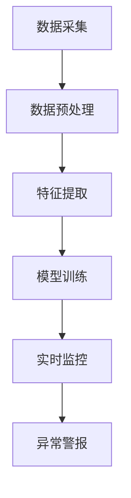

                 


# 金融市场异常检测系统

> 关键词：金融市场、异常检测、AI、大数据、量化交易、风险管理、金融系统

> 摘要：金融市场异常检测系统是一种利用先进的数据分析和人工智能技术，识别金融市场中的异常交易行为和市场波动的系统。该系统通过结合统计分析、机器学习和深度学习等多种技术手段，能够实时监控市场动态，及时发现和预警潜在的市场风险，帮助金融机构做出更明智的投资决策。本文将详细探讨该系统的核心概念、算法原理、系统架构以及实际应用。

---

# 正文

## 第一部分：金融市场概述

### 1.1 金融市场的基本概念

#### 1.1.1 金融市场的定义与分类
金融市场的定义是资金流动和金融资产交易的场所，主要参与者包括个人投资者、机构投资者、金融机构和监管机构。金融市场可以分为一级市场（新证券发行）和二级市场（现有证券交易）。

#### 1.1.2 金融市场的主要参与者
- **个人投资者**：散户投资者，参与股票、债券等交易。
- **机构投资者**：如基金公司、保险公司，进行大额投资。
- **金融机构**：银行、证券公司、交易所，提供金融服务和交易场所。
- **监管机构**：如证监会，负责监管市场行为，确保公平交易。

#### 1.1.3 金融市场的基本功能
- 资金融通：为企业和个人提供融资渠道。
- 价格发现：通过交易确定资产价格。
- 风险管理：帮助投资者对冲风险。

### 1.2 异常检测在金融领域的应用

#### 1.2.1 什么是金融市场异常
- 市场操纵：通过虚假交易影响价格。
- 内幕交易：利用未公开信息进行交易。
- 突发事件：如地缘政治冲突引发的市场剧烈波动。

#### 1.2.2 异常检测的必要性
- 保护投资者利益，防止欺诈行为。
- 维护市场公平，避免操纵和虚假交易。
- 提前预警风险，减少市场波动。

#### 1.2.3 异常检测的常见场景
- 股票价格的突然波动。
- 交易量的异常增加。
- 期权和期货市场的异常行为。

---

## 第二部分：异常检测的核心概念

### 2.1 异常检测的定义与分类

#### 2.1.1 异常检测的定义
异常检测是指识别数据中偏离预期模式或行为的过程。在金融市场中，异常检测用于识别不符合正常交易模式的事件。

#### 2.1.2 异常检测的分类
- **基于统计的方法**：如Z-分数和箱线图。
- **基于机器学习的方法**：如聚类和分类。
- **基于深度学习的方法**：如自动编码器和生成对抗网络。

#### 2.1.3 异常检测的关键属性对比
| 属性         | 统计方法      | 机器学习方法  | 深度学习方法  |
|--------------|---------------|---------------|---------------|
| 精度         | 中            | 高            | 高            |
| 计算复杂度   | 低            | 中            | 高            |
| 数据需求     | 结构化数据     | 结构化/非结构化数据 | 多样化数据     |

### 2.2 异常检测的核心要素

#### 2.2.1 数据特征
- 时间序列数据：股票价格、交易量。
- 市场情绪数据：新闻、社交媒体情绪。

#### 2.2.2 异常类型
- 点异常：单个数据点异常。
- 分布异常：整体数据分布变化。
- 鲁棒性异常：异常数据影响模型性能。

#### 2.2.3 检测方法
- **统计方法**：使用均值和标准差检测异常。
- **机器学习方法**：使用聚类和分类模型。
- **深度学习方法**：使用神经网络模型。

---

## 第三部分：异常检测的算法原理

### 3.1 异常检测的原理概述

#### 3.1.1 统计学方法
统计方法通过分析数据分布来检测异常。例如，使用Z-分数来衡量数据点与均值的距离。

#### 3.1.2 机器学习方法
机器学习模型通过学习正常数据的特征，识别异常数据。例如，使用孤立森林算法。

#### 3.1.3 深度学习方法
深度学习模型通过多层神经网络提取数据特征，识别异常。例如，使用自动编码器压缩数据，检测重建误差。

### 3.2 异常检测的核心算法

#### 3.2.1 统计方法
- **Z-分数**：计算数据点与均值的距离标准化值。
$$ Z = \frac{x - \mu}{\sigma} $$
其中，$\mu$ 是均值，$\sigma$ 是标准差。

- **箱线图**：通过四分位数判断异常值。

#### 3.2.2 机器学习方法
- **孤立森林**：一种基于树结构的异常检测方法。
- **K-近邻**：计算数据点的最近邻居，判断是否异常。

#### 3.2.3 深度学习方法
- **自动编码器**：通过重建误差检测异常。
- **生成对抗网络**：通过生成器和判别器对抗训练，识别异常。

---

## 第四部分：系统架构分析

### 4.1 金融市场异常检测系统架构

#### 4.1.1 系统功能模块
- 数据采集：收集股票价格、交易量等数据。
- 数据预处理：清洗和标准化数据。
- 特征提取：提取时间序列特征。
- 模型训练：训练异常检测模型。
- 实时监控：监控市场动态，发送异常警报。

#### 4.1.2 模块化架构


---

## 第五部分：项目实战

### 5.1 环境搭建

#### 5.1.1 安装必要的库
```bash
pip install numpy pandas scikit-learn keras
```

### 5.2 系统核心实现

#### 5.2.1 数据预处理
```python
import pandas as pd
import numpy as np

data = pd.read_csv('stock_data.csv')
data = data.dropna()
```

#### 5.2.2 特征提取
```python
from sklearn.preprocessing import StandardScaler

scaler = StandardScaler()
features = scaler.fit_transform(data[['open', 'high', 'low', 'close', 'volume']])
```

#### 5.2.3 模型训练
```python
from sklearn.ensemble import IsolationForest

model = IsolationForest(n_estimators=100, contamination=0.05)
model.fit(features)
```

#### 5.2.4 实时监控
```python
import datetime

while True:
    current_time = datetime.datetime.now()
    if current_time.hour == 9 and current_time.minute == 30:
        new_data = get_realtime_data()
        predictions = model.predict(new_data)
        for i in range(len(predictions)):
            if predictions[i] == -1:
                print("Detect anomaly at time:", current_time)
        break
```

---

## 总结

金融市场异常检测系统是保障市场公平和投资者利益的重要工具。通过结合统计方法、机器学习和深度学习技术，该系统能够有效识别异常交易行为，帮助金融机构降低风险。未来，随着人工智能技术的不断发展，金融市场异常检测系统将更加智能化和精准化。

---

**作者：AI天才研究院 & 禅与计算机程序设计艺术**

