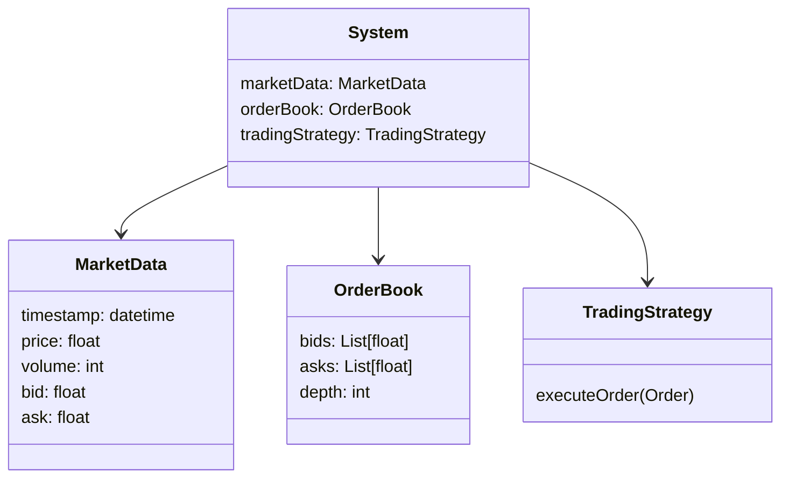
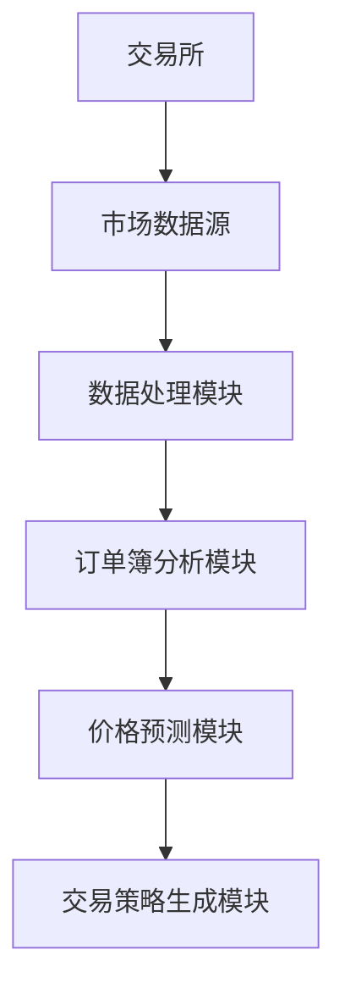
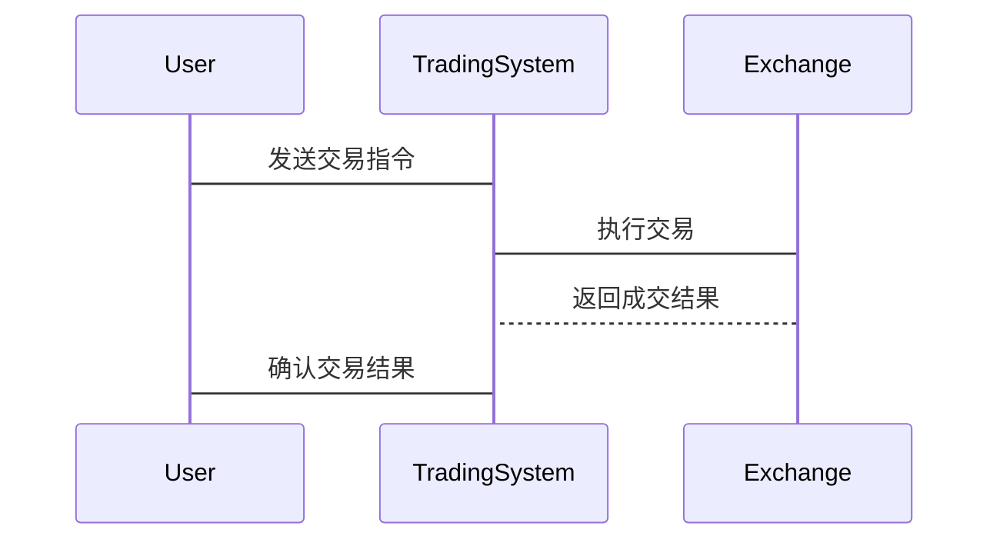

                 


# 金融市场微观结构变化对价格影响分析

> 关键词：金融市场、微观结构、价格影响、订单簿模型、高频交易、数学模型、系统架构

> 摘要：本文从金融市场的微观结构出发，分析了市场参与者行为、交易机制和价格形成机制的变化对市场价格的影响。通过详细讲解订单簿模型、高频交易算法和系统架构设计，结合实证分析和项目实战，深入探讨了金融市场微观结构变化对价格波动的具体影响机制。文章最后总结了最佳实践和注意事项，为读者提供了全面的分析框架和实践指导。

---

# 第一章: 金融市场微观结构概述

## 1.1 金融市场的基本概念

### 1.1.1 金融市场的定义与分类
金融市场的定义：金融市场的核心功能是资金的融通和价格的形成，参与者包括投资者、机构、交易商等。金融市场可以分为场内市场和场外市场，前者如交易所，后者如OTC市场。

### 1.1.2 微观结构的核心概念
- **市场参与者**：包括机构投资者、散户、做市商等。
- **交易机制**：订单匹配、撮合交易、竞价交易等。
- **价格形成机制**：市场供需、订单簿状态、参与者行为共同决定价格。

### 1.1.3 微观结构与价格的关系
- 微观结构的变化直接影响市场参与者的交易行为和订单生成。
- 价格是市场微观结构的综合反映，包括订单深度、流动性和市场情绪等因素。

---

## 1.2 金融市场微观结构的核心要素

### 1.2.1 市场参与者
- **投资者**：提供资金需求或供给。
- **机构**：包括基金、保险公司等，参与大额交易。
- **做市商**：提供流动性，撮合交易。

### 1.2.2 交易机制
- **订单驱动**：市场参与者通过提交订单进行交易。
- **撮合机制**：交易所根据订单匹配规则撮合成交。
- **竞价机制**：如拍卖交易，按价格优先、时间优先撮合。

### 1.2.3 价格形成机制
- **供需平衡**：买方和卖方订单的平衡决定价格。
- **订单簿状态**：包括订单深度、买价和卖价差（Spread）。

### 1.2.4 市场深度与流动性
- **市场深度**：衡量市场可交易的订单量。
- **流动性**：市场参与者快速买卖的能力。

---

## 1.3 微观结构变化对价格的影响机制

### 1.3.1 市场参与者行为变化
- 投资者情绪波动影响订单生成。
- 机构投资者的大额交易可能引发价格波动。

### 1.3.2 交易机制的演变
- 电子化交易取代传统交易，提高了交易效率。
- 算法交易的普及改变了订单生成的模式。

### 1.3.3 价格波动的传导路径
- 订单生成→订单簿状态变化→价格波动。
- 市场参与者的博弈行为影响价格走势。

---

## 1.4 本章小结
金融市场微观结构的变化直接或间接影响价格波动。市场参与者的交易行为、交易机制的演变以及价格形成机制的变化共同决定了价格的动态变化。理解这些变化对价格的影响机制，有助于更好地把握市场的运行规律。

---

# 第二章: 订单簿模型

## 2.1 订单簿模型的基本原理

### 2.1.1 订单簿的定义与构成
- **订单簿**：记录当前市场上所有待成交订单的电子表格。
- **买价和卖价**：买方和卖方的报价。
- **订单深度**：市场可交易的订单量。

### 2.1.2 市场深度与订单流
- **订单深度**：买方和卖方的订单总量。
- **订单流**：订单的生成和成交情况。

### 2.1.3 订单簿与价格波动的关系
- 订单簿的变化直接影响价格的波动。
- 市场深度的变化影响价格的稳定性。

---

## 2.2 订单簿模型的数学表达

### 2.2.1 订单生成的概率模型
- 假设订单生成的概率与市场深度相关。
- 订单生成的频率可以用泊松过程建模。

$$ \lambda = \lambda_{\text{buy}} + \lambda_{\text{sell}} $$

### 2.2.2 市场深度的动态变化
- 市场深度的变化可以用微分方程描述。

$$ \frac{dD}{dt} = \lambda_{\text{in}} - \lambda_{\text{out}} $$

### 2.2.3 价格形成的数学公式
- 价格由买方最高出价和卖方最低要价决定。

$$ P(t) = \max(P_{\text{bid}}) \quad \text{或} \quad P(t) = \min(P_{\text{ask}}) $$

---

## 2.3 订单簿模型的实证分析

### 2.3.1 数据来源与处理
- 数据来源：交易所的订单簿数据。
- 数据处理：清洗和标准化。

### 2.3.2 模型的验证与评估
- 使用实证数据验证模型的准确性。
- 模型评估指标：拟合优度、预测准确率。

### 2.3.3 实证结果与讨论
- 订单深度的变化与价格波动的相关性显著。
- 市场深度的减少可能导致价格波动加剧。

---

## 2.4 本章小结
订单簿模型是分析金融市场微观结构的重要工具。通过数学建模和实证分析，可以更好地理解订单簿变化对价格波动的影响。

---

# 第三章: 高频交易算法

## 3.1 高频交易的基本概念

### 3.1.1 高频交易的定义与特点
- 高频交易：在极短时间内完成大量交易的策略。
- 特点：高频、低延迟、算法驱动。

### 3.1.2 高频交易的策略类型
- **套利策略**：利用价格差异获利。
- **统计套利**：基于统计模型的交易。
- **算法交易**：基于算法的自动化交易。

---

## 3.2 高频交易算法的实现原理

### 3.2.1 市场数据的实时处理
- 数据流处理：高频交易需要实时处理市场数据。
- 数据特征提取：包括价格、成交量、订单簿状态等。

### 3.2.2 订单生成与执行策略
- **订单生成**：基于算法生成买卖订单。
- **执行策略**：优化订单执行以减少市场冲击。

### 3.2.3 算法的优化与改进
- 算法优化：减少延迟，提高执行速度。
- 策略改进：增强模型的预测能力。

---

## 3.3 高频交易算法的数学模型

### 3.3.1 时间序列分析模型
- 使用ARIMA模型预测价格走势。

$$ ARIMA(p, d, q) $$

### 3.3.2 价格预测的回归模型
- 基于订单簿数据的线性回归模型。

$$ P(t) = \beta_0 + \beta_1 X_1 + \beta_2 X_2 + \dots + \beta_n X_n $$

### 3.3.3 算法复杂度的计算
- 算法复杂度：O(n) 表示线性时间复杂度。

---

## 3.4 本章小结
高频交易算法通过数学建模和优化，显著提高了交易效率和准确性。理解高频交易算法的实现原理，有助于更好地分析其对市场价格的影响。

---

# 第四章: 微观结构分析系统的架构设计

## 4.1 系统需求分析

### 4.1.1 问题场景描述
- 需要实时监控和分析订单簿数据。
- 需要预测价格波动并制定交易策略。

### 4.1.2 系统目标与功能
- 实时数据处理。
- 订单簿分析。
- 价格预测与交易策略生成。

### 4.1.3 系统边界与接口
- 数据接口：与交易所系统对接。
- 用户界面：供用户查看分析结果。

---

## 4.2 系统功能设计

### 4.2.1 领域模型
- **领域模型**：用 Mermaid 类图表示。



---

## 4.3 系统架构设计

### 4.3.1 系统架构图
- **系统架构**：用 Mermaid 图表示。



---

## 4.4 系统接口设计

### 4.4.1 接口描述
- **市场数据接口**：提供实时市场数据。
- **订单簿接口**：提供订单簿状态。
- **交易接口**：执行交易指令。

### 4.4.2 接口交互流程图
- **接口交互流程图**：用 Mermaid 序列图表示。



---

## 4.5 本章小结
系统架构设计是实现金融市场微观结构分析的重要部分。通过模块化设计和接口标准化，可以提高系统的可扩展性和可维护性。

---

# 第五章: 项目实战

## 5.1 环境安装

### 5.1.1 环境要求
- 操作系统：Windows/Mac/Linux。
- 开发工具：Python、Jupyter Notebook。
- 第三方库：Pandas、NumPy、Matplotlib。

### 5.1.2 数据来源
- 数据集：可以从交易所获取或使用模拟数据。

---

## 5.2 系统核心实现源代码

### 5.2.1 数据处理代码
```python
import pandas as pd
import numpy as np

# 示例数据处理代码
data = pd.read_csv('market_data.csv')
data['timestamp'] = pd.to_datetime(data['timestamp'])
data.set_index('timestamp', inplace=True)
```

### 5.2.2 订单簿分析代码
```python
def calculate_depth(order_book):
    bid_depth = sum(order_book['bids'])
    ask_depth = sum(order_book['asks'])
    return bid_depth, ask_depth

order_book = {
    'bids': [100.0, 99.5, 99.0],
    'asks': [101.0, 100.5, 100.0]
}
bid_depth, ask_depth = calculate_depth(order_book)
print(f"_bid_depth: {bid_depth}, ask_depth: {ask_depth}")
```

### 5.2.3 价格预测代码
```python
from sklearn.linear_model import LinearRegression

# 示例价格预测代码
X = data[['bid', 'ask', 'volume']]
y = data['price']
model = LinearRegression()
model.fit(X, y)
 predictions = model.predict(X)
```

---

## 5.3 案例分析与详细解读

### 5.3.1 案例分析
- 数据分析：分析订单簿数据的变化。
- 价格预测：基于模型预测价格走势。
- 交易策略：制定基于预测结果的交易策略。

### 5.3.2 详细解读
- 数据分析结果：订单深度的变化与价格波动的相关性。
- 模型预测结果：预测的价格与实际价格的对比。
- 交易策略效果：策略的收益和风险分析。

---

## 5.4 本章小结
通过项目实战，可以更好地理解金融市场微观结构分析的实现过程。从数据处理到模型构建，再到策略制定，每个环节都需要精心设计和实现。

---

# 第六章: 总结与展望

## 6.1 最佳实践

### 6.1.1 小结
- 本文从金融市场微观结构出发，分析了订单簿模型、高频交易算法和系统架构设计对价格的影响。

### 6.1.2 注意事项
- 数据质量：确保数据的准确性和完整性。
- 模型优化：不断优化模型以提高预测精度。
- 风险控制：制定有效的风险控制策略。

### 6.1.3 拓展阅读
- 推荐阅读相关领域的经典文献，如《Market Microstructure: A practitioners guide》。

---

## 6.2 作者简介

作者：AI天才研究院/AI Genius Institute & 禅与计算机程序设计艺术 /Zen And The Art of Computer Programming

---

# 附录

## 附录A: 参考文献
- 文献1：L. A. Admati, R. M. Stom, and T. J. Bulkley, *The Microstructure of Financial Markets*, Princeton University Press, 1998.
- 文献2：R. C. Merton, *Theory of Rational Option Pricing*, The Bell Journal of Economics, 1973.

---

## 附录B: 工具与库
- Python
- Pandas
- NumPy
- Matplotlib
- Mermaid
- Jupyter Notebook

