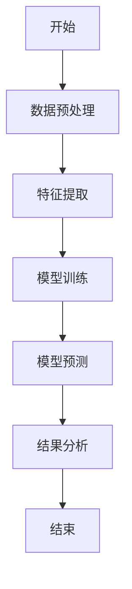
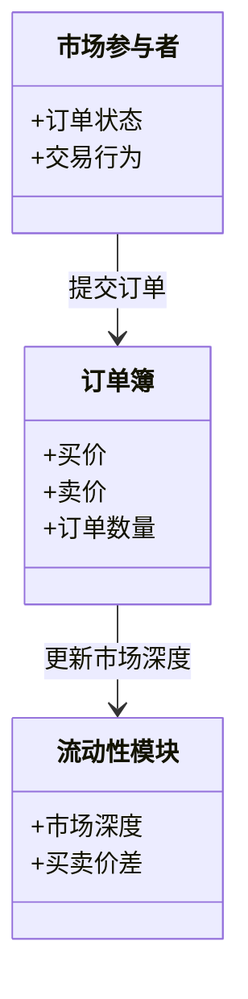
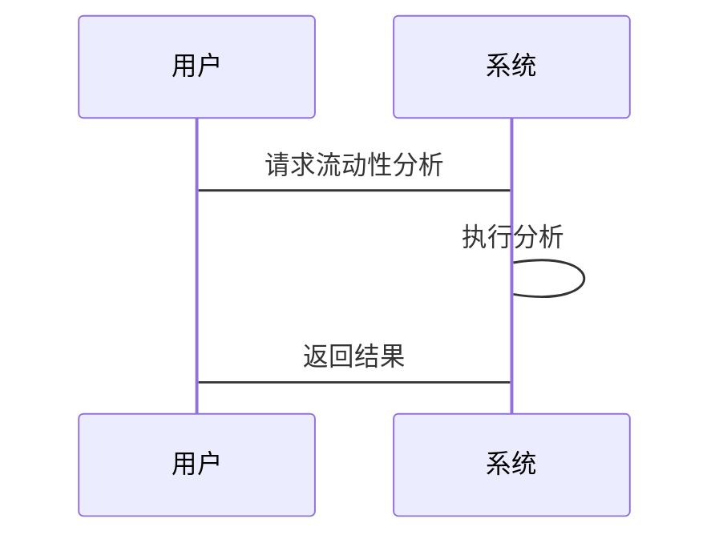

                 


# 金融市场微观结构变化对流动性影响分析

> 关键词：金融市场微观结构、流动性、订单簿、市场深度、高频交易

> 摘要：本文系统地分析了金融市场微观结构变化对流动性的影响。首先介绍了金融市场的基本概念和流动性的重要性，接着详细探讨了微观结构变化的核心概念及其对流动性的影响机制。随后，通过算法原理、系统架构设计和实际案例分析，深入剖析了微观结构变化对流动性的影响，并提出了相应的解决方案和最佳实践。

---

## 第1章: 金融市场微观结构概述

### 1.1 金融市场微观结构的定义

#### 1.1.1 金融市场的基本概念
金融市场是指以货币、证券、衍生品等金融资产为交易对象，通过市场参与者进行定价和交易的场所。它由参与者、交易规则和交易工具三部分构成。

#### 1.1.2 微观结构的核心要素
微观结构关注市场运行的细节，主要包括：
- **订单簿**：记录所有未成交的买、卖订单。
- **市场深度**：市场在某一价格水平上可执行的订单数量。
- **买卖价差**：买价与卖价之间的差距，反映市场流动性。

#### 1.1.3 微观结构与宏观市场的关系
微观结构是宏观市场运行的基础，宏观市场的稳定性依赖于微观结构的有效运作。例如，高频交易和算法交易等微观结构变化会影响整体市场的流动性和价格发现。

### 1.2 流动性的定义与重要性

#### 1.2.1 流动性的基本定义
流动性是指资产在市场中迅速以合理价格买卖的能力。高流动性意味着交易成本低、成交速度快。

#### 1.2.2 流动性在金融市场中的作用
- **降低交易成本**：高流动性减少买卖价差。
- **提高市场效率**：流动性高的市场资源配置更有效。
- **增强市场稳定性**：充足的流动性有助于缓解市场波动。

#### 1.2.3 流动性与市场效率的关系
流动性是市场效率的重要指标，反映了市场参与者交易的难易程度。流动性越高，市场效率越高。

### 1.3 微观结构变化的背景与驱动因素

#### 1.3.1 技术进步对微观结构的影响
技术进步推动了高频交易、算法交易和电子交易平台的发展，改变了市场的微观结构。

#### 1.3.2 市场参与者行为的变化
机构投资者和个人投资者的行为差异显著，影响市场的流动性和价格发现。

#### 1.3.3 监管政策对微观结构的影响
监管政策如订单簿公开、交易规则变化等，直接影响市场的微观结构。

---

## 第2章: 微观结构变化的核心概念与联系

### 2.1 微观结构变化对流动性的影响机制

#### 2.1.1 市场深度与订单簿分析
市场深度反映了市场在某一价格水平上的交易能力。订单簿的变化直接影响市场深度，进而影响流动性。

#### 2.1.2 买卖价差的变化与流动性
买卖价差是交易成本的重要组成部分。微观结构变化会导致买卖价差波动，进而影响流动性。

#### 2.1.3 高频交易对流动性的影响
高频交易提高了市场的流动性和价格发现效率，但也可能引发短期波动，影响市场的稳定性。

### 2.2 微观结构变化与市场参与者行为

#### 2.2.1 机构投资者的行为特征
机构投资者通常采取算法交易，追求短期收益，可能导致市场的流动性波动。

#### 2.2.2 散户投资者的行为特征
散户投资者通常基于情绪交易，可能在市场波动时影响流动性。

#### 2.2.3 市场参与者行为对流动性的影响
不同参与者的行为模式影响市场的流动性和价格发现机制。

### 2.3 微观结构变化的实体关系图

#### 2.3.1 ER实体关系图

```mermaid
erDiagram
    participant P1 : 机构投资者
    participant P2 : 散户投资者
    participant M1 : 市场监管机构
    participant T1 : 交易系统
    participant O1 : 订单簿
    participant L1 : 流动性
    P1 --> O1 : 提交订单
    P2 --> O1 : 提交订单
    M1 --> T1 : 监控交易
    T1 --> O1 : 更新订单簿
    O1 --> L1 : 影响流动性
```

#### 2.3.2 实体关系图的分析与解读
该图展示了市场参与者、交易系统和订单簿之间的关系。订单簿是市场流动性的核心，机构投资者和散户投资者的行为直接影响订单簿的状态，进而影响流动性。

---

## 第3章: 微观结构变化对流动性影响的算法原理

### 3.1 算法原理概述

#### 3.1.1 时间序列分析的基本原理
时间序列分析用于研究市场流动性的变化趋势。常用模型包括ARIMA、GARCH等。

#### 3.1.2 微观结构变化的特征提取
从订单簿数据中提取特征，如订单簿深度、买卖价差、订单撤销率等。

#### 3.1.3 流动性影响的预测模型
基于特征的预测模型，如ARIMA，用于预测流动性变化。

### 3.2 算法流程图



#### 3.2.1 算法流程图的绘制与解读
流程图展示了从数据预处理到结果分析的完整流程。

### 3.3 算法实现

#### 3.3.1 Python源代码实现

```python
# 示例代码：基于ARIMA模型的流动性预测
import pandas as pd
from statsmodels.tsa.arima_model import ARIMA

# 加载数据
data = pd.read_csv('market_depth.csv')

# 拟合ARIMA模型
model = ARIMA(data[' liquidity'], order=(1, 1, 1))
model_fit = model.fit()

# 预测未来流动性
forecast = model_fit.forecast(steps=5)
print(forecast)
```

#### 3.3.2 代码功能解读与分析
代码加载数据，拟合ARIMA模型，并预测未来5步的流动性。ARIMA模型适用于时间序列数据，能够捕捉到流动性变化的趋势。

### 3.4 数学模型与公式详细讲解

#### 3.4.1 ARIMA模型的数学表达

$$
ARIMA(p, d, q) = y_t = \phi_1 y_{t-1} + \dots + \phi_p y_{t-p} + \theta_1 \epsilon_{t-1} + \dots + \theta_q \epsilon_{t-q} + \epsilon_t
$$

其中，p为自回归阶数，d为差分阶数，q为移动平均阶数。

---

## 第4章: 系统分析与架构设计方案

### 4.1 问题场景介绍

#### 4.1.1 问题背景
分析金融市场微观结构变化对流动性的影响，需构建一个实时监测和分析系统。

### 4.2 项目介绍

#### 4.2.1 项目目标
构建一个实时监测市场微观结构变化，分析其对流动性影响的系统。

#### 4.2.2 项目范围
涵盖数据采集、分析、可视化和预警功能。

### 4.3 系统功能设计

#### 4.3.1 领域模型设计



#### 4.3.2 系统架构设计


### 4.4 接口和交互设计

#### 4.4.1 接口设计
- 数据接口：从订单簿获取市场深度数据。
- 分析接口：调用ARIMA模型进行预测。

#### 4.4.2 交互设计



---

## 第5章: 项目实战

### 5.1 环境安装

#### 5.1.1 安装必要的库
```bash
pip install pandas numpy statsmodels matplotlib
```

### 5.2 核心实现

#### 5.2.1 数据采集与预处理

```python
import pandas as pd
import numpy as np

# 示例数据
data = pd.DataFrame({
    '时间': range(100),
    '市场深度': np.random.normal(100, 10, 100)
})

data.to_csv('market_depth.csv', index=False)
```

#### 5.2.2 数据分析与建模

```python
import pandas as pd
from statsmodels.tsa.arima_model import ARIMA

data = pd.read_csv('market_depth.csv')
model = ARIMA(data['市场深度'], order=(1, 1, 1))
model_fit = model.fit()

forecast = model_fit.forecast(steps=5)
print(forecast)
```

### 5.3 实际案例分析

#### 5.3.1 案例分析
分析某段时间内市场深度的变化，预测未来流动性。

#### 5.3.2 案例结论
微观结构变化直接影响流动性，高频交易提高了流动性，但也可能引发短期波动。

---

## 第6章: 最佳实践与小结

### 6.1 小结
本文系统地分析了金融市场微观结构变化对流动性的影响，提出了基于ARIMA模型的预测方法，并设计了实时监测系统。

### 6.2 注意事项
- 数据质量影响模型准确性。
- 高频交易可能导致市场波动。
- 监管政策需及时调整。

### 6.3 拓展阅读
- 《金融市场微观结构》
- 《时间序列分析与应用》

---

## 作者：AI天才研究院/AI Genius Institute & 禅与计算机程序设计艺术/Zen And The Art of Computer Programming

---

通过以上详细分析，我们全面探讨了金融市场微观结构变化对流动性的影响，从理论到实践，为读者提供了系统性的指导和见解。

