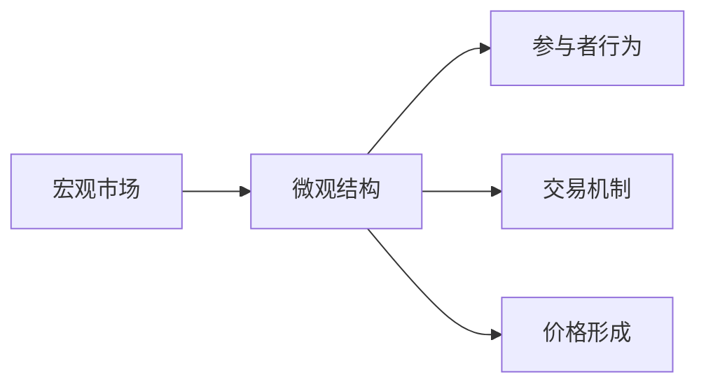
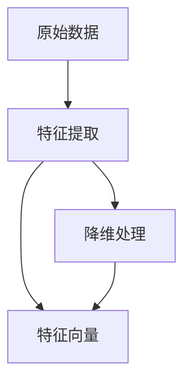

                 


# 金融市场微观结构变化检测

> 关键词：金融市场，微观结构，变化检测，统计方法，机器学习，时间序列分析

> 摘要：金融市场微观结构变化检测是金融数据分析中的重要任务，旨在识别市场参与者行为、交易机制或市场环境的变化。本文系统地介绍了金融市场微观结构的基本概念、变化检测的方法和技术实现，结合实际案例分析，深入探讨了统计方法、机器学习算法在变化检测中的应用，并通过系统设计和项目实战展示了如何构建高效的金融变化检测系统。

---

# 第一部分: 金融市场微观结构概述

# 第1章: 金融市场微观结构基础

## 1.1 金融市场微观结构的定义与核心要素

### 1.1.1 金融市场的定义与分类

金融市场的定义是一个复杂的系统，涉及多个参与者、机构和机制。我们将其分为场内市场（如交易所）和场外市场（如OTC市场），并根据资产类型（股票、债券、衍生品等）进行分类。

### 1.1.2 微观结构的核心要素

| 核心要素 | 定义 | 示例 |
|----------|------|------|
| 参与者   | 市场中的交易主体，包括投资者、机构、做市商等 | 零散投资者、机构投资者 |
| 交易机制 | 市场的交易规则和流程，如订单匹配、撮合机制 | 拍卖机制、订单簿 |
| 价格形成 | 价格的决定过程，包括供需关系、市场情绪等 | 开盘价、收盘价 |

### 1.1.3 微观结构与宏观市场的关系

使用 Mermaid 绘制市场结构关系图：



---

## 1.2 金融市场数据与特征分析

### 1.2.1 常见的金融市场数据类型

| 数据类型 | 描述 | 示例 |
|----------|------|------|
| 值数据   | 价格、成交量等 | 股票价格、交易量 |
| 关系数据 | 参与者之间的关系 | 投资者与机构的关系 |
| 时间序列数据 | 带有时间戳的数据 | 开盘价、收盘价随时间变化 |

### 1.2.2 数据特征的提取方法



---

# 第2章: 金融市场微观结构的变化检测

## 2.1 什么是变化检测？

变化检测的目标是识别金融市场微观结构中的异常或显著变化，通常分为 **离线检测**（批量处理历史数据）和 **在线检测**（实时处理流数据）。

## 2.2 变化检测的关键步骤

1. **数据预处理**：去噪、标准化。
2. **特征提取**：选择敏感特征。
3. **模型训练**：基于历史数据训练变化检测模型。
4. **实时监控**：对新数据进行变化检测。

---

# 第二部分: 金融市场微观结构变化检测基础

# 第3章: 统计方法在变化检测中的应用

## 3.1 基于均值的变化检测

### 3.1.1 方差变化检测

假设原始数据服从正态分布，通过卡方检验判断方差是否发生变化：

$$
\chi^2 = \frac{n}{\sigma^2} \sum_{i=1}^{n} (x_i - \mu)^2
$$

其中，$\mu$ 是均值，$\sigma^2$ 是估计的方差。

---

# 第4章: 机器学习方法在变化检测中的应用

## 4.1 基于深度学习的时间序列变化检测

### 4.1.1 LSTM 网络

使用 LSTM 网络处理时间序列数据，捕捉长期依赖关系：


---

# 第三部分: 金融市场微观结构变化检测的系统设计

# 第5章: 系统架构与实现

## 5.1 系统功能设计

### 5.1.1 模块划分

| 模块 | 功能描述 |
|------|----------|
| 数据采集 | 从金融数据源获取实时或历史数据 |
| 特征工程 | 提取和处理特征 |
| 变化检测 | 应用算法检测变化 |
| 可视化 | 展示检测结果 |

### 5.1.2 系统架构设计


---

# 第四部分: 项目实战

# 第6章: 项目实战与案例分析

## 6.1 环境配置

安装必要的 Python 库：

```bash
pip install numpy pandas scikit-learn tensorflow
```

## 6.2 核心代码实现

### 示例代码：基于 LSTM 的变化检测

```python
import numpy as np
import tensorflow as tf
from tensorflow.keras.layers import LSTM, Dense

# 示例数据生成
data = np.random.randn(1000, 1)

# 模型定义
model = tf.keras.Sequential([
    LSTM(32, input_shape=(None, 1)),
    Dense(1)
])

# 模型训练
model.compile(optimizer='adam', loss='mean_squared_error')
model.fit(data, data, epochs=10, batch_size=32)
```

---

# 第五部分: 总结与展望

## 5.1 总结

本文系统地介绍了金融市场微观结构变化检测的方法和技术实现，结合统计和机器学习方法，展示了如何构建高效的金融变化检测系统。

## 5.2 展望

未来的研究方向包括：引入更复杂的深度学习模型（如Transformer）、结合自然语言处理技术分析新闻事件对市场的影响。

---

作者：AI天才研究院/AI Genius Institute & 禅与计算机程序设计艺术 /Zen And The Art of Computer Programming

