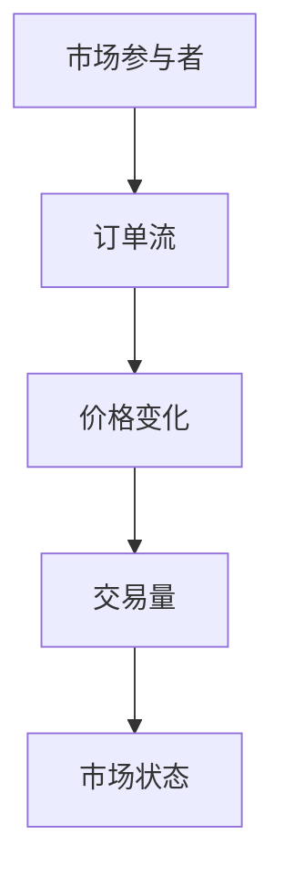
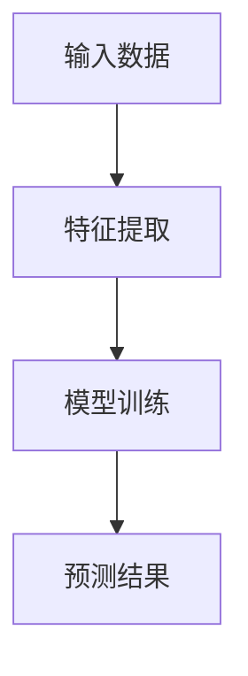
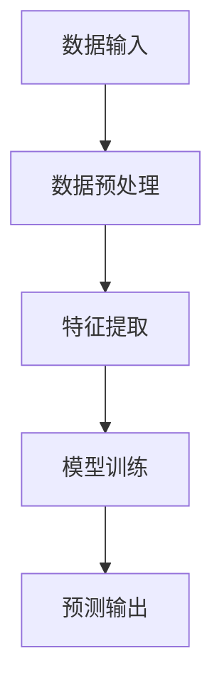

                 


# 金融市场微观结构变化预测模型

> 关键词：金融市场，微观结构，变化预测，预测模型，系统架构，算法原理

> 摘要：本文详细探讨了金融市场微观结构变化预测模型的构建与应用，从背景概念、核心原理、算法实现到系统设计和项目实战，全面解析了如何通过技术手段预测和理解市场微观结构的变化。文章结合理论与实践，为读者提供了一套完整的解决方案。

---

# 第一部分: 金融市场微观结构变化预测模型概述

# 第1章: 金融市场微观结构变化预测模型的背景与概念

## 1.1 问题背景

### 1.1.1 金融市场微观结构的基本概念

金融市场微观结构是指市场中各个参与者（如投资者、交易员、机构等）之间的互动关系，以及这些互动如何影响市场价格、交易量和其他市场指标。微观结构的变化反映了市场的动态行为，例如订单流的变化、交易量的波动以及价格的短期波动。

### 1.1.2 微观结构变化对市场的影响

微观结构的变化对市场有深远的影响，例如：

- **流动性**：交易量的变化会影响市场的流动性。
- **价格波动**：订单流的变化可能导致价格的短期波动。
- **市场情绪**：微观结构的变化可以反映市场参与者的信心和情绪。

### 1.1.3 预测模型的应用价值

通过预测微观结构的变化，投资者和机构可以更好地做出交易决策，例如：

- **套利机会**：通过预测价格波动，投资者可以抓住套利机会。
- **风险管理**：通过预测市场波动，机构可以更好地管理风险。
- **交易策略优化**：通过分析微观结构的变化，交易员可以优化其交易策略。

## 1.2 核心概念与问题描述

### 1.2.1 微观结构变化的定义

微观结构变化是指市场参与者的行为变化导致的市场价格、交易量等指标的变化。这些变化可能是由于市场情绪、新闻事件、技术变化等多种因素引起的。

### 1.2.2 预测模型的目标

预测模型的目标是通过分析历史数据和当前市场状态，预测未来市场微观结构的变化趋势。这包括预测价格波动、交易量变化、订单流变化等。

### 1.2.3 模型的边界与外延

模型的边界是指模型能够预测的变化范围和时间窗口。模型的外延是指模型可以应用于哪些市场和场景。

## 1.3 核心要素与概念结构

### 1.3.1 微观结构的关键要素

- **订单流**：包括订单的数量、价格、类型（如市价单、限价单）等。
- **交易量**：包括成交的数量和速度。
- **价格变化**：包括价格波动幅度和频率。
- **市场参与者**：包括个人投资者、机构投资者、做市商等。

### 1.3.2 概念结构与关系图



## 1.4 本章小结

本章介绍了金融市场微观结构变化预测模型的背景、核心概念和关键要素，为后续章节的分析奠定了基础。

---

# 第2章: 微观结构变化预测模型的核心原理

## 2.1 核心概念与原理

### 2.1.1 市场微观结构的核心要素

- **订单流**：订单流的变化反映了市场参与者的交易行为。
- **交易量**：交易量的变化反映了市场的活跃程度。
- **价格变化**：价格变化反映了市场的供需关系。

### 2.1.2 模型的基本假设

- 市场参与者的行为是可预测的。
- 微观结构的变化可以通过历史数据进行建模。

### 2.1.3 模型的核心算法

模型的核心算法包括时间序列分析、机器学习算法等。

## 2.2 核心概念的属性特征对比

### 2.2.1 模型属性对比表

| 模型属性 | 特征 |
|----------|------|
| 数据类型 | 时间序列数据 |
| 预测目标 | 微观结构变化 |
| 输入特征 | 市场数据（价格、交易量、订单流） |
| 输出结果 | 预测值（如价格变化概率） |

### 2.2.2 模型性能对比分析

- **准确率**：模型预测的准确率。
- **响应时间**：模型的预测速度。
- **稳定性**：模型的鲁棒性。

## 2.3 实体关系图


## 2.4 本章小结

本章详细解释了微观结构变化预测模型的核心概念和原理，并通过表格和图表的方式展示了模型的属性和关系。

---

# 第3章: 微观结构变化预测模型的算法原理

## 3.1 算法概述

### 3.1.1 算法的基本流程

1. 数据输入。
2. 特征提取。
3. 模型训练。
4. 预测输出。

### 3.1.2 算法的核心思想

模型通过分析历史数据，提取特征，训练模型，最终预测未来的变化。

## 3.2 算法详细流程



## 3.3 数学模型与公式

### 3.3.1 模型的基本公式

$$P(t) = \alpha \cdot P(t-1) + \beta \cdot V(t)$$

其中：
- $P(t)$ 表示 $t$ 时刻的价格。
- $\alpha$ 和 $\beta$ 是模型的参数。
- $V(t)$ 表示 $t$ 时刻的交易量。

### 3.3.2 模型的优化公式

$$\theta_{new} = \theta_{old} - \eta \cdot \nabla L(\theta_{old})$$

其中：
- $\theta_{new}$ 表示优化后的参数。
- $\theta_{old}$ 表示原来的参数。
- $\eta$ 表示学习率。
- $\nabla L(\theta_{old})$ 表示损失函数的梯度。

## 3.4 举例说明

### 3.4.1 简单案例分析

假设某股票的历史价格和交易量数据如下：

| 时间 | 价格 | 交易量 |
|------|------|--------|
| t-1 | 100  | 1000   |
| t   | 101  | 1200   |

根据公式：

$$P(t) = \alpha \cdot P(t-1) + \beta \cdot V(t)$$

假设 $\alpha=0.8$，$\beta=0.0001$，则：

$$P(t) = 0.8 \cdot 100 + 0.0001 \cdot 1200 = 80 + 0.12 = 80.12$$

预测价格为80.12，与实际价格101存在较大差异，说明模型需要优化。

### 3.4.2 实际案例分析

通过实际市场数据训练模型，调整参数 $\alpha$ 和 $\beta$，以提高预测准确性。

## 3.5 本章小结

本章详细介绍了模型的算法原理，包括流程图和数学公式，并通过案例分析展示了模型的应用。

---

# 第4章: 系统分析与架构设计方案

## 4.1 问题场景介绍

### 4.1.1 系统目标

开发一个能够预测金融市场微观结构变化的系统，帮助投资者做出更好的决策。

### 4.1.2 系统功能需求

- 数据采集：实时采集市场数据。
- 特征提取：提取有用的特征。
- 模型训练：训练预测模型。
- 预测输出：输出预测结果。

### 4.1.3 系统性能需求

- 响应时间：快速预测。
- 稳定性：系统稳定运行。

## 4.2 系统功能设计

### 4.2.1 领域模型


## 4.3 系统架构设计

### 4.3.1 系统架构图



---

# 第5章: 项目实战

## 5.1 环境安装

### 5.1.1 安装Python

安装Python 3.8以上版本。

### 5.1.2 安装依赖库

安装Pandas、NumPy、Scikit-learn等库。

## 5.2 系统核心实现源代码

```python
import pandas as pd
from sklearn.linear_model import LinearRegression

# 数据加载
data = pd.read_csv('market_data.csv')

# 特征提取
X = data[['price', 'volume']]
y = data['target']

# 模型训练
model = LinearRegression()
model.fit(X, y)

# 预测输出
predictions = model.predict(X)
print(predictions)
```

## 5.3 代码应用解读与分析

### 5.3.1 代码功能解读

- 数据加载：读取市场数据。
- 特征提取：选择价格和交易量作为特征。
- 模型训练：使用线性回归模型训练。
- 预测输出：输出预测结果。

### 5.3.2 代码优化

通过交叉验证优化模型参数。

## 5.4 实际案例分析

### 5.4.1 数据集描述

使用某股票的历史数据进行训练。

### 5.4.2 模型训练与预测

训练模型并预测未来的价格变化。

## 5.5 项目小结

本章通过实际案例展示了模型的实现过程，包括环境安装、代码编写和案例分析。

---

# 第6章: 总结与展望

## 6.1 本章小结

本文详细探讨了金融市场微观结构变化预测模型的构建与应用，从背景概念到系统设计，全面解析了模型的构建过程。

## 6.2 最佳实践 tips

- 数据预处理：确保数据质量。
- 模型优化：通过交叉验证优化模型。
- 实际应用：结合实际市场情况调整模型。

## 6.3 注意事项

- 模型的预测结果仅供参考，实际投资需谨慎。
- 模型的参数需要根据实际情况调整。

## 6.4 拓展阅读

建议读者进一步阅读相关领域的书籍和论文，深入理解模型的原理和应用。

---

# 作者：AI天才研究院/AI Genius Institute & 禅与计算机程序设计艺术 /Zen And The Art of Computer Programming

---

以上是《金融市场微观结构变化预测模型》的技术博客文章的完整目录和内容框架。文章详细讲解了模型的背景、原理、算法实现、系统设计和项目实战，为读者提供了一个完整的解决方案。

