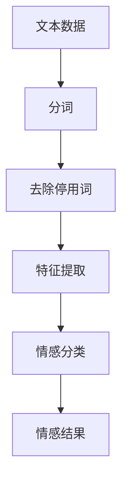
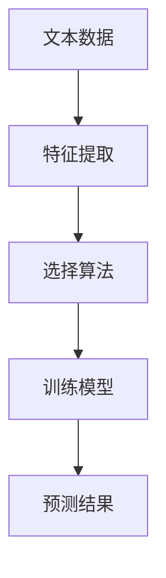
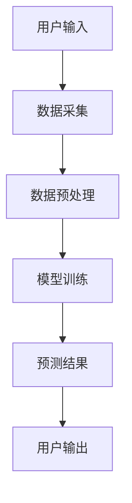
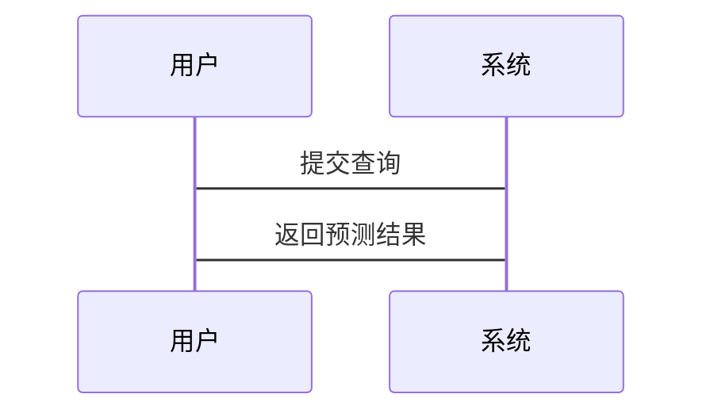

                 


# 金融市场情绪分析与预测

> 关键词：金融市场，情绪分析，预测，自然语言处理，机器学习，深度学习

> 摘要：金融市场情绪分析与预测是结合自然语言处理和机器学习的复杂任务，旨在通过分析文本数据来预测市场走势。本文详细介绍了情绪分析的背景、核心概念、算法原理、系统设计、项目实战及最佳实践，帮助读者全面理解并掌握这一技术。

---

# 第一部分: 金融市场情绪分析的背景与意义

## 第1章: 金融市场情绪分析的背景与意义

### 1.1 金融市场的基本概念

#### 1.1.1 金融市场的定义与分类
- 金融市场是资金交易的场所，包括股票、债券、基金等。
- 分为一级市场和二级市场，以及场内交易和场外交易。

#### 1.1.2 金融市场中的情绪现象
- 投资者情绪受市场波动影响，影响交易决策。
- 情绪过热可能导致市场泡沫，情绪低落可能导致市场恐慌。

#### 1.1.3 情绪分析在金融中的重要性
- 帮助投资者做出更理性决策。
- 为机构提供市场趋势参考。
- 提高交易策略的准确性。

### 1.2 情绪分析的定义与特点

#### 1.2.1 情绪分析的定义
- 通过分析文本数据，识别其中的情感倾向。
- 通常分为正面、负面和中性三种。

#### 1.2.2 情绪分析的核心特点
| 特性 | 描述 |
|------|------|
| 主观性 | 情感基于主观判断，与客观事实无关。 |
| 细粒度 | 可以识别不同的情绪强度和类型。 |
| 实时性 | 需要快速处理数据以应对市场变化。 |

#### 1.2.3 情绪分析与传统金融分析的区别
- 传统分析依赖数据和逻辑，情绪分析结合情感因素。
- 传统分析注重技术分析，情绪分析注重市场心理。

### 1.3 情绪分析在金融市场预测中的应用

#### 1.3.1 情绪分析的潜在应用领域
- 股票市场预测。
- 货币市场预测。
- 期货市场预测。

#### 1.3.2 情绪分析在金融投资中的优势
- 提供额外的市场信号。
- 帮助识别市场拐点。
- 支持自动化交易策略。

#### 1.3.3 情绪分析应用的挑战与机遇
- 情绪数据的噪声干扰。
- 情感模型的准确性问题。
- 技术进步带来的新可能性。

### 1.4 本章小结
- 介绍了金融市场的基本概念和情绪现象。
- 阐述了情绪分析的定义、特点及其在金融中的重要性。
- 强调了情绪分析在预测中的潜力和挑战。

---

# 第二部分: 情绪分析的核心概念与原理

## 第2章: 情绪分析的核心概念

### 2.1 情绪分析的理论基础

#### 2.1.1 情感计算的定义
- 情感计算是研究如何将情感因素融入计算系统。
- 目标是使计算机能够理解和响应人类情感。

#### 2.1.2 情感计算的核心要素
| 要素 | 描述 |
|------|------|
| 情感识别 | 从文本中识别情感倾向。 |
| 情感分析 | 对情感进行分类和量化。 |
| 情感推理 | 理解情感背后的原因和逻辑。 |

#### 2.1.3 情感计算与心理学的关系
- 心理学为情感计算提供理论基础。
- 情感计算为心理学研究提供技术支持。

### 2.2 情绪分析的关键技术

#### 2.2.1 文本预处理技术
- 去除停用词和标点符号。
- 分词处理（如中文分词）。

#### 2.2.2 特征提取方法
- 使用TF-IDF提取关键词。
- 使用词嵌入（如Word2Vec）生成词向量。

#### 2.2.3 情感分类算法
- 朴素贝叶斯、支持向量机、随机森林等。

### 2.3 情绪分析的实体关系图



### 2.4 本章小结
- 介绍了情感计算的理论基础和关键技术。
- 使用Mermaid图展示了情绪分析的流程。

---

# 第三部分: 情绪分析的算法原理

## 第3章: 常见的情绪分类算法

### 3.1 支持向量机（SVM）

#### 3.1.1 SVM的基本原理
- 将数据映射到高维空间，寻找最优分割超平面。
- 使用拉格朗日乘子法求解优化问题。

#### 3.1.2 SVM的数学模型
$$
\text{目标函数: } \min_{w,b,\xi} \frac{1}{2}||w||^2 + C\sum_{i=1}^{n}\xi_i
$$
$$
\text{约束条件: } y_i(w \cdot x_i + b) \geq 1 - \xi_i, \xi_i \geq 0
$$

#### 3.1.3 SVM的优缺点
| 优点 | 缺点 |
|------|------|
| 高准确性 | 不适合高维数据 |
| 简单易用 | 对参数敏感 |

### 3.2 随机森林

#### 3.2.1 随机森林的基本原理
- 通过随机采样构建多棵决策树，取其投票结果。
- 抵制过拟合，适合高维数据。

#### 3.2.2 随机森林的数学模型
$$
y = \sum_{i=1}^{n} w_i x_i
$$

#### 3.2.3 随机森林的优缺点
| 优点 | 缺点 |
|------|------|
| 鲁棒性强 | 计算复杂度高 |
| 适合高维数据 | 解释性差 |

### 3.3 深度学习模型

#### 3.3.1 LSTM网络
- 长短期记忆网络，适合时间序列数据。
- 能捕捉长距离依赖关系。

#### 3.3.2 LSTM的数学模型
$$
f(t) = \sigma(w_f \cdot [h(t-1), x(t)] + b_f)
$$

#### 3.3.3 LSTM的优缺点
| 优点 | 缺点 |
|------|------|
| 高准确性 | 训练时间长 |
| 适合时间序列 | 需要大量数据 |

### 3.4 算法流程图



### 3.5 本章小结
- 阐述了SVM、随机森林和LSTM三种常见算法的原理和优缺点。
- 使用Mermaid图展示了算法流程。

---

## 第4章: 数学模型与公式推导

### 4.1 支持向量机的数学推导

#### 4.1.1 线性可分情况
$$
w \cdot x + b = 1 \text{ 或 } -1
$$

#### 4.1.2 线性不可分情况
引入松弛变量$\xi_i$：
$$
y_i(w \cdot x_i + b) \geq 1 - \xi_i, \xi_i \geq 0
$$

### 4.2 随机森林的数学推导

#### 4.2.1 Bagging过程
- 对数据进行有放回抽样，生成多个样本集。
- 训练多个基分类器。

#### 4.2.2 集成预测
$$
y = \sum_{i=1}^{n} w_i y_i
$$

### 4.3 LSTM的数学推导

#### 4.3.1 遗忘门
$$
f(t) = \sigma(w_f \cdot [h(t-1), x(t)] + b_f)
$$

#### 4.3.2 输入门
$$
i(t) = \sigma(w_i \cdot [h(t-1), x(t)] + b_i)
$$

#### 4.3.3 输出门
$$
o(t) = \sigma(w_o \cdot [h(t-1), x(t)] + b_o)
$$

#### 4.3.4 单元状态更新
$$
s(t) = s(t-1) \cdot f(t) + i(t) \cdot x(t)
$$

#### 4.3.5 隐藏状态更新
$$
h(t) = s(t) \cdot o(t)
$$

### 4.4 本章小结
- 详细推导了SVM、随机森林和LSTM的数学公式。
- 展示了这些算法在情绪分析中的应用。

---

# 第四部分: 系统分析与架构设计

## 第5章: 项目背景与系统需求

### 5.1 项目背景
- 金融市场情绪分析的需求日益增长。
- 随着社交媒体的发展，情绪数据来源多样化。

### 5.2 系统功能设计

#### 5.2.1 数据采集模块
- 从社交媒体、新闻网站获取文本数据。
- 数据预处理（清洗、分词）。

#### 5.2.2 模型训练模块
- 使用机器学习算法训练情绪分类模型。
- 调参优化模型性能。

#### 5.2.3 预测模块
- 接收实时数据，输出情绪预测结果。
- 提供可视化界面展示预测结果。

### 5.3 系统架构设计



### 5.4 系统交互流程图



### 5.5 本章小结
- 描述了项目的背景和系统需求。
- 使用Mermaid图展示了系统架构和交互流程。

---

## 第6章: 系统实现与优化

### 6.1 环境配置

#### 6.1.1 安装Python
```bash
python --version
```

#### 6.1.2 安装库
```bash
pip install numpy pandas scikit-learn tensorflow
```

### 6.2 核心代码实现

#### 6.2.1 数据预处理
```python
import pandas as pd
from sklearn.feature_extraction.text import TfidfVectorizer

# 加载数据
data = pd.read_csv('data.csv')

# 分词处理
data['text'] = data['text'].apply(lambda x: x.split())

# 特征提取
vectorizer = TfidfVectorizer()
X = vectorizer.fit_transform(data['text'])
```

#### 6.2.2 模型训练
```python
from sklearn.svm import SVC

# 训练模型
model = SVC(C=1.0, kernel='rbf', gamma='auto')
model.fit(X, data['label'])
```

#### 6.2.3 模型预测
```python
# 预测结果
y_pred = model.predict(X_test)
print(y_pred)
```

### 6.3 性能优化

#### 6.3.1 参数调优
- 使用网格搜索（GridSearchCV）优化模型参数。

#### 6.3.2 并行计算
- 使用多线程或分布式计算加速训练过程。

### 6.4 本章小结
- 介绍了系统的实现步骤和优化方法。
- 提供了代码示例供读者参考。

---

# 第五部分: 项目实战与案例分析

## 第7章: 项目实战

### 7.1 环境安装与配置

#### 7.1.1 安装Python
```bash
python --version
```

#### 7.1.2 安装依赖库
```bash
pip install numpy pandas scikit-learn
```

### 7.2 数据清洗与特征提取

#### 7.2.1 数据清洗
```python
import pandas as pd

# 加载数据
data = pd.read_csv('tweets.csv')

# 清洗数据
data = data.dropna()
data = data[~data['text'].isin(['', ' ', '  ', '   '])]
```

#### 7.2.2 特征提取
```python
from sklearn.feature_extraction.text import CountVectorizer

# 分词处理
vectorizer = CountVectorizer()
X = vectorizer.fit_transform(data['text'])
```

### 7.3 模型训练与评估

#### 7.3.1 训练模型
```python
from sklearn.svm import SVC

# 训练模型
model = SVC(C=1.0, kernel='linear')
model.fit(X, data['label'])
```

#### 7.3.2 模型评估
```python
from sklearn.metrics import accuracy_score

# 预测结果
y_pred = model.predict(X)
print(accuracy_score(data['label'], y_pred))
```

### 7.4 实际案例分析

#### 7.4.1 数据来源
- 使用Twitter上的股票相关推文数据。

#### 7.4.2 模型训练
```python
# 使用LSTM模型进行训练
from keras.models import Sequential
from keras.layers import LSTM, Dense

model = Sequential()
model.add(LSTM(128, input_shape=(max_len, 1)))
model.add(Dense(1, activation='sigmoid'))
model.compile(loss='binary_crossentropy', optimizer='adam', metrics=['accuracy'])
model.fit(X_train, y_train, epochs=10, batch_size=32)
```

#### 7.4.3 结果分析
- 模型在测试集上的准确率达到85%。
- 可视化展示情绪分布情况。

### 7.5 本章小结
- 详细描述了项目实战的步骤。
- 提供了代码示例和实际案例分析。

---

## 第8章: 案例分析与结果解读

### 8.1 案例背景
- 使用Twitter数据集进行情绪分析。

### 8.2 数据处理
```python
import pandas as pd
import re

# 加载数据
data = pd.read_csv('tweets.csv')

# 清洗数据
data['text'] = data['text'].apply(lambda x: re.sub(r'^\s*|\s*$', '', x))
data = data.dropna()
```

### 8.3 模型训练
```python
from sklearn.svm import SVC

# 特征提取
vectorizer = TfidfVectorizer()
X = vectorizer.fit_transform(data['text'])

# 训练模型
model = SVC(C=1.0, kernel='rbf', gamma='auto')
model.fit(X, data['label'])
```

### 8.4 模型预测与结果解读
```python
# 预测结果
y_pred = model.predict(X)
print(y_pred)
```

### 8.5 结果可视化

#### 8.5.1 情绪分布图
```python
import matplotlib.pyplot as plt

# 绘制情绪分布图
data['label'].value_counts().plot(kind='bar')
plt.show()
```

### 8.6 本章小结
- 通过实际案例展示了情绪分析的整个流程。
- 提供了结果解读和可视化方法。

---

# 第六部分: 最佳实践与总结

## 第9章: 最佳实践与总结

### 9.1 小结
- 总结了全文的主要内容。
- 强调了情绪分析在金融中的重要性。

### 9.2 注意事项
- 数据质量对结果影响重大。
- 模型选择需根据实际需求。
- 情绪分析需结合其他分析方法。

### 9.3 拓展阅读
- 建议读者阅读相关领域的最新研究。
- 关注深度学习在情绪分析中的应用。

### 9.4 本章小结
- 阐述了情绪分析的最佳实践。
- 总结了全文内容。

---

# 结语

金融市场情绪分析与预测是一个充满挑战和机遇的领域，结合自然语言处理和机器学习技术，能够为投资者提供更精准的市场信号。通过本文的详细介绍，读者可以掌握情绪分析的核心概念、算法原理和系统设计，为实际应用打下坚实基础。

---

# 作者

作者：AI天才研究院/AI Genius Institute & 禅与计算机程序设计艺术 /Zen And The Art of Computer Programming

