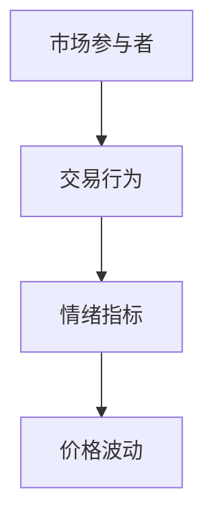
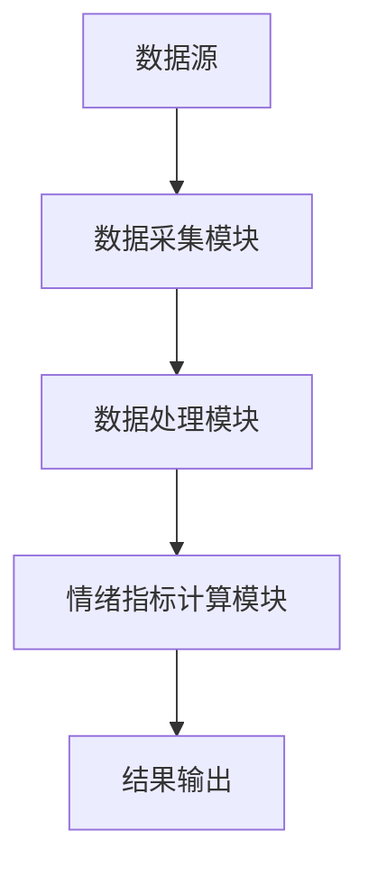
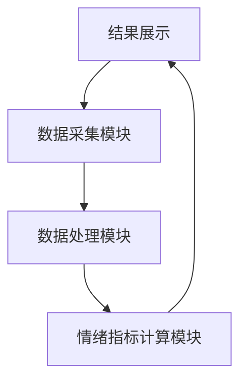

                 


---

# 金融市场情绪指标开发

## 关键词：
金融市场情绪指标、情绪分析、自然语言处理、时间序列分析、量化交易、机器学习、系统架构设计

## 摘要：
金融市场情绪指标是量化交易和金融分析中的重要工具，用于捕捉和量化市场参与者的心理状态和行为模式。本文系统地介绍了情绪指标的定义、分类、算法原理、系统架构设计以及实际开发中的关键问题。通过结合自然语言处理和时间序列分析，本文提出了情绪指标开发的详细步骤，并通过实际案例展示了如何利用这些指标进行有效的金融数据分析和预测。

---

## 第1章: 金融市场情绪指标概述

### 1.1 情绪指标的定义与背景

#### 1.1.1 什么是金融市场情绪指标
金融市场情绪指标是一种量化工具，用于衡量市场参与者（如投资者、交易员）的情绪状态和行为倾向。情绪指标通常基于价格数据、新闻数据或社交媒体数据进行计算，反映了市场的乐观或悲观情绪。

#### 1.1.2 情绪指标在金融市场的应用背景
金融市场的价格波动不仅仅由基本面因素决定，还受到市场情绪的影响。情绪指标可以帮助投资者预测市场走势、识别市场拐点，并优化交易策略。

#### 1.1.3 情绪指标的核心作用与价值
情绪指标能够捕捉市场的非理性波动，为量化交易提供额外的信息维度，帮助投资者做出更明智的决策。

#### 1.1.4 情绪指标的边界与外延
情绪指标的计算范围可以是局部市场（如某只股票）或整体市场，时间范围可以是短期（如日内）或长期（如季度）。其外延包括情绪数据的可视化、情绪预测模型的构建等。

### 1.2 情绪指标的分类与特点

#### 1.2.1 情绪指标的分类
- **基于价格数据的情绪指标**：如相对强弱指数（RSI）、波动率等。
- **基于新闻数据的情绪指标**：如新闻情绪强度指数（NMEI）。
- **基于社交媒体的情绪指标**：如推特情绪指数（TWE）。

#### 1.2.2 情绪指标的特点
- **实时性**：情绪指标通常需要实时或高频数据支持。
- **波动性**：市场情绪受多种因素影响，具有较强的波动性。
- **可量化性**：情绪指标通过数学模型量化市场情绪。

### 1.3 情绪指标开发的必要性与挑战

#### 1.3.1 金融市场中的情绪波动
市场情绪是影响价格波动的重要因素，但其难以直接观测，需要通过间接的方式进行量化。

#### 1.3.2 情绪指标在投资决策中的作用
情绪指标可以用于辅助投资决策，例如在市场情绪过度乐观时提示潜在风险。

#### 1.3.3 情绪指标开发的主要挑战
- 数据获取难度：高质量的情绪数据（如新闻、社交媒体）可能难以获取。
- 数据噪声：社交媒体数据通常包含大量噪声，需要进行清洗和处理。
- 模型选择：如何选择合适的算法和模型是情绪指标开发的关键问题。

---

## 第2章: 情绪指标的核心概念与联系

### 2.1 情绪指标的核心概念

#### 2.1.1 情绪指标的基本属性
- **数据来源**：情绪指标基于价格、新闻、社交媒体等数据。
- **计算方法**：基于统计学、NLP或机器学习算法。
- **输出结果**：通常是一个数值或指标，表示市场情绪的强度和方向。

#### 2.1.2 情绪指标的数学表达
情绪指标可以通过以下公式表示：
$$
\text{情绪强度} = f(\text{数据输入})
$$
其中，$f$ 是情绪指标的计算函数。

#### 2.1.3 情绪指标与市场行为的关系
市场情绪通常与价格走势相关联，例如，当情绪强度达到极值时，价格可能反转。

### 2.2 情绪指标的原理与联系

#### 2.2.1 情绪指标的计算方法
- **统计方法**：如均值、标准差等。
- **NLP方法**：如情感分析、关键词提取。
- **机器学习方法**：如LSTM、随机森林等。

#### 2.2.2 情绪指标与价格走势的关联
情绪指标可以通过回归分析与价格走势相关联，例如：
$$
y = \beta_0 + \beta_1 x + \epsilon
$$
其中，$y$ 是价格变化，$x$ 是情绪指标，$\beta_1$ 是回归系数。

#### 2.2.3 情绪指标与其他技术指标的对比
以下是几种常见技术指标的对比：

| 指标类型 | 输入数据 | 输出结果 | 适用场景 |
|----------|----------|----------|----------|
| 情绪指标 | 文本、价格 | 情绪强度 | 市场情绪分析 |
| RSI      | 价格     | 超买/超卖 | 趋势分析 |
| MACD     | 价格     | 趋势强度 | 市场趋势分析 |

### 2.3 情绪指标的实体关系图



---

## 第3章: 情绪指标的算法原理

### 3.1 情绪指标的核心算法

#### 3.1.1 基于NLP的情绪分析算法
自然语言处理（NLP）是情绪指标开发的重要工具，常用算法包括：
- **情感分析**：对文本进行情感分类（如正面、负面、中性）。
- **关键词提取**：提取与市场相关的关键词。

#### 3.1.2 基于时间序列的情绪指标算法
时间序列分析是情绪指标开发的另一种方法，常用算法包括：
- **ARIMA**：自回归积分滑动平均模型。
- **LSTM**：长短期记忆网络。

#### 3.1.3 基于机器学习的情绪预测算法
机器学习算法可以用于情绪预测，常用算法包括：
- **随机森林**：基于特征的重要性进行分类。
- **XGBoost**：梯度提升树。

### 3.2 情绪指标的数学模型

#### 3.2.1 情绪指标的线性回归模型
线性回归模型可以表示为：
$$
y = \beta_0 + \beta_1 x_1 + \beta_2 x_2 + \ldots + \beta_n x_n + \epsilon
$$
其中，$y$ 是情绪指标，$x_i$ 是输入特征，$\beta_i$ 是回归系数。

#### 3.2.2 情绪指标的马尔可夫链模型
马尔可夫链模型可以用于情绪状态的转移分析：
$$
P(s_t | s_{t-1}) = \theta
$$
其中，$s_t$ 是当前情绪状态，$s_{t-1}$ 是前一状态，$\theta$ 是转移概率。

#### 3.2.3 情绪指标的LSTM网络模型
LSTM网络模型可以用于时间序列的情绪预测：
$$
f(x_t) = \text{LSTM}(x_t, f(x_{t-1}))
$$

### 3.3 情绪指标的算法实现

#### 3.3.1 算法实现的步骤
1. 数据预处理：清洗和特征提取。
2. 模型训练：选择合适的算法进行训练。
3. 模型评估：验证模型的准确性和稳定性。
4. 模型部署：将模型应用于实际数据。

#### 3.3.2 算法实现的代码示例
以下是一个基于Python的情绪分析代码示例：

```python
from textblob import TextBlob
import pandas as pd

def calculate_sentiment(text):
    blob = TextBlob(text)
    sentiment = blob.sentiment.polarity
    return sentiment

data = pd.DataFrame({'text': ['Positive news', 'Negative news']})
data['sentiment'] = data['text'].apply(lambda x: calculate_sentiment(x))
print(data)
```

### 3.4 本章小结

---

## 第4章: 情绪指标的系统分析与架构设计

### 4.1 系统分析

#### 4.1.1 系统目标与范围
系统目标是开发一个能够实时计算和分析市场情绪的指标系统，范围包括数据采集、处理和分析。

#### 4.1.2 系统功能需求
- 数据采集模块：采集新闻、社交媒体等数据。
- 数据处理模块：清洗和特征提取。
- 情绪指标计算模块：计算情绪指标并输出结果。

#### 4.1.3 系统性能需求
- 实时性：快速处理数据并输出结果。
- 稳定性：系统能够长时间稳定运行。

### 4.2 系统架构设计

#### 4.2.1 系统架构图


#### 4.2.2 系统功能模块设计
- 数据采集模块：负责从API或数据库中获取数据。
- 数据处理模块：清洗数据并提取特征。
- 情绪指标计算模块：基于特征计算情绪指标。

#### 4.2.3 系统接口设计
- 数据输入接口：接收原始数据。
- 数据输出接口：输出情绪指标。

### 4.3 系统交互流程

#### 4.3.1 系统交互流程图


### 4.4 本章小结

---

## 第5章: 情绪指标的项目实战

### 5.1 项目背景与目标
本项目旨在开发一个基于社交媒体数据的情绪指标系统，用于分析和预测市场情绪。

### 5.2 项目环境与工具
- 数据来源：社交媒体API（如Twitter API）。
- 开发工具：Python、Jupyter Notebook。
- 依赖库：numpy、pandas、textblob、scikit-learn。

### 5.3 项目实现

#### 5.3.1 数据预处理
```python
import pandas as pd
from textblob import TextBlob

def preprocess(text):
    blob = TextBlob(text)
    sentiment = blob.sentiment.polarity
    return sentiment

data = pd.read_csv('tweets.csv')
data['sentiment'] = data['text'].apply(preprocess)
```

#### 5.3.2 算法实现
```python
from sklearn.model_selection import train_test_split
from sklearn.linear_model import LinearRegression

X = data[['sentiment']]
y = data['price_change']

X_train, X_test, y_train, y_test = train_test_split(X, y, test_size=0.2)

model = LinearRegression()
model.fit(X_train, y_train)
```

#### 5.3.3 模型评估
```python
from sklearn.metrics import r2_score

y_pred = model.predict(X_test)
print(r2_score(y_test, y_pred))
```

### 5.4 项目案例分析
通过实际数据的分析，展示情绪指标在预测市场情绪中的应用。

### 5.5 项目总结
总结项目开发中的经验教训，并提出改进建议。

---

## 第6章: 情绪指标开发的最佳实践

### 6.1 开发中的注意事项
- 数据清洗的重要性。
- 模型选择的策略。
- 系统优化的技巧。

### 6.2 小结
总结全文的主要内容和关键点。

### 6.3 注意事项
- 数据隐私问题。
- 系统的实时性和稳定性。

### 6.4 拓展阅读
推荐相关领域的书籍和论文。

---

## 参考文献

- 文献1：《Quantitative Equity Portfolio Management》
- 文献2：《Natural Language Processing for Finance》
- 文献3：《Time Series Analysis and Its Applications》

---

## 作者：AI天才研究院/AI Genius Institute & 禅与计算机程序设计艺术 /Zen And The Art of Computer Programming

---

以上是《金融市场情绪指标开发》的技术博客文章的完整目录大纲和部分章节内容的详细展开。如果需要进一步扩展或调整，请随时告知！

