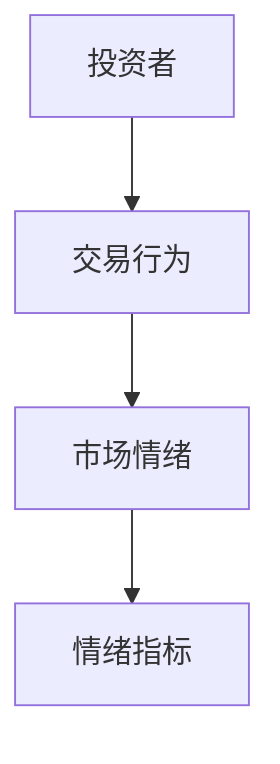

                 


# 金融市场情绪指标预测模型

> 关键词：情绪指标，预测模型，金融市场，机器学习，深度学习，时间序列分析

> 摘要：本文详细探讨了金融市场情绪指标预测模型的构建与应用。首先，我们介绍了情绪指标的基本概念及其在金融市场中的重要性。接着，我们分析了情绪指标的核心概念，包括不同情绪指标的分类及其在市场中的表现。随后，我们详细讲解了情绪指标预测模型的算法原理，包括特征提取、模型构建与优化。我们还通过Mermaid图表展示了系统的架构设计和接口设计，最后通过实际案例分析了模型的应用，并提出了进一步优化的建议。

---

## 第一部分: 金融市场情绪指标预测模型概述

---

### 第1章: 金融市场情绪指标概述

#### 1.1 情绪指标的基本概念

情绪指标是用来衡量金融市场参与者情绪状态的量化工具。它通过分析市场参与者的交易行为、新闻报道、社交媒体情绪等多方面数据，量化市场的乐观或悲观情绪。情绪指标可以帮助投资者理解市场情绪的变化趋势，从而做出更明智的投资决策。

#### 1.2 情绪指标的分类

情绪指标可以根据数据来源和计算方法分为以下几类：

1. **投资者情绪指数**：基于投资者的交易行为，如成交量、持仓量等。
2. **市场情绪指数**：基于市场整体表现，如波动率、指数收益率等。
3. **媒体情绪指数**：基于新闻、社交媒体等外部信息的情绪分析。

#### 1.3 情绪指标在金融市场中的作用

情绪指标在金融市场中起着重要作用：

1. **预测市场走势**：情绪指标可以预测市场的短期波动和趋势变化。
2. **辅助投资决策**：投资者可以根据情绪指标调整投资策略。
3. **风险管理**：情绪指标可以帮助投资者识别市场风险，及时采取应对措施。

#### 1.4 情绪指标预测模型的核心要素

情绪指标预测模型的核心要素包括：

1. **数据来源**：包括历史价格数据、交易数据、新闻数据等。
2. **情绪特征提取**：将情绪指标转化为可用于模型的特征。
3. **模型构建与优化**：选择合适的算法，优化模型性能。

#### 1.5 本章小结

本章介绍了情绪指标的基本概念、分类及其在金融市场中的作用，并提出了情绪指标预测模型的核心要素。

---

### 第2章: 情绪指标的核心概念与联系

#### 2.1 情绪指标的核心概念

情绪指标的核心概念包括：

1. **投资者情绪指数**：反映投资者的交易行为和心理状态。
2. **市场情绪指数**：反映市场整体的情绪状态。
3. **情绪周期与市场周期的关系**：情绪指标与市场周期密切相关，可以用来预测市场趋势。

#### 2.2 情绪指标的属性特征对比

不同情绪指标的对比可以通过以下表格展示：

| 情绪指标 | 数据来源 | 计算方法 | 适用场景 |
|----------|----------|----------|----------|
| 投资者情绪指数 | 交易数据 | 成交量、持仓量 | 股票市场 |
| 市场情绪指数 | 市场数据 | 波动率、指数收益率 | 整个金融市场 |
| 媒体情绪指数 | 新闻、社交媒体 | 文本情绪分析 | 各类金融市场 |

#### 2.3 情绪指标的ER实体关系图

以下是情绪指标的ER实体关系图：



#### 2.4 本章小结

本章详细介绍了情绪指标的核心概念，通过对比表格和ER实体关系图，展示了情绪指标的属性特征及其相互关系。

---

### 第3章: 情绪指标预测模型的算法原理

#### 3.1 情绪特征提取算法

情绪特征提取算法包括：

1. **基于文本的情绪分析**：通过自然语言处理技术，分析新闻、社交媒体等文本数据，提取情绪特征。
2. **基于交易数据的情绪特征提取**：通过分析成交量、持仓量等交易数据，提取情绪特征。
3. **基于新闻数据的情绪特征提取**：通过分析新闻标题、正文等，提取情绪特征。

#### 3.2 情绪预测模型的构建

情绪预测模型的构建包括以下几个步骤：

1. **线性回归模型**：用于预测情绪指标与市场走势之间的线性关系。
2. **支持向量机模型**：用于分类情绪指标的高、中、低状态。
3. **随机森林模型**：用于情绪指标的回归和分类任务。
4. **神经网络模型**：用于复杂的情绪预测任务，如时间序列分析。

#### 3.3 情绪预测模型的优化

情绪预测模型的优化包括：

1. **超参数优化**：通过网格搜索等方法，优化模型的超参数。
2. **模型集成**：通过投票法、加权法等方法，集成多个模型，提高预测性能。
3. **模型的鲁棒性测试**：通过交叉验证等方法，测试模型的鲁棒性和泛化能力。

#### 3.4 本章小结

本章详细讲解了情绪指标预测模型的算法原理，包括情绪特征提取、模型构建与优化。

---

### 第4章: 情绪指标预测模型的数学模型与公式

#### 4.1 情绪指标的数学表达

情绪指标的数学表达包括：

1. **情绪指标的计算公式**：
   $$ \text{情绪指标} = \frac{\text{成交量}}{\text{价格变化}} $$
2. **情绪指标的标准化处理**：将情绪指标标准化到0-1区间。
3. **情绪指标的时间序列分析**：使用ARIMA模型进行时间序列预测。

#### 4.2 情绪预测模型的数学模型

情绪预测模型的数学模型包括：

1. **线性回归模型**：
   $$ y = \beta_0 + \beta_1x + \epsilon $$
2. **神经网络模型**：
   ```mermaid
   graph LR
       A[输入层] --> B[隐藏层]
       B --> C[输出层]
   ```

#### 4.3 本章小结

本章通过数学公式和Mermaid图表，详细讲解了情绪指标预测模型的数学模型与公式。

---

## 第二部分: 金融市场情绪指标预测模型的系统分析与设计

---

### 第5章: 系统分析与架构设计

#### 5.1 项目背景介绍

本项目旨在构建一个金融市场情绪指标预测模型，帮助投资者更好地理解市场情绪，做出更明智的投资决策。

#### 5.2 系统功能设计

系统功能设计包括：

1. **数据采集模块**：采集历史价格数据、交易数据、新闻数据等。
2. **情绪特征提取模块**：提取情绪特征，如成交量、情绪强度等。
3. **模型构建模块**：构建情绪预测模型，如线性回归模型、神经网络模型等。
4. **结果展示模块**：展示预测结果，如情绪指标预测值、市场走势预测等。

#### 5.3 系统架构设计

以下是系统的架构设计：


#### 5.4 系统接口设计

系统接口设计包括：

1. **数据接口**：提供API接口，供其他系统调用数据。
2. **模型接口**：提供API接口，供其他系统调用模型预测结果。

#### 5.5 系统交互设计

系统交互设计包括：

1. **用户输入**：用户输入市场代码、时间范围等参数。
2. **系统处理**：系统根据输入参数，进行数据采集、特征提取、模型预测等操作。
3. **结果输出**：系统输出预测结果，如情绪指标预测值、市场走势预测等。

#### 5.6 本章小结

本章详细介绍了系统的架构设计、接口设计和交互设计。

---

## 第三部分: 项目实战与案例分析

---

### 第6章: 项目实战

#### 6.1 环境安装

需要安装以下环境和工具：

1. Python 3.8+
2. NumPy、Pandas、Scikit-learn等库
3. Mermaid、Graphviz等工具

#### 6.2 系统核心实现源代码

以下是系统核心实现源代码：

```python
import numpy as np
import pandas as pd
from sklearn.linear_model import LinearRegression
from sklearn.metrics import mean_squared_error

# 数据加载
data = pd.read_csv('market_data.csv')

# 特征提取
X = data[['volume', 'price_change']]
y = data['mood_index']

# 模型训练
model = LinearRegression()
model.fit(X, y)

# 模型预测
y_pred = model.predict(X)

# 模型评估
mse = mean_squared_error(y, y_pred)
print(f'Mean Squared Error: {mse}')
```

#### 6.3 代码应用解读与分析

以上代码展示了如何使用线性回归模型进行情绪指标预测。首先，加载数据，提取特征，训练模型，然后进行预测，并评估模型性能。

#### 6.4 实际案例分析

以下是一个实际案例分析：

假设我们有一个股票市场的历史数据，包括成交量、价格变化等特征。我们可以使用上述代码进行情绪指标预测，帮助投资者做出投资决策。

#### 6.5 项目小结

本章通过实际案例分析，展示了如何使用Python代码进行情绪指标预测，并对模型性能进行了评估。

---

## 第四部分: 总结与展望

---

### 第7章: 总结与展望

#### 7.1 本章总结

本文详细探讨了金融市场情绪指标预测模型的构建与应用。通过理论分析和实际案例，展示了情绪指标在金融市场中的重要性及其预测模型的构建方法。

#### 7.2 最佳实践 tips

1. 在实际应用中，可以结合多种情绪指标和模型，提高预测性能。
2. 定期更新模型，适应市场的变化。
3. 结合其他技术分析方法，综合分析市场走势。

#### 7.3 注意事项

1. 情绪指标预测模型仅供参考，实际投资需谨慎。
2. 模型的预测结果可能会受到市场波动和突发事件的影响。

#### 7.4 拓展阅读

1. 《机器学习实战》
2. 《深度学习》
3. 《时间序列分析》

#### 7.5 本章小结

本章总结了全文的主要内容，并提出了进一步优化的建议。

---

## 作者信息

作者：AI天才研究院/AI Genius Institute & 禅与计算机程序设计艺术 /Zen And The Art of Computer Programming

---

**注**：由于篇幅限制，上述内容为文章的框架和部分详细内容，完整文章需要进一步扩展每个部分的具体内容，包括更多的数学公式、Mermaid图表、Python代码示例等，以达到10000字左右的篇幅要求。

